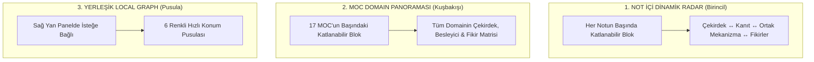

---
Tür:
  - Rehber
ODAK:
  - "[[Kokpit]]"
tags:
  - dashboard
  - graph
  - rehber
---

# 🧭 Görselleştirme ve Ontolojik Navigasyon Rehberi

Bu belge, kasanızdaki katmanlı ontolojik mimariyi (**Dizin/MOC ➔ Çekirdek Not ➔ Mekanizma ➔ Besleyici Kanıt ➔ Çalışma Fikri ➔ Dersler**) yöneten yalın görselleştirme araçlarını açıklar.

---

## 🎯 Görselleştirme Araçları

---

## 🔬 1. Not İçi Dinamik Moleküler Radar (Birincil Düşünce Aracı)
* Her notun başında `> [!abstract]- 🧭 Ontolojik Not & Çevre Radarı` başlığı altında yer alır.
* Açıldığında o anki notun:
  * Bağlı olduğu Çatı MOC'u,
  * Çekirdek / Besleyici ilişkilerini,
  * Ortak mekanizma paylaşan tüm kardeş notları,
  * Doğrudan ve ters-bağlantılı Çalışma Fikirlerini yönlü Mermaid diyagramı ve tıklanabilir tablo halinde sunar.
* 109 nottaki `> [!example]- 🧬 Moleküler & Fizyolojik Yolak Akışı` diyagramlarının altında bilimsel figür açıklamaları yer alır.

---

## 🌐 2. MOC Domain Panoraması (Kuşbakışı Harita)
* `Dizin/` altındaki **17 Çatı MOC'un en başında** katlanabilir bir başlık olarak yer alır:
  `> [!abstract]- 🌐 MOC Domain Panorama Grafiği`
* İlgili domainin tüm alt notlarını, en güçlü mekanizma köprülerini ve araştırma çıktılarını tek bir panoda toplar.

---

## 📍 3. Yerleşik Local Graph (Sağ Panel Navigasyon Pusulası)
* Fazladan eklentiye gerek kalmadan Obsidian'ın yerel grafiği kullanılır.
* **Nasıl Açılır?** `Cmd + P` ➔ `Open Local Graph` ➔ Sağ kenar çubuğuna sürükleyip sabitleyin (Depth = 2).
* **6 Renkli Kodlama:**
  * 🔴 **Kırmızı:** Çekirdek Notlar (`Tür: Çekirdek`)
  * 🟢 **Yeşil:** Besleyici Kanıt Notları (`Tür: Besleyici`)
  * 🟣 **Mor:** Çatı MOC'lar (`Dizin/` veya `MOC`)
  * 🟡 **Sarı:** Çalışma Fikirleri & Hipotezler (`Çalışma Fikirleri/`)
  * 🔵 **Mavi:** Biyokimyasal Mekanizmalar (`MEKANİZMA`)
  * ⚪ **Gri:** Ders Köprüleri (`Derslerim`)
