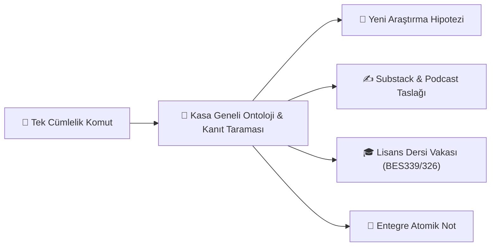

---
Tür:
  - Rehber
ODAK:
  - "[[Kokpit]]"
tags:
  - kokpit
  - playbook
  - komutlar
  - uretim
---

# ⚡ Akademik Süper Komutlar ve Üretim Playbook'u
> **Dr. Caner Özyıldırım Akademik Vault İşletim Sistemi**  
> *Bu rehber, kasanızdaki 157 not, 10 Çatı MOC, PubMed/Zotero motorları ve 4 boyutlu üretim matrisini tek cümlelik komutlarla çalıştırmanız için hazırlanmış pratik komut kataloğudur.*

---

## 🧭 Nasıl Kullanılır?
Aşağıdaki kategorilerden ihtiyacınız olan komutu seçin, köşeli parantezli alanları `[Konu/Not]` belirterek bana doğrudan söyleyin. Sistem tüm ontolojik taramayı, sentezi ve dosya üretimini otonom olarak gerçekleştirecektir.

---

## 🔬 1. Kategori: Çelişki ve Boşluk Madenciliği (Living Evidence Mining)

Kasanızdaki `#finding/contradictory` ve `#finding/null` etiketli kanıtları tarayarak popüler konsensüse meydan okuyan akademik boşlukları yakalar.

### 📌 Komut 1.1: "Kasadaki Çelişkilerden Yayın/Bülten Konusu Çıkar"
> **Bana söyleyin:**  
> *"Kasadaki tüm çelişkili (`#finding/contradictory`) ve anlamsız (`#finding/null`) notları tara; popüler algıyla en çok ters düşen 3 paradoksu ve bunlardan doğabilecek Substack/makale başlıklarını çıkar."*

### 📌 Komut 1.2: "Eksik Halka (Missing Link) Tespiti"
> **Bana söyleyin:**  
> *"**[[Not A]]** ile **[[Not B]]** arasında ortak bir mekanizma var mı? İkisinin kesiştiği biyokimyasal köprüyü bul ve henüz kasada yazılmamış olan eksik ara notu tespit et."*

### 📌 Komut 1.3: "Yetim Mekanizma Avı & Çekirdek Sentez Adayı"
> **Bana söyleyin:**  
> *"Kasada 3'ten fazla notta geçen ama henüz kendi Çekirdek Sentez Notu olmayan mekanizmaları listele (örn: AMPK-TBK1, Ferroptozis) ve benim için bir Çekirdek Sentez Notu taslağı oluştur."*

---

## 🧬 2. Kategori: Çapraz-Domain Hipotez & Proje Füzyonu

İki farklı uzmanlık alanını (MOC) biyokimyasal yolaklar üzerinden çarpıştırarak TÜBİTAK, BAP veya uluslararası RCT araştırma projeleri üretir.

### 📌 Komut 2.1: "İki MOC'u Çarpıştırıp RCT Hipotezi Üret"
> **Bana söyleyin:**  
> *"**[[00_GLP-1 ve Farmakolojik Müdahaleler_MOC]]** ile **[[00_Aralıklı Açlık ve Açlık Mekanizmaları_MOC]]** alanlarını çarpıştır; iskelet kası proteolizi ve mitofaji ekseninde özgün bir RCT hipotezi tasarla ve `Çalışma Fikirleri/` altına kaydet."*

### 📌 Komut 2.2: "Metodolojik Boşluğu Kapatan Çalışma Tasarımı"
> **Bana söyleyin:**  
> *"**[[Not Adı]]** notundaki metodolojik sınırlılığı (örneğin hayvan modeli olması veya örneklem kısıtı) incele; bunu insan kohortunda test edecek 12 haftalık bir klinik beslenme çalışma protokolüne dönüştür."*

---

## 🎓 3. Kategori: 4 Boyutlu Akademik Üretim Fabrikası

Tek bir makaleden veya nottan anında 4 farklı akademik ürün üretir.

### 📌 Komut 3.1: "Tek Notu 4 Boyuta Dönüştür (Master Komut)"
> **Bana söyleyin:**  
> *"**[[Not Adı]]** içeriğini 4 boyutlu üretim matrisine sok:  
> 1. 🎓 **BES339 / BES326 Dersi:** Derste tartışılacak 1 adet kışkırtıcı klinik vaka sorusu.  
> 2. ✍️ **Substack:** 'Popüler Efsane vs. Moleküler Gerçek' odaklı 800 kelimelik bülten taslağı.  
> 3. 🎙️ **Konsantre Podcast:** 5 dakikalık 3 maddelik sesli not akışı.  
> 4. 🔬 **Çalışma Fikri:** `Çalışma Fikirleri/` altına somut bir araştırma önerisi."*

### 📌 Komut 3.2: "Haftalık Ders Münazarası Hazırla"
> **Bana söyleyin:**  
> *"**[[00_Ultra İşlenmiş Besinler ve Diyet Kalitesi_MOC]]** altındaki son bulguları kullanarak BES326 Diyet İlkeleri dersi için öğrencileri ikiye bölecek (NOVA savunucuları vs. Gıda matrisi savunucuları) bir münazara senaryosu ve puanlama rubriği yaz."*

---

## 📡 4. Kategori: Canlı Literatür Tarama & Kasa Zenginleştirme

PubMed, Europe PMC ve bilimsel motorları kullanarak kasanıza taze kanıt pompalar ve otomatik entegre eder.

### 📌 Komut 4.1: "PubMed'den 2025/2026 Taze RCT Bul ve Kasaya Ekle"
> **Bana söyleyin:**  
> *"PubMed üzerinden **[Konu: örn. GLP-1 and Lean Mass Resistance Training]** üzerine 2025-2026 yıllarında yayınlanmış en yüksek etkili 2 RCT'yi bul; özetlerini çıkar, YAML'ını hazırla, katlanabilir radarı ve figür açıklamasını ekleyerek `Notlar/` altına yeni not olarak kaydet."*

### 📌 Komut 4.2: "Zotero / NotebookLM Ham Notunu İşle"
> **Bana söyleyin:**  
> *"**[[Clippings veya Zotero Notu]]** ham dosyasını oku; temel biyokimyasal mekanizmalarını çıkar, ilgili Çatı MOC'a bağla, kanıt yönünü (`positive/negative/null`) belirle ve `Notlar/` klasörüne rafine bir atomik not olarak taşı."*

---

## 🔄 5. Kategori: Kasa Bakımı, MOC ve Katman Analizi

Kasanızın zaman içinde kör noktalara düşmesini engelleyen periyodik zeka protokolleri.

### 📌 Komut 5.1: "Aylık Katman Analizini Çalıştır"
> **Bana söyleyin:**  
> *"Kasadaki tüm son gelişmeleri tara; en güçlü köprü mekanizmaları, beklenmedik bağlantıları ve çalışma fikri boşluklarını çıkarıp **[[Katman Analizi Geçmişi]]** dosyasına Analiz #5 olarak kaydet."*

### 📌 Komut 5.2: "MOC Köprü Doğrulama & Otomatik Güncelleme"
> **Bana söyleyin:**  
> *"Son eklenen notların 10 Çatı MOC altındaki ilgili alt başlıklara linklenip linklenmediğini kontrol et; eksik olan bağlantıları MOC dosyalarına otomatik ekle."*

---

## 📊 6. Kategori: Yeniden Üretilebilir Araştırma & R İstatistik Motoru (Manuscripts)

`Manuscripts/` altındaki veri setlerini analiz eder, R scriptlerini yürütür, tabloları/grafikleri üretir ve metin içi atıfları çözer.

### 📌 Komut 6.1: "Veri Setini İncele ve Veri Sözlüğü Oluştur"
> **Bana söyleyin:**  
> *"**`Manuscripts/Proje1/data/cohort.sav`** veri setini incele; değişken tipleri, kayıp veriler ve faktör düzeylerini içeren `data_dictionary.md` dosyasını oluştur."*

### 📌 Komut 6.2: "R Analizini Yürüt ve Makale Notuna Ekle"
> **Bana söyleyin:**  
> *"**`Manuscripts/Proje1/scripts/01_analysis.R`** dosyasını çalıştır; çıkan Tablo 1'i ve ggplot grafiklerini **`Manuscripts/Proje1/manuscript.md`** taslağına otomatik iliştir."*

### 📌 Komut 6.3: "Metin İçi Atıfları Çöz (>>ref:X<< ➔ [@citekey])"
> **Bana söyleyin:**  
> *"**`Manuscripts/Proje1/manuscript.md`** dosyasındaki tüm `>>ref:X<<` etiketlerini Zotero citekey'lerine dönüştür."*

---

## 📊 Hızlı Komut Cheat-Sheet (Özet Kartı)

| Ne İstiyorsun? | Kısayol Komut Cümlesi |
| :--- | :--- |
| **Veri Seti İnceleme** | *"X veri setini tara ve data_dictionary.md oluştur."* |
| **R İstatistik & Grafik** | *"X scriptini R'da yürüt, Tablo ve Grafikleri makale taslağına ekle."* |
| **Atıf Çözümleme** | *"Makale taslağındaki >>ref:X<< etiketlerini Zotero citekey'e çevir."* |
| **Paradoks / Makale Konusu** | *"Kasadaki çelişkili bulguları tara, bana 3 Substack başlığı çıkar."* |
| **TÜBİTAK / BAP Projesi** | *"GLP-1 ve Aralıklı Açlık MOC'larını çarpıştırıp bir RCT projesi tasarla."* |
| **Ders Materyali** | *"X notundan BES339 dersi için klinik vaka münazarası hazırla."* |
| **Taze Literatür** | *"PubMed'den X konusunda 2026 en güncel yayını bulup kasaya entegre et."* |
| **Kasa Sağlık Raporu** | *"Katman analizini çalıştır ve kasanın yeni köprülerini raporla."* |

---
*💡 Bu dosyayı dilediğiniz zaman `00 Kontrol Merkezi/` altından açabilir ve aklınıza gelen herhangi bir komutu sohbete kopyalayarak bana verebilirsiniz.*
