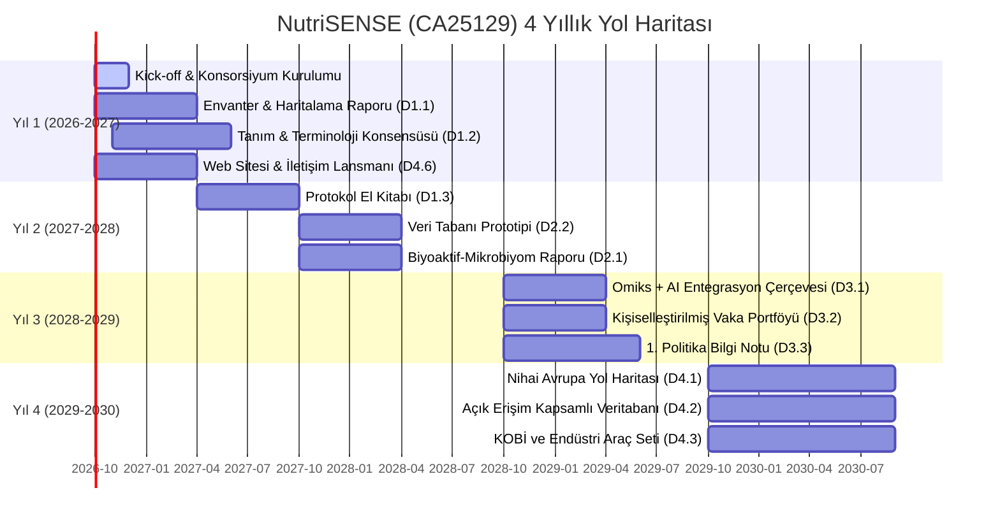

# 🥗 COST Action CA25129 — NutriSENSE
**A European Network on Bioactives for Personalized Nutrition and Gut Health**

---

## 📌 1. Genel Bakış ve Yönetici Özeti

* **Aksiyon Kodu:** CA25129
* **Akronim:** NutriSENSE
* **MoU Onay Tarihi:** 19 Mayıs 2026
* **Resmi Başlangıç / Bitiş:** Sonbahar 2026 (~Ekim 2026) – Sonbahar 2030 (~Ekim 2030)
* **Toplam Süre:** 48 Ay (4 Yıl)
* **e-COST Sayfası:** [e-services.cost.eu/action/CA25129](https://e-services.cost.eu/action/CA25129)
* **Senin Başvuru Durumun:** Başvuru tamamlandı, üyelik değerlendirme ve WG seçimleri bekleniyor.

### 🎯 Temel Amaç (Aim & Scope)
NutriSENSE, gıdalardaki **biyoaktif bileşikler (karotenoidler, polifenoller, organosülfür bileşikler, fitosteroller, betalainler vb.), bağırsak mikrobiyotası ve konakçı sağlığı arasındaki karmaşık üçlü etkileşimi** aydınlatmak; bulaşıcı olmayan kronik hastalıkların (NCDs) önlenmesinde sürdürülebilir, kanıta dayalı **kişiselleştirilmiş beslenme stratejileri ve yapay zeka tabanlı karar destek modelleri** geliştirmek amacıyla kurulmuş en güncel pan-Avrupa ağıdır.

---

## 🎯 2. MoU Hedefleri (Specific Objectives)

### 🔬 Araştırma Koordinasyonu (Research Coordination)
1. **Terminoloji ve Metot Harmonizasyonu:** Diyet biyoaktiflerinin (polifenoller, karotenoidler vb.) mikrobiyota ile etkileşimini inceleyen deneysel ve klinik protokolleri Avrupa genelinde uyumlu hale getirmek.
2. **Entegre Veri Tabanları:** Biyoaktif bileşik kompozisyonu, besin tüketim verileri, mikrobiyom profilleri ve klinik sağlık çıktılarını birleştiren açık erişimli pan-Avrupa veri tabanları oluşturmak.
3. **Gıda Teknolojisi ve Beslenme Entegrasyonu:** Gıda işleme, ekstraksiyon, biyo-yararlanım ve yaşam döngüsü değerlendirmesi (LCA) ile beslenme ve mikrobiyom bilimini entegre etmek.
4. **Yapay Zeka Destekli Kişiselleştirilmiş Beslenme:** Çoklu omiks ve diyet verilerini makine öğrenmesi algoritmalarıyla işleyerek bireyselleştirilmiş beslenme öneri sistemleri geliştirmek.
5. **Pilot Klinik Kanıt Çalışmaları:** Biyoaktif zengini fonksiyonel gıda formülasyonlarını test eden çok merkezli işbirlikli pilot çalışmalar yürütmek.

### 👥 Kapasite Geliştirme (Capacity Building)
1. Genç Araştırmacılar ve Yenilikçiler (YRI) için özel bir **"YRI Think Tank"** kurmak, mentorluk ve liderlik pozisyonları sağlamak.
2. Hedef Ülkelerin (ITC) en az %50 katılımını ve karar verici mekanizmalarda yer almasını güvence altına almak.
3. Çiftlikten Çatala (Farm-to-Fork), Avrupa Yeşil Mutabakatı (Green Deal) ve EU4Health politikalarına bilimsel girdi sunmak.

---

## 🥗 3. Neden NutriSENSE Senin Uzmanlığının Tam Merkezinde?

Bu aksiyon, bir **Beslenme ve Diyetetik Akademisyeni** için kelimenin tam anlamıyla **"Home Turf" (Ana Uzmanlık Alanı)** niteliğindedir:

* **Doğrudan Alanın:** Diyetisyenlik mesleğinin ve moleküler beslenme biliminin geleceği olan "Kişiselleştirilmiş Beslenme" ve "Biyoaktif Bileşikler-Mikrobiyom Etkileşimi" aksiyonun ana omurgasıdır.
* **Tüm Zinciri Kapsaması:** Tarladan sofraya (biyoaktif eldesi) -> Gastrointestinal sindirim ve mikrobiyal fermentasyon -> İmmün ve metabolik sağlık çıktıları -> Kişiselleştirilmiş diyet reçetesi.

---

## 📊 4. İş Paketleri (WGs) ve Hedefler

| WG | Başlık | Temel Odak | Önerilen Üyelik |
| :--- | :--- | :--- | :---: |
| **WG1** | **Bioactive–Microbiome Interactions (Nutrition & Health)** | Biyoaktiflerin (polifenoller, karotenoidler vb.) mikrobiyota metabolizması, sağlık etkileri, protokol uyumu | 🌟 **1. Tercih (Ana Evin)** |
| **WG2** | Harmonisation of Methodologies & Standards (FS&T) | Analitik metotlar, gıda matriks etkileri, in vitro sindirim modelleri, pişirme/işleme etkileri | 💡 Destekleyici |
| **WG3** | **Data Integration, AI & Systems Approaches (Sustainability)** | Çoklu omiks entegrasyonu, kişiselleştirilmiş beslenme algoritmaları ve yapay zeka karar destek modelleri | 🌟 **2. Tercih (Çok Güçlü)** |
| **WG4** | **Stakeholder Engagement, Dissemination & Policy Impact** | KOBİ'ler, gıda endüstrisi, politika belgeleri, halk sağlığı kılavuzları, diyetisyen eğitimleri | 🌟 **3. Tercih (Yaygınlaştırma)** |

---

## 🗓️ 5. Zaman Çizelgesi ve 4 Yıllık Yol Haritası (2026 – 2030)

> [!NOTE]
> **Mevcut Konum (Ağustos 2026):** **Grant Period 1 Öncesi / Başlangıç Aşaması (Ay 0).** Aksiyonun en başında yer almak, aksiyonda Yönetim Komitesi (MC), WG Liderliği veya Görev Koordinatörlüğü alma şansını en üst seviyeye çıkarır!

---

## 🎯 6. Onay Geldiğinde Uygulayacağın Stratejik Adımlar

1. **Çalışma Grubu Seçimi:**
   * e-COST onay e-postası geldiğinde veya başvurular açıldığında **WG1 (Nutrition & Health)** ve **WG3 (Data Integration & AI)** gruplarını mutlaka seç.
2. **YRI Think Tank Grubuna Katılmak:**
   * Genç Araştırmacılar (Young Researchers and Innovators) inisiyatifinde yer alacağını belirterek liderlik pozisyonlarına talip ol.
3. **Erken Dönem STSM ve Sanal Hareketlilik:**
   * Grant Period 1 (Yıl 1) bütçesinden ilk çağrılarda STSM veya Virtual Mobility hibesine başvur.
4. **D1.2 Terminoloji ve Konsensüs Dokümanı (Ay 6-12):**
   * Beslenme bilimi terminolojisinin (ör. biyoaktif dozajları, porsiyon tanımları, mikrobiyota metabolit sınıflandırması) yazım komitesine dahil ol.
