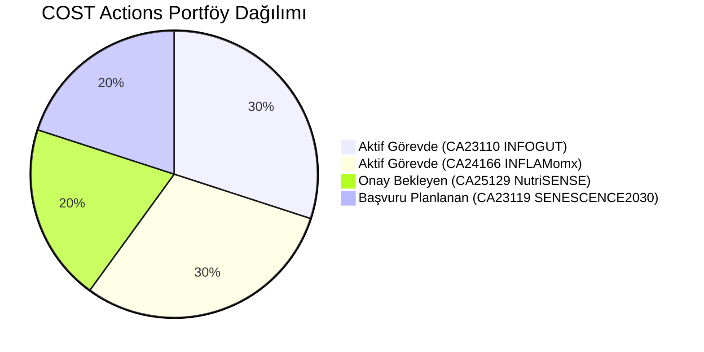
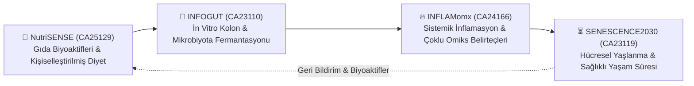
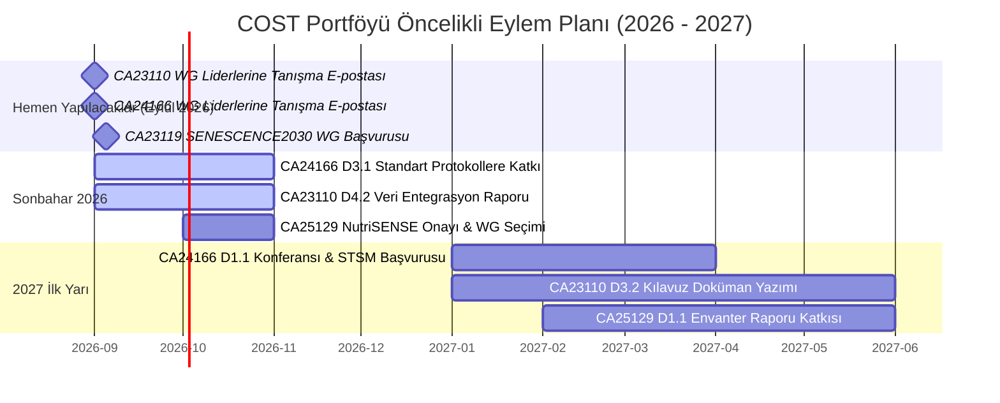

# 🌐 COST Actions Master Stratejik Portföyü
**Dr. Caner Özyıldırım — Araştırma & Uluslararası Ağ Yönetim Paneli**

---

## 📊 1. Portföy Genel Özeti ve Üyelik Durumları

| Aksiyon Kodu & Akronim | Tam Başlık | Görev / Durum | Tarih Aralığı | Mevcut Dönem (Ağustos 2026) | Not Bağlantısı |
| :--- | :--- | :--- | :---: | :---: | :---: |
| **CA23110** `INFOGUT` | In vitro colon models simulating gut microbiota mediated interactions | 🟢 **Aktif Üye** *(WG3, WG4, WG5)* Başlangıç: 20/08/2026 | 2024 – 2028 | Yıl 2 Sonu (~23. Ay / 48) | [[CA23110 - INFOGUT/CA23110 - INFOGUT\|INFOGUT Notu]] |
| **CA24166** `INFLAMomx` | Pan-European Network for Inflammaging: Multi-omics Integration | 🟢 **Aktif Üye** *(WG1, WG3, WG4)* Başlangıç: 02/07/2026 | 2025 – 2029 | Yıl 1 Sonu (~11. Ay / 48) | [[CA24166 - INFLAMomx/CA24166 - INFLAMomx\|INFLAMomx Notu]] |
| **CA25129** `NutriSENSE` | Bioactives for Personalized Nutrition and Gut Health | 🟡 **Başvuruldu** *(Sonuç Bekleniyor)* | 2026 – 2030 | GP1 Öncesi (Ay 0 / 48) | [[CA25129 - NutriSENSE/CA25129 - NutriSENSE\|NutriSENSE Notu]] |
| **CA23119** `SENESCENCE2030` | Targeting Cell Senescence to Prevent Age-Related Diseases | 🔵 **Başvurulacak** *(Öneri: WG2, WG3)* | 2024 – 2028 | Yıl 2 Sonu (~23. Ay / 48) | [[CA23119 - SENESCENCE2030/CA23119 - SENESCENCE2030\|SENESCENCE2030 Notu]] |
| **CA25145** `SEARCH` | Simulation Education And Research Collaborative in Healthcare | ⚪ **İlgi Alanı** *(Henüz Başvurulmadı — tüm WG liderleri TBA)* | Bilinmiyor | Çok Erken Aşama | [[CA25145 - SEARCH/CA25145 - SEARCH\|SEARCH Notu]] |

---

## 🧬 2. Dört Aksiyon Arasındaki Bilimsel Sinerji (Büyük Resim)

Bu dört aksiyon bir araya geldiğinde, senin akademik profilin için **"Kişiselleştirilmiş Beslenme, Mikrobiyom ve Biyogerontoloji"** ekseninde mükemmel bir pan-Avrupa araştırma ekosistemi oluşturur:

1. **Gıda & Biyoaktifler:** *NutriSENSE* ile besin ögeleri ve fitokimyasalları karakterize edersin.
2. **Bağırsak Metabolizması:** *INFOGUT* ile bu bileşiklerin bağırsak mikrobiyotası tarafından nasıl fermente edildiğini ve SCFA/metabolit profillerini in vitro test edersin.
3. **Sistemik İnflamasyon & Omiks:** *INFLAMomx* ile mikrobiyal metabolitlerin düşük dereceli kronik inflamasyonu (inflammaging) nasıl baskıladığını çoklu omiks ile incelersin.
4. **Hücresel Yaşlanma & Yaşam Süresi:** *SENESCENCE2030* ile beslenmenin hücresel düzeyde senolitik/senomorfik etkilerini ortaya koyarak sağlıklı yaşlanma kılavuzları oluşturursun.

---

## 📋 3. Öncelikli Aksiyon Listesi ve Zaman Çizelgesi

---

## 💡 4. COST Fon Mekanizmalarından En Üst Düzeyde Yararlanma İpuçları

1. **STSM (Short-Term Scientific Missions):** 
   * Her aksiyon yılda 10-20 araştırmacıya 2.000 – 4.000 € arası araştırma ziyareti hibesi verir. Türkiye'den bir laboratuvara gitmek veya yabancı bir araştırmacıyı laboratuvarına davet etmek için mükemmeldir.
2. **ITC Conference Grants:**
   * Türkiye bir ITC (Inclusiveness Target Country) olduğu için, aksiyon kapsamındaki konularda uluslararası bir kongrede sunacağın poster/sözlü bildiri için 1.500 – 2.000 € doğrudan seyahat hibesi alabilirsin.
3. **Virtual Mobility Grants:**
   * Fiziksel olarak seyahat etmeden, online bir çalıştay, anket analizi veya kılavuz yazımı koordine ederek 1.500 €'ya kadar hibe alabilirsin.
4. **Ortak Ufuk Avrupa (Horizon Europe) Konsorsiyumları:**
   * COST aksiyonlarının en büyük getirisi, 2. ve 3. yıllarında aksiyon üyelerinin bir araya gelerek **Horizon Europe Health & Food (Cluster 1 & Cluster 6)** çağrılarına multi-milyon euroluk proje konsorsiyumları kurmasıdır.

---

## 🌐 5. Web Sitesi ve Akademik Portföy Entegrasyonu

Web sitenizin CV, Projeler veya Blog/Duyuru sayfalarını güncellemek için hazırlanan hazır iki dilli (TR/EN) içeriklere ve HTML kart bloklarına buradan ulaşabilirsiniz:
* 📄 [[Web Sitesi - COST Projeleri Icerigi|Web Sitesi - COST Projeleri İçerik Paketi (TR / EN / HTML)]]
