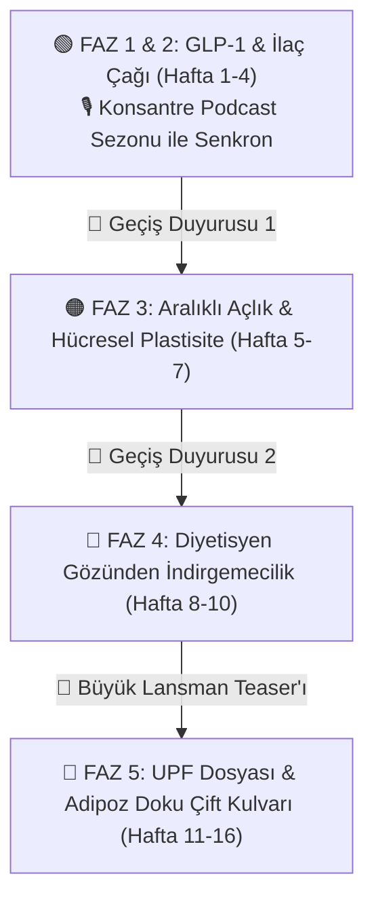

---
tags:
  - strateji
  - sosyal_medya
  - substack
  - podcast
  - lansman_plani
DURUM: hazir
TÜR: ana_yol_haritasi
YAZAR: Dr. Caner Özyıldırım
OLUSTURMA_TARIHI: 2026-08-23
---

# 🧭 BÜYÜK YAYIN VE İÇERİK BAŞLANGIÇ PLANI (16 HAFTALIK MASTER STRATEJİ)

> [!abstract] 📌 Stratejik Özet ve Vizyon
> Bu belge; **Konsantre Podcast**, **Substack Bülteni**, **X (Twitter)**, **LinkedIn** ve **Instagram** kanallarını birbirini besleyen organik bir büyüme çarkına (*Omnichannel Flywheel*) dönüştürmek üzere tasarlanmış 16 haftalık eksiksiz içerik ve lansman planıdır.
>
> **Güncellenmiş Temel Strateji (23-24 Ağustos 2026 revizyonu):**
> 1. **Faz 1 — GLP-1 Lansmanı:** 3 podcast bölümü (2-3 gün arayla) + ardından haftada 2 Substack yazısıyla kitleyi içeri almak. Detay için aşağıdaki "🚀 Lansman Sıralaması" bölümüne bakın.
> 2. **Faz 2 — Aralıklı Açlık & Hücresel Plastisite:** GLP-1'den doğal bir köprüyle devam. Stok neredeyse hazır (bkz. içerik bankası).
> 3. **Faz 3 — Büyük UPF Dosyası + Saf Adipoz Doku Biyolojisi:** Çift kulvarlı başyapıt. Kanca-önce/teknik-sonra sıralamasıyla (bkz. "Faz 3" bölümü).
> 4. **Askıya Alındı — "Diyetisyen Gözünden" İndirgemecilik:** Üç ana sütun (GLP-1, Açlık, UPF) tamamlanmadan gündeme alınmayacak. İçerik bankada duruyor, sırası geldiğinde değerlendirilecek.
> 5. **Paralel Şerit — AI/İş Akışı Reels:** Ayrı bir faz değil; üç fazın altından geçen, düşük üretim maliyetli, haftada ~1 düzenli akan bir destek kanalı. Detay için "🤖 Paralel Şerit" bölümüne bakın.
>
> 🎨 **Görsel Canvas Şeması:** [[16 Haftalık Master Başlangıç Planı.canvas|🖼️ 16 Haftalık Master Başlangıç Planı (Görsel Canvas)]] — *not: canvas şeması eski faz sırasını yansıtıyor, güncellenmesi gerekiyor.*

> [!warning] ⚠️ İçerik Güvenliği & Regülasyon Notu
> Sağlık meslek mensuplarının reçeteli ilaçların **ticari isimlerini** tanıtım/bilgilendirme içeriğinde kullanması Türkiye'de düzenleyici risk taşır (Sağlık Bakanlığı reklam yönetmeliği, TİTCK). Bu nedenle:
> - Tüm içeriklerde marka isimleri (ör. belirli bir GLP-1 ilacının ticari adı) **kullanılmayacak**; bunun yerine jenerik/etken madde adları (semaglutid, tirzepatid, retatrutid) veya sınıf isimleri ("GLP-1 reseptör agonistleri") tercih edilecek.
> - Şirket/tarihsel bağlamda geçen isimler (ör. Novo Nordisk, araştırmacı isimleri) bilimsel/gazetecilik anlatımı kapsamında kalır, sorun teşkil etmez.
> - Her ilaç-ilişkili gönderinin açıklamasına şu kısa not eklenecek: *"Bu içerik genel bilimsel bilgilendirme amaçlıdır, belirli bir ürünün tanıtımı veya tedavi önerisi değildir. Tedavi kararları hekiminizle birlikte alınmalıdır."*
> - Görsellerde jenerik/markasız enjeksiyon kalemi görselleri kullanılacak, ambalaj/logo içeren görsellerden kaçınılacak.

# 🚀 LANSMAN SIRALAMASI (GÜNCEL — bu bölüm eski Faz 1-2 haftalık dökümünün yerini alır)

> [!info] Neden bu sıra?
> Kanalları aynı anda değil sırayla parlatıyoruz: önce kulak (podcast), sonra göz (Substack + sosyal). Sıfır takipçili bir kanalda haftalık boşluk ilgiyi soğutur, bu yüzden bölümler arası 2-3 gün — bir hafta değil.

1. **Podcast Bölüm 1 (Gila Canavarı hikayesi)** + aynı gün **"Kertenkele Tükürüğü" reels** (Reels.md'de zaten scriptli) + X thread.
2. **Podcast Bölüm 2** (2-3 gün sonra) — kas kaybı paradoksu. Substack'e hiç dokunma.
3. **Podcast Bölüm 3** (2-3 gün sonra) — food noise / ilacı bırakınca ne oluyor. Kısa bir "şimdi yazılara geçiyoruz" duyurusuyla kapat.
4. **Substack'i temiz taslaklarla başlat:** GLP1 + GLP3 (marka ismi içermiyor, direkt yayına hazır). Haftada 2 ritmini bunlarla aç.
5. **GLP2 + GLP4'ü temizleyip sıraya sok:** GLP2 başlıkta dahil defalarca "Ozempic" içeriyor, GLP4'te "Ozempic/Wegovy", "Mounjaro/Zepbound" geçiyor — jenerik isimlerle değiştirilmeli. GLP4 ayrıca kaynakça açısından ham, tamamlanması gerekiyor.
6. **2 ek GLP-1 yazısı üret** (podcast fazı sürerken paralelde) — elde 4 taslak var, haftada-2 ritmiyle 6 yazıya tamamlamak için 2 tane daha gerekiyor.
7. **Reklamı 2 en güçlü kancaya yoğunlaştır:** Podcast Bölüm 1 (kertenkele hikayesi) ve GLP2'nin carousel'i (temizlenmiş haliyle "Doğanın GLP-1 İlacı Yok"). Diğer parçalara reklam verme — bunlar en az jargonlu, en paylaşılabilir olanlar.
8. **Ek reels:** "GLP-1 yerine yaban mersini yeyin denilen içerikler... şaka mısınız?" fikri GLP2 ile eşleşiyor, aynı hafta kullan.

## 📢 Reklam Stratejisi — genel ilke
Reklamı her gönderiye değil, sadece **giriş kancası** niteliğindeki (az jargonlu, geniş kitleye hitap eden) içeriklere ver. Teknik/derin parçalar zaten mevcut takipçiye organik ulaşır; reklamın işi yeni kitle çekmek. Bütçeyi düz dağıtmak yerine faz geçişi anlarında (lansman, büyük UPF açılışı gibi) yoğunlaştır. Hedef etkileşim değil, Substack aboneliği veya podcast dinleme olmalı.

## 📊 Ölçüm & Checkpoint
Bu proje büyüme değil kimlik/uzmanlık inşası olduğu için metrikleri buna göre okumalı:
- **Takip edilecek:** Substack açılma oranı (sadakat sinyali), podcast tamamlanma oranı, yorum/DM/cevap oranı, Instagram kaydetme oranı, gelen işbirliği/davet talepleri.
- **Erken haftalarda beklenmeyecek ama not edilecek:** abone sayısı büyümesi, reach, viral yayılım — bunlar zamanla gelir.
- **Kontrol sıklığı:** haftalık değil, ~3 haftada bir 10 dakikalık "yön kontrolü". Sayılara göre anlık karar verme, sadece trend tersine dönüyorsa not al.

## 🤖 PARALEL ŞERİT: AI / İş Akışı Reels
Ayrı bir faz değil — GLP-1/Açlık/UPF fazlarının altından geçen, araştırma gerektirmeyen (ekran kaydı/anlatım) düşük maliyetli destek kanalı. Yazı üretemediğin haftalarda boşluk doldurucu olarak kullan. Mevcut stok (Reels.md, "Yapay Zekadan Nasıl Faydalanıyorum 1-11"): Passaparola uygulaması, NotebookLM kullanımı, dijital ders defterleri, Gem kullanımı, Google Labs, Zotero→Obsidian→AI özetleme akışı, istatistik uygulaması, obsidian+notebooklm bağlantısı. Ayrıca yayına hazır, iki dilli bir LinkedIn yazısı var ("Yapay Zekaya Gözün Kapalı Güvenme" — AI'ın akademik yazımda özgüvenli yalan söylemesi üzerine, somut örnekli). Bu faz için yeni Substack-uzunluğunda yazı stoğu birikmeden ana faz yapılmamalı.

---

# ⏸️ ASKIYA ALINAN FAZ: "Diyetisyen Gözünden" İndirgemecilik
Aşağıdaki Faz 4 içeriği (8-10. haftalar) plandan çıkarılmadı, sadece sıralamada geriye alındı. GLP-1 → Aralıklı Açlık → UPF üçlüsü tamamlanmadan gündeme alınmayacak.

---



---

# 🟢 FAZ 1: GLP-1 SEZONU & İŞTAH BİYOLOJİSİ (1 - 3. HAFTALAR)

> **Motto:** *"İlaç iştahı kesiyor olabilir ama hücrenin içinde ne yaşanıyor?"*
> **Ritim:** Haftada 1 Podcast (Pazartesi) + Haftada 2 Substack (Salı - Perşembe) + Sosyal Medya Dağıtımı.

---

## 🗓️ 1. HAFTA: İLAÇLARIN DOĞUŞU & EMİLİM KRİZLERİ

### 🎙️ Podcast Bölüm 1: Gila Canavarından Mucize İlaçlara: GLP-1 Ailesi ve Diğerleri
* **Dayanak Not:** `[[Sosyal Medya/Konsantre Podcast/Konsantre Podcast-GLP1 Serisi#BÖLÜM 1: BİR BİLİMSEL POLİSİYE – KERTENKELE TÜKÜRÜĞÜNDEN NOVO NORDISK'İN GİZLİ SAVAŞINA|Podcast Bölüm 1 Scripti]]`
* **🎬 Instagram Reels / TikTok:**
  * **Kanca (İlk 3 sn):** *"Dünyanın en zengin ilaç şirketinin kaderini zehirli bir çöl kertenkelesinin tükürüğü nasıl değiştirdi?"*
  * **Görsel:** Gila Canavarı fotoğrafı + jenerik bir GLP-1 enjeksiyon kalemi görseli (marka logosu/ismi görünmeyecek şekilde).
  * **Metin Akışı:** Doğal GLP-1 hormonunun kanda 2 dakikada eridiği, Dr. John Eng'in kertenkele tükürüğündeki Exendin-4'ü keşfetmesi ve Novo Nordisk'in iptalden dönen laboratuvar savaşı.
  * **CTA:** *"Konsantre Podcast yeni sezonuyla Spotify ve Apple Podcasts'te yayında! Link bioda."*
* **🐦 X (Twitter) Thread:**
  * **Tweet 1 (Hook):** 2026 itibarıyla 100 milyar doları aşan GLP-1 ilaç pazarının hikayesi modern bir laboratuvarda değil, çölde yaşayan zehirli bir kertenkelenin tükürüğünde başladı. İşte tıp tarihinin en garip keşif polisiye hikayesi: 🧵👇
  * **Tweet 2:** İnsan vücudundaki doğal GLP-1 hormonu yemekten sonra salgılanır ve 2 dakika içinde DPP-4 enzimi tarafından parçalanır. İlaç yapmak imkansızdı.
  * **Tweet 3:** Dr. John Eng, Gila Canavarı kertenkelesinin tükürüğünde bu enzimin kesemediği Exendin-4'ü buldu. NIH "bunun ticari değeri yok" deyince kendi cebinden patentledi!
  * **Tweet 4:** Novo Nordisk araştırmacısı Lotte Knudsen ise moleküle 16 karbonlu yağ asidi zinciri takarak albümin zırhı geliştirdi ve yarı ömrü 7 güne çıkardı.
  * **Tweet 5 (CTA):** Tıp tarihini değiştiren bu inanılmaz bilimsel savaşı Konsantre Podcast'in yeni bölümünde anlattım. Dinlemek için: [Podcast Linki]
* **💼 LinkedIn Gönderisi:**
  * **Başlık:** Bir Biyoteknoloji Polisiye Hikayesi: Çöl Kertenkelesinden 100 Milyar Dolarlık GLP-1 Pazarına.
  * **İçerik:** Moleküler mühendislik zaferinin, biased agonism konseptinin ve Lotte Knudsen'ın projesini kurtarma hikayesinin yönetici ve akademisyen gözüyle analizi.

---

### 📝 Yazı 1 (Salı): "Doğanın GLP-1 İlacı" Diye Bir Şey Neden Yoktur?
* **Bağlantılı Not:** `[[Sosyal Medya/Substack/23-doganin-ozempici-diye-bir-sey-neden-yoktur]]`
* **🐦 X Thread:** Yulaf lapası ("Oatempic"), Psyllium ve Berberin neden asla sentetik GLP-1 reseptör agonistlerinin yerini tutamaz? Doğal GLP-1'in 2 dakikalık ömrü vs sentetik Semaglutid'in 165 saatlik albümin kalkanı.
* **💼 LinkedIn:** Sosyal medyadaki "Doğal Alternatif" illüzyonu ve farmakokinetik gerçekler. Neden doğa bizim 7/24 tok gezmemizi istemez?
* **📸 Instagram Carousel:** 
  * *Slayt 1:* "Yulaf Lapası Gerçekten Doğanın GLP-1 İlacı mı?" 
  * *Slayt 2:* İki dakikalık doğal hormon vs 7 günlük sentetik molekül.
  * *Slayt 3:* DPP-4 hücresel giyotini nasıl çalışır?
  * *Slayt 4:* Berberin bir GLP-1 ilacı değil, Metformin taklididir!
  * *Slayt 5:* Substack bültenine davet.
* **🎯 REKLAM ÖNERİSİ:** *Bu carousel gönderisine günlük 100 TL Meta reklamı verilerek profil ziyareti çekilecek.*

---

### 📝 Yazı 2 (Perşembe): GLP-1 Kullanırken Tok Hissetmeniz, Aç Olduğunuz Gerçeğini Değiştirmiyor
* **Bağlantılı Not:** `[[Sosyal Medya/Substack/GLP-1 Kullanırken Tok Hissetmeniz, Aç Olduğunuz Gerçeğini Değiştirmiyor]]`
* **🐦 X Thread:** 461.382 hastanın gerçek dünya verisi ne diyor? GLP-1 kullananların %22'sinde beslenme yetersizliği, demir emiliminde %30 düşüş ve SIBO/IMO artışı.
* **💼 LinkedIn:** Bariatrik cerrahi ciddiyetinde mikrobesin açlığı: GLP-1 çağında Tıbbi Beslenme Tedavisi (MNT) neden eskisinden daha hayati?
* **📸 Instagram Carousel:** *"Tartıda Kilo Verirken Hücreleriniz Neden Aç Kalıyor?"* (Demir, D vitamini, B12 emilim krizleri ve SIBO ilişkisi).

---

## 🗓️ 2. HAFTA: MOLEKÜLER GELECEK & KAS KAYBI PARADOKSU

### 🎙️ Podcast Bölüm 2: Zayıflama İlaçları Obeziteyi Bitirdi mi? (Diyetisyenler Buraya)
* **Dayanak Not:** `[[Sosyal Medya/Konsantre Podcast/Konsantre Podcast-GLP1 Serisi#BÖLÜM 2 SCRIPT SON|Podcast Bölüm 2 Scripti]]`
* **🎬 Instagram Reels / Video:**
  * **Kanca:** *"İlaçla 20 kilo verip 8 kilo kas kaybetmek... Sizce bu zayıflamak mı, yoksa metabolik olarak yaşlanmak mı?"*
  * **İçerik:** DXA ölçümlerinde kaybedilen kilonun %30-40'ının kas olması, EASO ve ACLM kılavuzlarının "diyetisyensiz reçete edilmemeli" uyarısı.
* **🐦 X Thread:** ABD'de obezite oranı %39.9'dan %36.4'e geriledi. Peki obezite gerçekten bitti mi? Kilo vermek vs Obeziteyi tedavi etmek ayrımı.
* **💼 LinkedIn:** EASO 2026 ve ACLM Konsensus Kılavuzları Işığında Diyetisyenlik Mesleğinin Dönüşümü.

---

### 📝 Yazı 3 (Salı): Ameliyatsız Mide Küçültme Çağı: Glukagon Paradoksu
* **Bağlantılı Not:** `[[Sosyal Medya/Substack/24-ameliyatsiz-mide-kucultme-cagi-glukagon-paradoksu]]`
* **🐦 X Thread:** Kan şekerini yükselten bir hormon (Glukagon) zayıflama ilacına neden konur? Retatrutide'in %24.2'lik rekor kilo kaybının arkasındaki metabolik adaptasyon freni.
* **💼 LinkedIn:** İkili (Tirzepatide) ve Üçlü (Retatrutide) Agonistlerin Farmakolojisi: Bariatrik Cerrahinin Sonu mu Geliyor?
* **📸 Instagram Carousel:** *"Yangına Benzin Dökmek mi? Zayıflama İlacında Glukagon Mucizesi."*

---

### 📝 Yazı 4 (Perşembe): Kaslarımızın Diyet Sonrası İntikamı: GLP-1 ve Sarkopenik Obezite
* **Bağlantılı Not:** `[[Sosyal Medya/Substack/Kaslarımızın Diyet Sonrası İntikamı]]` *(GLP-1 Perspektifiyle Entegre Edildi)*
* **🐦 X Thread:** Hızlı kilo kaybında iskelet kaslarında artan Tip 3 Deiyodinaz (D3) enzimi kanda normal görünen tiroidi kas içinde nasıl felç eder? Kaslar kaloriyi neden reddeder?
* **💼 LinkedIn:** GLP-1 kaynaklı hızlı ağırlık kaybında 'Catch-up Fat' dinamiği ve lokal hipotiroidi mekanizması.
* **📸 Instagram Carousel:** *"Kilo Verince Tiroidiniz Neden Kasa İsyan Eder?"*
* **🎯 REKLAM ÖNERİSİ:** *Bu carousel gönderisine günlük 100 TL Meta reklamı verilerek hekim ve diyetisyen kitlesi hedeflenecek.*

---

## 🗓️ 3. HAFTA: İLACI BIRAKINCA NE OLUYOR? & BEYİNDEKİ "FOOD NOISE"

### 🎙️ Podcast Bölüm 3: İlacı Bıraktığınız O İlk Gün: Food Noise'un İntikamı
* **Dayanak Not:** `[[Sosyal Medya/Konsantre Podcast/Konsantre Podcast-GLP1 Serisi#BÖLÜM 3: FOOD NOISE VE BEYİN ÖDÜL SİSTEMİ|Podcast Bölüm 3 Scripti]]`
* **🎬 Instagram Reels:** *"İlacı bırakınca yemek gürültüsü neden 3 kat şiddetle geri dönüyor? İrade zayıflığı mı, hipotalamik intikam mı?"*
* **🐦 X Thread:** BMJ meta-analizi: İlacı bırakanların 1.5 yılda tüm kiloları geri alması ve beyindeki dopaminerjik ödül yolağının uyanışı.

---

### 📝 Yazı 5 (Salı): İlacı Bıraktığınızda Ne Olur? GLP-1 Sonrası Geri Kazanım Gerçeği
* **Bağlantılı Not:** `[[Sosyal Medya/Substack/25-ilaci-biraktiginizda-ne-olur-glp1-sonrasi]]`
* **🐦 X Thread:** İlaç ne kadar güçlüyse rebound o kadar sert! Semaglutid/Tirzepatid bırakanlarda ayda 0.8 kg geri alım hızı. Çıkış planı girişi planından neden daha önemlidir?
* **💼 LinkedIn:** Kronik Farmakoterapi Varsayımının Klinikteki Çöküşü: Hastaların %50'si ilacı bırakıyorsa 'çıkış stratejimiz' ne?
* **📸 Instagram Carousel:** *"Zayıflama İğnesini Bırakanların %70'i Neden Eski Kilosuna Dönüyor?"*

---

### 📝 Yazı 6 (Perşembe - YENİ YAZI): Beyindeki "Food Noise" Neden İlaç Kesilince Çığ Gibi Döner?
* **📌 Durum:** *Yazılacak Yeni Makale.*
* **Konsept:** Hipotalamik nöropeptit Y (NPY/AgRP) uyarımı, mezolimbik dopamin ödül merkezinin ilaca duyarsızlaşması ve ilacı bırakan bireylerin yaşadığı kontrolsüz açlık dalgası.
* **🐦 X Thread:** Beynimizin içindeki hiç susmayan "Yemek Gürültüsü" (Food Noise) nedir ve ilaç bunu nasıl susturur?
* **💼 LinkedIn:** Nörobiyolojik Açıdan İştah ve İrade: Obezite Bir Karakter Zaafı mıdır?

---

# 🟡 FAZ 2: KÖPRÜ HAFTASI (4. HAFTA - İKİ SENARYOLU AKIŞ)

> [!warning] Güncelliğini yitirdi
> Podcast artık sabit 3 bölüm olarak planlandığı için aşağıdaki A/B senaryo dallanması geçerli değil. Güncel geçiş, yukarıdaki "🚀 Lansman Sıralaması" bölümündeki 3. ve 4. adımlarla (Bölüm 3 sonrası tek, sade bir Substack geçiş duyurusu) yönetiliyor.

---

### 🅰️ SENARYO A: Podcast 4. Bölüm Olursa (Obezojenik Çevre & Sistem Eleştirisi)
* **🎙️ Podcast 4:** *Obezojenik Çevre, Medicaid Bütçe Patlaması ve Biyolojik Tüketicilik.*
* **📝 Yazı 7 (Salı):** *"Obezite İlaçları Bizi Özgürleştiriyor mu, Yoksa %100 Sömürülebilir Biyolojik Tüketicilere mi Dönüştürüyor?"* (Lancet Regional Health Europe verileri).
* **📝 Yazı 8 (Perşembe):** *"Geleceğin GLP-1 İlaçları: Miyostatin ve Aktivin Blokerleri Kas Kaybını Sıfırlayabilir mi?"* (Yeni moleküler AR-GE).

### 🅱️ SENARYO B: Podcast 3 Bölümde Biterse (GLP-1 Serisi Kapanışı & Danışan Kılavuzu)
* **📝 Yazı 7 (Salı):** *"GLP-1 Çağında Diyetisyenlik ve Hekimlik: 800 Kalorilik İştah Penceresinden Sağlık Çıkarmak"* (ACLM pozisyon analizi).
* **📝 Yazı 8 (Perşembe):** *"Zayıflama İğnesi Kullananlar İçin 5 Aşamalı Güvenli Çıkış Protokolü"* (Klinik pratik öneriler).

---

# 🔄 GEÇİŞ DUYURUSU 1: FAZ 2'DEN FAZ 3'E GEÇİŞ (ARALIKLI AÇLIK TEASER'I)

> **Ne Zaman Paylaşılacak?** 4. Haftanın Pazar günü veya 5. Haftanın Pazartesi sabahı.

### 📧 Substack Özel Geçiş E-Postası (Bülten Okurlarına)
* **Konu:** *"GLP-1 Dosyasını Kapattık: Önümüzdeki 3 Hafta Hücrelerimizin Açlık Hafızasına İniyoruz."*
* **İçerik:** *"Değerli okurlar, 1 aydır tıp dünyasını sarsan zayıflama iğnelerini ve arkasındaki moleküler zaferi konuştuk. Ancak madalyonun diğer tarafında, binlerce yıldır genlerimize kazınmış çok daha kadim bir mekanizma var: Açlık. Önümüzdeki 3 hafta boyunca; orucu bozduğunuz o ilk saniyede hücrede ne olduğunu, kadınlarda açlığın neden farklı çalıştığını ve pankreasın açlıkla gençleşip gençleşemeyeceğini konuşacağız. Hazır olun!"*

### 📱 Sosyal Medya (Instagram Story / Post & X Tweeti)
* **Metin:** *"GLP-1 dosyamızı geride bıraktık! 🎯 Önümüzdeki 3 hafta boyunca popüler diyet safsatalarını bir kenara bırakıp 'Aralıklı Açlığın (Intermittent Fasting) Moleküler Biyolojisi'ne odaklanıyoruz. Salı günü ilk yazı yayında!"*

---

# 🟠 FAZ 2 (yeni sıra) — eski "Faz 3": ARALIKLI AÇLIK & HÜCRESEL PLASTİSİTE SERİSİ

> [!tip] Stok durumu
> 08, 09, 10, 12 numaralı yazılar "yayınlandı" durumunda — direkt kullanılabilir. 41 (pankreas/beta hücre) taslak ama içerik olarak neredeyse tamam, küçük bir düzenleme yeterli. Bu faz GLP-1'den sonra en az yazı yükü isteyen faz.

> **Motto:** *"Açlık bir kalori hesabı değil, genetik bir açma-kapama düğmesidir."*

---

### 🗓️ 5. HAFTA: AÇLIĞIN MOLEKÜLER BİYOLOJİSİ & PANKREAS REJENERASYONU
* **📝 Yazı 1 (Salı):** `[[Sosyal Medya/Substack/12-orucu-bozdugunuz-o-ilk-an]]`
  * **İçerik:** Orucu bozduğunuz o ilk an hücrede substrat partisyonu (glukoz vs serbest yağ asidi yarışı), insülin pikleri ve mitokondriyal şok.
  * **Sosyal Medya:** X Thread + Instagram Carousel: *"Saatlerce Aç Kaldıktan Sonra Ağzınıza Attığınız İlk Lokma Hücrede Neyi Başlatır?"*
* **📝 Yazı 2 (Perşembe):** `[[Sosyal Medya/Substack/41-pankreas-genclesebilir-mi-aclikta-beta-hucre-plastisitesi]]`
  * **İçerik:** Valter Longo'nun FMD modeli, Ngn3 ekspresyonu ve beta hücre dediferansiyasyonu / rejenerasyonu.
  * **Sosyal Medya:** LinkedIn + X: *"Pankreas Yaşlanmayı Geri Çevirebilir mi? Açlık Taklit Eden Diyetlerin Hücresel Kanıtı."*

---

### 🗓️ 6. HAFTA: CİNSİYET FARKLARI & UZUN AÇLIK RİSKLERİ
* **📝 Yazı 3 (Salı):** `[[Sosyal Medya/Substack/09-kadinlarda-52-diyeti-cikmazi]]`
  * **İçerik:** Kadınlarda aralıklı açlığın Ghrelin ve HPA aksı (stres/kortizol) üzerindeki yıkıcı etkileri, anksiyete ve adet düzensizliği paradoksu.
  * **Sosyal Medya:** Instagram Carousel (Viral Potansiyel): *"Aralıklı Açlık Kadınlarda Neden Erkeklerdeki Gibi Çalışmaz?"*
* **📝 Yazı 4 (Perşembe):** `[[Sosyal Medya/Substack/08-uzun-sureli-su-orucu-guvenli-mi]]`
  * **İçerik:** 3-7 günlük su oruçları: Otofaji vaatleri vs nitrojen/protein kaybı, kardiyak elektrolit riskleri.
  * **Sosyal Medya:** X Thread + LinkedIn: *"Otofaji Uğruna Kalp Kası Eritmek: Uzun Su Oruçlarının Klinik Gerçekliği."*

---

### 🗓️ 7. HAFTA: BAĞIRSAK MİKROBİYOTASI & BİYOBELİRTEÇ DEEP-DIVE
* **📝 Yazı 5 (Salı):** `[[Sosyal Medya/Substack/10-aralikli-aclik-isle-yaramiyor-mu-bagirsaklariniz]]`
  * **İçerik:** Açlık bağırsak mukus tabakasını inceltir mi, yoksa mikrobiyotayı zenginleştirir mi? Akkermansia muciniphila dinamikleri.
  * **Sosyal Medya:** Instagram Carousel: *"Aç Kalırken Bağırsak Bakterileriniz Ne Yiyor?"*
* **📝 Yazı 6 (Perşembe - ÖZEL DEEP DIVE):** `[[Gıda Anketleri Tarihe mi Karışıyor? Ne Yediğiniz İdrarınızdan Anlaşılıyor]]`
  * **Dayanak Not:** `[[Notlar/UPF Tüketimi Metabolitlerle Belirlenebilir Mi?]]` (PLOS Med 2025 - Abar et al.)
  * **İçerik:** Diyet anketlerinin yetersizliğini yıkan Poli-Metabolit Skorları, idrardaki Levoglukozan ve N6-karboksimetillizin (CML) analizi.
  * **Sosyal Medya:** X Thread + LinkedIn: *"Beslenme Epidemiyolojisinde Devrim: Artık Ne Yediğiniz Kan ve İdrar Metabolitlerinizden Ölçülüyor!"*

---

# 🔄 GEÇİŞ DUYURUSU 2: FAZ 3'TEN FAZ 4'E GEÇİŞ (İNDİRGEMECİLİK TEASER'I)

> **Ne Zaman Paylaşılacak?** 7. Haftanın Pazar günü.

* **Substack & Sosyal Medya Metni:**
  > *"3 haftalık hücre ve açlık yolculuğumuz bitti. Şimdi iğneyi biraz kendimize, yani beslenme bilimine batırma vakti. Önümüzdeki 3 hafta boyunca; 'Bir domates neden likopenden ibaret değildir?', 'Kalori hesabı neden çöktü?' ve 'Diyetisyenlik neden mutfakta öğrenilmelidir?' sorularını masaya yatırıyoruz. 'Diyetisyen Gözünden Beslenme Ezberleri' serimiz Salı günü başlıyor!"*

---

# ⏸️ FAZ 4 (ASKIYA ALINDI): "DİYETİSYEN GÖZÜNDEN" BESİNSEL İNDİRGEMECİLİK SERİSİ

> [!warning] Askıya alındı
> GLP-1 → Aralıklı Açlık → UPF üçlüsü bitmeden bu faz gündeme alınmayacak. İçerik aşağıda referans olarak duruyor.

> **Motto:** *"Gıdayı kimyasal parçalarına ayırırken asıl resmi kaybediyoruz."*

---

### 🗓️ 8. HAFTA: İNDİRGEMECİLİĞİN ÇÖKÜŞÜ & KALORİ YANILGISI
* **📝 Yazı 1 (Salı):** `[[Sosyal Medya/Substack/01-bir-domates-asla-likopen-degildir]]`
  * **İçerik:** Besinsel İndirgemecilik (Nutritionism) eleştirisi. Gıda matrisi vs tekil kimyasallar.
  * **Sosyal Medya:** Instagram Carousel + X: *"Bir Domates Sadece Likopen midir? Beslenme Biliminin En Büyük İndirgemeci Hatası."*
* **📝 Yazı 2 (Perşembe):** `[[Sosyal Medya/Substack/Diyetisyenler, 1 kg=7000 kkal hesabını bir kenara bırakın]]`
  * **İçerik:** Wishnofsky kuralının çöküşü, dinamik enerji dengesi modelleri (Kevin Hall simülatörü).
  * **Sosyal Medya:** LinkedIn + X: *"Diyetisyenler! 1 kg = 7000 kkal Hesabını Artık Bir Kenara Bırakın."*

---

### 🗓️ 9. HAFTA: MESLEKİ GERÇEKLER & MUTFAK SOSYOLOJİSİ
* **📝 Yazı 3 (Salı):** `[[Sosyal Medya/Substack/04-gercek-beslenme-bilimi-can-sikici-kadar-sikicidir]]`
  * **İçerik:** Popüler diyetlerin sahte heyecanı vs bilimin gri, yavaş ve sıkıcı gerçekleri.
  * **Sosyal Medya:** X Thread: *"Gerçek Beslenme Bilimi Neden Can Sıkıcıdır?"*
* **📝 Yazı 4 (Perşembe):** `[[Sosyal Medya/Substack/03-diyetisyenler-ocak-basinda-egitilmeli]]`
  * **İçerik:** Kültürel gastronomi, sofra ritüeli ve mutfaktan kopuk diyet listelerinin başarısızlığı.
  * **Sosyal Medya:** Instagram Post + LinkedIn: *"Diyetisyenler Ocak Başında Eğitilmeli: Tabak Modelleri Kültürü Neden Yok Sayıyor?"*

---

### 🗓️ 10. HAFTA: SAĞLIK ANKSİYETESİ & BÜYÜK UPF TEASER'I
* **📝 Yazı 5 (Salı):** `[[Sosyal Medya/Substack/02-bilgi-topladikca-mi-saglikli-oluyorsunuz]]` + `[[Sosyal Medya/Substack/36-bir-diyetisyen-olarak-beni-soke-eden-sey]]`
  * **İçerik:** Sağlık anksiyetesi çağı, ortoreksiya ve kılavuzların metodolojik çatışmaları.
  * **Sosyal Medya:** X + Instagram: *"Sürekli Sağlık Araştırması Okuyup Neden Daha Kaygılı Hissediyoruz?"*
* **📝 Yazı 6 (Perşembe - BÜYÜK UPF KÖPRÜSÜ):** `[[Sosyal Medya/Substack/40-ultra-islenmis-ama-turk-mutfagindan]]`
  * **İçerik:** Bizim geleneksel tarhanamız, pekmezimiz, kurutulmuş etlerimiz NOVA sistemine göre UPF mi?
  * **Sosyal Medya:** Viral Soru: *"Tarhana Çorbası Ultra-İşlenmiş Gıda mı? Gelecek Hafta Büyük Dosyayı Açıyoruz!"*

---

# 🔄 GEÇİŞ DUYURUSU 3: FAZ 4'TEN FAZ 5'E GEÇİŞ (BÜYÜK UPF LANSMANI)

> **Ne Zaman Paylaşılacak?** 10. Haftanın Pazar günü.

### 🚀 BÜYÜK SEZON LANSMAN DUYURUSU (Tüm Kanallarda)
* **Substack Özel Sayı:** *"Önümüzdeki Pazartesi, Türkiye'de bugüne kadar yapılmış en kapsamlı Ultra-İşlenmiş Gıdalar (UPF) Dosyası Başlıyor! Üstelik çift kulvarla: Pazartesi günleri gıdanın endüstriyel yolculuğunu, Perşembe günleri ise o gıdanın depolandığı 'Yağ Dokusu Fizyolojisini' inceleyeceğiz."*
* **Instagram / X / LinkedIn Banner & Video:** *"6 Hafta, 12 Yazı, Sıfır Dogma, %100 Bilimsel Kanıt. UPF ve Adipoz Doku Dosyası Başlıyor!"*

---

# 🔴 FAZ 3 (yeni sıra) — eski "Faz 5": BÜYÜK UPF DOSYASI & SAF ADİPOZ DOKU ÇİFT KULVARI

> [!tip] Kanca sıralaması
> Erişilebilir/şaşırtıcı-gerçek kancalı parçaları (yağ dokusu hafızası, dedenizin açlık yılları, yağ hücreleri hiç ölmüyor, kahverengi yağ, GDF15/anksiyete) ilk haftalara; en teknik mekanistik parçaları (mekanik kafes/fibrozis, SASP/senesens) son haftalara koy. Aşağıdaki 6 haftalık tablo bu mantıkla gözden geçirilmeli — özellikle 13 ve 16. hafta AD parçaları en teknik olanlar, mümkünse ortadan sona kaydırılmalı.

> **Motto:** *"Pazartesi fabrikanın tabağımıza koyduklarını, Perşembe o tabağın yağ dokumuzda yarattığı hücresel devrimi inceliyoruz."*

---

### 🗓️ 6 HAFTALIK ÇİFT KULVAR MASTER DAĞITIM TABLOSU

| Hafta | 🗓️ PAZARTESİ: UPF DOSYASI (Ana Seri) | 🗓️ PERŞEMBE: SAF ADİPOZ DOKU (AD) FİZYOLOJİSİ |
| :--- | :--- | :--- |
| **11. Hafta** | **UPF 1:** `[[Sosyal Medya/Substack/UPF1-Bir Besinin Ultra İşlenmiş Olduğuna Kim Karar Veriyor?]]` | `[[Sosyal Medya/Substack/06-neden-yaglariniz-gitmiyor]]`<br>*(Adipoz Dokunun Enerji Freni: TBK1-AMPK Ekseni)* |
| **12. Hafta** | **UPF 2:** `[[Sosyal Medya/Substack/UPF2-Aynı Semptom Farklı Teşhisler Hangisi Gerçek Ultra İşlenmiş Besin?]]` | `[[Sosyal Medya/Substack/11-kilo-verip-geri-aldiniz-mi-yag-dokunuz-hatirliyor]]`<br>*(Yağ Dokusunun Epigenetik Hafızası & Catch-up Fat)* |
| **13. Hafta** | **UPF 3:** `[[Sosyal Medya/Substack/UPF3-Gerçek Suçlu Gıdanın İşlenmesi mi, Yoksa Kendisi mi?]]` *(Danimarka Akıllı Teknoloji)* | `[[Sosyal Medya/Substack/13-kilo-vermek-neden-yetmez-mekanik-kafes]]`<br>*(Adipoz Doku Fibrozisi: Yağ Hücresinin Mekanik Kafesi)* |
| **14. Hafta** | **UPF 4:** `[[Sosyal Medya/Substack/UPF4-Ultra İşlenmiş Besinlerden Korkmayı Abarttık mı?]]` *(İstatistiksel Gerçekler)* | `[[Notlar/Bölgesel Adipozite, Depot-Spesifiklik ve Tür-Doku Eşleşme Problemi]]`<br>*(Deri Altı vs Visseral Yağ: Hangi Yağ Tehlikeli?)* |
| **15. Hafta** | **UPF 5:** `[[Sosyal Medya/Substack/UPF5-Ultra İşlenmişlik Kavramı Bitki Bazlı Beslenmeyi Yok Sayıyor]]` | `[[Sosyal Medya/Substack/27-yag-dokunuz-neden-sizi-kaygilandiriyor-gdf15]]`<br>*(GDF15 & Yağ Dokusunun Beyne Gönderdiği Anksiyete Sinyali)* |
| **16. Hafta** | **UPF 6:** `[[Sosyal Medya/Substack/UPF6-Kapanış UPFler Hakkında Ne Düşünmeliyiz?]]` *(Büyük Final)* | `[[Notlar/Adipoz Doku Yaşlanması ve Kalori Kısıtlaması]]`<br>*(Adipoz Hücresel Senesens, SASP ve Yağ Dokusunu Genç Tutmak)* |

*(Not: UPF 1-6 yazılarının tüm X, LinkedIn ve Instagram içerik şablonları `[[Sosyal Medya/UPF_Serisi_Sosyal_Medya_Paketi]]` dosyasında eksiksiz olarak hazırdır).*

---

# 📋 YAYIN VE REKLAM OPERASYON KILAVUZU

```markdown
1. Pazartesi: Podcast Bölümü Yayını (Faz 1) / UPF Dosyası Yazısı (Faz 5)
2. Salı: Substack Yazısı 1 + X Thread
3. Çarşamba: Instagram Reels (Video / Podcast Kesiti)
4. Perşembe: Substack Yazısı 2 + LinkedIn Profesyonel Gönderi
5. Cuma: Instagram Carousel (Haftanın Ana İnfografiği)
6. Hafta Sonu: X Tekil Alıntılar ve Etkileşim Hikayeleri
```

> [!tip] 🚀 Başlangıç Butonu
> Bu dosya sizin **ana komuta merkezinizdir**. İhtiyaç duyduğunuz tüm eksik yazılar yazılıp taslaklar tamamlandığında bana sadece *"Başlıyoruz"* demeniz yeterli; haftalık paylaşımları adım adım birlikte yöneteceğiz!
