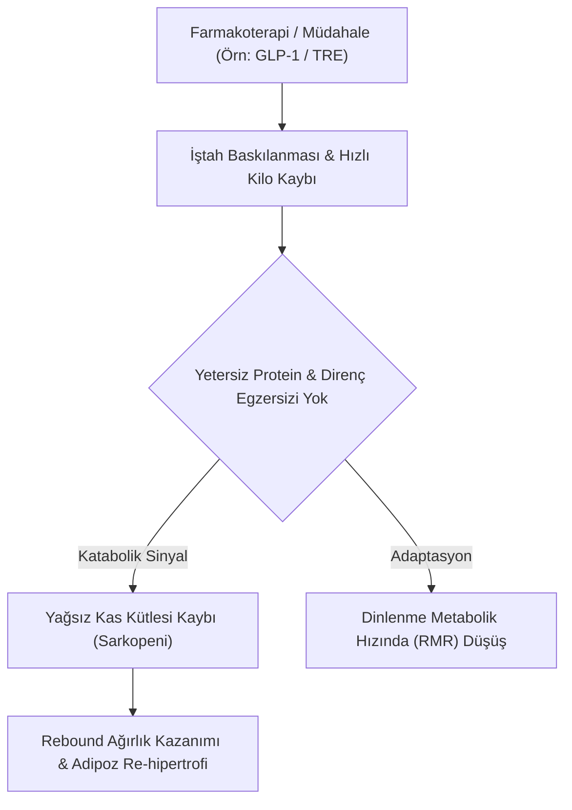

# 🩺 Klinik Vaka Simülasyonu: {{title}}

> **Pedagojik Amaç:** Bu şablon, yayınlanan yeni bir klinik çalışmanın bulgularını lisans/yüksek lisans diyetetik ve tıp öğrencileri için interaktif bir problem temelli öğrenme (PBL) vakasına dönüştürmek amacıyla tasarlanmıştır.

---

## 👤 1. Hasta Profili ve Başvuru Öyküsü

| Parametre | Değer | Klinik Referans / Yorum |
| :--- | :--- | :--- |
| **Yaş / Cinsiyet** | 54 yaş, Kadın | Postmenopozal Dönem |
| **Tanı** | Tip 2 Diyabet + Sarkopenik Obezite | GLP-1 RA (Semaglutid 1.0 mg/hafta) |
| **BMI / Bel Çevresi** | 33.4 kg/m² / 98 cm | Santral Adipozite + Viseral Yağlanma |
| **Laboratuvar** | HbA1c: %8.2, Trigliserit: 240 mg/dL, ALT: 48 U/L | İnsülin Direnci & Hepatik Yağlanma |
| **Vücut Kompozisyonu (BIA/DXA)** | İskelet Kası Kütlesi (SMM): Düşük (%-2.1 Z-skoru) | Miyosteatoz Şüphesi |

---

## 🧬 2. Moleküler & Fizyolojik Mekanizma Akışı

---

## ❓ 3. Öğrenci Tartışma ve Karar Noktaları (Sokratik Sorular)

1. **Beslenme Teşhisi (NCP / PES Cümlesi):**
   * *Problem:* GLP-1 kullanımı sırasında gelişen yetersiz protein ve mikrobesin alımı.
   * *Etiyoloji:* İlacın gastrik boşalmayı geciktirmesi ve erken tokluk hissi.
   * *Belirti/Semptom:* İskelet kası kaybı, halsizlik, serum B12/Ferritin düşüklüğü.

2. **Klinik İkilem:**
   * Hastanın kilosu hızla düşüyor ve doktoru memnun; ancak hasta kas kaybediyor. Siz bir klinik diyetisyen olarak bu tedavi protokolünü nasıl revize edersiniz?

3. **Müdahale Stratejisi (MNT Reçetesi):**
   - [ ] Günlük protein hedefini $\ge 1.6 	ext{ g/kg}$ (yağsız vücut ağırlığı başına) düzeyine çıkarmak.
   - [ ] Lösin / Esansiyel Amino Asit takviyesi veya besin yoğunluğu yüksek sıvı formülasyonlar planlamak.
   - [ ] İlerleyici direnç egzersizi protokolü entegre etmek.

---

## 📚 4. Kanıta Dayalı Çözüm & Makale Çıkarımı
* **Dayanak Makale:** `[[{{title}}]]`
* **Çıkarım:** *{{synthesis}}*
