# 2. Konu: Diyabet ve Tıbbi Beslenme Tedavisi

> **Dersin Pedagojik Felsefesi & Klinik Vizyonu:**
> Bu ders notu ve eşlik eden sunum, lisans düzeyindeki beslenme ve diyetetik öğrencilerini bir lokma karbonhidratın ağızdan girişinden hücresel sinyal kaskadlarına, insülinin sistemik fizyolojisinden ektopik lipid birikimi (DAG/Seramid), post-reseptör sinyal blokajları (Serin fosforilasyonu) ve glukotoksisite kimyasına kadar adım adım taşımak üzere kurgulanmıştır. Amacımız; yalnızca yüzeysel bir şeker yüksekliği bilgisi değil, poliklinikte karşımıza oturan danışanın belirtilerini hücresel mekanizmalarla anında eşleştirebilen ve kanıta dayalı beslenme tedavisi uygulayan yetkin klinik diyetisyenler yetiştirmektir.

---

## 📑 Ders İçerik Haritası

- **Bölüm 00:** Kan Şekerinin Düzenlenmesi, İnsülin Rolleri, İnsülin Direncinin Moleküler Şalteri (Tirozin vs Serin), Bozulmanın 4 Sürücüsü ve Glukotoksisite Kimyası
- **Bölüm 01:** Tanı Kriterleri, ADA 2026 Etyolojik Sınıflandırma (Tip 1, Tip 2, LADA, Monogenik, Gestasyonel) ve Ahlqvist 5-Küme Modeli
- **Bölüm 02:** Akut ve Kronik Komplikasyonlar (DKA, HHS, Hipoglisemi, Mikro/Makrovasküler Hasar Haritası, PLADO Diyeti, Aterojenik Triad)
- **Bölüm 03:** Glisemik Hedefler (Standart, CGM/AGP, Yaşlılarda 3 Grup), OAD Sınıfları & MNT Süzgeci, İnkretinler (GLP-1/GIP) ve İnsülin Farmakokinetiği
- **Bölüm 04:** Beslenme Bakım Süreci (ADIME) ve PES Cümleleri
- **Bölüm 05:** Tıbbi Beslenme Tedavisi (TBT) & 3 Kademeli Karbonhidrat Sayımı (Temel, Orta, İleri; İKO, İDF, Düzeltme Bolusu, UWL, AMPK Şantı)
- **Bölüm 06:** Özel Durumlar & İlaç-Besin Etkileşimleri (GDM, Egzersiz, Yaşlı Bireyler, Metformin-B12, SGLT2 eDKA Riski)
- **Bölüm 07:** Olgu Çalışması (A.K. Klinik Simülasyonu: 52 Yaş Erkek Olgu, Enerji/Makro Hesabı, Menü ve İzlem)
- **Bölüm 08:** Klinik Akıl Haritası, Sentez Soruları ve Kapanış

---

## BÖLÜM 00: KAN ŞEKERİNİN DÜZENLENMESİ VE METABOLİK TEMELLER

### 1. Büyük Resim: Bir Öğün Karbonhidratın Yolculuğu

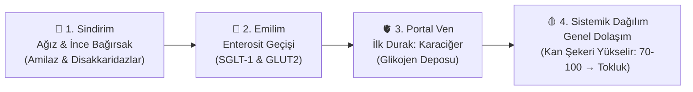

1. **Ağız ve İnce Bağırsak (Sindirim):** Tükürük ve pankreatik $\alpha$-amilaz diyetteki kompleks nişastayı maltoz ve maltotriyoza parçalar. İnce bağırsak fırçamsı kenar enzimleri (laktaz, sükraz, maltaz) bunları emilebilir monosakkaritlere (glukoz, fruktoz, galaktoz) hidroliz eder.
2. **Enterositten Geçiş (Emilim):** Glukoz ve galaktoz, enterosit lümen zarındaki **SGLT-1** (Sodyum-Glukoz Kotransportörü-1) ile aktif olarak hücreye alınır; bazolateral zardaki **GLUT2** taşıyıcısı ile portal dolaşıma aktarılır. Fruktoz ise **GLUT5** ile kolaylaştırılmış difüzyonla emilir.
3. **Portal Ven ve Karaciğer (İlk Filtre):** Bağırsaktan emilen tüm glukoz doğrudan karaciğere ulaşır. Karaciğer, gelen glukozun yaklaşık üçte birini ilk geçişte yakalar ve glikojen olarak depolar.
4. **Sistemik Dolaşım ve Glisemi:** Kalan glukoz sistemik dolaşıma geçer ve periferik dokulara (kas, beyin, adipoz doku) dağılır. Açlıkta 70–100 mg/dL olan plazma glukozu yemekle birlikte fizyolojik olarak yükselir.

> **💡 Klinik Diyetisyen Notu:**
> Tüketilen karbonhidratın moleküler yapısı, lif içeriği ve posa bileşimi glukozun emilim ve kana geçiş hızını (glisemik yanıtı) belirler. Sağlıklı organizmada bu yükseliş pankreas tarafından hızla dengelenir.

---

### 2. Pankreas Glukozu Nasıl Algılar ve İnsülini Ateşler? (Metabolik Termostat)

Pankreas $\beta$-hücresi, kandaki glukoz yoğunluğunu milisaniyeler içinde tarayan mükemmel bir biyokimyasal sensördür:

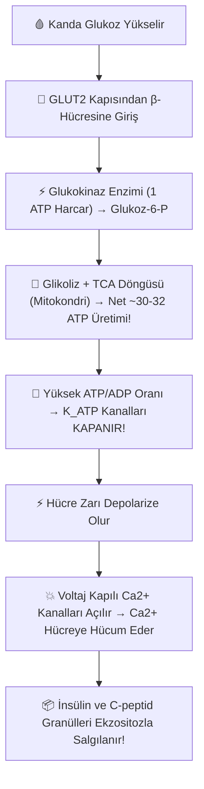

#### Moleküler Adımlar:
1. **Glukoz Girişi & Glukokinaz (Hücresel Termostat):** Glukoz, insülinden bağımsız **GLUT2** taşıyıcısıyla $\beta$-hücresine girer. Hücre içindeki **Glukokinaz (Hekzokinaz IV)** enzimi 1 molekül ATP kullanarak glukozu *Glukoz-6-Fosfat (G6P)* haline getirir. Bu reaksiyon glukozu hücre içine kilitler.
2. **Glikoliz, Krebs Döngüsü ve ATP Üretimi:** G6P hızla glikolize ve mitokondriyal Krebs (TCA) + ETS döngüsüne girer. **1 glukoz molekülünden net ~30–32 ATP üretilir.**
3. **Metabolik Sensör: $K_{\text{ATP}}$ Kanalının Kapanması:** Hücre içinde artan $\text{ATP}/\text{ADP}$ oranı, hücre zarında bulunan ATP duyarlı potasyum kanallarına ($K_{\text{ATP}}$) bağlanarak kanalı kapatır.
4. **Depolarizasyon ve $\text{Ca}^{2+}$ Girişi:** Potasyumun dışarı çıkışı engellenince hücre zarı depolarize olur. Voltaj kapılı L-tipi $\text{Ca}^{2+}$ kanalları açılır.
5. **Ekzositoz:** Hücre içine dolan kalsiyum iyonları, insülin depolu veziküllerin hücre zarıyla kaynaşmasını sağlayarak insülini ve C-peptidi ekzositozla kana salgılar.

---

### 3. İki Fazlı İnsülin Salınımı ve Karaciğer Freni

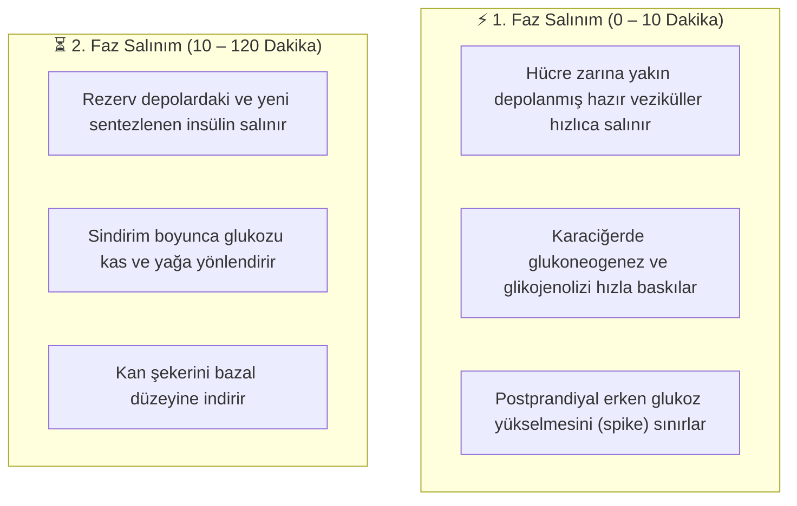

* **1. Fazın Zayıflaması:** Tip 2 diyabet ve prediyabet patogenezinde erken dönemde 1. Faz insülin yanıtı zayıflar. Karaciğer baskılanamadığında tokluk kan şekeri pikleri daha belirgin hale gelir.

---

### 4. İnsülin Hücre Kapısını Nasıl Açar? (IRS-1, PI3K, Akt, AS160 ve GLUT4)

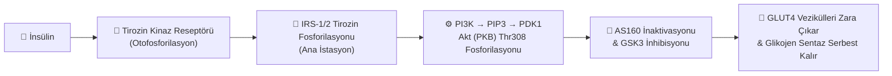

1. **Reseptör Bağlanması ve Otofosforilasyon:** İnsülin $\alpha$ alt birimine bağlanır; hücre içi $\beta$ alt birimindeki **Tirozin Kinaz** aktive olarak kendi tirozin kalıntılarını fosforiller.
2. **IRS-1/2 Aktivasyonu:** Reseptör, İnsülin Reseptör Substratı-1 ve -2 (IRS-1/2) proteinlerini kendine çekerek **Tirozin kalıntılarından** fosforiller.
3. **PI3K / Akt Yolağının Tetiklenmesi:** Tirozin-fosforile IRS-1, PI3K enzimini aktive eder $\rightarrow$ PIP2'yi PIP3'e dönüştürür $\rightarrow$ PDK1 enzimi sitozoldeki **Akt'yi (PKB) Thr308 kalıntısından** fosforilleyerek tam aktif hale getirir.
4. **AS160 İnaktivasyonu ve GLUT4 Translokasyonu:** Aktifleşen Akt, GLUT4 veziküllerini hücre içinde tutan **AS160 (Akt Substrate of 160 kDa)** proteinini fosforilleyerek inaktive eder. Membrana yerleşen GLUT4 kapıları sayesinde glukoz kolaylaştırılmış difüzyonla içeri alınır.
5. **Glikojen Sentezi:** Akt eşzamanlı olarak **GSK3 (Glikojen Sentaz Kinaz-3)** enzimini fosforilleyip pasifleştirir $\rightarrow$ Baskısı kalkan **Glikojen Sentaz** serbest kalarak glikojen sentezini başlatır.

---

### 5. İnsülinin Klasik Metabolik Rolleri: Anabolik Süreçlerin Temel Düzenleyicisi

| Hedef Doku / Sistem | İnsülinin Moleküler Mekanizması | Klinik Diyetisyen İçin Anlamı |
| :--- | :--- | :--- |
| **🥖 Karbonhidrat Metabolizması** | Kas ve yağda GLUT4 translokasyonu; GSK3 inhibisyonu ile glikojen sentaz uyarımı; glikojenoliz ve glukoneogenezin baskılanması. | Açlık ve tokluk plazma glukoz düzeylerinin 70–100 mg/dL bandında tutulmasında başlıca rolü oynar. |
| **🥑 Lipid / Yağ Metabolizması** | LPL uyarımı ile yağ asidi alımını destekler; **Hormon Duyarlı Lipazı (HSL) inhibe ederek lipolizi (yağ mobilizasyonunu) baskılar.** | İnsülin seviyeleri yüksek seyrettiğinde yağ yakımı kısıtlanır; bu nedenle insülin dalgalanmalarını dengelemek ağırlık yönetiminde kilit bir hedeftir. |
| **🥩 Protein / Kas Metabolizması** | Kas hücrelerine amino asit (BCAA) girişini ve ribozomal protein sentezini uyarır; kas proteolizini azaltır. | Egzersiz sonrası protein + dengeli karbonhidrat kombinasyonunun kas anabolizmasındaki bilimsel dayanağıdır. |
| **🧠 İştah & Beyin Dinamiği** | Hipotalamusta tokluk merkezlerini uyarır; ancak ani glukoz dalgalanmaları ve reaktif hipoglisemi durumlarında açlık sinyallerini tetikleyebilir. | Ani glukoz düşüşleri tatlı aşermelerini ve kontrolsüz açlık ataklarını tetikleyebilir. |

---

### 6. İnsülinin Sistemik Görevleri: Klinik Diyetetikte 4 Kritik Eksen

1. **Elektrolit Dengesi & Potasyum ($	ext{K}^+$):** İnsülin, hücre zarındaki $	ext{Na}^+/	ext{K}^+$-ATPaz pompasını uyararak potasyum ve fosfatı hücre içine sokar.
   * *Refeeding Sendromu Uyarısı:* Uzun süreli açlık/malnütrisyon sonrası birden yüksek KH verildiğinde salınan aşırı insülin potasyum ve fosfatı hızla hücreye çeker $
ightarrow$ Hipokalemi ve hipofosfatemi riskine karşı dikkatli olunmalıdır.
2. **Böbrek & Sıvı Dengesi:** İnsülin renal distal tübüllerde sodyum ($	ext{Na}^+$) geri emilimini destekler. Hiperinsülinemi sodyum tutulumuna ve kan basıncı artışına katkıda bulunabilir.
3. **Overler & Hormonal Denge (PCOS):** İnsülin over Teka hücrelerinde androjen sentezini uyarabilir ve karaciğerde SHBG sentezini baskılar. PCOS patogenezinde hiperinsülinemi merkezi bir bileşendir; TBT ile insülin duyarlılığı artırıldığında klinik tablo belirgin düzelir.
4. **Karaciğer & De Novo Lipogenez (MASLD):** İnsülin SREBP-1c transkripsiyon faktörünü uyararak aşırı substrat varlığında yağ asidi/trigliserit sentezini (DNL) artırır $
ightarrow$ Karaciğer yağlanması (MASLD) ve dislipidemi riski gelişir.

---

### 7. Hormon Orkestrası: İnsülin Yalnız Değildir

* **Glukagon ($alpha$-hücresi):** İnsülinin baş karşıt-düzenleyicisidir. Açlıkta devreye girerek karaciğerde glikojenoliz ve glukoneogenezi başlatır; kana glukoz verir.
* **GLP-1 & GIP (İnkretinler):** Besin alımıyla bağırsaktan salınır. Glukoza bağımlı insülin salgısını artırır (İnkretin Etkisi), mide boşalmasını yavaşlatır ve tokluk sağlar.
* **Kortizol (Adrenal Korteks):** Glukoneogenezi uyarır ve periferik dokuların glukoz kullanımını azaltır. Kronik stres ve enfeksiyonlarda glisemik kontrolü zorlaştırabilir.
* **Adrenalin (Epinefrin):** Akut stres ve hipoglisemide glukoz mobilizasyonunu hızlandırır; insülin salgısını geçici baskılar.

---

### 8. İnsülin Direnci Panoraması: Tirozin vs. Serin Fosforilasyonu Şalteri

İnsülin direncinin hücresel düzeydeki en temel moleküler mekanizması, IRS-1 molekülünün fosforilasyon tipinin **Tirozin'den Serin/Treonin amino asitlerine kaymasıdır**:

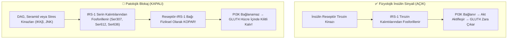

> [!TIP]
> **🧬 İnteraktif Karşılaştırmalı Hücre Simülasyonu:**
> Sunumda bu adımın hemen ardından yer alan interaktif simülasyon ([insulin_resistance_comparison_simulation.html](file:///Users/canerozyildirim/Library/Mobile%20Documents/iCloud~md~obsidian/Documents/caner/Dersler/Yetişkinlerde%20Beslenme%20Tedavisi%20Uygulaması/Sunumlar/insulin_resistance_comparison_simulation.html)) üzerinden; sağlıklı hücredeki fizyolojik **Tirozin fosforilasyonu** ile lipotoksik/stres ortamında gelişen patolojik **Serin fosforilasyonu** ve GLUT4 kapılarının kilitlenme dinamikleri eşzamanlı canlı animasyonla incelenebilmektedir.

---

### 9. Danışanda İnsülin Direncini Gösteren Klinik İpuçları & IGF-1 Mekanizması

1. **Postprandiyal Somnolans:** Karbonhidrat ağırlıklı öğünlerden 30–60 dk sonra gelen belirgin yorgunluk ve uyku hali.
2. **Reaktif Hipoglisemi & Tatlı Aşermesi:** Hücre kapıları geç açıldığı için pankreas kompansatuar olarak aşırı insülin salgılar; 2–4 saat sonra gelen bu gecikmiş insülin dalgası glukozu aniden tabana vurur (titreme, soğuk terleme, tatlı krizleri).
3. **Viseral (Santral) Adipozite:** Bel çevresinin genişlemesi (Kadınlarda $ge 88	ext{ cm}$, Erkeklerde $ge 102	ext{ cm}$; Türkiye verilerinde $ge 80 / 94	ext{ cm}$).
4. **Dermatolojik Belirteçler (Akantozis Nigrikans & Et Benleri):**
   * *Moleküler Nedeni:* Kanda biriken aşırı insülin (hiperinsülinemi), epidermal keratinosit ve dermal fibroblastların yüzeyindeki **IGF-1 (Insulin-like Growth Factor-1) Reseptörlerine doğrudan çapraz bağlanır**. Bu uyarım, hücre proliferasyonunu tetikleyerek kadifemsi koyulaşmalara (Akantozis Nigrikans) ve et benlerine (akrokordon) yol açar.

---

### 10. İnsülin Direnci Nasıl Ölçülür? (Tanı İndeksleri & Kılavuz Uyarısı)

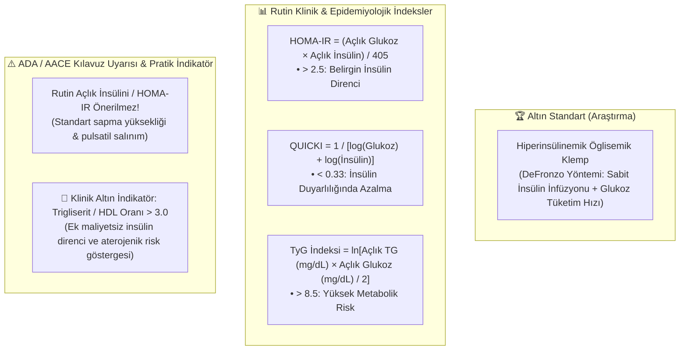

---

### 11. İnsülin Direncinin Doğal Seyri & Sistemik Riskler (Amilin Plakları ve Kanser)

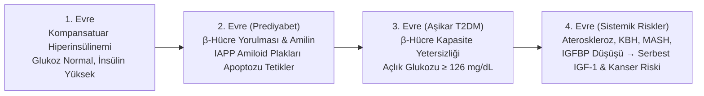

* **Amilin (IAPP) Plakları:** İnsülinle eş salgılanan amilin aşırı üretildiğinde çözünmeyen fibriller oluşturarak $eta$-hücre membranına zarar verir ve apoptozu hızlandırır.
* **Kanser Riski Artışı:** Kronik hiperinsülinemi karaciğerde **IGFBP-1 ve 2** sentezini baskılar $
ightarrow$ Kanda serbest **IGF-1** fırlar $
ightarrow$ Kolon, meme, prostat ve endometriyum tümör hücrelerinde proliferasyon uyarılır.

---

### 12. Selektif Direnç Paradoksu: Hiperinsülinemi ve Vasküler Yapı

İnsülin hücre içinde iki ana otoyolu kullanır:
1. **Metabolik Yolak (PI3K / Akt):** Glukozu hücreye sokan ve endotelde vazodilatatör **Nitrik Oksit (NO)** üreten koldur. **İnsülin direncinde BU YOLAK BASKILANIR.**
2. **Mitojenik Yolak (MAPK / ERK):** Hücre çoğalmasını ve damar düz kas büyümesini yöneten koldur. **BU YOLAK DUYARLILIĞINI KORUR.**

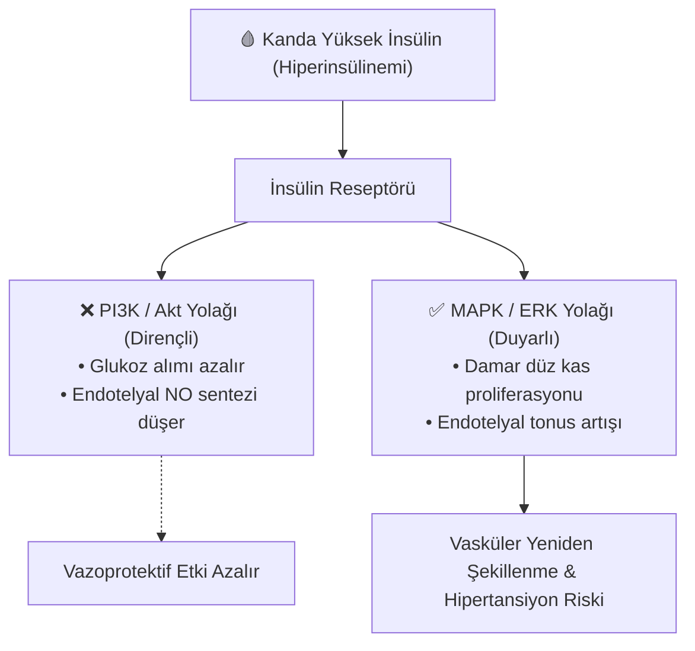

---

### 13. Glukoz Dengesi Nasıl Bozulur? (4 Temel İtici Güç & Diyet Etkileşimi)

Glukoz metabolizmasındaki bozulma 4 temel aks üzerinden ilerler:
1. **Adipoz Doku Taşması & Lipotoksisite** (Ektopik DAG/PKCθ/ε, Seramid/PP2A ve IRS-1 serin fosforilasyonu)
2. **Hepatik De Novo Lipogenez (DNL) & Fruktoz Paradoksu** (PFK baypası, Metilglioksal ve 7 kat hızlı glikasyon)
3. **Mitokondriyal Oksidatif Stres & ER Stresi** (ETS aşırı yüklenmesi, ROS artışı)
4. **Bağırsak Mikrobiyotası & Metabolik Endotoksemi** (Disbiyozis, Leaky Gut, LPS/TLR4 inflamasyonu)

---

### 14. 1. İtici Güç: Adipoz Taşması & Lipotoksisite (DAG, Seramid, PKC & PP2A)

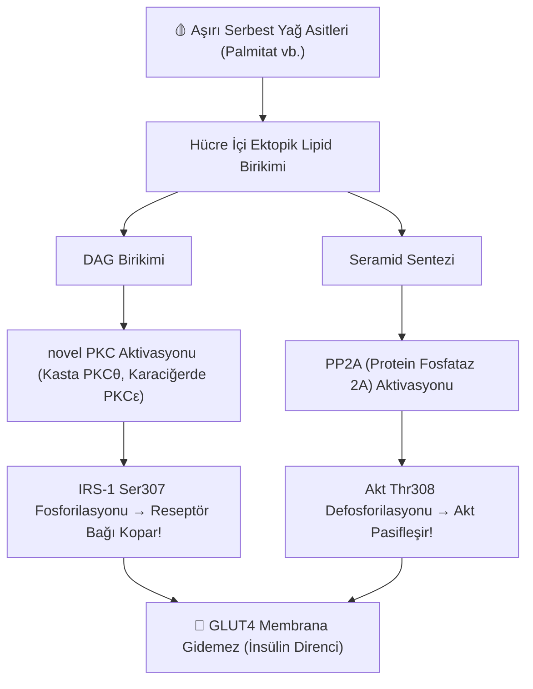

* **MNT & Diyet Lipid Kalitesi:**
  * ⚠️ *Doymuş Yağlar (Palmitat C16:0):* **TLR4** reseptörüne bağlanarak **IKKβ** ve **JNK** stres kinazlarını ateşler $
ightarrow$ **NF-κB** uyarımı (TNF-α, IL-6) ve IRS-1 serin fosforilasyonu.
  * 🌿 *Zeytinyağı (Oleik Asit MUFA):* DAG ve seramid birikimini tetiklemez; PKCθ ve TLR4 aracılı inflamasyonu baskılar.
  * 🌿 *Omega-3 PUFA (EPA/DHA):* Hücre membranındaki **GPR120 (FFAR4)** reseptörüne bağlanarak IKKβ ve JNK kinazlarını susturur, IRS-1 serin fosforilasyonunu engeller.
  * 🌿 *Kalori Kısıtlaması:* Hücre içi DAG ve seramidlerin mitokondriyal $eta$-oksidasyona sokularak temizlenmesini sağlar.

---

### 15. 2. İtici Güç: Hepatik DNL & Fruktoz Paradoksu (Metilglioksal Tehdidi)

* **PFK Baypası:** Fruktoz, glikolizin hız sınırlayıcı enzimi olan Fosfofruktokinazı (PFK) baypas ederek kontrolsüz trigliserit sentezine (MASLD) yönelir.
* **Metilglioksal (MG) Fırtınası:** Fruktoz ara ürünleri hızla son derece reaktif dikarbonil olan **Metilglioksal'e (MG)** parçalanır. Metilglioksal intraselüler proteinlere saldırarak hücre içi AGE sentezini patlatır ve mitokondriyal disfonksiyon yaratır.
* **7 Kat Hızlı Glikasyon:** Fruktoz kimyasal yapısı gereği non-enzimatik glikasyon reaksiyonunu glukoza göre **7 kat daha hızlı** başlatır.
* **Beslenme Yönetimi:** Sıvı serbest şekerlerin (HFCS, meyve suları) kesilmesi; meyvenin bütün lifli matriksiyle porsiyon kontrolü dahilinde tüketilmesi.

---

### 16. 3. İtici Güç: Mitokondriyal Oksidatif Stres & ER Stresi
* **Hücresel Mekanizma:** Sürekli aşırı substrat girişi mitokondriyal ETS'yi aşırı yükler; elektron kaçağı ve **Reaktif Oksijen Türleri (ROS)** üretimi artar.
* **Beta Hücre Kırılganlığı:** Pankreas $eta$-hücrelerinin antioksidan enzim ekspresyonu (Katalaz, SOD) sınırlıdır; oksidatif stres altında hızla sekretuvar yetmezliğe ve apoptoza sürüklenir.
* **Beslenme Yönetimi:** Yüksek glisemik indeksli besinlerin ve trans yağların sınırlandırılması; polifenol zengini beslenme (Zeytinyağı, Yeşil çay EGCG, Yaban mersini antosiyaninleri) ile Nrf2/ARE antioksidan savunmanın uyarılması.

---

### 17. 4. İtici Güç: Bağırsak Mikrobiyotası & Metabolik Endotoksemi
* **Hücresel Mekanizma:** Liften fakir beslenme bağırsak mikrobiyotasını bozar (disbiyozis); mukus tabakası incelir ve intestinal geçirgenlik artar (*Leaky Gut*).
* **LPS ve TLR4 İnflamasyonu:** Gram-negatif bakteri duvarı bileşeni olan **Lipopolisakkaritler (LPS)** dolaşıma sızar. Karaciğer ve yağ dokusundaki **TLR4** reseptörlerine bağlanarak düşük dereceli kronik inflamasyonu ve insülin direncini tetikler.
* **Beslenme Yönetimi:** Prebiyotik çözünür lifler (İnülin, Dirençli Nişasta RS3), fermente besinler $
ightarrow$ **Kısa Zincirli Yağ Asitleri (KZYA: Bütirat)** üretimi ile mukozal bariyer onarımı.

---

### 18. Kronik Hiperglisemi ve Doku Hasarı (Glukotoksisitenin 4 Başlıca Yolağı)

Hiperglisemi 4 temel biyokimyasal hasar yolağı üzerinden vasküler ve organ disfonksiyonuna zemin hazırlar:

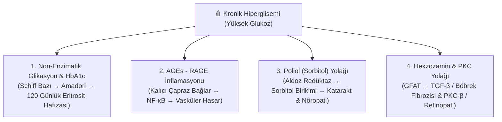

---

### 19. 1. Hasar Yolağı: Non-Enzimatik Glikasyon, HbA1c & Glisemik Değişkenlik
* **Biyokimyasal Reaksiyon (Maillard):** Glukoz serbest aldehit grubuyla hemoglobin amino grubuna bağlanır $
ightarrow$ Schiff Bazı $
ightarrow$ Kararlı ketoamin (**HbA1c**).
* **120 Günlük Glisemik Hafıza:** Eritrositlerin ortalama yaşam süresi ~120 gündür. Bir kez glikozillenen hemoglobin eritrosit ömrü boyunca o halde kaldığından HbA1c son 2–3 aylık ortalama kan şekerini yansıtır.
* **HbA1c İllüzyonu & Glisemik Değişkenlik:** HbA1c %6.2 olsa bile gün içi 50–350 mg/dL dalgalanmalar anlık piklerde Aldoz Redüktazı (Poliol) ve doku hasarını tetikler. Diyetisyenin hedefi dalgalanmaları düzleştirmektir.

---

### 20. 2. Hasar Yolağı: AGEs - RAGE İnflamasyonu & Mutfakta Asit Gücü (dAGE)
* **AGEs ve RAGE Sinyali:** Amadori ürünleri uzun vadede **İleri Glikasyon Son Ürünlerine (AGEs)** dönüşür $
ightarrow$ RAGE reseptörüne bağlanarak **NF-κB inflamatuar yolağını** uyarır $
ightarrow$ Endotel disfonksiyonu ve damar sertliği hızlanır.
* **Nefropatide dAGE Riski:** Tüketilen dAGE'lerin %10–30'u emilir; böbrek filtrasyonu azalan nefropatili hastalarda dAGE kısıtlaması hayati önem taşır.
* **Asitliğin Biyokimyasal Açıklaması (Marinasyon):** Limon suyu veya sirke (asidik pH), amino asitlerin serbest amino grubunu ($R-NH_2$) protonize ederek ($R-NH_3^+$) nükleofilik özelliğini yok eder $
ightarrow$ Glukozun karboniline saldıramaz $
ightarrow$ **Schiff bazı oluşumu durdurulur (dAGE %50–70 azalır)!**

---

### 21. 3. Hasar Yolağı: Poliol (Sorbitol) Yolağı & İnsülinden Bağımsız Dokular
* **İnsülinden Bağımsız Hedef Dokular:** Göz merceği, retina perisitleri, Schwann hücreleri ve renal podositler glukozu hücre içine almak için insüline bağımlı değildir. Hiperglisemide bu hücrelerin içine aşırı glukoz akar.
* **Aldoz Redüktaz ve Sorbitol Birikimi:**
  $$\text{Glukoz} + \text{NADPH} \xrightarrow{\text{Aldoz Redüktaz}} \text{Sorbitol} + \text{NADP}^+$$
  Sorbitol hücre zarını kolayca geçemez ve hücre içinde birikir.
* **Hücresel Hasarın 3 Ayağı:**
  1. *Ozmotik Stres:* Hücre içine su çekerek ozmotik basınca yol açar $
ightarrow$ Lens hidrasyonu, katarakt ve görme bulanıklığı.
  2. *Antioksidan Savunmada Azalma:* NADPH sorbitol sentezinde tüketildiğinden glutatyon yenilenemez $
ightarrow$ Oksidatif Stres.
  3. *Nöronal Disfonksiyon:* İnozitil azalması ve $\text{Na}^+/\text{K}^+$-ATPaz aktivitesinin zayıflaması $
ightarrow$ **Diyabetik Periferik Nöropati**.

---

### 22. 4. Hasar Yolağı: Hekzozamin ve PKC Yolağı
* **Hekzozamin Yolağı:** Aşırı glukoz glikolizden Hekzozamin yolağına (GFAT enzimi) saparak UDP-GlcNAc sentezini artırır. Transkripsiyon faktörlerinin aşırı O-glikozilasyonu **TGF-$\beta$ gen ekspresyonunu artırır** $
ightarrow$ Glomerüllerde mezanjiyal matriks birikir ve **Diyabetik Nefropati (Renal Fibrozis)** süreci hızlanır.
* **Protein Kinaz C (PKC) Aktivasyonu:** Hücre içi glukoz artışı Diaçilgliserol (DAG) sentezini tetikler $
ightarrow$ **PKC-$\beta$ aktive olur** $
ightarrow$ **VEGF (Vasküler Endotelyal Büyüme Faktörü)** ekspresyonu artar. VEGF retinada anormal kırılgan damarlanma ve permeabilite artışına yol açarak **Diyabetik Retinopatiyi** desteklerken koruyucu eNOS baskılanır.

---


## BÖLÜM 01: DİYABET SINIFLANDIRMASI, FENOTİPİK KÜMELEME, TANI KRİTERLERİ VE LABORATUVAR NÜANSLARI

Bu bölüm, diyabeti yalnızca bir 'kan şekeri yüksekliği' olarak değil; altında yatan etyolojik mekanizmalara, genetik profillere, fenotipik alt kümelere (Ahlqvist) ve biyokimyasal/laboratuvar parametrelerine göre ayrıştıran 5 modüler basamakta inceler.

---

### 1.1. Etyolojik Sınıflandırma ve ADA 2026 4 Ana Kategori

ADA 2026 sınıflandırmasında diyabet, patofizyolojik oluşum mekanizmasına göre 4 temel sınıfta toplanır:

1. **Tip 1 Diyabet:** Pankreas $\beta$-hücrelerinin otoimmün yıkımı sonucu gelişen mutlak insülin eksikliği tablosudur.
2. **Tip 2 Diyabet:** Periferik insülin direnci zemininde gelişen ilerleyici $\beta$-hücre sekresyon yetmezliğidir (Tüm olguların %90-95'i).
3. **Gestasyonel Diyabet (GDM):** Gebeliğin 2. veya 3. trimesterinde ilk kez saptanan, gebelik öncesi aşikar diyabet kriterlerini karşılamayan hiperglisemidir.
4. **Spesifik Nedenlere Bağlı Diğer Diyabet Tipleri:** Monogenik diyabet sendromları (MODY, neonatal DM), ekzokrin pankreas hastalıkları (Tip 3c DM; pankreatit, kistik fibrozis) ve ilaca/kimyasala bağlı hiperglisemi (kortikosteroidler, immün checkpoint inhibitörleri, atipik antipsikotikler).

---

### 1.2. Tip 1 Diyabet ve LADA Patogenezi

#### A. Tip 1 DM: 3 Evreli Gelişim Modeli
Tip 1 DM, genetik yatkınlığı olan bireylerde çevresel tetikleyicilerle başlayan T-hücre aracılı otoimmün insülitis sürecidir:
- **Evre 1 (Erken İmmünite):** $\ge 2$ Pozitif Adacık Otoantikoru (Anti-GAD65, IA-2A, ZnT8A, IAA) + **Normoglisemi** (Asemptomatik).
- **Evre 2 (Disglisemi):** $\ge 2$ Pozitif Otoantikor + **Bozulmuş Glukoz Toleransı/Açlık** (FPG 100-125, OGTT 140-199 mg/dL, HbA1c %5.7-6.4).
- **Evre 3 (Aşikar Klinik Diyabet):** $\beta$-hücre kütlesinin %80-90'ı harap olmuştur; semptomatik hiperglisemi ve DKA riskiyle başvurulur. Eksojen insülin hayati zorunluluktur.

#### B. LADA (Yetişkinin Yavaş Seyirli Otoimmün Diyabeti)
- **ADA 2026 Statüsü:** LADA ayrı bir hastalık değil, **Tip 1 Diyabetin yetişkinde görülen yavaş seyirli otoimmün alt formu** olarak sınıflandırılır.
- **Klinik Tuzak:** Olguların **%40'ı başlangıçta Tip 2 DM sanılarak** yanlış teşhis alır. Hastalar genellikle $\ge 30-35$ yaşta, normo-ponderal (zayıf/normal kilolu) ve **Anti-GAD65 pozitiftir**.
- **Kritik Güvenlik Uyarısı:** LADA hastalarına Tip 2 DM sanılarak SGLT2 inhibitörü başlanması veya aşırı karbonhidrat kısıtlaması (ketojenik diyet) yapılması **öglisemik Diyabetik Ketoasidoz (DKA)** tablosunu tetikleyebilir!

---

### 1.3. Tip 2 Diyabet Patofizyolojisi ve Hiperglisemiye Yol Açan Sistemik Ağ

Tip 2 DM patogenezi, periferik insülin direnci ile $\beta$-hücre yetmezliğinin eş zamanlı ilerlemesidir. Başlangıçta pankreas normoglisemiyi korumak için aşırı insülin üretir (kompansatuar hiperinsülinemi). Yıllar içinde glukolipotoksisite ve ER stresi nedeniyle $\beta$-hücreleri iflas eder; tanı anında fonksiyonun yaklaşık %50'si kaybedilmiştir.

#### Hiperglisemiye Yol Açan 8 Eş Zamanlı Bozukluk ve Genişletilmiş Sistemik Eksenler:
1. **Pankreas $\beta$-Hücresi:** İlerleyici insülin sekresyon yetersizliği ve apoptoz.
2. **Karaciğer:** İnsülin freni tutmadığı için kontrolsüz hepatik glukoz üretimi (Aşırı Glukoneogenez).
3. **İskelet Kası:** GLUT4 translokasyon defekti nedeniyle glukoz klirensinde %80'e varan azalma.
4. **Adipoz Doku:** İnhibe edilemeyen lipoliz, FFA salınımı ve ektopik yağlanma.
5. **İnce Bağırsak:** GLP-1 ve GIP inkretin etkisinde zayıflama.
6. **Böbrekler:** SGLT-2 aşırı ekspresyonu ile glukozun patolojik geri emilimi.
7. **Pankreas $\alpha$-Hücresi:** Hiperglisemiye rağmen paradoksal glukagon hipersekresyonu.
8. **Beyin/Hipotalamus:** Santral insülin direnci, iştah regülasyonu ve tokluk sinyallerinin bozulması.
9. **Sistemik İnflamasyon:** Adipokin dengesizliği (TNF-$\alpha$, IL-6, CRP yüksekliği; adiponektin düşüşü).
10. **Bağırsak Mikrobiyotası:** Disbiyozis, bütirat üreten türlerin kaybı ve endotoksemi.
11. **Mide ve Safra Asitleri:** Değişmiş mide boşalma hızı ve TGR5/FXR sinyal bozukluğu.

---

### 1.4. Gestasyonel, Monogenik ve Sekonder Diyabet Türleri

1. **Gestasyonel Diyabet (GDM):**
   - 24-28. haftada plasental hormonların (hPL, progesteron, kortizol) yarattığı fizyolojik direnç sonucu gelişir.
   - **Pedersen Hipotezi:** Maternal hiperglisemi $\rightarrow$ Fetal hiperinsülinemi $\rightarrow$ Makrozomi (>4000g), neonatal hipoglisemi ve doğum travması.
   - **TBT:** Minimum 175 g/gün KH sağlanarak ketozis önlenmeli; AKŞ $\le 95\text{ mg/dL}$, 1.st $\le 140\text{ mg/dL}$, 2.st $\le 120\text{ mg/dL}$ hedeflenmelidir.
2. **Monogenik Diyabet (MODY):**
   - **MODY 2 (GCK):** Glukokinaz eşik kayması; hafif açlık hiperglisemisi (100-145 mg/dL), komplikasyon riski yoktur, ilaç gerektirmez.
   - **MODY 3 (HNF1A) & MODY 1 (HNF4A):** En sık form (%70); ilerleyici $\beta$-hücre disfonksiyonu ve düşük renal eşik. **Düşük doz Sulfonilüreye** dramatik yanıt verir (İnsülin ihtiyacını sonlandırabilir).
3. **Sekonder ve İlaca Bağlı DM:**
   - **Tip 3c DM (Pankreatojenik):** Kronik pankreatit veya cerrahi sonrası hem insülin hem glukagon yokluğu; ağır hipoglisemiler ve kırılgan glisemi. PERT ve dengeli beslenme gerekir.
   - **Kortikosteroid DM:** Açlık normal kalabilirken, öğleden sonra ve akşam aşırı glukoz pikleri görülür.
   - **İmmün Checkpoint İnhibitörleri:** Akut otoimmün $\beta$-hücre yıkımı ve ani DKA tablosu yapabilir.

---

### 1.5. Fenotipik Kümeleme: Ahlqvist 5-Cluster Modeli

İsveç ANDIS kohortu (Lancet Diabetes 2018), diyabetin heterojen yapısını 6 temel biyobelirteçle (Yaş, BMI, HbA1c, HOMA2-B/C-peptid, HOMA2-IR, Anti-GAD) 5 homojen alt kümeye ayırmıştır:

| Küme Kodu | Tanım & Karakteristik | Başlıca Klinik Organ Hasarı Riski | Diyetisyenin Hassas TBT Preskripsiyonu |
| :--- | :--- | :--- | :--- |
| **SAID** *(Küme 1)* | **Ağır Otoimmün DM:** Genç yaş, düşük BMI, Anti-GAD (+), ağır insülin yetmezliği. | DKA Riski, Şiddetli Glisemik Değişkenlik | İleri Karbonhidrat Sayımı, bazal-bolus uyumu, hipoglisemi önleme. |
| **SIDD** *(Küme 2)* | **Ağır İnsülin Yetersiz DM:** Anti-GAD (-), genç/orta yaş, yüksek HbA1c, çok düşük HOMA-B. | **Diyabetik Retinopati & Katarakt Riski En Yüksek Küme** | Düşük glisemik yük, postprandiyal pikleri önleme, anti-AGE fitokimyasallar, erken insülin desteği. |
| **SIRD** *(Küme 3)* | **Ağır İnsülin Dirençli DM:** Yüksek BMI, çok yüksek HOMA-IR ve C-peptid, karaciğer yağlanması. | **Diyabetik Nefropati, KBY ve MASH Riski En Yüksek Küme** | Nefroprotektif protein (**$0.8\text{ g/kg/gün}$**), sodyum $<2000\text{ mg}$, viseral yağ kaybı odaklı Akdeniz diyeti. |
| **MOD** *(Küme 4)* | **Obeziteyle İlişkili Hafif DM:** Belirgin yüksek BMI, erken yaş, orta direnç. | Metabolik Sendrom, Kardiyovasküler Risk | $\%7-10$ hedeflenmiş kilo kaybı, $500-750\text{ kkal}$ enerji açığı, porsiyon kontrolü. |
| **MARD** *(Küme 5)* | **Yaşla İlişkili Hafif DM:** İleri yaş, hafif metabolik bozulma, en geniş küme (%35-40). | Sarkopeni, Polifarmasi, Fonksiyonel Gerileme | Katı kısıtlamadan kaçınma, kas kütlesi koruma (**$1.0-1.2\text{ g/kg}$ protein**), esnek glisemik hedefler. |

---

### 1.6. ADA 2026 Tanı Kriterleri, Prediyabet ve Yatan Hasta Yönetimi

#### A. Standart Tanı Eşikleri
| Tanı Testi | Normal | Prediyabet | Diyabet (Eşik) |
| :--- | :---: | :---: | :---: |
| **Açlık Plazma Glukozu (FPG)** (En az 8 saat) | $< 100\text{ mg/dL}$ | $100 - 125\text{ mg/dL}$ (IFG) | $\ge 126\text{ mg/dL}$ |
| **OGTT 2. Saat Plazma Glukozu** ($75\text{ g}$ anhidroz) | $< 140\text{ mg/dL}$ | $140 - 199\text{ mg/dL}$ (IGT) | $\ge 200\text{ mg/dL}$ |
| **HbA1c** (NGSP/DCCT Standardize) | $< 5.7\%$ | $5.7\% - 6.4\%$ | $\ge 6.5\%$ |
| **Rastgele Glukoz + Klasik Semptomlar** | — | — | $\ge 200\text{ mg/dL}$ *(Tek ölçüm yeterli)* |

- **Doğrulama Kuralı:** Akut kriz yoksa tanı **farklı bir günde tekrarlanan ikinci bir anormal testle** doğrulanmalıdır.
- **Prediyabet:** DPP çalışması kanıtıyla, diyetisyen kontrolünde $\%7$ kilo kaybı ve haftalık $150\text{ dk}$ aktivite ile diyabete dönüşüm **$\%58$ oranında önlenebilir**.

#### B. Hastanede Yatan Hastada Tanı Yönetimi
- Kan şekeri $>140\text{ mg/dL}$ saptanan her hastada HbA1c bakılmalıdır.
- $\text{HbA}_{1c} \ge \%6.5$ ise **Yeni Tanı Diyabet**, $<\%6.5$ ise **Stres Hiperglisemisi** kabul edilir.
- Servis hedefi **$140 - 180\text{ mg/dL}$** aralığıdır (Aşırı sıkı hedefler mortaliteyi artırır).

---

### 1.7. Kan ve İdrar Parametrelerinde Kritik Nüanslar

#### A. $\text{HbA}_{1c}$ Fizyolojik Sınırları ve Yalancı Değerler
- **Yalancı Yüksek Nedenleri:** Demir eksikliği anemisi, $\text{B}_{12}$/folat eksikliği (yaşlı eritrosit oranı artışı), splenektomi, hiperlipidemi interferansı.
- **Yalancı Düşük Nedenleri:** Hemolitik anemi, akut/kronik kan kaybı, EPO tedavisi, KBY/hemodiyaliz (üremik yıkım), karaciğer sirozu, gebelik (2-3. trimester).
- **ADA 2026 Çözüm Kuralı:** Klinik tablo veya hemoglobinopati varlığında HbA1c geçersizdir; tanı ve izlemde **yalnızca venöz plazma glukozu (FPG/OGTT) ve CGM (GMI)** kullanılır.

#### B. İdrar Parametreleri: Keton & UACR
- **İdrar Ketonu:** İntraselüler glukoz açlığı ve lipoliz alarmıdır. SGLT2i kullananlarda veya LADA olgularında normal glukozda dahi keton pozitifliği **Öglisemik DKA** habercisidir.
- **UACR Eşikleri:** Normal $<30\text{ mg/g}$, Mikroalbüminüri $30-299\text{ mg/g}$, Makroalbüminüri $\ge 300\text{ mg/g}$. UACR $\ge 30\text{ mg/g}$ olduğunda diyetisyen protein alımını **$0.8\text{ g/kg/gün}$** sınırına çekmeli ve sodyumu $<2000\text{ mg/gün}$ ile kısıtlamalıdır.

---

### 1.8. C-Peptid Biyokimyası ve Klinik Karar Ağacı

- Proinsülinden insülin ile **$1:1$ eşmolar** salgılanır, eksojen insülinden bağımsızdır ve karaciğer ilk geçişinde yıkılmaz.
- **$< 200\text{ pmol/L}$ ($< 0.6\text{ ng/mL}$):** Mutlak insülin eksikliği (Tip 1 DM / İleri LADA / SIDD) $\rightarrow$ **İleri Karbonhidrat Sayımı (İKO/DFF)**.
- **$200 - 600\text{ pmol/L}$:** Dinamik gri bölge $\rightarrow$ Karbonhidrat dağılımı ve glisemik değişkenlik kontrolü.
- **$> 600\text{ pmol/L}$ ($> 1.8\text{ ng/mL}$):** Yüksek endojen rezerv / İnsülin direnci (Tip 2 DM / SIRD) $\rightarrow$ Kalori kısıtlaması, viseral yağ kaybı ve egzersiz.

---

### 1.9. Ayırıcı Tanı Matrisi, Tarama Algoritması ve Diyetisyen Vizyonu

#### A. 4 Büyük Tipin Ayırıcı Tanı Matrisi
| Parametre | Tip 1 DM | Tip 2 DM | LADA | MODY |
| :--- | :---: | :---: | :---: | :---: |
| **Başlangıç Yaşı** | Genellikle $<20$ | Genellikle $\ge 35-40$ | $\ge 30-50$ | Genellikle $<25$ |
| **BMI Profili** | Zayıf / Normal | Aşırı Kilolu / Obez | Çoğunlukla Normal | Genellikle Normal |
| **Otoantikorlar** | Pozitif (%90-95) | Negatif | Pozitif (Anti-GAD) | Negatif |
| **C-Peptid** | $<200\text{ pmol/L}$ | $>600\text{ pmol/L}$ | Başlangıçta normal, hızla düşer | Korunmuş |
| **DKA Riski** | Yüksek | Düşük (HHS görülür) | Geç evrede yüksek | Çok Nadir |
| **Temel Tedavi** | İnsülin + KH Sayımı | Yaşam Tarzı + OAD | Erken İnsülin + KH Sayımı | Düşük Doz Sulfonilüre |

#### B. ADA 2026 Tarama ve FINDRISC
- **Evrensel Yaş Kuralı:** Tüm bireyler risk faktörü olmasa dahi **35 yaşından itibaren** taranmalıdır.
- **Erken Tarama:** BMI $\ge 25\text{ kg/m}^2$ (Asya $\ge 23$) + $\ge 1$ ek risk faktörü taşıyanlar her yaşta taranır.
- **FINDRISC:** 8 parametreli anketle 10 yıllık risk öngörülür (Skor $>15$ puan: %33 risk).
- **Diyetisyen Vizyonu:** Hastalığın etiketini değil; moleküler rezervini, fenotipik riskini ve etyolojik kökenini bilerek **organ koruyucu hassas tıbbi beslenme tedavisi** planlarız.


## BÖLÜM 02: DİYABETİN AKUT VE KRONİK KOMPLİKASYONLARI

Diyabetik komplikasyonların gelişimi, basit bir glukoz yüksekliğinden ziyade hücresel düzeyde sistemik bir metabolik yıkım ve vasküler hasar sürecidir.

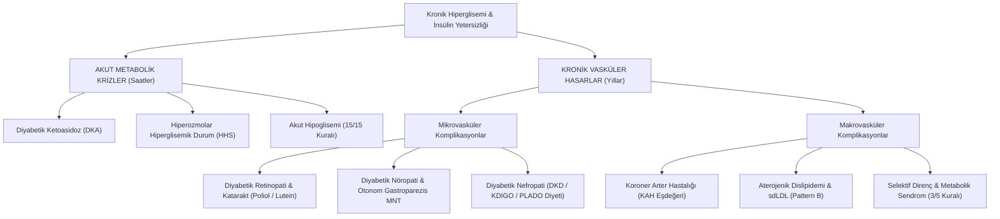

---

### 2.1. Akut Komplikasyonlar: 2024 ADA/EASD Konsensus Raporu ve Metabolik Aciller

2024 yılında ADA, EASD, JBDS, AACE ve DTS ortaklığıyla yayınlanan uluslararası konsensus raporu (*"Hyperglycaemic crises in adults with diabetes: a consensus report"*), 2009'dan bu yana ilk kez DKA ve HHS tanı kriterlerini, moleküler patogenezini ve yönetimini baştan revize etmiştir.

```mermaid
flowchart TD
    subgraph "MUTLAK İNSÜLİN EKSİKLİĞİ (DKA)"
        A1["Mutlak İnsülin Yokluğu & Karşıt Hormon Fırtınası"] --> A2["Adipoz HSL Aşırı Aktif & Serbest Yağ Asidi (FFA) Akışı"]
        A2 --> A3["Karaciğer CPT-1 Kapağı Açılır & Mitokondriyal Ketojenez"]
        A3 --> A4["🎯 Kanda BOHB ≥ 3.0 mmol/L, pH < 7.30, HCO3 < 18 (DKA)"]
    end
    subgraph "GÖRELİ İNSÜLİN EKSİKLİĞİ (HHS)"
        B1["Minimal İnsülin Varlığı & Ağır İnsülin Direnci"] --> B2["Eser İnsülin Lipolizi Frenler (Keton Negatif / Eser)"]
        B2 --> B3["Karaciğer Glukoneogenezi Durdurulamaz & Glukoz ≥ 600 mg/dL"]
        B3 --> B4["🎯 Masif Ozmotik Diürez & Efektif Ozmolarite > 320 mOsm/kg (HHS)"]
    end
```

---

#### A. Eski (2009 ADA) vs. Yeni (2024 ADA/EASD Konsensus) Tanı Kriterleri Karşılaştırması

| Tanı Parametresi | Eski Kılavuz (ADA 2009) | Yeni Konsensus (ADA/EASD 2024) | Klinik Rasyonel & Yenilik |
| :--- | :--- | :--- | :--- |
| **Plazma Glukozu** | $> 250\text{ mg/dL}$ ($>13.9\text{ mmol/L}$) | **$\ge 200\text{ mg/dL}$ ($11.1\text{ mmol/L}$)** veya diyabet öyküsü | SGLT-2i ve erken evre DKA'yı yakalamak için eşik düşürüldü. |
| **Keton Ölçümü** | İdrarda/serumda asetoasetat (nitroprussid) | **Kanda $\beta$-Hidroksibütirat (BOHB) $\ge 3.0\text{ mmol/L}$** | **Altın Standart:** BOHB asıl patolojik ketondur; idrar stripi erken evreyi kaçırır. |
| **Kan Gazı & pH** | Yalnızca Arteriyel pH ($7.25-7.30\ /\ 7.00-7.24\ /\ <7.00$) | **Venöz Kan Gazı (VBG) pH** eşdeğer kabul edildi ($\text{pH} < 7.30$) | Ağrılı arteriyel ponksiyon şartı kalktı; venöz gaz takibi yeterlidir. |
| **Serum Bikarbonat** | Hafif: 15-18, Orta: 10-14, Ağır: <10 mEq/L | **$\text{HCO}_3 < 18\text{ mmol/L}$** (Hafif: 15-18, Orta: 10-14, Ağır: <10) | Metabolik asidoz derecesini ve şiddet evrelemesini belirler. |
| **Anyon Açığı** | $> 10-12\text{ mEq/L}$ | **$> 10-12\text{ mEq/L}$** ($[\text{Na}^+] - [\text{Cl}^- + \text{HCO}_3^-]$) | Yüksek anyon açıklı metabolik asidozun doğrulanması. |
| **İyileşme (Resolution)**| Glukoz <200 + 2 kriter (pH >7.30, $\text{HCO}_3 \ge 15$, Anyon açığı normal) | **Glukoz <200 + BOHB <0.6 mmol/L** VEYA (Venöz pH $\ge 7.30$ ve $\text{HCO}_3 \ge 18$) | Kanda ketonun doğrudan temizlendiğini teyit eden biyokimyasal kanıt. |

---

#### B. 2024 DKA Şiddet Evrelemesi ve Triyaj (Konsensus Tablo 2)

```
┌────────────────────────────────────────────────────────────────────────────────────────┐
│                          2024 DKA ŞİDDET EVRELEMESİ VE TRİYAJ                          │
├────────────────────────┬───────────────────────────────┬───────────────────────────────┤
│ 1. Hafif DKA (Mild)    │ 2. Orta DKA (Moderate)        │ 3. Ağır DKA (Severe)          │
├────────────────────────┼───────────────────────────────┼───────────────────────────────┤
│ • Venöz pH: 7.25-7.30  │ • Venöz pH: 7.00-7.24         │ • Venöz pH: < 7.00            │
│ • HCO3: 15-18 mmol/L   │ • HCO3: 10-14 mmol/L          │ • HCO3: < 10 mmol/L           │
│ • BOHB: ≥ 3.0 mmol/L   │ • BOHB: ≥ 3.0 mmol/L          │ • BOHB: Genellikle > 6.0      │
│ • Mental: Tam açık     │ • Mental: Uyanık / Letarjik   │ • Mental: Stupor / Koma       │
│ • Bakım: Dahiliye Serv.│ • Bakım: Ara Yoğun Bakım      │ • Bakım: Yoğun Bakım (YBÜ)    │
└────────────────────────┴───────────────────────────────┴───────────────────────────────┘
```

---

#### C. DKA, HHS ve Öglisemik DKA (euDKA) 2024 Ayırıcı Tanı Matrisi

| Parametre | Klasik DKA | Hiperozmolar Durum (HHS) | Öglisemik DKA (euDKA) |
| :--- | :---: | :---: | :---: |
| **Tipik Hasta** | Tip 1 DM / LADA | İleri yaş Tip 2 DM, dehidrate | SGLT-2i alan T2DM veya katı keto diyet |
| **Plazma Glukozu** | **$\ge 200 - 600\text{ mg/dL}$** | **$\ge 600 - 1200+\text{ mg/dL}$** | **$< 200\text{ mg/dL}$** (Normal/Hafif Yüksek) |
| **Kanda BOHB** | **$\ge 3.0\text{ mmol/L}$** (Pozitif) | $< 3.0\text{ mmol/L}$ (Eser/Negatif) | **$\ge 3.0\text{ mmol/L}$** (Pozitif keton) |
| **Venöz pH** | **$< 7.30$** (Asidoz) | **$\ge 7.30$** (Normal/Hafif Düşük) | **$< 7.30$** (Ağır Asidoz) |
| **Serum Bikarbonat**| **$< 18\text{ mmol/L}$** | **$\ge 18\text{ mmol/L}$** | **$< 18\text{ mmol/L}$** |
| **Efektif Ozmolarite**| Değişken ($<320\text{ mOsm/kg}$) | **$> 320\text{ mOsm/kg}$** (Ağır) | Normal ($<300\text{ mOsm/kg}$) |
| **Temel Klinik** | Kussmaul solunumu, kusma | Ağır dehidratasyon ($8-10\text{ L}$), koma | Şeker normal sanılıp tanının atlanması! |

---

#### D. İyileşme (Resolution), Subkutan İnsüline 2 Saatlik Geçiş Köprüsü ve 15/15 Kuralı
1.  **DKA Resolution:** $\text{Glukoz} < 200\text{ mg/dL}$ + $\text{Kan BOHB} < 0.6\text{ mmol/L}$ VEYA (Venöz pH $\ge 7.30$ ve $\text{HCO}_3 \ge 18\text{ mmol/L}$).
2.  **Kritik 2 Saatlik Örtüşme (Overlap):** IV insülin durdurulmadan ve ilk öğün yenmeden **tam 2 saat önce subkutan bazal insülin** yapılmalıdır. Aksi halde dakikalar içinde rebound ketoasidoz gelişir!
3.  **Hipoglisemi 15/15 Kuralı:** Glukoz $<70\text{ mg/dL}$ olduğunda 15g saf basit şeker (3-4 kesme şeker veya 150 mL meyve suyu) verilir; 15 dk sonra ölçülür. Çikolata/yağlı pasta emilimi kilitlediği için kesinlikle yasaktır!

---

### 2.2. Kronik Hasarın Moleküler Temeli: Forbes & Cooper (2013) Çerçevesinde 5 Büyük Klinik Sezgi

Diyabetik komplikasyonların patofizyolojisini anlamak için enzim ezberinden ziyade **5 büyük klinik kavrama** odaklanmak gerekir:

#### 1. Neden Sadece Belirli Organlar Hasar Görür? (İnsülinsiz Kapı Paradoksu)
* **GLUT4 vs. GLUT1/3:** İskelet kası ve yağ dokusu glukoz girişi için insüline (GLUT4) muhtaçtır; insülin direnci varlığında hücre kapısını kapatır ve kendisini hücre içi hiperglisemiden korur.
* **Savunmasız Dokular:** Damar endoteli, retina kılcalları, böbrek podosit/mezangiyumu ve Schwann hücreleri **GLUT1 ve GLUT3** eksprese eder (insülinden bağımsız). Kanda şeker yükseldiğinde kapıyı kapatamazlar; hücre içi kontrolsüz glukozla boğulur (*intraselüler hiperglisemi*).
* **Klinik Çıkarım:** Retinopati, nefropati ve nöropatinin bu 3 organda kümelenmesinin nedeni 'glukoz kapısını kapatamamalarıdır'.

#### 2. Brownlee Birleştirici Trafik Modeli: GAPDH Otoyol Tıkanıklığı ve 4 Tali Yol
* **Kök Neden (Mitokondriyal Aşırı Yük):** Kontrolsüz glukoz akışı mitokondri elektron transport zincirinde süperoksit ($O_2^{\bullet-}$) patlamasına yol açar $\rightarrow$ DNA kırılması $\rightarrow$ PARP aktivasyonu $\rightarrow$ Ana glikoliz enzimi **GAPDH kilitlenir**.
* **4 Zararlı Tali Yol:** Ana otoyol tıkanınca glukoz metabolitleri mecburen 4 tali yola taşar:
  1. **Poliol (Sorbitol) Yolağı:** NADPH tükenir, Glutatyon (GSH) antioksidan kalkanı çöker $\rightarrow$ Ozmotik ödem ve katarakt.
  2. **İleri Glikasyon (AGEs/RAGE):** Proteinler karamelize olur $\rightarrow$ Damar esnekliği biter, kronik inflamasyon.
  3. **Protein Kinaz C (PKC) Aktivasyonu:** DAG birikimi $\rightarrow$ VEGF artışı, damar geçirgenliğinin delinmesi.
  4. **Heksozamin Yolağı:** PAI-1 ve TGF-$\beta$ uyarımıyla dokularda geri dönüşsüz fibrozis (sertleşme).

#### 3. Metabolik Bellek (Legacy Effect): Neden 'İleride Diyet Yaparım' Denemez?
* İlk 5-10 yılda yaşanan hiperglisemi ve ROS fırtınası; DNA histon proteinlerinde **kalıcı histon metilasyonları** ve kollajen liflerinde kırılgan AGE çapraz bağları bırakır.
* Hasta 10 yıl sonra şekerini normale indirse bile genetik şalter yangı üretmeye devam eder.
* **Klinik Çıkarım:** Prediyabet ve yeni tanı evresindeki **erken agresif TBT müdahalesi**, hastayı 20 yıl sonraki felç ve diyalizden koruyan tek fırsat penceresidir.

#### 4. Kardiyo-Renal Ölüm İttifakı: Böbrek Alarmı Neden Kalbin SOS Vermesidir?
* Forbes & Cooper (2013) Tespiti: *Diyabetik nefropatili hastaların büyük kısmı diyalize girmeden önce kardiyovasküler olaydan (MI/inme) hayatını kaybeder.*
* İdrarda mikroalbüminüri (UACR $\ge 30$ mg/g), sadece böbreğin değil, **tüm sistemik damar endotelinin delindiğinin** en erken kanıtıdır. Diyetisyen mikroalbüminüri gördüğü an Akdeniz tipi kardiyovasküler koruyucu beslenmeye geçmelidir.

#### 5. Neden Tek Bir İlaçla Komplikasyonlar Durdurulamaz? (Beslenmenin Kökten Çözüm Gücü)
* Tekli yolak blokerları (sadece antioksidan hapı veya sadece AGE inhibitörü) klinik denemelerde hayal kırıklığıyla sonuçlanmıştır; çünkü tek bir tali yol tıkansa bile hasar diğer 3 koldan akmaya devam eder.
* **Tıbbi Beslenme Tedavisi (MNT):** Glisemik değişkenliği (pik-vadi dalgalarını), postprandiyal glukoz sıçramalarını ve ekzojen dAGE alımını en tepeden (ana caddede) yöneten tek holistik güçtür.

---

### 2.3. Diyabetik Retinopati ve Katarakt (Oküler TBT Protokolü)

- **Patofizyoloji:** Perisit kaybı $
ightarrow$ Kapiler bazal membran kalınlaşması $
ightarrow$ Mikroanevrizmalar ve protein sızıntısı $
ightarrow$ Retinal iskemiye yanıt olarak aşırı **VEGF (Vasküler Endotelyal Büyüme Faktörü)** salgılanması $
ightarrow$ Kırılgan neovaskülarizasyon ve **Diyabetik Makula Ödemi (DME)**.
- **Klinik Kanıt (UKPDS):** $\text{HbA}_{1c}$ düzeyindeki her **$\%1$'lik düşüş, mikrovasküler komplikasyon riskini $\%37$ oranında azaltır**.
- **Lens Kataraktı:** Göz merceğinde biriken sorbitolün hidropik dejenerasyonu ile lens lifleri şişer ve matlaşır. Yüksek glisemik indeksli şekerli içecek tüketen çocuklarda dahi retinal damar daralması kanıtlanmıştır.
- **Diyetisyenin Oküler MNT Preskripsiyonu:**
  1. **Glisemik Değişkenliğin Yönetimi:** Postprandiyal pikleri ve endotelyal stresi önleyen **Düşük Gİ ve Düşük Glisemik Yüklü (GY)** beslenme.
  2. **Makuler Karotenoidler:** Makulada biriken ve zararlı mavi ışığı filtreleyen **Lutein ve Zeaksantin** (Ispanak, kara lahana, pazı, brokoli, yumurta sarısı).
  3. **Antioksidan Kalkan:** C vitamini, E vitamini, Selenyum ve koyu renkli meyve polifenolleri (antosiyaninler).

---

### 2.4. Diyabetik Nöropati ve Otonom Gastroparezis (Nöro-Gastrointestinal MNT)

- **Patofizyoloji:** Sinir kılıflarını besleyen kılcal damarların (**vasa nervorum**) glikasyonla tıkanması + Schwann hücrelerinde sorbitol hasarı $
ightarrow$ Miyelin kılıf harabiyeti ve iletim hızı kaybı.
- **Koruyucu Duyu Kaybı (LOPS) ve Diyabetik Ayak:** Ağrı hissi kaybolduğu için hasta bası yaralarını, kesikleri hissetmez. Periferik iskemiyle birleştiğinde iyileşmeyen ülserler ve **non-travmatik alt ekstremite ampütasyonu** gelişir. Doku onarımı için böbrek yetmezliği yoksa **$1.2-1.5\text{ g/kg}$ protein, Çinko, C vitamini, Arjinin ve Glutamin** desteği verilir.
- **Diyabetik Otonom Gastroparezis:** Vagus siniri felci nedeniyle midenin mekanik tıkanıklık olmaksızın katı gıdaları boşaltamamasıdır (T1D %5, T2D %1). Bulantı, saatler sonra kusma, erken doygunluk ve aşırı glisemik dalgalanma görülür.

#### Gastroparezis Tıbbi Beslenme Tedavisi (5 Altın Kural):
1. **Küçük ve Sık Öğünler:** Günde **5-7 öğün** planlanarak midenin gerim yükü azaltılır.
2. **Düşük Yağ:** Yağlar CCK üzerinden mide boşalmasını en çok geciktiren besindir; kısıtlanmalıdır.
3. **Çözünmeyen Lif Kısıtlaması & Bezoar Önleme:** Çiğ sebzeler, kabuklu meyveler ve sert lifler midede taşlaşarak **bezoar (lif yumağı)** tıkanmasına yol açar; çözünmeyen lif kesinlikle kısıtlanır.
4. **Tekstür Modifikasyonu (Küçük Partikül):** Besinler blenderize, püre, çorba veya smoothie formunda verilir; yerçekimiyle duodenuma geçişi sağlanır.
5. **Gravitasyonel Destek:** Hasta yemek yerken dik oturmalı; yemekten sonra **en az 1-2 saat kesinlikle yatmamalıdır**.
6. **İnsülin Koordinasyonu (Lag-Phase Önleme):** Yemek öncesi yapılan hızlı insülin erken hipoglisemi ve saatler sonra gecikmiş hiperglisemi yapar. İnsülin **yemekten sonraya (postprandiyal)** kaydırılmalı veya pompalarda **uzatılmış/ikili (dual-wave) bolus** kullanılmalıdır.

---

### 2.5. Diyabetik Nefropati (DKD) ve Renal Tıbbi Beslenme Tedavisi

- **Patogenez:** Glomerüler Bazal Membran (GBM) kalınlaşması ve **Negatif Yük Bariyerinin Çöküşü** $
ightarrow$ Negatif yüklü plazma albümininin idrara sızması (Albüminüri) $
ightarrow$ Glomerül iskemisi ve nefron ölümü.
- **Sinsi Kreatinin Tuzağı:** Serum kreatinin düzeyi, böbrek fonksiyonunun (GFR) **yaklaşık $\%50$'si çökmeden önce kesinlikle yükselmez!** Sadece kreatinine bakan hekim/diyetisyen ilk 3 evreyi kaçırır; **Spot idrarda UACR ve eGFR (CKD-EPI 2021 ırksız denklem)** şarttır.

#### KDIGO 2024 CGA Evreleme Sistemi
- **eGFR (G Kategorileri):** G1 ($\ge 90$), G2 ($60-89$), G3a ($45-59$), G3b ($30-44$), G4 ($15-29$), G5 ($<15\text{ mL/dk/1.73m}^2$ - Diyaliz).
- **UACR (A Kategorileri):** A1 ($<30\text{ mg/g}$ Normal), A2 ($30-300\text{ mg/g}$ Mikroalbüminüri - Geri çevrilebilir tek evre), A3 ($>300\text{ mg/g}$ Makroalbüminüri).

#### Böbrek Yetmezliğinde "Hipoglisemi Paradoksu"
İnsülinin $\%30-40$'ı böbrek proksimal tübüllerinde peptidazlarla yıkılır. GFR $<30-45\text{ mL/dk}$ altına indiğinde renal insülin klirensi çöker $
ightarrow$ Eksojen ve endojen insülinin yarı ömrü uzar $
ightarrow$ Hasta aynı insülin dozunu almasına rağmen **aniden ölümcül ve refrakter hipoglisemiler** yaşar. Diyetisyen hekimi acil doz düşümü için uyarmalıdır.

#### KDOQI & Bitki Dominantlı Düşük Protein (PLADO) Diyeti Protokolü
1. **Diyaliz Öncesi Protein Kısıtlaması (Evre 3-5):** İntraglomerüler hiperfiltrasyonu ve üre birikimini durdurmak için protein **$0.6 - 0.8\text{ g/kg/gün}$** (İdeal ağırlık) ile sınırlandırılır.
2. **Diyaliz Başladığı An (Protein Fırlaması):** Diyaliz membranlarından seans başına $\sim 15\text{ g}$ amino asit kaybedildiği için katabolizmayı (PEW - Protein Energy Wasting) önlemek üzere protein **$1.2 - 1.4\text{ g/kg/gün}$** seviyesine yükseltilir.
3. **PLADO Parametreleri:**
   - **Protein Kalitesi:** Proteinlerin **$>\%50$'si bitkisel kaynaklı** olmalıdır (Kurubaklagiller, tofu, tahıllar). Bitkisel protein afferent arteriyolü genişletmez, glomerüler içi basıncı korur.
   - **Enerji:** Kas erimesini önlemek için $30-35\text{ kcal/kg/gün}$.
   - **Sodyum Kısıtlaması:** RAAS sistemini baskılamak ve ACEi/ARB ilaçlarının nefroprotektif gücünü artırmak için **$<2000-2400\text{ mg/gün}$ sodyum** (yaklaşık $5\text{ g}$ tuz).
   - **Posa:** Üre üreten mikrobiyotayı baskılamak için $>25\text{ g/gün}$ lif.

---

### 2.6. Makrovasküler Komplikasyonlar ve Kardiyovasküler Sinerji

- **KAH Eşdeğerliği:** Diyabetli bir bireyin 10 yıllık kardiyovasküler ölüm riski, daha önce kalp krizi geçirmiş diyabetsiz bir bireyle aynıdır (%20). Diyabet bağımsız bir KAH eşdeğeridir.
- **3 Büyük Yatak:** Koroner Arter Hastalığı (KAH), Serebrovasküler Olay (İnme / SVO), Periferik Arter Hastalığı (PAH / Diyabetik Ayak İskemisi).

#### Aterojenik Dislipidemi ve sdLDL Kanseri
İnsülin direnci karaciğerde VLDL salınımını fırlatır; LPL aktivitesi düşer $
ightarrow$ **Aterojenik Triad:**
1. **Yüksek Trigliserit:** $\ge 150\text{ mg/dL}$
2. **Düşük HDL Kolesterol:** Erkek $<40$, Kadın $<50\text{ mg/dL}$
3. **Küçük Yoğun LDL (sdLDL - Pattern B):** Toplam LDL normal çıksa dahi subendotelyal alana sızar, non-enzimatik glikasyona ve oksidasyona (oxLDL) uğrar $
ightarrow$ Makrofajlarca yutularak **Köpük Hücrelerine (Foam Cells)** ve aterom plağına dönüşür.
- **Lipid MNT:** Doymuş yağ $<\%7$, trans yağ $\%0$, sızma zeytinyağı (MUFA), deniz kaynaklı Omega-3 (EPA/DHA) ve safra asidi bağlayıcı çözünür lif ($25-38\text{ g/gün}$).

#### Selektif Direnç ve Düz Kas Proliferasyonu
İnsülin direnci seçicidir: Metabolik **PI3K/Akt yolağı dirençliyken**, mitojenik **MAPK (Ras-MAP Kinase) yolağı insüline duyarlı kalır**. Kanda biriken aşırı insülin (hiperinsülinemi) vasküler düz kas hücrelerini prolifere eder $
ightarrow$ Damar lümeni daralır, elastikiyet kaybolur (stiffness) $
ightarrow$ **Hipertansiyon ve hızlanmış ateroskleroz**.

#### AHA / IDF Harmonize Metabolik Sendrom Tanı Kriterleri (3 / 5 Kuralı)
Aşağıdaki 5 kriterden **en az 3'ünün** varlığı Metabolik Sendrom tanısı koydurur:
1. **Abdominal Obezite (Bel Çevresi):** Erkek $\ge 102\text{ cm}$ (Asya $\ge 90$), Kadın $\ge 88\text{ cm}$ (Asya $\ge 80$).
2. **Yüksek Trigliserit:** $\ge 150\text{ mg/dL}$ veya ilaç kullanımı.
3. **Düşük HDL:** Erkek $<40\text{ mg/dL}$, Kadın $<50\text{ mg/dL}$ veya ilaç kullanımı.
4. **Yüksek Tansiyon:** $\ge 130 / \ge 85\text{ mmHg}$ veya antihipertansif kullanımı.
5. **Yüksek Açlık Glukozu:** $\ge 100\text{ mg/dL}$ (IFG/DM) veya antidiyabetik kullanımı.


## BÖLÜM 03: GLİSEMİK HEDEFLER, DİYABET FARMAKOTERAPİSİ VE MNT KOORDİNASYONU

Modern diyabet yönetimi, glukosantrik modelden uzaklaşarak "Kişi Merkezli Bakım" modeline evrilmiştir. ADA 2026 Standartları, popülasyon düzeyinde yetişkinlerin yalnızca **%50,5'inin** A1C < %7 hedefine ulaşabildiğini raporlamaktadır. Bu terapötik ataleti kırmanın anahtarı, **Grade A kanıt düzeyine sahip Tıbbi Beslenme Tedavisi (MNT)** ve interdisipliner ekip koordinasyonudur.

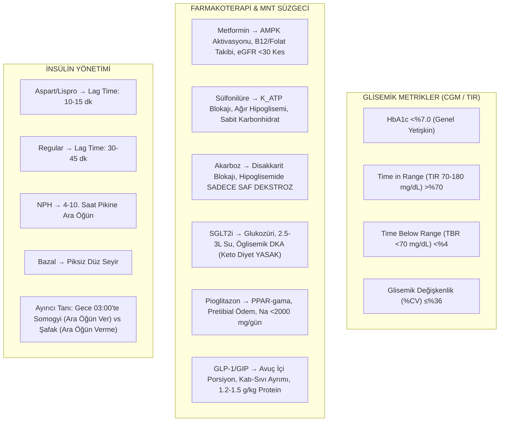

---

### 3.1. Oral Antidiyabetiklerin (OAD) Moleküler Mekanizmaları ve Diyetisyenin MNT Süzgeci

| İlaç Sınıfı & Örnekler | Moleküler Hedef | Hipoglisemi Riski | Kilo Etkisi | Diyetisyenin Takip / Müdahale Alanı (MNT Süzgeci) |
| :--- | :--- | :--- | :--- | :--- |
| **Biguanid (Metformin)** | Hepatik AMPK aktivasyonu, PEPCK/G6Paz baskılanması, periferik GLUT4 artışı | Yok (Monoterapide) | Nötr / Hafif Kayıp | **B12 Malabsorpsiyonu:** İleumda kübilin reseptör blokajı $
ightarrow$ Makrositik anemi ve nöropati maskelemesi. Yıllık serum B12, MMA, Homosistein takibi.<br>**GİS:** Yemekle/tok karnına alma, Metformin XR.<br>**Laktik Asidoz:** Alkolde NAD+ tükenmesi $
ightarrow$ alkol yasağı.<br>**Renal:** eGFR >45 başla, <30 KONTRENDİKE. |
| **Sülfonilüreler (Gliklazid, Glimepirid)** | Beta hücre $K_{\text{ATP}}$ kanallarını kapatır $
ightarrow$ Glukozdan bağımsız kontrolsüz insülin ekzositozu | **ÇOK YÜKSEK!** | **Kilo Artışı** | **Pankreası Kırbaçlama:** Glukozdan bağımsız çalıştığı için öğün atlandığında ölümcül hipoglisemi. **Sabit Karbonhidrat Dağılımı** şarttır.<br>**Meglitinid Kuralı (Repaglinid):** 'Yemek yiyorsan ilacı al, yemiyorsan atla!'<br>**ADA 2026:** Gıda Güvencesizliği (Food Insecurity) taraması. |
| **Alfa-Glukozidaz İnhibitörleri (Akarboz)** | Fırçamsı kenar maltaz, sukraz, izomaltaz enzim blokajı $
ightarrow$ disakkarit sindirimini geciktirir | Yok (Monoterapide) | Nötr | **HAYATİ UYARI:** Hipoglisemi durumunda sofra şekeri (sukroz), bal, meyve suyu veya çikolata **etkisizdir!** Çünkü sukraz enzimi bloke edilmiştir. **SADECE SAF GLUKOZ (DEKSTROZ TABLETİ / JELİ)** kullanılır.<br>**GİS:** İlk lokmayla çiğneme, düşük FODMAP başlangıcı. |
| **SGLT2 İnhibitörleri (Gliflozinler: Dapagliflozin, Empagliflozin)** | Proksimal nefron SGLT2 kotransporter blokajı $
ightarrow$ Günde 70-100g glukozüri (~300 kcal/gün negatif enerji) | Yok | **Kilo Kaybı (2-4 kg)** | **Ozmotik Diürez:** Günlük en az **2.5 - 3 litre su** tüketimi.<br>**Genitoüriner Enfeksiyon:** Perine hijyeni, fermente probiyotik (yoğurt/kefir) desteği.<br>**ÖLÜMCÜL TUZAK (Öglisemik DKA):** Kan şekeri <200 olsa dahi glukagon artışıyla ketoasidoz gelişebilir. **KETOJENİK / VLCD DİYET KESİNLİKLE YASAKTIR!** |
| **Tiazolidindionlar - TZD (Pioglitazon)** | Nükleer PPAR-$\gamma$ reseptör aktivasyonu $
ightarrow$ Periferik glukoz alımı ve MASH gerilemesi | Yok | Kilo Artışı (Sıvı) | **Sıvı Retansiyonu:** Renal sodyum tutulumu $
ightarrow$ pretibial ödem (BİA faz açısı, NFPE 5 sn testi). **Sodyum <2000 mg/gün**.<br>**Yağ Kayması:** Visseral tehlikeli yağların subkutan zararsız depolara kayması. |
| **DPP-4 İnhibitörleri (Sitagliptin, Vildagliptin)** | Endojen GLP-1 ve GIP hormonlarının DPP-4 enzimiyle yıkımını durdurur | Yok | Nötr | Yemeklerden bağımsız alınabilir, iyi tolere edilir. |

---

### 3.2. İnkretin Tedavileri (GLP-1 RA & Çift GIP/GLP-1) ve Diyetisyen Protokolleri

İnce bağırsak L-hücrelerinden salgılanan GLP-1 ve K-hücrelerinden salgılanan GIP; glukoza bağımlı insülin salgısını artırır, glukagonu baskılar, **gastrik boşalmayı (mide boşalmasını) yavaşlatır** ve hipotalamik POMC/CART nöronları üzerinden iştahı kapatır.

#### A. Klinik Ajanlar
*   **Liraglutid (Saxenda/Victoza):** Günlük subkutan enjeksiyon.
*   **Semaglutid (Ozempic/Wegovy/Rybelsus):** Haftalık subkutan enjeksiyon (veya günlük oral). %15-17 kilo kaybı.
*   **Tirzepatid (Mounjaro/Zepbound):** Çift GIP/GLP-1 agonisti. **%21-25 kilo kaybı** (Bariatrik cerrahi eşdeğeri).

#### B. Diyetisyenin GİS Tolerans Protokolü (Bulantı-Kusma Yönetimi)
1.  **Avuç İçi / Yumruk Porsiyonları:** Tek oturuşta öğün hacmi bir avuç içini geçmemeli; günde 5-6 mini öğün planlanmalıdır.
2.  **Katı-Sıvı Ayrımı (30 Dakika Kuralı):** Mide içi basıncı artırmamak için sıvılar yemekle içilmez; yemekten 30 dk önce veya sonra yudumlanmalıdır.
3.  **Yağ ve Baharat Kısıtlaması:** Yağlar gastrik boşalmayı daha da geciktirdiği için kızartma/krema kesilmeli; haşlama/fırın ve kokusuz gıdalar seçilmelidir.
4.  **Akşam Yemeği Kesme Saati:** Yatmadan en az **3-4 saat önce** besin alımı durdurulmalıdır.

#### C. Ölümcül Risk: Sarkopenik Obezite ve Agresif Kas Koruma Protokolü
*   İştah aşırı kapandığı için günlük kalori 600-800 kcal'ye çakılabilir. Kontrolsüz açlıkta **kaybedilen ağırlığın %30-40'ı iskelet kası** olur.
*   **MNT Reçetesi:** Protein hedefi **1.2 ila 1.5 g/kg/gün** seviyesine çıkarılmalı, her mini öğüne kaliteli protein (yumurta, balık, tavuk, süzme peynir, whey) konulmalıdır.
*   Haftada en az 3 gün **direnç egzersizi** planlanmalı; BİA ile İskelet Kası (SMM) ve **Faz Açısı (>5.5°)** izlenmelidir.

---

### 3.3. İnsülin Farmakokinetiği ve Karbonhidrat "Lag Time" Koordinasyonu

| İnsülin Grubu | Klinik Örnekler | Etki Başlangıcı (Onset) | Pik Noktası (Peak) | Toplam Süre | MNT Koordinasyonu ve 'Lag Time' Kuralı |
| :--- | :--- | :--- | :--- | :--- | :--- |
| **Çok Hızlı Etkili** | Aspart (NovoRapid)<br>Lispro (Humalog)<br>Glulisine (Apidra) | 10 - 15 dk | 30 - 90 dk | 4 - 6 saat | **Lag Time: 10-15 dk.** İnsülin vurulduktan maksimum 15 dk sonra yemeğe oturulmalıdır. Postprandiyal glisemik spikeleri önlemede altın standarttır. |
| **Kısa Etkili** | Human Regular (Actrapid, Humulin R) | 30 - 60 dk | 2 - 3 saat | 5 - 8 saat | **Lag Time: 30-45 dk.** Yemek için en az 30 dk beklenmelidir. Erken oturulursa 1. saatte hiperglisemi, 3. saatte geç hipoglisemi yaşanır. |
| **Orta Etkili** | NPH (Humulin N, Insulatard) | 2 - 4 saat | 4 - 10 saat (Geniş) | 10 - 16 saat | 4-10. saatlerdeki devasa pike karşı **mutlaka karbonhidrat + protein dengeli ara öğün** verilmelidir. |
| **Uzun Etkili (Bazal)** | Glargine (Lantus)<br>Detemir (Levemir)<br>Degludec (Tresiba) | 1 - 2 saat | **PİKSİZ (Düz Seyir)** | 20 - 24+ saat | Karaciğerin bazal glukoneogenezini baskılar. Öğün karbonhidratıyla eşleştirilmez; gün boyu zemin kontrolü sağlar. |

#### Toplam Günlük İnsülin Dozu (TDD) ve Rejimler
*   **Tip 1 DM:** TDD = $0.5 - 1.0\text{ U/kg/gün}$ (%50 Bazal + %50 Bolus). **Esnek Karbonhidrat Sayımı** ve ICR/ISF matematiği uygulanır.
*   **Tip 2 DM:** TDD = $0.5 - 1.2\text{ U/kg/gün}$ (Dirençte 1.5 U/kg).
*   **Karışım (Premixed 70/30) Rejimi:** İnsülin dozları ve pik saatleri sabittir. **Sabit Karbonhidratlı Öğün Planı (Consistent CHO)** ve NPH pikine zorunlu ara öğün uygulanır.

#### Diyetisyenin Kırmızı Bayrağı: Aşırı Bazalizasyon (Overbasalization)
1.  Bazal insülin dozunun **>0.5 Ünite/kg** olması.
2.  Yatış kan şekeri ile sabah açlık şekeri farkının **$\ge 50\text{ mg/dL}$** olması.
3.  Sık gece hipoglisemileri ve yüksek glisemik değişkenlik (%CV >%36).
*   *Çözüm:* Bazal doz düşürülür; öğün içi prandiyal bolus veya GLP-1 RA eklenir.

#### Gece Yarısı Krizleri: Somogyi vs. Şafak (Dawn) Fenomeni
*   **Gece Saat 03:00 Ölçümü <70 mg/dL ise $\rightarrow$ SOMOGYI ETKİSİ:** Reaktif hiperglisemi. Yatmadan önce **kompleks karbonhidrat + protein ara öğünü** verilir; gece insülini azaltılır.
*   **Gece Saat 03:00 Ölçümü Normal / Yüksek ise $\rightarrow$ ŞAFAK FENOMENİ:** Kortizol/GH piki. Akşam KH azaltılır; **gece ara öğün VERİLMEZ**; gece bazal insülin dozu artırılır.

---

## 🥗 BÖLÜM 04: DİYABET HASTALARININ DEĞERLENDİRİLMESİ VE BESLENME BAKIM SÜRECİ (ADIME)

### 4.1. Kişi Merkezli Karar Döngüsü ve Değerlendirmenin Rolü
ADA 2026 rehberleri, diyabet yönetimini tek yönlü bir reçete yazma sürecinden çıkarıp sürekli bir **"Kişi Merkezli Karar Döngüsü" (Person-Centered Decision Cycle)** olarak tanımlar.
*   **Terapötik Atalet (Therapeutic Inertia) ve Gerçek Yaşam Uçurumu:** Diyabetli bireylerin yalnızca **%22.2'si** eş zamanlı üçlü hedefe (HbA1c < %7.0, KB < 130/80 mmHg, LDL-K < 70 mg/dL) ulaşabilmektedir.
*   **Bütüncül Amaç (Quadruple Aim):** Yalnızca glukoz düşürmek değil; kardiyovasküler/renal komplikasyonları önlemek, yaşam kalitesini korumak, hipoglisemi yükünü sıfırlamak ve sürdürülebilir davranış değişikliği sağlamaktır.

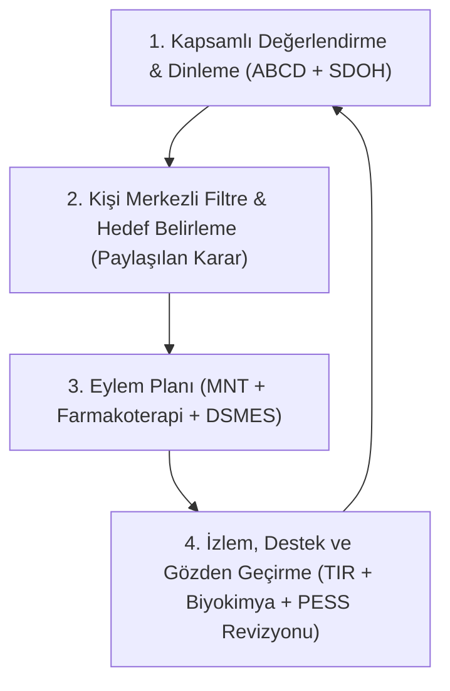

---

### 4.2. Beslenme Bakım Süreci (NCP / ADIME) ve CDCES Perspektifi
Diyabet Eğitim ve Bakım Uzmanı (CDCES) ve klinik diyetisyen için ADIME adımları:

| NCP Basamağı | Klinik Soru & Yaklaşım | Diyabete Özgü Kritik Odak Noktaları |
| :--- | :--- | :--- |
| **Assessment (A)** | *Veriler ne söylüyor? Bireyin metabolik ve sosyal profili nedir?* | ABCD taraması, SDOH, gıda güvencesizliği, sağlık numerasisi, egzersiz-ilaç senkronizasyonu. |
| **Diagnosis (D)** | *Beslenme problemi ve kök nedeni tam olarak nedir?* | **PESS** formatı (Problem, Etiyoloji, Belirtiler/Semptomlar). Diyetisyenin doğrudan çözebileceği beslenme problemi. |
| **Intervention (I)** | *Kişiye özel TBT preskripsiyonu ve davranış hedefi nedir?* | Karbonhidrat kalitesi/sayımı, porsiyon yönetimi, hipoglisemi eylem planı, mutfak kimyası. |
| **Monitoring & Eval (ME)**| *Plan çalışıyor mu, hedeflere ulaşıldı mı?* | CGM DATAA modeli, TIR $\ge \%70$, TBR $<\%4$, HbA1c, lipidler, kilo stabilitesi, yıllık B12. |

---

### 4.3. ABCD Metodu ile Kapsamlı Değerlendirme

#### A — Antropometrik Değerlendirme
*   **Bel Çevresi ve Bel/Boy Oranı (WHtR):** Viseral adipozite ve hepatik steatozun en güçlü göstergesidir. Bel çevresi $\ge 94$ cm (E) / $\ge 80$ cm (K) ve WHtR $\ge 0.5$ artmış metabolik riski gösterir.
*   **Ağırlık Kaybı Eşikleri:** %3-5 kayıp (glisemi ve trigliserit kontrolü), %5-10 kayıp (kardiyovasküler riskte azalma), **%10-15 kayıp (Tip 2 Diyabet klinik remisyonu)**.

#### B — Biyokimyasal Değerlendirme
*   **HbA1c:** Son 2-3 aylık ortalama plazma glukozu. Formül: $	ext{Ortalama Glukoz (mg/dL)} = (28.7 	imes 	ext{HbA1c}) - 46.7$ (kabaca her %1 $pprox 30-35$ mg/dL).
*   **Renal Fonksiyon:** **eGFR + İdrar UACR** yıllık taranmalıdır. $	ext{UACR} \ge 30$ mg/g persistansı = Diyabetik Böbrek Hastalığı (DKD) evre 1-2.
*   **Metformin & B12:** $\ge 4$ yıl ve $\ge 1500$ mg/gün metformin kullananlarda yıllık B12 takibi zorunludur.

#### C — Klinik ve Fiziksel Muayene (NFPE)
*   **Sarkopeni / Kas Kaybı:** Şakak, klavikula ve kuadriseps kaslarında erime (özellikle yaşlı ve SGLT2i kullananlarda).
*   **İnsülin Direnci Stigmatları:** *Acanthosis nigricans*, skin tags (akrokordon).
*   **Diyabetik Ayak ve Nöropati:** 10g monofilament testi (LOPS taraması), periferik nabızlar, interdigital mantar/ülser.

#### D — Diyet ve Yaşam Tarzı Öyküsü
*   Öğün-ilaç zamanlama eşleşmesi (özellikle sülfonilüre ve hızlı etkili insülin alanlarda atlanan öğün riski).
*   Alkol tüketimi (gecikmiş gece hipoglisemisi riski) ve sıvı şeker kaynakları.

---

### 4.4. Sağlık Numerasisi Taraması (3 Düzey Matrisi)
Beslenme planının karmaşıklığı hastanın sağlık numerasi düzeyine tam uyumlu olmalıdır:

```
┌────────────────────────────────────────────────────────────────────────────────────────┐
│                        SAĞLIK NUMERASİSİ DÜZEYLERİ VE TBT UYARLAMASI                   │
├────────────────────────┬───────────────────────────────┬───────────────────────────────┤
│ 1. Birincil (Primary)  │ 2. Uygulamalı (Applied)       │ 3. Yorumlayıcı (Interpretive) │
├────────────────────────┼───────────────────────────────┼───────────────────────────────┤
│ • Sayı tanıma, basit   │ • Etiket okuma, porsiyon      │ • Oran/orantı, ICR (1:10),    │
│   glukoz hedefi anlama │   gramajı hesaplama           │   ISF, FPU dual-wave bolus    │
│ • Uygun TBT: ADA Tabak │ • Uygun TBT: Temel/Orta Düzey │ • Uygun TBT: İleri Düzey KH   │
│   Yöntemi, sabit porsiyon  Karbonhidrat Sayımı             Sayımı & Pompa Yönetimi     │
└────────────────────────┴───────────────────────────────┴───────────────────────────────┘
```

---

### 4.5. Sosyal Belirleyiciler (SDOH) ve Gıda Güvencesizliği Taraması
*   **2 Maddelik Hager Açlık Hayati İşareti (Hunger Vital Sign):** Son 12 ayda "Yiyeceğimiz biter mi korkusu" veya "Yiyeceğin parasızlıktan erken bitmesi" durumlarından en az birine 'Sıklıkla'/'Bazen' denmesi pozitif taramadır.
*   **Klinik Toksisite:** Gıda güvencesizliği olan hastalar ucuz, ultra-işlenmiş, rafine karbonhidratlara yönelir. Ay sonu gıda bittiğinde hipoglisemi yapıcı ilaç (SU/insülin) alınmaya devam edilirse **ölümcül hipoglisemi** tetiklenir.

---

### 4.6. Geriatrik '4Ms' Çerçevesi ve Klinik Tarama Eşikleri
Yaşlı diyabetlilerde glisemik hedefler kognitif ve fiziksel kırılganlığa göre esnetilmelidir:
1.  **What Matters (Önem Taşıyan):** Yaşam kalitesi ve bağımsızlık.
2.  **Medication (İlaçlar):** Polifarmasinin azaltılması, hipoglisemi yapıcı ilaçların de-eskalasyonu.
3.  **Mentation (Zihin):** Mini-Cog veya MMSE; GDS-5 $\ge 2$ (Depresyon taraması).
4.  **Mobility (Hareketlilik):** Sarkopeni (SARC-F $\ge 4$), Kırılganlık (CFS $\ge 4$), Malnütrisyon (MNA-SF $\le 11$), Düşme riski (STEADI).

---

### 4.7. Beslenme Tanısı (PESS Formatı) ve PESS Cümlesi İnşası
Klinik PESS cümleleri spesifik, ölçülebilir ve doğrudan diyetisyenin TBT müdahalesiyle düzeltilebilir olmalıdır:

> **PESS Örneği 1 (İlaç-Besin Zamansızlığı):**
> *   **Problem (P):** İlaç-besin etkileşimine bağlı reaktif hipoglisemi riski (NI-2.3)
> *   **Etiyoloji (E):** Hızlı etkili insülin analogu enjeksiyonu ile yemek başlama süresi arasında 45 dakikalık gecikme olması ve öğün KH miktarının tutarsızlığı ile ilişkili,
> *   **Semptomlar/Belirtiler (S):** Haftada 3 gün postprandiyal glukozun <54 mg/dL olması ve terleme/çarpıntı semptomları ile kanıtlanan.

> **PESS Örneği 2 (Gıda Güvencesizliği):**
> *   **Problem (P):** Tutarsız karbonhidrat alımı ve mikrobesin yetersizliği riski (NB-3.1)
> *   **Etiyoloji (E):** Ciddi gıda güvencesizliği (Hager skoru pozitif) ve bütçe yetersizliği nedeniyle rafine nişasta ağırlıklı tek tip beslenme ile ilişkili,
> *   **Semptomlar/Belirtiler (S):** HbA1c'nin %9.8 olması, glukoz değişkenliğinin CV >%42 olması ve son 3 ayda 2 kez acil başvurusuna yol açan ağır hipoglisemi epizotları ile kanıtlanan.

---

### 4.8. İzlem ve Değerlendirme: CGM DATAA Modeli
Sürekli Glukoz Takibi (CGM) verileri diyetisyen tarafından **DATAA** sistematik algoritmasıyla değerlendirilir:
*   **D (Download):** En az 14 günlük sürekli veri (%70 üzeri aktif sensör kullanımı).
*   **A (Assess):** Aktif glisemi örüntülerinin, CV (Glukoz Değişkenliği $\le \%36$) ve GMI incelenmesi.
*   **T (Time in Range):** **TIR %70-180 mg/dL ($\ge \%70$)**, **TBR <70 mg/dL ($<\%4$)**, **TBR <54 mg/dL ($<\%1$)**, **TAR >180 mg/dL ($<\%25$)**.
*   **A (Areas):** Sorunlu zaman dilimlerinin saptanması (Gece 03:00 düşüşü, kahvaltı sonrası ani spike vb.).
*   **A (Action):** Beslenme ve yaşam tarzı müdahalesi (Öğün sırası, KH sayımı kalibrasyonu, lif artırımı).

---

## 🌾 BÖLÜM 05: TIBBİ BESLENME TEDAVİSİ (TBT), İLERİ MNT STRATEJİLERİ VE KLİNİK PROTOKOLLER

### 5.1. "Diyabetik Diyet" Dogmasının Yıkılışı ve Bireyselleştirilmiş MNT

Geleneksel tıp anlayışında dayatılan standart, kısıtlayıcı ve tek tip makrobesin yüzdeleri (%55 KH, %30 Yağ, %15 Protein) geride kalmıştır. ADA 2026 ve uluslararası rehberler, diyabet yönetiminde tek bir "ideal" makrobesin dağılımı olmadığını kesin bir dille belirtmektedir. Beslenme tedavisi; hastanın metabolik profiline, insülin direnci düzeyine, komplikasyonlarına ve **Ahlqvist Kümeleme Sınıflandırmasındaki** yerine göre bireyselleştirilmelidir.

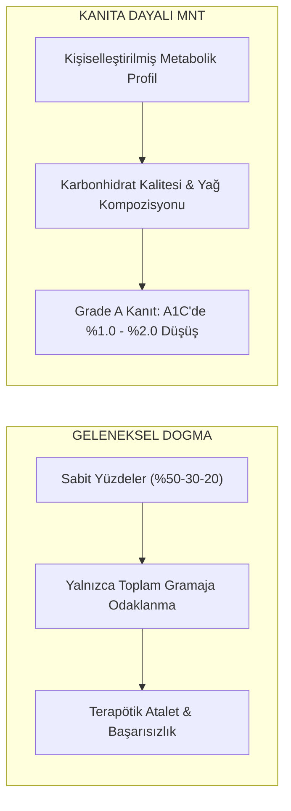

---

### 5.2. Ağırlık Yönetimi, Remisyon Fizyolojisi ve Karşılaştırmalı Remisyon Matrisi (Lancet 2025 & DiRECT)

**Remisyon Tanımı:** En az 3 ay boyunca tüm glukoz düşürücü ilaçlar kesilmiş halde **$\text{HbA1c} < \%6.5$ ($<48\text{ mmol/mol}$)** olmasıdır.

#### A. Roy Taylor Çift Döngü Hipotezi (Twin Cycle Hypothesis) & DiRECT
**DIRECT (Diabetes Remission Clinical Trial)** çalışmasına göre, yeni tanı konmuş (<6 yıl) Tip 2 Diyabet hastalarında yoğun yaşam tarzı ve kalori kısıtlaması ile sağlanan **%10-15 oranında akut ağırlık kaybı**, diyabeti ilaçsız klinik remisyona sokabilmektedir.

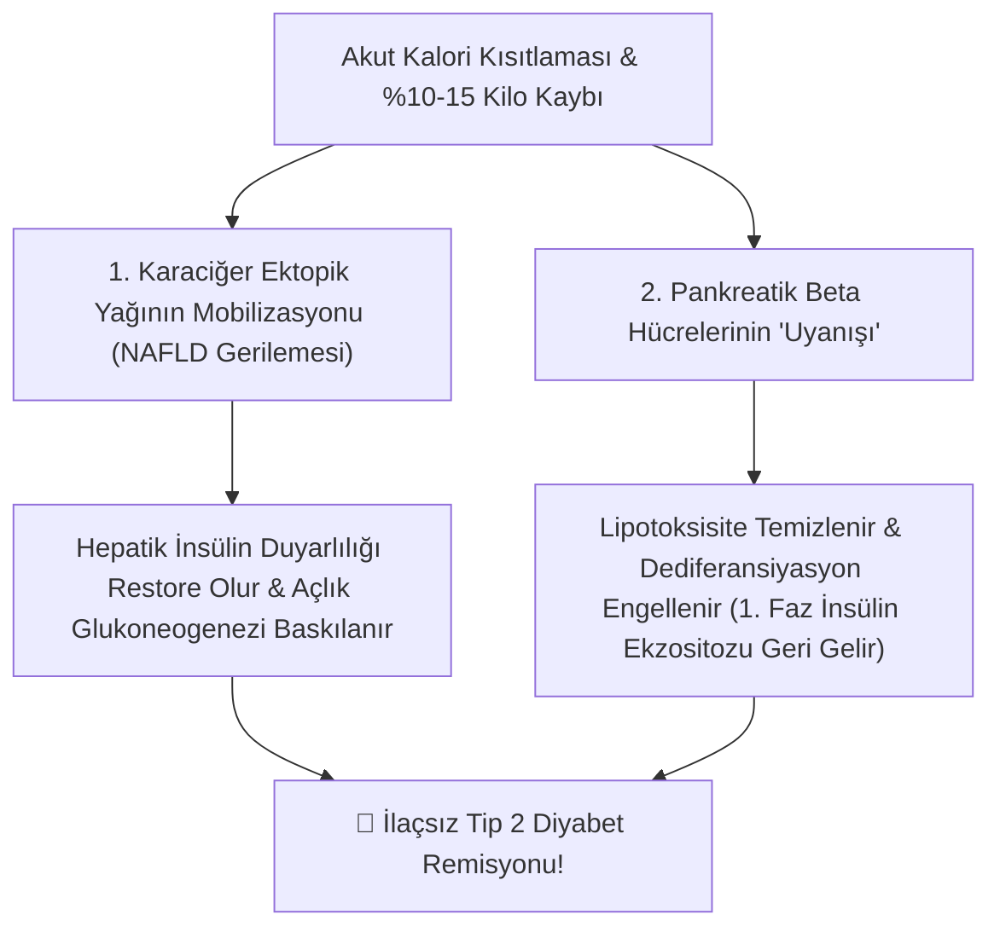

---

#### B. Farklı Klinik Müdahalelerin Remisyon Oranları Matrisi (The Lancet Diabetes & Endocrinology, 2025)

*The Lancet Diabetes & Endocrinology (2025)* derlemesine göre remisyon; yalnızca cerrahinin veya katı diyetlerin tek seferlik bir sonucu değil, sürdürülebilirlik ve kardiyovasküler koruma odaklı dinamik bir spektrumdur:

| Müdahale Modeli | Temel Klinik Çalışmalar | Remisyon Oranı | Klinik Seyir, Kalp-Böbrek Koruması & TBT Rolü |
| :--- | :--- | :---: | :--- |
| **Yoğun TBT & Düşük Kalori** | **DiRECT** (UK, 850 kkal $\rightarrow$ TBT)<br>**DIADEM-I** (Katar, Genç kohort) | **%46 – %61** (1. Yıl)<br>($>15\text{ kg}$ kayıpta **%86**) | Karaciğer/pankreas yağı temizlenir; 2. yılda %36 sürer. **Sıfır cerrahi komplikasyon, en yüksek maliyet etkinliği.** |
| **Kapsamlı Yaşam Tarzı** | **Look AHEAD** (12 yıllık çok merkezli kohort) | **%11.5** (1. Yıl)<br>**%7.3** (4. Yıl) | **Lancet 2025 Vurgusu:** Geçici remisyonda bile **Kardiyovasküler Hastalıkta %40**, **Kronik Böbrek Hastalığında %33 azalma**! |
| **İleri Farmakoterapi** | **SURPASS** (Tirzepatide)<br>**STEP** (Semaglutid 2.4 mg) | **%50 – %80** (İlaç altında $\text{A1C} < 6.5$) | İlaç desteğiyle normoglisemi; ancak ilaç kesildiğinde kilo/glisemi geri döner. **Kalıcı başarı için TBT şarttır.** |
| **Bariatrik / Metabolik Cerrahi** | **STAMPEDE**, **SOS** (RYGB / Sleeve Gastrektomi) | **%60 – %75** (1-3. Yıl)<br>**%30 – %40** (5. Yıl) | Erken dönemde çok güçlü; ancak 10-15. yılda nüks %50-70'e ulaşır. Ömür boyu mikrobesin takibi gerekir. |

> [!IMPORTANT]
> **Lancet 2025 'Hasta Merkezli' Klinik Çıkarım:**
> 1. **Remisyon Bir Bitiş Çizgisi Değildir:** Remisyona giren hastada glisemik izlem (HbA1c, UACR, KB) asla bırakılamaz.
> 2. **Geçici Remisyonun Damar Hafızası Gücü:** Hasta birkaç yıl sonra diyabete geri dönse bile, remisyonda geçirilen süre endoteli koruyarak 10 yıllık kardiyovasküler ve renal ölüm riskini kalıcı olarak düşürür.
> 3. **Beslenmenin Yeri:** İster cerrahi ister GLP-1/GIP kullanılsın, tedavinin kalıcı başarısı ve kas kütlesinin korunması **kişiselleştirilmiş TBT** olmadan imkansızdır.

---

### 5.3. Bireyselleştirilmiş Makrobesin Dağılım Matrisi & Biyokimyası

```
┌────────────────────────────────────────────────────────────────────────────────────────┐
│                        BİREYSELLEŞTİRİLMİŞ MAKROBESİN MATRİSİ                          │
├────────────────────────┬───────────────────────────────┬───────────────────────────────┤
│  Karbonhidrat (%45-55) │          Yağ (%30-35)         │       Protein (%15-20)        │
├────────────────────────┼───────────────────────────────┼───────────────────────────────┤
│ • Kompleks, tam tahıllı│ • Doymuş Yağ (SFA) < %7       │ • Normal Fonksiyon: 1.0-1.2g  │
│ • Posa: ≥ 14g/1000 kcal│ • MUFA (Zeytinyağı): %15-20   │ • Sarkopenik Obezite: 1.2-1.5g│
│ • İlave şeker: < %5-10 │ • Trans Yağ: %0               │ • DKD (eGFR<60): 0.8g PLADO   │
└────────────────────────┴───────────────────────────────┴───────────────────────────────┘
```

1. **Karbonhidrat Kalitesi & Viskoz Çözünür Lif:**
   - Pektin, beta-glukan, guar gum ve psyllium ince bağırsakta hidrate jel oluşturur.
   - **Unstirred Water Layer** kalınlaşır; $\alpha$-amilaz difüzyonu engellenir ve glukoz emilim hızı yavaşlar.
   - **SCFA & Endojen GLP-1 Patlaması:** Kolonda fermente olan lifler **Asetat, Propiyonat ve Bütirat** üretir. SCFA'lar L-hücrelerindeki **GPR41/43 (FFAR2/3)** reseptörlerini uyararak de novo **GLP-1 ve PYY** salınımını tetikler.
2. **Protein Metabolizması & İnsülinotropik Güç:**
   - Diyet BCAA'ları (lösin, izolösin, valin) beta hücrelerindeki $K_{ATP}$ kanallarını kapatıp membran depolarizasyonu yaratarak glukozsuz insülin ekzositozu uyarır.
   - **DKD & PLADO Modeli:** Diyaliz öncesi eGFR <60 olanlarda yüksek protein glomerüler hiperfiltrasyon yaratır. KDIGO 2024: **0.8 g/kg/gün** protein sınırı ve $\ge \%50$ bitkisel protein (PLADO).
3. **Yağ Asidi Kompozisyonu:**
   - **MUFA (Sızma Zeytinyağı):** Hücre zarı akışkanlığını artırır, IRS-1 tirozin kinaz afinitesini yükseltir.
   - **Doymuş Yağ (Palmitat):** Kas/karaciğerde **DAG ve Seramid** biriktirir $\rightarrow$ Novel PKC $\rightarrow$ IRS-1 **Serin/Treonin fosforilasyonu** (Lipotoksisite kilidi).

---

### 5.4. Mutfak MNT'si ve İleri Gıda Teknolojisi

1. **Retrograd (Sınıf III Dirençli) Nişasta (RS3):**
   - Pişirilen nişastalı besinler (patates, pirinç, makarna) **+4°C'de 24 saat soğutulduğunda**, jelatinize amiloz zincirleri lineer hidrojen bağlarıyla kristalleşir.
   - İnce bağırsak amilazı bu kristali parçalayamaz; besin kolona geçer. **Glisemik İndeks %30 ila %40 oranında düşer**.
2. **Asit Sinerjisi (Sirke & Limon):**
   - Asetik asit ve sitrik asit duodenum asit reseptörlerini uyararak gastrik boşalmayı geciktirir + fırçamsı kenar $\alpha$-amilaz ve sükraz enzimlerini geçici olarak inhibe eder.
3. **Besin Tüketim Sıralaması (Food Sequencing):**
   - **1. Önce Lif/Sebze** (Bağırsak lümenini posa jeliyle kaplar) $\rightarrow$ **2. Sonra Protein/Yağ** (CCK ve GLP-1 uyarımıyla mide çıkışını kilitler) $\rightarrow$ **3. En Son Karbonhidrat** (Pürüzsüz glukoz eğrisi).
4. **Glisemik Yük (GY) & Karpuz Paradoksu:**
   $$\text{GY} = \frac{\text{Gİ} \times \text{Net KH (g)}}{100}$$
   - Karpuzun Gİ değeri 72 (yüksek) olmasına rağmen, 120g porsiyondaki net KH yalnızca 6g olduğu için $\text{GY} = (72 \times 6)/100 = \mathbf{4.3}$ (düşük) olur. Besinleri yasaklamak yerine porsiyon yönetilmelidir.

---

### 5.5. Karbonhidrat Sayımı ve İleri Bolus Matematiği

```
[3. Basamak: İleri Düzey KH Sayımı] ──> İKO (500), İDF (1800) ve Düzeltme Bolusu
               ▲
[2. Basamak: Orta Düzey KH Sayımı]  ──> Sabit KH Gramajı & İlaç/İnsülin Pik Uyumu (Sülfonilüre/Premixed)
               ▲
[1. Basamak: Temel KH Sayımı]       ──> Porsiyon Kontrolü, Değişim Listeleri (1 Değişim = 15g KH)
```

1. **İnsülin/Karbonhidrat Oranı (İKO - 500 Kuralı):** $\text{İKO} = \frac{500}{\text{TDD}}$ (1 U insülinin karşıladığı KH gramı).
2. **İnsülin Duyarlılık Faktörü (İDF - 1800 Kuralı):** $\text{İDF} = \frac{1800}{\text{TDD}}$ (1 U insülinin düşürdüğü mg/dL glukoz).
3. **Master Bolus Formülü:**
   $$\text{Toplam Bolus} = \left(\frac{\text{Öğün Net KH}}{\text{İKO}}\right) + \left(\frac{\text{Mevcut AKŞ} - \text{Hedef AKŞ}}{\text{İDF}}\right)$$
4. **FPU (Fat-Protein Unit) ve Çift Dalgalı (Dual-Wave) Bolus:**
   $$\text{FPU} = \frac{(\text{Yağ (g)} \times 9) + (\text{Protein (g)} \times 4)}{100}$$
   - Yüksek yağ ve protein 3-6 saat sonra geç hiperglisemi yapar.
   - Pompa Stratejisi: 1 FPU (3 st), 2 FPU (4 st), 3 FPU (5 st), >4 FPU (6-8 st yayılı iletim).

---

### 5.6. Popüler Diyet Modelleri, Risk Matrisi ve euDKA Tuzağı

| Diyet Modeli | Moleküler Mekanizma | Klinik Kanıt / Fayda | 🚨 Majör Risk / Kontrendikasyon |
| :--- | :--- | :--- | :--- |
| **Akdeniz Diyeti** | Yüksek MUFA, polifenol, çözünür lif, omega-3; TLR-4 inflamasyon blokajı. | PREDIMED: MACE riskinde %30 azalma, endotelyal NO artışı. | Güvenli, altın standart, sürdürülebilir. |
| **Ketojenik Diyet** (<50g KH) | Ekstrem KH kısıtı; aşırı FFA oksidasyonu ve karaciğerde ketojenez. | İlk 3-6 ayda hızlı kilo/A1C düşüşü (1-2 yılda eşitlenir). | **SGLT-2i ile euDKA (Öglisemik DKA) koması!** sdLDL/ApoB fırlaması. |
| **Aralıklı Oruç (IF 16:8)** | 16 st açlıkta glikojen boşalması, otofaji uyarımı, NAFLD gerilemesi. | Kalori kısıtlamasını kolaylaştırır, insülin duyarlılığını artırır. | **Sülfonilüre ve İnsülinde açlık penceresinde ölümcül hipoglisemi!** |
| **Bitki Bazlı (PLADO)** | Doymuş yağ ve heme demir eliminasyonu; intramiyosellüler lipid temizliği. | İnsülin direncinin kırılması, DKD'de intraglomerüler basınç koruması. | **B12 vitamini eksikliği** (Metformin kullananlarda çift yönlü risk). |

> [!CAUTION]
> **Öglisemik DKA (euDKA) Alarmı:** SGLT-2i kullanan bir hastada Ketojenik Diyet uygulandığında idrarla sürekli glukoz atıldığı için plazma glukozu normal (<250 mg/dL) ölçülür; ancak hasta derin metabolik asidoz ve keton fırtınasındadır! **SGLT-2i kullananlarda ketojenik diyet KESİNLİKLE YASAKTIR.**

---

### 5.7. Özel Protokoller: Egzersiz AMPK Şantı, Alkol & GDM

1. **Egzersiz Karar Algoritması:**
   - **<100 mg/dL:** Egzersize başlama! 15-30g KH ver, >100 olunca başla.
   - **100-250 mg/dL:** Güvenli yeşil bölge; doğrudan başla.
   - **>250 mg/dL:** **Ketonu ölç!** Keton (+) ise **EGZERSİZ KESİNLİKLE YASAK (DKA tetiklenir)**; Keton (-) ise hafif tempo başla.
   - Akşam egzersizi sonrası 24-48 saat kas glikojen dolumuna bağlı geç gece hipoglisemisini önlemek için gece ara öğününe yavaş KH + protein ekle.
2. **Alkolün NADH Tuzağı:**
   $$\text{Etanol} + \text{NAD}^+ \xrightarrow{\text{ADH}} \text{Asetaldehit} + \text{NADH} + \text{H}^+$$
   $$\text{Pirüvat} + \text{NADH} + \text{H}^+ \xrightarrow{\text{LDH}} \text{Laktat} + \text{NAD}^+$$
   - Yüksek NADH pirüvatı tüketir $\rightarrow$ Glukoneogenez tamamen durur $\rightarrow$ 6-10 saat sonra gece uykusunda ölümcül nörogliopenik koma! Alkol asla aç karnına tüketilmez.
3. **Gestasyonel Diyabet (GDM) 175g Tabanı:**
   - Fetal beyin gelişimi ve fetal ketozisi/IQ hasarını önlemek için maternal karbonhidrat **asla <175g altına düşürülmez**.
   - Sabah plasental hormon direnci piki için kahvaltıda **15-30g katı KH kısıtlaması** (süt ve meyve yasak) uygulanır.

---

### 5.8. Diyetisyenin Hızlı Klinik Karar Matrisi (Cep Kartı)

| Klinik Semptom | Tarama Sorusu | Biyokimyasal Köken | Acil MNT Müdahalesi |
| :--- | :--- | :--- | :--- |
| **Gece uykuda geç hipoglisemi** | *"Akşam aç alkol alındı mı?"* | Etanol NADH artışı ile glukoneogenez blokajı. | Aç alkol yasağı; alkol yanında kompleks KH+protein; gece AKŞ <140 ise ek ara öğün. |
| **Yemekten 2 st sonra tatlı krizi** | *"Fenalık hissi, çarpıntı var mı?"* | Reaktif Hipoglisemi: Reseptör gecikmesi & aşırı kompansatuar insülin. | Düşük glisemik yük; karbonhidratın yanına lif, protein ve sağlıklı yağ ekle. |
| **Egzersizde bulantı, kusma** | *"Şekeriniz kaçtı, keton baktınız mı?"* | İnsülinsiz egzersizin FFA akışı ve DKA tetiklemesi. | Şeker >250 ve keton (+) ise egzersizi derhal durdur; acile sevk et. |
| **Hipoglisemide çikolata ile şekerin çıkmaması** | *"Düştüğünde ilk ne yediniz?"* | Çikolata yağı CCK salgılatır, mide boşalmasını kilitler. | Yağlı tatlıları yasakla; yalnızca 15g saf glukoz (dekstroz tablet, meyve suyu) ver. |

---

## 🏛️ BÖLÜM 06: TARTIŞMA, SENTEZ VE KLİNİK KARAR ÇERÇEVESİ

### 6.1. 360° Bütüncül Diyabet Yönetim Modeli
Diyabet tedavisi tek bir branşın veya tek tip bir diyetin konusu değildir. Diyetisyen; moleküler kökeni (IRS-1 serin fosforilasyonu, DAG/seramid lipotoksisitesi) anlayıp, laboratuvar fenotipini (Ahlqvist 5-küme) belirleyen, farmakoterapi dinamiklerini (SGLT2i euDKA, SU/insülin hipoglisemisi, metformin B12 blokajı) filtreleyen ve hastanın sağlık numerasisi ile gıda güvencesizliğini hesaba katarak hassas TBT preskripsiyonu oluşturan lider metabolizma uzmanıdır.

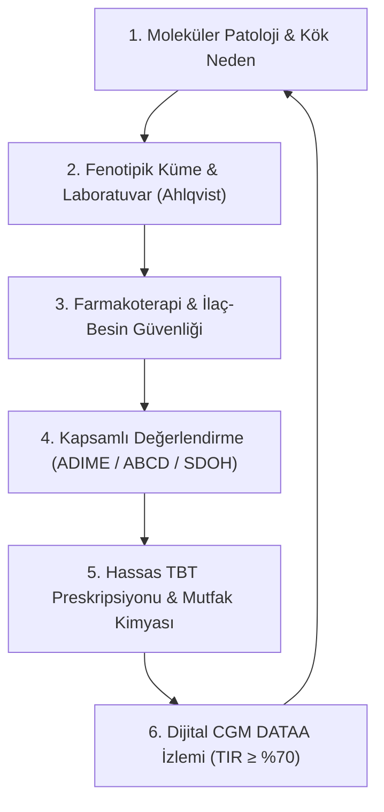

---

### 6.2. 4 Büyük Kritik Klinik İkilem ve Bilimsel Karar Matrisi

| Klinik İkilem | Çatışan Dinamikler | Kanıta Dayalı Karar & Klinik Çözüm |
| :--- | :--- | :--- |
| **1. SGLT2i + Ketojenik Diyet** | Hızlı kilo kaybı arzusu vs. **Öglisemik DKA** riski. | SGLT2i kullananlarda ketojenik diyet kesinlikle yasaktır. Karbonhidrat $\ge 130$ g/gün tutulmalı ve ketonüri izlenmelidir. |
| **2. DKD + Sarkopenik Obezite** | Kas kütlesi koruma ihtiyacı vs. **Glomerüler hiperfiltrasyon**. | Diyaliz öncesi eGFR <60'ta **0.8 g/kg PLADO** modeli (%50+ bitkisel protein) ve progresif direnç egzersizi uygulanır. |
| **3. GLP-1/GIP + İştahsızlık** | Hızlı yağ kaybı vs. **Yağsız kütle (kas) erimesi**. | Her ana öğünde önce 25-30g yüksek kaliteli protein tüketilmeli; enerji açığı kademeli tutulmalı ve B12/Fe izlenmelidir. |
| **4. İnsülin Direnci + Egzersiz** | İnsülinsiz AMPK GLUT4 açılması vs. **Reaktif hipoglisemi**. | Egzersiz öncesi glukoz 100-250 mg/dL olmalı; SU/insülin dozu hekimle koordineli %20-50 azaltılmalıdır. |

---

### 6.3. Diyetisyenin 5 Adımlı Hızlı Karar Algoritması

1.  **Adım 1 — Fenotip & Kümeleme:** C-peptid, otoantikorlar, BMI ve yaş ile Ahlqvist kümesini belirle (SIRD mi, SAID mi, MOD mu?).
2.  **Adım 2 — İlaç & Güvenlik Süzgeci:** Hipoglisemi yapıcı ilaç (SU/İnsülin)? SGLT2i kullanımı (euDKA riski)? Uzun süreli metformin ($\ge 4$ yıl $
ightarrow$ B12 kontrolü)?
3.  **Adım 3 — Organ Fonksiyonu & Komplikasyon:** eGFR <60 veya UACR $\ge 30 
ightarrow 0.8$ g/kg PLADO. Gastroparezis semptomları $
ightarrow$ Düşük lif/yağ, bölünmüş öğün ve yemek sonrasına kaydırılmış bolus.
4.  **Adım 4 — Numerasi & Sosyal Filtre:** 3 Düzey Sağlık Numerasisi ve 2 Maddelik Hager Gıda Güvencesizliği Ölçeği ile TBT modelini (ADA Tabak vs KH Sayımı) seç.
5.  **Adım 5 — MNT Preskripsiyonu & CGM İzlemi:** Viskoz lif, RS3, asit sinerjisi ve besin sırası ile glisemik piki düzleştir; CGM DATAA modeli ile **TIR $\ge \%70$, TBR $<\%4$** hedeflerini denetle.

---

### 6.4. Klinikte En Sık Yapılan 6 Tehlikeli Hata

1.  **15/15 Kuralında Çikolata/Süt Vermek:** Yağ gastrik boşalmayı kilitler; glukoz yükselmez, hipoglisemi komaya ilerler! *Doğrusu:* 15g saf glukoz (meyve suyu / dekstroz).
2.  **Somogyi Reboundunda Gece Ara Öğünü Vermek:** Gece hipoglisemisini tetikleyen aşırı bazal dozdur; ara öğün sabah glukotoksisitesini tırmandırır. *Doğrusu:* Gece 03:00 ölçümü ile bazal dozu azaltmak.
3.  **SGLT2i Alan Hastaya Ketojenik Diyet Uygulamak:** Glukoz normal seyrederken öglisemik DKA gelişir. *Doğrusu:* Karbonhidrat $\ge 130$ g/gün.
4.  **Gastropareziste İnsülini Yemekten Önce Yapmak:** Mide boşalması geciktiği için hasta önce hipoglisemiye girer, 4 saat sonra şiddetli hiperglisemi yaşar! *Doğrusu:* Postprandiyal veya çift dalga (dual-wave) bolus.
5.  **Metformin Alan Hastada B12 Taramasını Atlamak:** İleal kalsiyum blokajına bağlı B12 eksikliği gelişir; hastanın periferik uyuşmaları nöropati sanılır. *Doğrusu:* Yıllık B12 takibi ve takviye.
6.  **DKD Evre 3'te Yüksek Protein Önermek:** İntraglomerüler basıncı artırarak nefron kaybını hızlandırır. *Doğrusu:* 0.8 g/kg PLADO.

---

### 6.5. Diyabet Diyetisyeninin 10 Altın Klinik İlkesi

1.  **Tek Tip Diyet Dogması Yoktur:** Beslenme tedavisi hastanın metabolik profiline, genetiğine ve sosyal koşullarına göre kişiselleştirilir.
2.  **Remisyon İlk Hedeftir:** Erken evre obez T2DM'de %10-15 kilo kaybı ile ektopik yağ temizlenir ve ilaçsız remisyon mümkündür (DiRECT).
3.  **Mutfak Kimyasını Kullanın:** Dirençli nişasta (RS3), asit sinerjisi ve doğru besin sıralaması ile glisemik pik mekanik olarak ezilir.
4.  **Farmakonütrisyon Güvenliği Hayattır:** İlacın mekanizması bilinmeden yazılan diyet ölümcül hipoglisemiye veya euDKA'ya yol açabilir.
5.  **Böbreği Korumak Önceliktir:** eGFR <60 olan diyabetlilerde 0.8 g/kg PLADO modeli nefron ömrünü uzatır.
6.  **Sağlık Numerasisini Değerlendirin:** Düzey 1 hastaya Tabak Yöntemi, Düzey 3 hastaya ileri ICR/ISF ve FPU eğitimi verilir.
7.  **Gıda Güvencesizliğine Kör Kalmayın:** Hager ölçeği ile taranmayan açlık riski, ilaç alındığında ölümcül hipoglisemiye neden olur.
8.  **CGM DATAA ile Dinamik Yönetin:** Yalnızca 3 aylık HbA1c'ye değil, günlük glukoz değişkenliği (CV $\le \%36$) ve TIR'a odaklanın.
9.  **Multidisipliner Ekip Liderliği:** Hekim, CDCES, hemşire ve hasta ile paylaşılan karar döngüsünü işletin.
10. **Terapötik Ataleti Kırın:** Glisemik hedeflere ulaşılamadığında beklemeyin; TBT ve yaşam tarzı stratejilerini proaktif biçimde revize edin.
