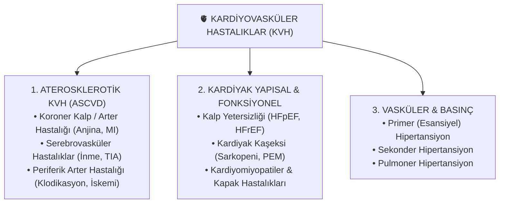

# Modül 0: KVH'a Giriş Mekanizmaları

## BÖLÜM 1: LİPOPROTEİN METABOLİZMASI VE ATEROJENİK LİPİD PANELİ

### Giriş: Diyetisyen Gözüyle Lipoproteinler Neden Var?

Beslenme ve diyetetik uygulamasında kan lipid tahlillerini değerlendirirken ilk kavranması gereken ilke şudur: **Yağlar suda çözünmez, ancak kanımızın büyük kısmı sudan oluşur.**

Sindirilen veya karaciğerde üretilen nötral yağların (trigliserit ve kolesterol esterleri) dokulara taşınabilmesi için etraflarının hidrofilik (suyu seven) bir kılıfla kaplanması gerekir. İşte bu taşıyıcı kapsüllere **Lipoprotein** denir.

Lipoproteinin yapısını bir "küreye" benzetebiliriz:

- **Merkezde (Kor):** Suda hiç çözünmeyen nötral yağlar (Trigliseritler ve Kolesterol Esterleri) yer alır.
- **Dış Yüzeyde (Kılıf):** Suyu seven Fosfolipid tabakası, Serbest Kolesterol ve doku reseptörlerinin tanımasını sağlayan **Apolipoproteinler (Apo-proteinler)** bulunur.

---

### 1. KANDA NEDEN "TOTAL KOLESTEROL" VE "TRİGLİSERİT" PARAMETRELERİNE BAKIYORUZ?

Klinikte bir hastanın kan tahlili raporunu elimize aldığımızda ilk gördüğümüz iki değer **Total Kolesterol (TK)** ve **Trigliserit (TG)** değerleridir. Ancak unutulmamalıdır ki kanda serbestçe dolaşan tek bir "kolesterol" veya "trigliserit" yoktur; bu iki parametre, dolaşımdaki tüm lipoproteinlerin taşıdığı toplam biyokimyasal havuzu gösterir.

```
                                  KAN LİPİD BİYOKİMYASAL HAVUZU
                                                │
       ┌────────────────────────────────────────┴────────────────────────────────────────┐
       ▼                                                                                 ▼
TOTAL KOLESTEROL (TK) HAVUZU                                              TRİGLİSERİT (TG) HAVUZU
[LDL-Kolesterol] + [HDL-Kolesterol] + [VLDL-Kolesterol]                  [VLDL Trigliseriti] + [Şilomikron Trigliseriti]
(Karaciğer & Dokular Arası Kolesterol Trafiği)                            (Karaciğer & Diyet Kaynaklı Enerji Yağları)
```

#### A. Total Kolesterol (TK) Nedir ve Neden Bakılır?

- **Biyokimyasal Anlamı:** Kanda dolaşan tüm lipoproteinlerin (LDL, HDL, VLDL ve IDL) merkezinde ve yüzeyinde taşıdığı kolesterol moleküllerinin **toplam niceliğidir**.
- **Neden Önemli?** Vücutta hücresel membranların yapımı, D vitamini, safra asitleri ve steroid hormonların (östrojen, testosteron, kortizol) sentezi için kolesterol şarttır. TK, vücuttaki toplam kolesterol trafiğinin genel büyüklüğünü gösteren birincil tarama parametresidir.
- **Klinik Diyetisyen Yorumu:** TK tek başına "iyi" mi yoksa "kötü" mü olduğunu söyleyemez. Örneğin bir hastanın TK değeri 220 mg/dL çıkabilir; ancak bu yüksekliğin sebebi koruyucu olan HDL-Kolesterolünün çok yüksek olması olabilir. Bu nedenle TK, mutlaka alt bileşenleri olan **LDL** ve **HDL** ile birlikte değerlendirilir.

#### B. Trigliserit (TG) Nedir ve Neden Yükselir?

- **Biyokimyasal Anlamı:** Vücudun birincil enerji depolama formu olan nötral yağlardır (3 yağ asidi + 1 gliserol). Kanda serbest dolaşamazlar; birincil olarak **VLDL** (karaciğer üretimi) ve açlıkta olmaması gereken **Şilomikronlar**(diyet üretimi) içinde taşınırlar.
- **Neden Önemli?** 12 saatlik gece açlığı sonrası alınan kanda Trigliserit değerinin yüksek çıkması (Hipertrigliseridemi); karaciğerin aşırı miktarda VLDL ürettiğini veya üretilen bu parçacıkların kandan yeterince hızlı temizlenemediğini gösterir.
- **Klinik Diyetisyen Yorumu:** Açlık kanda TG yüksekliği, doğrudan **karaciğerde aşırı yağ sentezinin (De Novo Lipojenez)**, **insülin direncinin** veya **aşırı şeker/fruktoz tüketiminin** en net biyokimyasal kanıtıdır.

---

### 2. LİPOPROTEİNLERİN BİYOKİMYASAL YAPISI VE KADERİ

```
                                 LİPOPROTEİN TAŞIMA HATTLARI
                                              │
       ┌──────────────────────────────────────┴──────────────────────────────────────┐
       ▼                                                                             ▼
EKSOJEN (DİYET) TAŞIMA HATTI                                          ENDOJEN (KARACİĞER) TAŞIMA HATTI
[İnce Bağırsak] ──► Şilomikron (ApoB-48)                               [Karaciğer] ──► VLDL (ApoB-100)
                         │                                                             │
                         ▼ (LPL Enzimi ile Trigliserit Yıkımı)                         ▼ (LPL Enzimi ile Trigliserit Yıkımı)
               [Dokulara Yağ Asidi (FFA)]                                    [Dokulara Yağ Asidi (FFA)]
                         │                                                             │
                         ▼                                                             ▼
                Şilomikron Kalıntısı                                              IDL  ──►  LDL
                         │                                                                   │
                         ▼                                                                   ▼
             (Karaciğerce Temizlenme)                                               (Dokulara Kolesterol Dağıtımı)
                                                                                             │
                                                                                             ▼
                                                                           HDL (ApoA1 / LCAT - RCT Yolağı)
                                                                            (Damardan Kolesterolü Toplama)
```

#### A. Şilomikron ve VLDL: Yağ Taşımacılığının Eksojen ve Endojen Otobanları

##### 1. Şilomikronlar (Diyet Kaynaklı / Eksojen Yolak)

- **Ne İş Yapar?** Diyetle besinlerden aldığımız nötral yağları, yağda eriyen vitaminleri (A, D, E, K) ve kolesterolü ince bağırsaktan emerek kan dolaşımına taşır. Lipoproteinler içinde en büyük çaplı fakat en düşük yoğunluklu olanıdır.
- **Kimlik Kartı (Apoprotein):** İnce bağırsak enterositlerinde sentezlenen **ApoB-48** proteini, şilomikronun değişmez yapısını oluşturur.
- **Dolaşımdaki Yolculuğu ve Kilit Enzim (LPL):** Bağırsaktan kana geçen şilomikron, kas ve yağ dokusu kılcal damar duvarında bulunan **Lipoprotein Lipaz (LPL)** enzimiyle karşılaşır. LPL, şilomikronun içindeki trigliseritleri parçalayarak **Serbest Yağ Asitlerine (FFA)** dönüştürür. Yağ asitleri kas tarafından enerji olarak yakılır, yağ dokusu tarafından ise tekrar depolanır.
- **Beslenme ve Klinik Bağlantısı:**
    - Yağlı bir öğünden 1–2 saat sonra kan plazmasının süt gibi beyaz/bulanık görülmesinin nedeni kanda dolaşan şilomikronlardır.
    - **İnsülin hormonu LPL enziminin sentezini ve aktivitesini artırır.** Yemek sonrası insülin yükseldiğinde, diyetle gelen yağların hızla dokulara çekilip depolanması sağlanır.
    - Trigliseritlerinin %90'ını dokulara bırakan şilomikron büzülür ve "Şilomikron Kalıntısı" (_remnant_) halini alır; karaciğer tarafından kandan tamamen temizlenir.

##### 2. VLDL (Çok Düşük Yoğunluklu Lipoprotein / Endojen Yolak)

- **Ne İş Yapar?** Karaciğerin kendi ürettiği veya depolardan topladığı trigliseritleri çevre dokulara taşımak üzere paketlediği araçtır.
- **Kimlik Kartı (Apoprotein):** Karaciğerde sentezlenen **ApoB-100**'dür.
- **Kaderi:** Tıpkı şilomikron gibi VLDL de damar duvarındaki LPL enzimiyle karşılaşır ve trigliserit yükünü dokulara boşaltır. Trigliseritlerini verdikçe hacmi küçülür, yoğunluğu artar ve önce IDL'ye (Ara Yoğunluklu Lipoprotein), ardından kanda birincil kolesterol taşıyıcısı olan **LDL**'ye dönüşür.

---

#### B. LDL ve HDL Dengesi: Kolesterolün Dağıtımı ve Toplanması

```
                  KOLESTEROL DENGESİ: DAĞITIM VE TERSİNE TRANSPORT
                                         │
       ┌─────────────────────────────────┴─────────────────────────────────┐
       ▼                                                                   ▼
LDL (Low-Density Lipoprotein)                               HDL (High-Density Lipoprotein)
* Taşıdığı Yük: Kolesterol Esteri                           * Taşıdığı Yük: Protein & Fosfolipid
* Kimlik Kartı: ApoB-100                                    * Kimlik Kartı: ApoA1
* Görevi: Karaciğerden dokulara kolesterol taşır.           * Görevi: Dokulardan karaciğere kolesterol toplar.
* Risk: Fazlası damar duvarına sızar, oksitlenir (oxLDL)     * Kilit Enzim: LCAT (Kolesterolü esterleştirir)
  ve Köpük Hücreye (Foam Cell) dönüşür.                     * Mekanizma: Tersine Kolesterol Transportu (RCT)
```

##### 1. LDL (Düşük Yoğunluklu Lipoprotein) – "Kolesterol Dağıtıcısı"

- **Nasıl Oluşur ve Çalışır?** VLDL'nin trigliseritlerini kaybetmesiyle kanda oluşan, bileşiminin yaklaşık %50'si kolesterol olan parçacıktır. Üzerinde kofaktör olarak **ApoB-100** taşır.
- **Biyolojik Görevi:** Hücre zarı bütünlüğünü korumak veya steroid hormon sentezlemek için dokulara ihtiyaç duydukları kolesterolü götürür. Hücreler ihtiyaç duyduklarında yüzeylerindeki **LDL Reseptörlerini (LDLR)** açar ve ApoB-100'e tutunan LDL'yi hücre içine alır.
- **Aterojenik Risk Neden Doğar?** Hücre içi kolesterol doygunluğa ulaştığında LDL reseptörleri kapanır. Kanda temizlenemeyen ve uzun süre dolaşan LDL parçacıkları damar duvarına sızar. Serbest radikallerce oksitlenerek **Okside LDL (oxLDL)** halini alır. Bağışıklık hücreleri (makrofajlar) bu oxLDL'yi yutarak damarı tıkayan **Köpük Hücrelere (Foam Cell)** dönüşür.

##### 2. HDL (Yüksek Yoğunluklu Lipoprotein) – "Sokak Süpürgesi ve RCT"

- **Nasıl Oluşur ve Çalışır?** Karaciğer ve bağırsakta sentezlenen, proteinden son derece zengin, disk şeklinde en küçük ve yoğun lipoprotein parçacığıdır. Kimlik kartı **ApoA1**'dir.
- **Kilit Enzim (LCAT):** Disk şeklindeki ham HDL, damar duvarından ve hücrelerden serbest kolesterolü toplar. HDL yüzeyindeki **LCAT (Lecithin-Cholesterol Acyltransferase)** enzimi, ApoA1 tarafından aktive edilir ve toplanan kolesterolleri esterleştirerek HDL'nin merkezine hapseder.
- **Tersine Kolesterol Transportu (Reverse Cholesterol Transport - RCT):** HDL'nin damar duvarından topladığı fazla kolesterolü karaciğere geri taşıması sürecidir. Karaciğer bu kolesterolü yakalar ve safra asitlerine dönüştürerek dışkı yoluyla vücuttan atar.

---

### 3. LİPİD METABOLİZMASININ BİYOKİMYASAL DÜZENLEYİCİLERİ VE BESLENME BAĞLANTISI

Hücrelerin yağ ve kolesterol sentezini yöneten moleküler şalterlerin diyet bileşenleriyle nasıl etkileştiğini bilmek, tıbbi beslenme tedavisinin temelini oluşturur.

```
                              BESİN ÖGELERİ VE LİPİD DÜZENLEME MEKANİZMALARI
                                                    │
       ┌────────────────────────────────────────────┼────────────────────────────────────────────┐
       ▼                                            ▼                                            ▼
[1. AŞIRI ŞEKER & FRUKTOZ]                   [2. DOYMUŞ YAĞ (SFA)]                        [3. TRANS YAĞ ASİTLERİ (TFA)]
* Karaciğerde SREBP-1c & ChREBP açılır       * Karaciğer içi serbest kolesterolü artırır  * CETP enzim dengesini bozar
* Yağ Asidi Sentaz (FAS) uyarılır            * Karaciğer LDL Reseptörlerini (LDLR) kilitler* **HEM LDL'yi yükseltir**
* Karaciğerde *De Novo Lipojenez* başlar     * Kanda LDL birikir, temizlenemez            * **HEM DE HDL'yi düşürür**
* Kanda VLDL ve Trigliserit fırlar           * (SFA kısıtlaması reseptörleri tekrar açar) * (Aterojenik sdLDL formunu artırır)
```

#### A. SREBP-1c ve ChREBP: Karaciğerin Yağ Fabrikası Şalterleri (Şeker ve Fruktoz Stresi)

- **Sistem Nasıl Çalışır?** Karaciğer hücresinde yağ sentezini başlatan iki ana moleküler şalter vardır: İnsülin ile uyarılan **SREBP-1c** ve yüksek glukoz/fruktoz ile uyarılan **ChREBP** transkripsiyon faktörleri.
- **Besinsel Tetiklenme ve Sonuç (De Novo Lipojenez - DNL):** Diyette aşırı rafine şeker veya **Yüksek Fruktozlu Mısır Şurubu** tüketildiğinde bu şalterler açılır. **Yağ Asidi Sentaz (FAS)** enzimi uyarılır; karaciğer gelen fazla şekeri doğrudan yağa (trigliserit) dönüştürmeye başlar (_De Novo Lipojenez_). Karaciğer bu yeni yağları paketleyip masif miktarda **VLDL** olarak kana salar ve kanda Trigliserit (TG) yükselir.

#### B. Doymuş Yağların (SFA) LDL Reseptörlerini Baskılaması

- **Moleküler Mekanizma ve Reseptör Kilitlenmesi:** Doymuş yağ asitleri (özellikle _Palmitik asit C16:0_ ve _Myristik asit C14:0_), karaciğer hücresi içindeki serbest kolesterol düzeyini yükseltir. Karaciğer kandan daha fazla kolesterol çekmemek için yüzeyindeki **LDL Reseptörlerinin (LDLR) üretimini durdurur ve kapıları kilitler**.
- **Klinik Sonuç:** Karaciğer kapıları kapandığı için kanda dolaşan LDL parçacıkları emilip temizlenemez ve kanda LDL-kolesterol fırlar. Doymuş yağ kısıtlandığında LDLR kapıları tekrar açılır ve kanda LDL düşer.

#### C. Trans Yağ Asitleri (TFA): En Aterojenik Yağ Türü

- **Moleküler Mekanizma:** Endüstriyel trans yağlar, lipoproteinler arasında lipid alışverişini sağlayan **CETP (Kolesteril Ester Transfer Proteini)** enziminin dengesini bozar.
- **Klinik Sonuç:** Doymuş yağlar sadece LDL'yi yükseltirken; Trans Yağlar **HEM kanda zararlı LDL ve Trigliserit seviyelerini fırlatır, HEM DE koruyucu HDL seviyelerini düşürür**. Ayrıca damar duvarına çok kolay sızan **küçük yoğun LDL (sdLDL)** oluşumunu uyarır.

---

### 4. BESİN GRUPLARI VE BESLENME ÖRÜNTÜLERİNİN (BATI DİYETİ) LİPİD PANELSİNE ETKİSİ

```
                               BATI DİYETİ (WESTERN DIET) LİPİD BOZUKLUĞU
                                                   │
     ┌─────────────────────────────────────────────┼─────────────────────────────────────────────┐
     ▼                                             ▼                                             ▼
[RAFİNE ŞEKER & FRUKTOZ]                    [DOYMUŞ VE TRANS YAĞ]                         [İŞLENMİŞ DÜŞÜK LİF]
 Karaciğer DNL Aktivasyonu                   Karaciğer LDLR Kilitlenmesi                   Safra Atılımı Durur
     │                                             │                                             │
     ▼                                             ▼                                             ▼
Yüksek Trigliserit (TG)                     Yüksek LDL-Kolesterol                         Düşük / İşlevsiz HDL
     │                                             │                                             │
     └─────────────────────────────────────────────┼─────────────────────────────────────────────┘
                                                   ▼
                                **ATEROJENİK ÜÇLÜ (ATHEROGENIC TRIAD)**
                           (Yüksek TG + Yüksek sdLDL + Düşük/İşlevsiz HDL)
```

#### A. Batı Diyeti (Western Diet) Örüntüsü ve "Aterojenik Üçlü"

Modern sanayi toplumlarının beslenme tarzı olan **Batı Diyeti (Western Diet)**; işlenmiş etler, rafine karbonhidratlar, yüksek fruktozlu mısır şurubu, doymuş/trans yağlar ve çok düşük lif içeriği ile karakterizedir.

Bu beslenme örüntüsü kan lipid panelinde **Aterojenik Üçlü (Atherogenic Triad)** olarak bilinen tabloyu yaratır:

1. **Yüksek Kan Trigliseriti (TG):** Şeker ve fruktozun karaciğerde DNL yolağını uyarmasıyla fırlayan VLDL üretimi.
2. **Yüksek Küçük Yoğun LDL (sdLDL):** Kanda biriken VLDL'nin metabolize olmasıyla oluşan, damar duvarına kolayca sızan ve hızlı oksitlenen tehlikeli LDL alt grubu.
3. **Düşük ve İşlevsiz HDL:** Yüksek TG varlığında CETP enziminin HDL içindeki kolesterolü boşaltıp yerine trigliserit koyması ve bu trigliseritli HDL'nin böbreklerce hızla yıkılması.

---

#### B. Besin Grupları Düzeyinde Biyokimyasal Lipid Etkileri

##### 1. Tam Tahıllar, Kuru Baklagiller ve Çözünür Lifler (Yulaf, Psyllium, Pektin)

- **Biyokimyasal Etki:** Çözünür lifler (örneğin yulaftaki _Beta-Glukan_), ince bağırsakta jel kıvamı oluşturarak karaciğerin safra asitlerini bağlar ve dışkıyla vücuttan attırır.
- **Karaciğer Yanıtı:** Karaciğer, eksilen safrayı yeniden sentezlemek için ana hammadde olan kolesterola ihtiyaç duyar. Kan dolaşımından masif miktarda LDL çekebilmek için yüzeyindeki **LDL Reseptörlerini (LDLR) sonuna kadar açar**. Böylece kanda LDL-kolesterol belirgin şekilde düşer.

##### 2. Sızma Zeytinyağı ve Kuruyemişler (MUFA & PUFA Dengesi)

- **Biyokimyasal Etki:** Sızma zeytinyağındaki **Oleik asit (MUFA)** ve ceviz/bademdeki doymamış yağlar (PUFA); karaciğer LDL reseptörlerinin duyarlılığını korur.
- **Ek Avantaj:** Sızma zeytinyağındaki polifenoller (hydroxytyrosol, oleocanthal), kanda dolaşan LDL parçacıklarının serbest radikallerce oksitlenip **oxLDL'ye dönüşmesini engelleyen antioksidan bir kalkan** oluşturur.

##### 3. Yağlı Deniz Balıkları (Omega-3: EPA ve DHA)

- **Biyokimyasal Etki:** Derin su balıklarından (somon, uskumru, sardalya) alınan EPA ve DHA yağ asitleri, karaciğerde trigliserit sentezleyen _DGAT_ enzimini inhibe eder.
- **Sonuç:** Karaciğerin kana VLDL salınımı baskılanır. Yüksek doz Omega-3 alımı kanda **Trigliserit (TG) seviyelerini %20–30 oranında düşüren** en güçlü doğal besinsel müdahaledir.

##### 4. Süt ve Süt Ürünleri (Tam Yağlı vs. Fermente)

- **Doymuş Yağ Yükü:** Tam yağlı tereyağı ve sert peynirler yüksek palmitik asit içerikleri nedeniyle karaciğer LDL reseptörlerini baskılayıp LDL'yi yükseltebilir.
- **Fermente Süt Ürünleri (Yoğurt, Kefir) Ayrıcalığı:** Fermente süt ürünlerinde bulunan laktik asit bakterileri ve süt yağı küresi zarı (_MFGM_), gıdadaki kolesterolün bağırsaktan emilimini sınırlar; mikrobiyotada SCFA (kısa zincirli yağ asitleri) üreterek karaciğer kolesterol sentezini dengeler.

---

### BÖLÜM 1 DERS ÖZETİ VE HIZLI BAKIŞ MATRİSİ

```
+-----------------------------------------------------------------------------------------------------------------------------------+
|                                 LİPOPROTEİN VE LİPİD DÜZENLEYİCİ BÖLÜM ÖZETİ MATRİSİ                                             |
+-------------------+-------------------+-------------------+-----------------------------------+-----------------------------------+
| Parametre / Faktör| Biyokimyasal Köken| Birincil Yükü/Etki| Temel Görevi / Klinik Anlamı      | Beslenme Müdahalesi Odak Noktası  |
+-------------------+-------------------+-------------------+-----------------------------------+-----------------------------------+
| Total Kolesterol  | Tüm Lipoproteinler| Toplam Kolesterol | Kanda dolaşan genel kolesterol    | Bütüncül diyet kalitesi kontrolü; |
| (TK)              | (LDL+HDL+VLDL)    | Havuzu            | yükseklikte alt tiplere (LDL/HDL) bakılır.| SFA kısıtlaması, lif artışı.      |
+-------------------+-------------------+-------------------+-----------------------------------+-----------------------------------+
| Trigliserit (TG)  | VLDL ve           | Nötral Depo Yağı  | Karaciğerde yağ yapımını (DNL)    | Rafine şeker, fruktoz kısıtlaması;|
|                   | Şilomikron        |                   | ve insülin direncini gösterir.    | Omega-3 (EPA/DHA) artırılması.    |
+-------------------+-------------------+-------------------+-----------------------------------+-----------------------------------+
| LDL               | VLDL Kalıntısı    | Kolesterol Esteri | Dokulara kolesterol dağıtır.     | SFA kısıtlaması ile karaciğer    |
|                   | (ApoB-100)        |                   | Fazlası oksitlenip plak (oxLDL) yapar.| LDL reseptörlerini (LDLR) açmak.  |
+-------------------+-------------------+-------------------+-----------------------------------+-----------------------------------+
| HDL               | Karaciğer/Bağırsak| Protein/Fosfolipid| Damardan kolesterolü toplar (RCT)| Fiziksel aktivite, MUFA/PUFA ve  |
|                   | (ApoA1)           |                   | LCAT enzimi ile esterleştirir.    | çözünür lif artışı.               |
+-------------------+-------------------+-------------------+-----------------------------------+-----------------------------------+
| Batı Diyeti       | Şeker + SFA +     | Aterojenik Üçlü   | Yüksek TG, Yüksek sdLDL ve        | Akdeniz / Bitki temelli diyete    |
| (Western Diet)    | Trans Yağ + Düşük Lif| (Triad) Yaratır| Düşük/İşlevsiz HDL oluşturur.    | geçiş; işlenmiş gıdaları eleme.   |
+-------------------+-------------------+-------------------+-----------------------------------+-----------------------------------+
| Çözünür Lifler    | Yulaf (Beta-Glukan)| Safra Asidi Bağlama| Karaciğerde LDLR kapılarını açar,| Yulaf, baklagil, psyllium        |
|                   | Pektin / Psyllium |                   | kandan LDL-C'yi çekip düşürür.    | tüketimini artırmak.              |
+-----------------------------------------------------------------------------------------------------------------------------------+
```

---

🎯 **Sıradaki Adım:** Genişletilmiş BÖLÜM 1 tamamlandı. Hazırsanız Modül 0'ın ikinci parçası olan **BÖLÜM 2: ENDOTEL FİZYOLOJİSİ, NO YOLAĞI VE MAKROBESİN BİYOKİMYASI** (Karbonhidrat, Yağ ve Protein metabolizmasının damar esnekliğiyle doğrudan konuşması) ile aynı açıklayıcı, pratik ve öğrenci dostu dille devam edelim mi?


## BÖLÜM 2: ENDOTEL FİZYOLOJİSİ, NO YOLAĞI VE MAKROBESİN BİYOKİMYASI
### Giriş: Endotel Nedir ve Bir Diyetisyen İçin Neden Hayatidir?

Damarlarımızın iç yüzeyini tek bir sıra halinde kaplayan, toplam ağırlığı yaklaşık 1.5 kg'ı bulan devasa bir hücre tabakası vardır: **Endotel Dokusu**.

Eskiden endotelin sadece kanın damar dışına sızmasını engelleyen "pasif bir kılıf" olduğu sanılırdı. Bugün biliyoruz ki endotel; vücudun en aktif, en hassas endokrin ve metabolik organlarından biridir.

Sağlıklı bir endotel dokusu 3 temel görevi kusursuz yürütür:

1. **Damar Esnekliği (Vasküler Tonus Control):** Kan basıncına göre damarları genişletir (_vazodilatasyon_) veya daraltır (_vazokonstriksiyon_).
2. **Anti-Trombotik Yüzey (Pıhtı Önleme):** Kanın damar içinde pıhtılaşmadan kaygan bir şekilde akmasını sağlar.
3. **Seçici Geçirgenlik ve İltihap Kontrolü:** Bağışıklık hücrelerinin damar duvarına yapışmasını ve mikropların/toksinlerin dokulara sızmasını engeller.

**Diyetisyen Açısından Ana İlke:** Ateroskleroz, hipertansiyon veya koroner kalp hastalığı aniden ortaya çıkmaz. Tüm kardiyovasküler hastalıklar, beslenme hatalarıyla başlayan **Endotel Disfonksiyonu (Endotel Bozulması)** ile patlak verir.

Besin ögelerinin metabolizma adımları doğrudan endotel hücreleriyle "konuşur". Eğer doğru beslenirsek endotel damarı genişletip korur; yanlış beslenirsek damar kilitlenir, sertleşir ve iltihaplanır.

---

### 1. NİTRİK OKSİT (NO) YOLAĞI: DAMARIN DOĞAL ESNEKLİK VE KORUMA ARACI

Endotel hücresinin damar sağlığını korumak için ürettiği en mucizevi molekül **Nitrik Oksit (NO)** gazıdır.

```
                         NİTRİK OKSİT (NO) SENTEZ VE ETKİ MEKANİZMASI
                                             │
      Diyetle Alınan Amino Asit: L-ARJİNİN  +  Kofaktörler (Tetrahidrobiyopterin - BH4)
                                             │
                                             ▼
                        [eNOS Enzimi (Endotelyal Nitrik Oksit Sentaz)]
                                             │
                                             ▼
                                NİTRİK OKSİT (NO) ÜRETİMİ
                                             │
       ┌─────────────────────────────────────┼─────────────────────────────────────┐
       ▼                                     ▼                                     ▼
[DAMAR DÜZ KASINI GEVŞETİR]       [PIHTILAŞMAYI ENGELLEMELER]          [İNFLAMASYONU DURDURUR]
Damar genişler, kan basıncı       Trombositlerin kümeleşmesini         Lökositlerin damar duvarına
(tansiyon) düşer (Vazodilatasyon). (pıhtılaşmayı) engeller.            yapışmasını kilitler.
```

#### A. Nitrik Oksit (NO) Nasıl Üretilir ve Ne İş Yapar?

- **Substrat ve Enzim:** Endotel hücresi, diyetle aldığımız **L-Arjinin** amino asidini alır ve **eNOS (Endotelyal Nitrik Oksit Sentaz)** enzimi aracılığıyla Nitrik Oksit (NO) gazına dönüştürür.
- **Damarda Ne Yapar?**
    - Üretilen NO, hemen alt tabakadaki damar düz kas hücrelerine geçer ve kasın gevşemesini sağlar. Damar genişler, kan rahat akar ve **kan basıncı (tansiyon) düşer**.
    - Damar iç yüzeyini teflon tava gibi kayganlaştırarak pıhtı hücrelerinin (trombositler) ve iltihap hücrelerinin damar duvarına yapışmasını engeller.

#### B. "eNOS Uncoupling" (Enzim Eşleşme Bozukluğu) Nedir?

- Normalde eNOS enzimi bir koruyucudur. Ancak vücutta aşırı serbest radikal (oksidatif stres) veya yüksek kan şekeri olduğunda, enzimin ihtiyaç duyduğu kofaktörler (BH4) parçalanır.
- Enzim "eşleşme bozukluğuna" (_uncoupling_) uğrar. Yani eNOS, L-Arjinin'den Nitrik Oksit üretmeyi bırakır; bunun yerine damar duvarına **Süperoksit Radikali (\(O_2^{\bullet-}\))** pompalamaya başlar.
- **Klinik Sonuç:** Damarı koruması gereken enzim, damarı içten içe yıpratan bir serbest radikal fabrikasına dönüşür!

---

### 2. KARBONHİDRAT METABOLİZMASI VE ENDOTEL DOKUSU

Karbonhidrat metabolizmasındaki bozukluklar (hiperglisemi, yüksek glisemik yük, aşırı fruktoz) endotel dokusunu doğrudan vurur.

```
                             KARBONHİDRAT AŞIRILIĞI VE ENDOTEL HASARI
                                                │
       ┌────────────────────────────────────────┴────────────────────────────────────────┐
       ▼                                                                                 ▼
KRONİK HİPERGLİSEMİ VE AGEs OLUŞUMU                                    AŞIRI FRUKTOZ VE ÜRİK ASİT TUZAĞI
* Şeker molekülleri proteinlere yapışır (İleri Glikasyon)              * Karaciğerde kontrolsüz fruktoz tüketimi
* AGEs, endoteldeki RAGE reseptörüne bağlanır                           * Hücresel ATP depolarının boşalması
* NF-κB şalteri açılır ──► Damar duvarında İLTIHAP başlar              * Kanda ÜRİK ASİT fırlaması
* PKC enzimi uyarılır ──► eNOS kilitlenir, NO üretimi durur            * Ürik asit eNOS enzimini inhibe eder ──► TANSİYON ↑
```

#### A. Kronik Hiperglisemi ve İleri Glikasyon Son Ürünleri (AGEs)

- **Şekerin Proteinlere Yapışması (Glikasyon):** Kanda glukoz seviyesi uzun süre yüksek seyrettiğinde, şeker molekülleri enzimatik olmayan bir yolla damar duvarındaki proteinlere ve kolajene yapışır. Bu duruma **İleri Glikasyon Son Ürünleri (AGEs)** denir.
- **İltihap Şalterinin Açılması (RAGE Reseptörü):** Endotel hücresinin yüzeyinde AGEs'leri tanıyan **RAGE** adlı bir reseptör bulunur. Yapışan şekerler bu reseptöre bağlandığında, hücre içinde iltihap şalteri olan **NF-\(\kappa\)B**açılır. Damar duvarında iltihabi sitokinler (\(TNF-\alpha, IL-6\)) ve akyuvarları damara çeken yapışkan moleküller (\(VCAM-1\)) salgılanır.
- **eNOS'un Kilitlenmesi:** Hiperglisemi, hücre içi **PKC (Protein Kinaz C)** enzimini uyararak eNOS enzimini fosforiller ve çalışamaz hale getirir. Nitrik oksit üretilemediği için damar esnekliğini kaybeder.

#### B. Fruktoz Tuzağı ve Ürik Asit

- **Kontrolsüz Fruktoz Yıkımı:** Diyetle alınan glukoz hücrede insülin ve doyum frenleriyle kontrol edilirken; sakaroz veya **Yüksek Fruktozlu Mısır Şurubu (HFCS)** ile gelen fruktoz karaciğerde tamamen kontrolsüz ve hızla tüketilir.
    
- **Ürik Asit Patlaması:** Fruktozun hızlı metabolizması esnasında hücre içi ATP depoları aniden tükenir ve pürin yıkım yolağı tetiklenerek kanda **Ürik Asit** seviyesi fırlar.
    
- **Damara Etkisi:** Yükselen ürik asit, endotel hücresindeki eNOS enzimini doğrudan inhibe eder. Nitrik oksit eksikliğine bağlı olarak damarlar kasılır ve kan basıncı (hipertansiyon) yükselir.
    
- **Diyetisyen Çıkarımı:** Yüksek glisemik indeksli besinler, rafine şekerler ve fruktozlu içecekler sadece kilo aldırmaz veya diyabet yapmaz; her tüketildiğinde damar esnekliğini doğrudan kilitler.
    

---

### 3. YAĞ METABOLİZMASI VE ENDOTEL DOKUSU

Yağların türü ve bir öğünde ne kadar tüketildiği endotelin anlık performansını belirler.

```
                                 YAĞ METABOLİZMASI VE ENDOTEL ETKİLEŞİMİ
                                                    │
       ┌────────────────────────────────────────────┴────────────────────────────────────────────┐
       ▼                                                                                         ▼
POSTPRANDİYAL LİPEMİ (AĞIR YAĞLI ÖĞÜN STRESİ)                                DOYMUŞ YAĞLAR (SFA) VE TLR4 UYARIMI
* Doymuş yağdan zengin ağır tek bir öğün tüketimi                           * Palmitik asit (C16:0) bakteri endotoksinini taklit eder
* Kanda Serbest Yağ Asidi (FFA) bombardımanı                                * Endoteldeki TLR4 reseptörüne bağlanır
* NADPH Oksidaz uyarımı ──► Serbest radikal (ROS) patlaması                 * Düşük dereceli kronik damar iltihabını başlatır
* **4-6 Saat Boyunca Geçici Endotel Paralizisi / Felci**                     * (MUFA ve PUFA ise TLR4'ü uyarmaz, damarı korur)
```

#### A. Postprandiyal Lipemi (Yemek Sonrası Geçici Endotel Felci)

- **Tek Bir Ağır Öğünün Yıkımı:** Doymuş yağdan, kızartmalardan zengin ağır bir öğün yendiğinde, öğünden 2–4 saat sonra kanda **Serbest Yağ Asitleri (FFA)** fırlar.
- **Serbest Radikal Patlaması:** Kanda aniden yükselen bu yağ asitleri, endotel hücresindeki NADPH Oksidaz enzimini uyararak hücre içinde serbest radikal patlaması yaratır. Serbest radikaller mevcut Nitrik Oksiti (NO) saniyeler içinde yok eder.
- **Geçici Endotel Felci:** Öğünden sonraki **4 ila 6 saat boyunca damarlar esneme ve genişleme yeteneğini tamamen kaybeder**. Günde 3 öğün bu şekilde beslenen bir bireyin damarları günün 18 saati "fonksiyonel olarak felçli" kalır.

#### B. Doymuş Yağlar (SFA) ve TLR4 Reseptörü (Yalancı İnfeksiyon Uyarısı)

- **Bakteri Taklidi:** Doymuş yağ asitleri (özellikle hayvansal yağlarda ve palm yağında bulunan _Palmitik asit_), bağışıklık ve endotel hücrelerinin yüzeyindeki **TLR4 (Toll-Like Receptor 4)** reseptörüne bağlanır.
    
- **İltihap Sinyali:** TLR4 reseptörü normalde zararlı bakterilerin duvarındaki endotoksinleri tanıyan bir alarm sistemidir. Palmitik asit bu reseptöre bağlandığında, hücre sanki damar içinde bir bakteri enfeksiyonu varmış gibi alarm verir ve **düşük dereceli kronik iltihabı (\(TNF-\alpha, IL-6\))** başlatır.
    
- **Doymamış Yağ Farkı:** Zeytinyağındaki Oleik asit (MUFA) veya balıktaki Omega-3 (PUFA) bu reseptörü uyarmaz; aksine iltihabı baskılar.
    
- **Diyetisyen Çıkarımı:** Doymuş yağları kısıtlayıp yerine sızma zeytinyağı, fındık, ceviz ve balıktan gelen doymamış yağları koymak; damarı yemek sonrası gelişen bu radikal patlamasından ve iltihaptan korur.
    

---

### 4. PROTEİN VE AMİNO ASİT METABOLİZMASI VE ENDOTEL DOKUSU

Protein metabolizmasından köken alan iki kritik molekül endotelin kaderini belirler: **ADMA** ve **Homosistein**.

```
                               PROTEİN METABOLİZMA ATIKLARI VE ENDOTEL
                                                  │
       ┌──────────────────────────────────────────┴──────────────────────────────────────────┐
       ▼                                                                                     ▼
ADMA (ASİMETRİK DİMETİLARJİNİN) YARIŞMASI                                HOMOSİSTEİN YOLAĞI VE B VİTAMİNİ EKSİKLİĞİ
* Protein yıkım ürünü olan ADMA kanda birikir                            * Metiyonin amino asit yıkım ara ürünü: Homosistein
* eNOS enzimine bağlanmak için L-Arjinin ile yarışır                     * **Folat (B9), B12 veya B6 eksikliğinde temizlenemez!**
* ADMA kazanırsa ──► eNOS kilitlenir, NO sentezi durur                   * Kanda Homosistein fırlar (Hiperhomosisteinemi)
* (L-Arjinin zengin beslenme ADMA engelini kırar)                        * ADMA'yı fırlatır, damar duvarını kireçlendirir ve sertleştirir
```

#### A. L-Arjinin vs. ADMA Yarışması

- **ADMA Nedir?** Vücutta proteinlerin yıkımı esnasında açığa çıkan doğal bir metabolik atıktır (_Asimetrik Dimetilarjinin_).
- **Moleküler Yarış:** ADMA'nın kimyasal yapısı L-Arjinin'e çok benzer. eNOS enziminin aktif bölgesine bağlanmak için L-Arjinin ile yarışır (_yarışmalı inhibisyon_). Eğer kanda ADMA yüksekse, eNOS enzimini işgal eder ve L-Arjinin'in bağlanmasını engeller. Nitrik oksit üretimi durur.
- **Diyetin Rolü:** Diyette L-Arjinin kaynaklarını (kabak çekirdeği, ceviz, badem, baklagiller, hindi) artırmak, kanda L-Arjinin/ADMA oranını L-Arjinin lehine çevirerek eNOS enzimini tekrar çalıştırır.

#### B. Homosistein Yolağı (Metiyonin Metabolizması ve B Vitamini Kalkanı)

- **Homosistein Nasıl Oluşur?** Hayvansal proteinlerde bol bulunan _Metiyonin_ amino asidinin hücresel yıkımı esnasında **Homosistein** adında toksik bir ara ürün oluşur.
    
- **B Vitamini Kalkanı:** Homosistein vücuttan iki yolla temizlenir:
    
    1. Tekrar Metiyonine dönüşme yolağı: **Folat (B9 Vitamini)** ve **Vitamin B12** gerektirir.
    2. Sisteine dönüşüp atılma yolağı: **Vitamin B6** gerektirir.
- **Hiperhomosisteinemi Tehlikesi:** Eğer hastada Folat, B12 veya B6 vitamini eksikliği varsa, Homosistein vücuttan temizlenemez ve kanda birikir (**Hiperhomosisteinemi**).
    
- **Damara Etkisi:** Kanda biriken Homosistein; ADMA seviyelerini fırlatır, eNOS'u kilitler, damar duvarındaki elastik lifleri parçalar ve damarın kireçlenmesine neden olur.
    
- **Diyetisyen Çıkarımı:** Yeşil yapraklı sebzeler (Folat), kuru baklagiller, tam tahıllar (B6) ve hayvansal gıdalar/takviyeler (B12) üzerinden yeterli B vitamini almak; Homosisteini düşürerek damarı içten yıpranmaktan korur.
    

---

### BÖLÜM 2 DERS ÖZETİ VE HIZLI BAKIŞ MATRİSİ

```
+-----------------------------------------------------------------------------------------------------------------------------------+
|                                  ENDOTEL VE MAKROBESİN METABOLİZMASI BÖLÜM ÖZETİ MATRİSİ                                          |
+-------------------+-------------------+-------------------+-----------------------------------+-----------------------------------+
| Besin Öğesi / Etken| Biyokimyasal YOL  | Moleküler Etki    | Endotel Düzeyindeki Sonuç         | Diyetisyen Pratik Çözüm Reçetesi  |
+-------------------+-------------------+-------------------+-----------------------------------+-----------------------------------+
| L-Arjinin         | eNOS Enzim        | Nitrik Oksit (NO) | Damar genişler (Vazodilatasyon),  | Ceviz, badem, kabak çekirdeği,    |
|                   | Substratı         | sentezini başlatır| tansiyon düşer, pıhtı engellenir. | baklagil tüketimini artırmak.     |
+-------------------+-------------------+-------------------+-----------------------------------+-----------------------------------+
| Yüksek Şeker /    | PKC Aktivasyonu & | AGEs oluşur, eNOS | eNOS uncoupling (süperoksit üretimi)| Rafine şeker ve glisemik yükü    |
| Glisemik Yük      | İleri Glikasyon   | kilitlenir.       | ve damar iltihabı ($VCAM-1$) başlar.| düşük tam gıdalara geçmek.        |
+-------------------+-------------------+-------------------+-----------------------------------+-----------------------------------+
| Fruktoz / HFCS    | ATP Tüketimi &    | Serum Ürik Asit   | eNOS enzimi inhibe olur; damar    | Fruktozlu hazır içecek, tatlı ve  |
|                   | Pürin Yıkımı      | seviyesi fırlar.  | kilitlenir, tansiyon yükselir.    | işlenmiş gıdaları sıfırlamak.     |
+-------------------+-------------------+-------------------+-----------------------------------+-----------------------------------+
| Ağır Doymuş Yağ   | NADPH Oksidaz &   | Serbest Radikal   | Yemekten sonra 4-6 saat boyunca   | Kızartma ve ağır yağlı öğünleri   |
| (Postprandiyal)   | FFA Akını         | (ROS) Patlaması   | geçici endotel felci gelişir.     | zeytinyağlı/hafif öğünlerle değiştirmek.|
+-------------------+-------------------+-------------------+-----------------------------------+-----------------------------------+
| Palmitik Asit     | TLR4 Reseptör     | Bakteri enfeksiyonu| Düşük dereceli kronik damar       | İşlenmiş et, sakatat, palm yağı   |
| (Doymuş Yağ)      | Uyarımı           | alarmı verir.     | iltihabı ($TNF-\alpha, IL-6$) başlar.| yerine MUFA/PUFA koymak.          |
+-------------------+-------------------+-------------------+-----------------------------------+-----------------------------------+
| B9, B12, B6       | Metiyonin Yıkım   | Homosisteini      | Homosistein birikimini ve ADMA    | Yeşil yapraklı sebze, baklagil ve |
| Vitaminleri       | Kofaktörleri      | temizler.         | eNOS blokajını engeller.          | B12 durumunu aktif korumak.       |
+-----------------------------------------------------------------------------------------------------------------------------------+
```

---

🎯 **Sıradaki Adım:** BÖLÜM 2 tamamlandı. Hazırsanız Modül 0'ın üçüncü parçası olan **BÖLÜM 3: OKSİDATİF STRES, ROS VE ANTİOKSİDAN SAVUNMA SİSTEMLERİ BİYOKİMYASI** (LDL'nin nasıl oksitlenip plak yaptığı, Selenyum, Çinko, Cu, Mn, E ve C vitaminleri ile Polifenollerin hücresel antioksidan kalkanı) ile aynı açıklayıcı, pratik ve öğrenci dostu dille devam edelim mi?

## BÖLÜM 3: OKSİDATİF STRES, ROS VE ANTİOKSİDAN SAVUNMA SİSTEMLERİ BİYOKİMYASI

### Giriş: Oksidatif Stres Nedir ve Damar İçin Neden Tehlikelidir?

Oksijen yaşamımız için vazgeçilmezdir; ancak hücrelerimizin enerji üretimi (solunum) esnasında tıpkı bir araba egzozundan çıkan duman gibi kararsız, reaktif yan ürünler oluşur. Kimyasal olarak eşleşmemiş elektron taşıyan ve etrafındaki moleküllere (yağlara, proteinlere, DNA'ya) saldırarak onları bozan bu kararsız moleküllere **Serbest Radikaller** veya **Reaktif Oksijen Türleri (ROS)** denir.

Sağlıklı bir vücutta serbest radikal üretimi ile bunları nötralize eden antioksidan savunma sistemi tam bir denge halindedir.

Eğer diyet hataları (kızartmalar, işlenmiş gıdalar, rafine şeker), sigara veya çevre kirliliği nedeniyle serbest radikallerin üretimi artar ve antioksidan kalkan yetersiz kalırsa **Oksidatif Stres** tablosu doğar. Oksidatif stres, damar duvarındaki lipidleri oksitleyerek damar sertliğini (aterosklerozu) başlatan birincil kıvılcımdır.

---

### 1. LDL'NİN OKSİTLENMESİ (oxLDL) VE ATEROSKLEROZUN BİYOLOJİK TETİKLEYİCİSİ

Poliklinikte hastalarımıza kan kolesterolünün tehlikelerini anlatırken yapılan en büyük kavram kargaşası şudur: **Kan dolaşımındaki doğal (native) LDL parçacığı, tek başına durduk yere damarı tıkamaz.**

LDL'nin damar duvarına yapışıp plak oluşturabilmesi için öncelikle serbest radikallerce oksitlenerek **Okside LDL (oxLDL)** haline gelmesi şarttır.

```
                         LDL'NİN OKSİTLENMESİ VE KÖPÜK HÜCREYE DÖNÜŞÜMÜ
                                               │
               Dolaşımdaki Doğal (Native) LDL (Kılıfında PUFA ve ApoB-100 taşır)
                                               │
                                               ▼ (Serbest Radikal / ROS Saldırısı)
                               Lipid Peroksidasyonu & MDA Oluşumu
                                               │
                                               ▼
                              OKSİDE LDL (oxLDL) (Bozulmuş Kimlik)
                                               │
       ┌───────────────────────────────────────┴───────────────────────────────────────┐
       ▼                                                                               ▼
[KARACİĞER LDLR YOLU KAPANIR]                                       [DAMARDAKİ MAKROFAJLAR DEVREYE GİRER]
Karaciğerdeki LDL reseptörleri bozulmuş                             Makrofajlar üzerindeki Scavenger Reseptörler (CD36)
ApoB-100'ü tanımaz, kandan çekemez.                                 oxLDL'yi denetimsizce ve doyuma ulaşmadan yutar.
                                                                                       │
                                                                                       ▼
                                                                           KÖPÜK HÜCRE (FOAM CELL)
                                                                                       │
                                                                                       ▼
                                                                        ATEROSKLEROTİK PLAK BAŞLANGICI
```

#### A. Oksidasyon Aşaması: Yağların Paslanması (Lipid Peroksidasyonu)

- **Yıkım Nasıl Başlar?** LDL parçacığının dış kılıfında bol miktarda Çoklu Doymamış Yağ Asidi (PUFA) ve taşıyıcı **ApoB-100** proteini bulunur.
- **Serbest Radikal Saldırısı:** Damar duvarındaki serbest radikaller, LDL'nin yapısındaki hassas PUFA çift bağlarına saldırarak bir zincir reaksiyonu başlatır (_Lipid Peroksidasyonu_).
- **Malondialdehit (MDA) Yapışması:** Yağların oksitlenmesi esnasında açığa çıkan **Malondialdehit (MDA)** adındaki toksik ürünler, ApoB-100 proteininin yapısını tamamen bozar. LDL artık vücudun tanıdığı "doğal bir kolesterol taşıyıcısı" değil, kimliği bozulmuş "yabancı bir çöp" halini almıştır.

#### B. Köpük Hücre (Foam Cell) Oluşumu

- **Karaciğerin Reddi:** Kimliği bozulan bu oxLDL parçacığını karaciğerdeki normal LDL reseptörleri tanımaz ve kandan temizleyemez.
- **Makrofajların Kontrolsüz Yutması:** Damar duvarındaki bağışıklık hücreleri (makrofajlar), yüzeylerinde bulunan **Scavenger Reseptörler (CD36 ve SR-A)** aracılığıyla oxLDL'yi yabancı bir mikrop/tehdit sanarak yutmaya başlar.
- **Doyum Freninin Olmaması:** Normal LDL reseptörleri hücre kolesterola doyduğunda kapılarını kapatır. Ancak Scavenger reseptörlerin bir "doyum freni" yoktur; ortamdaki tüm oxLDL'yi son parçasına kadar yutarlar.
- **Sonuç:** İçi aşırı oksitlenmiş yağla dolan makrofaj şişer, patlar ve **Köpük Hücreye (Foam Cell)** dönüşür. Biriken köpük hücreleri damar duvarında sarı yağlı çizgilenmeleri ve aterom plağını oluşturur.

---

### 2. ENDOJEN ANTİOKSİDAN SAVUNMA SİSTEMİ VE MİNERAL KOFAKTÖRLERİ

Vücudumuz serbest radikal saldırılarına karşı tamamen savunmasız değildir; hücrelerimizin içinde ürettiğimiz **Endojen Antioksidan Enzimler** bulunur.

Ancak bir diyetisyenin bilmesi gereken en hayati biyokimyasal gerçek şudur: **Bu enzimatik antioksidan kalkanın çalışabilmesi, diyetle yeterli MİNERAL almanıza bağlıdır.** Mineraller bu enzimlerin çalışmasını sağlayan "biyokimyasal kilit anahtarlarıdır (kofaktör)".

```
                             ENDOJAN ANTİOKSİDAN ENZİMLER VE MİNERAL KOFAKTÖRLERİ
                                                       │
       ┌───────────────────────────────────────────────┼───────────────────────────────────────────────┐
       ▼                                               ▼                                               ▼
SÜPEROKSİT DİSMUTAZ (SOD)                       GLUTATYON PEROKSİDAZ (GPx)                        KATALAZ
* En tehlikeli radikali (Süperoksit)            * Toksik peroksitleri suya dönüştürür.           * Hidrojen peroksidi suya ve
  hidrojen perokside çevirir.                   * **SELENYUM (Se) BAĞIMLIDIR!**                   oksijene yıkar.
* Sitozol/Ekstrasellüler: **BAKIR (Cu) & ÇİNKO (Zn)** (Eksikliğinde GPx çöker ──► Keshan Hastalığı) * **DEMİR (Fe) BAĞIMLIDIR.**
* Mitokondri: **MANGANEZ (Mn)**
```

#### A. Süperoksit Dismutaz (SOD) – "İlk Savunma Hattı"

- **Ne İş Yapar?** Hücresel solunum esnasında oluşan en saldırgan ilk radikal olan _Süperoksiti (\(O_2^{\bullet-}\))_, daha az toksik olan hidrojen perokside (\(H_2O_2\)) dönüştürür.
- **Mineral Kofaktörleri:**
    - **Çinko (Zn) ve Bakır (Cu):** Hücre sıvısındaki (sitozol) ve damar yüzeyindeki SOD1 ve SOD3 enzimlerinin çalışması için şarttır. Çinko eksikliğinde damar yüzeyindeki ilk savunma kalkanı çöker.
    - **Manganez (Mn):** Hücrenin enerji santrali olan mitokondri içindeki SOD2 enziminin kofaktörüdür.

#### B. Glutatyon Peroksidaz (GPx) – "Damar Koruyucu Selenyum Kalkanı"

- **Ne İş Yapar?** SOD'un oluşturduğu hidrojen peroksidi ve lipidlerin oksitlenmesiyle oluşan toksik lipid peroksitlerini doğrudan **zararsız suya (\(H_2O\)) ve alkollere** dönüştürür.
- **SELENYUM (Se) Şartı:** GPx bir _selenoproteindir_. Enzimin merkezinde Selenyum atomu yer alır.
- **Klinik Beslenme Bağlantısı (Keshan Hastalığı):** Toprağında ve besinlerinde selenyum bulunmayan Çin'in Keshan bölgesinde, çocuklarda ve kadınlarda GPx enzimi çalışamadığı için masif damar/kalp kası harabiyeti (_Keshan Kardiyomiyopatisi_) gelişmiştir. Diyete selenyum eklenmesiyle hastalık tamamen engellenmiştir.
- **GSH Rejenerasyonu ve B2 Vitamini:** GPx enzimi radikalleri nötralize ederken hücre içi _Glutatyon (GSH)_depolarını tüketir. Oksitlenmiş glutatyonu tekrar aktif koruyucu haline getiren Glutatyon Redüktaz enzimi ise **B2 Vitaminine (Riboflavin)** bağımlıdır.

#### C. Katalaz – "Demir Güçlü Nötralizatör"

- **Ne İş Yapar?** Hücre içinde biriken hidrojen peroksidi su ve oksijene parçalar.
- **Mineral Kofaktörü:** Merkezinde **Demir (Fe)** atomu taşıyan bir hemoproteindir. Ağır demir eksikliği anemisinde hücresel antioksidan kapasitenin düşmesinin bir sebebi de Katalaz enzim aktivitesinin azalmasıdır.

---

### 3. EKSOJEN (DİYETSEL) ANTİOKSİDAN AĞ (ANTIOXIDANT NETWORK)

Enzimatik kalkanımızın yanı sıra, diyetle besinlerden aldığımız antioksidanlar damar duvarında serbest radikalleri avlayan "eksojen koruma ordusunu" oluşturur.

Bu antioksidanlar tek başlarına değil, bir **"Yeniden Aktivasyon Ağı (Antioxidant Network)"** halinde birbirlerini destekleyerek çalışırlar.

```
                           DİYETSEL ANTİOKSİDAN YENİDEN AKTİVASYON AĞI
                                                │
[Damar Zarı & LDL] ──► Serbest Radikal (ROS) Saldırısı
                              │
                              ▼
                   E VİTAMİNİ (α-Tokoferol) Radikali Yutar
                              │
                              ▼ (E Vitamini Oksitlenir ve Etkisizleşir)
                   C VİTAMİNİ (Askorbik Asit) Elektron Verir
                              │
                              ▼ (E Vitamini Rejenere Olur ve Tekrar Savaşa Döner!)
                   POLİFENOLLER / FLAVONOİDLER & GLUTATYON
                              │
                              ▼ (C Vitaminini Rejenere Eder)
                   TAM GIDA ANTİOKSİDAN SİNERJİSİ
```

#### A. E Vitamini (\(\alpha\)-Tokoferol) – "Lipid Membran Koruyucusu"

- **Biyokimyasal Görevi:** Yağda eriyen bir vitamin olduğu için doğrudan LDL parçacığının kılıfına ve hücre zarına yerleşir. Yağların oksitlenmesini zincirleme olarak durduran birincil lipid antioksidanıdır.
- **Zayıf Yönü:** Bir serbest radikali nötralize ettiğinde kendisi oksitlenir (_Tokoferoksil radikali_) ve antioksidan gücünü kaybeder.

#### B. C Vitamini (Askorbik Asit) – "E Vitamininin Yeniden Canlandırıcısı"

- **Biyokimyasal Görevi:** Suda eriyen fazda çalışır. Oksitlenip gücünü kaybetmiş olan E vitaminine bir elektron vererek **E vitaminini yeniden rejenere eder (eski aktif haline döndürür)**.
- **Sinerji:** Diyette C vitamini yetersizse, E vitamini tek başına radikallerle savaştıktan sonra etkisiz kalır. İki vitaminin birlikte tüketilmesi damar korumasını katlayarak artırır.

#### C. Karotenoidler ve Likopen

- **Likopen (Domates, Karpuz, Pembe Greyfurt):** Yağda eriyen karotenoidler içinde serbest oksijen radikallerini söndüren en güçlü moleküldür. Özellikle zeytinyağı ile pişirilmiş domatesteki likopenin emilimi fırlar ve LDL parçacıklarının oksitlenmesini engeller.

#### D. Polifenoller ve Flavonoidler (Sızma Zeytinyağı, Yeşil Çay, Kakao, Koyu Meyveler)

- **Metal Şelasyonu:** Oksidasyonu başlatan serbest demir ve bakır iyonlarını bağlayarak radikal üretimini kökünden keser.
- **Nrf2 Transkripsiyon Faktörünün Açılması:** Zeytinyağındaki _oleocanthal_ veya yeşil çaydaki _EGCG_, hücrede antioksidan genlerin şalteri olan **Nrf2** transkripsiyon faktörünü uyararak vücudun kendi antioksidan enzimlerini (SOD, GPx) üretmesini sağlar.

---

### 4. DİYETİSYEN İÇİN PRATİK KLİNİK ÇIKARIMLAR VE "ANTİOKSİDAN PARADOKSU"

Klinikte öğrencilerin ve danışanların en çok düştüğü yanılgı şudur: _"Madem antioksidanlar damarı koruyor, o zaman yüksek doz E ve C vitamini hapı (supplement) verelim, damarlar hiç tıkanmasın!"_

Klinik araştırmalar bu yaklaşımın **büyük bir başarısızlıkla sonuçlandığını (Antioksidan Paradoksu)** göstermiştir.

```
+--------------------------------------------------------------------------------------------------------+
|                           SENTETİK TAKVİYE VS. TAM GIDA ANTİOKSİDAN KARSILASTIRMASI                     |
+-------------------+-----------------------------------+------------------------------------------------+
| Özellik           | SENTETİK İZOLE TAKVİYE (Hap)      | TAM GIDA ANTİOKSİDANİ (Whole Foods)            |
+-------------------+-----------------------------------+------------------------------------------------+
| İçerik Yapısı     | Yüksek doz tek bir molekül        | Yüzlerce antioksidan, lif ve mineral kompleksi |
|                   | (Örn: 1000 mg sentetik C Vit)     | (Örn: Turunçgil, böğürtlen, sızma zeytinyağı)  |
+-------------------+-----------------------------------+------------------------------------------------+
| Biyokimyasal Etki | **Pro-Oksidan Tehlikesi:** Yüksek | **Sinerjik Yeniden Aktivasyon:** C vitamini   |
|                   | doz izole moleküler yapıda kendisi| E vitaminini, polifenoller C vitaminini        |
|                   | serbest radikale dönüşebilir!     | rejenere eder. Asla toksik olmaz.             |
+-------------------+-----------------------------------+------------------------------------------------+
| Klinik Sonuç      | KVH riskini azaltmamış, hatta     | **Mükemmel Koruma:** Aterosklerotik plak ve    |
|                   | bazı dozlarda riski artırmıştır.  | oxLDL oluşumunu belirgin şekilde engeller.     |
+--------------------------------------------------------------------------------------------------------+
```

#### Diyetisyen Pratik Reçete İlkesi:

1. **İzole Hapa Değil, Tabağa Odaklanın:** Hastalarınıza yüksek doz izole antioksidan vitamin hapları yazmak yerine; tabağı renklendiren **Akdeniz tipi tam gıda beslenme modelini** benimsetin.
2. **Renk Tayfı Kuramı (Rainbow Diet):** Tabağa eklenen her farklı renk (Kırmızı: Likopen, Mor/Mavi: Antosiyanin, Yeşil: Klorofil/Lutein, Turuncu: Beta-karoten) damar duvarına farklı bir antioksidan kalkan kazandırır.
3. **Mineralleri İhmal Etmeyin:** Antioksidan enzimlerin çalışabilmesi için diyette Çinko (kabak çekirdeği, et, baklagil), Selenyum (Brezilya cevizi, deniz ürünleri, yumurta) ve Bakır/Manganez kaynaklarının yer aldığından emin olun.

---

### BÖLÜM 3 DERS ÖZETİ VE HIZLI BAKIŞ MATRİSİ

```
+-----------------------------------------------------------------------------------------------------------------------------------+
|                                 OKSİDATİF STRES VE ANTİOKSİDAN BÖLÜM ÖZETİ MATRİSİ                                                |
+-------------------+-------------------+-------------------+-----------------------------------+-----------------------------------+
| Faktör / Enzim    | Biyokimyasal Türü | Mineral / Kofaktör| Damar Sağlığındaki Görevi         | Diyetisyen Pratik Çözüm Reçetesi  |
+-------------------+-------------------+-------------------+-----------------------------------+-----------------------------------+
| oxLDL             | Oksitlenmiş       | -                 | Scavenger reseptörlerce yutulup   | Doymuş/trans yağ kısıtlaması,     |
|                   | Lipoprotein       |                   | Köpük Hücre (plak) oluşturur.     | renkli taze antioksidan gıdalar.  |
+-------------------+-------------------+-------------------+-----------------------------------+-----------------------------------+
| SOD (Süperoksit   | Endojen Antioksidan| Bakır (Cu), Çinko | Süperoksit radikalini hidrojen    | Çinko ve bakırdan zengin          |
| Dismutaz)         | Enzim             | (Zn), Manganez(Mn)| perokside dönüştürür.             | baklagil, sert kabuklu yemişler.  |
+-------------------+-------------------+-------------------+-----------------------------------+-----------------------------------+
| GPx (Glutatyon    | Endojen Antioksidan| **SELENYUM (Se)** | Toksik peroksitleri suya çevirir; | Brezilya cevizi, deniz ürünleri,  |
| Peroksidaz)       | Enzim             |                   | eksikliğinde Keshan hastalığı olur| tam tahıllar ile Selenyum desteği.|
+-------------------+-------------------+-------------------+-----------------------------------+-----------------------------------+
| E Vitamini        | Eksojen Lipid     | C Vitamini ile    | LDL zarını ve hücre membranını    | Sızma zeytinyağı, badem, fındık,  |
|                   | Antioksidanı      | rejenere olur     | peroksidasyondan korur.           | avokado tüketimi.                 |
+-------------------+-------------------+-------------------+-----------------------------------+-----------------------------------+
| C Vitamini        | Eksojen Suda      | Glutatyondan      | Oksitlenmiş E vitaminine elektron | Turunçgiller, biber, kivi, çilek, |
|                   | Eriyen Antioksidan| beslenir          | vererek E vitaminini rejenere eder| koyu yeşil yapraklı sebzeler.     |
+-------------------+-------------------+-------------------+-----------------------------------+-----------------------------------+
| Polifenoller      | Diyetsel Bitkisel | Nrf2 Şalterini    | Metalleri bağlar, antioksidan     | Sızma zeytinyağı, yeşil çay,      |
|                   | Bileşikler        | Uyarır            | genleri açar, oxLDL'yi engeller.  | kakao, mor/kırmızı meyveler.      |
+-----------------------------------------------------------------------------------------------------------------------------------+
```

---

🎯 **Sıradaki Adım:** BÖLÜM 3 tamamlandı. Hazırsanız Modül 0'ın son parçası olan **BÖLÜM 4: DÜŞÜK DERECELİ KRONİK İNFLAMASYON VE METABOLİK YOLAKLAR** (AGE/RAGE yolağı, NF-\(\kappa\)B iltihap şalteri, n-6/n-3 eikozanoid savaşı, hs-CRP, AMPK ve SIRT1 enerji sensörleri) ile aynı açıklayıcı, pratik ve öğrenci dostu dille devam edelim mi?

## BÖLÜM 4: DÜŞÜK DERECELİ KRONİK İNFLAMASYON VE METABOLİK YOLAKLAR

### Giriş: Düşük Dereceli Kronik İnflamasyon (Sinsi İltihap) Nedir?

Halk arasında "iltihap" veya "inflamasyon" denildiğinde genellikle kızarmış, şişmiş, ağrıyan ve mikrop kapmış bir yara (akut inflamasyon) akla gelir. Akut inflamasyon, vücudun kendini mikroplara karşı koruma ve dokuyu iyileştirme mekanizmasıdır; yani hayat kurtarır.

Ancak damar sağlığını tehdit eden tablo **Düşük Dereceli Kronik İnflamasyon (Low-Grade Chronic Inflammation)**olarak adlandırılır.

Bu iltihap türünde:

- Herhangi bir mikrop veya enfeksiyon yoktur.
- Kızarıklık, şiddetli ağrı veya ateş gibi aşikar belirtiler vermez; tamamen **sinsi ve ağrısızdır**.
- Yıllar boyunca, hücresel düzeyde hafif bir alev gibi içten içe yanarak damar duvarını, insülin reseptörlerini ve organları yıpratır.

**Diyetisyen Açısından Ana İlke:** Ateroskleroz (damar sertliği), özünde damar duvarının **kronik iltihabi bir hastalığıdır**. Beslenme modelimiz; tabağımızdaki besinlerin türüne göre bu sinsi iltihabı ya sürekli körükleyen bir "benzin" ya da iltihabı söndüren bir "yangın söndürücü" işlevi görür.

---

### 1. HÜCRESEL İLTİHAP ŞALTERİ: NF-κB VE AGE / RAGE YOLAĞI

Damar hücresinin içinde iltihap genlerini açıp kapatan ana bir "elekrik şalteri" vardır: **NF-κB (Nuclear Factor Kappa-B)**transkripsiyon faktörü.

Normalde bu şalter hücre içinde kapalı tutulur. Ancak beslenme hataları bu şalteri sürekli "AÇIK" konumda kilitler.

```
                           HÜCRESEL İLTİHAP ŞALTERİNİN (NF-κB) AÇILMASI
                                                │
[Kızartma / Rafine Şeker / Hiperglisemi] ──► İleri Glikasyon Son Ürünleri (AGEs)
                                                │
                                                ▼
                             Endoteldeki RAGE Reseptörüne Bağlanma
                                                │
                                                ▼
                     Hücre İçi İltihap Şalterinin Açılması (NF-κB Nükleusa Geçer)
                                                │
       ┌────────────────────────────────────────┼────────────────────────────────────────┐
       ▼                                        ▼                                        ▼
[SİTOKİN SALINIMI]                     [YAPIŞKAN MOLEKÜLLER (VCAM-1)]         [PAI-1 FIRLAMASI]
TNF-α ve IL-6 kanda fırlar,            Akyuvarları (monositleri) damar         Pıhtı eritme mekanizması
karaciğerde hs-CRP sentezlenir.        duvarına yapıştırır.                   kilitlenir, pıhtı riski artar.
```

#### A. Şeker ve Yüksek Isı Tuzağı: AGEs ve RAGE Reseptörü

- **AGEs (Advanced Glycation End-products) Nasıl Oluşur?**
    1. _Vücut İçinde (Endojen):_ Kanda glukoz ve fruktoz seviyesi yüksek seyrettiğinde şekerler damar proteinlerine yapışarak AGEs oluşturur.
    2. _Diyetle Alınan (Eksojen):_ Yüksek ısıda, susuz ve kuru yöntemlerle pişirilen gıdalarda (kızartmalar, ızgara etlerin kömürleşmiş kısımları, karamelize şekerler, cipsler) masif miktarda diyetsel AGEs oluşur.
- **RAGE Reseptörü Uyarımı:** Damar yüzeyinde bu yapışkan molekülleri tanıyan **RAGE (Receptor for AGEs)** adlı bir alarm anteni bulunur. Diyetsel veya hücresel AGEs bu antene bağlandığında hücreye "Tehlike var!" sinyali gönderilir.

#### B. NF-κB Şalterinin Kilitlenmesi ve Damar Yıkımı

- **Şalterin Açılması:** RAGE uyarımıyla birlikte hücre içindeki **NF-κB** serbest kalır ve hücre çekirdeğine (nükleus) geçer.
    
- **İltihap Genlerinin Okunması:** NF-κB çekirdeğe girdiğinde şu yıkıcı genleri çalıştırmaya başlar:
    
    - **Pro-inflamatuar Sitokinler (TNF-α, IL-6):** Kanda iltihap fırtınasını başlatır.
    - **Adhezyon Molekülleri (VCAM-1, ICAM-1):** Damar iç yüzeyine "cırt cırt" gibi yapışkan moleküller dizerek kanda dolaşan bağışıklık hücrelerini damar duvarına yapıştırır.
    - **PAI-1 (Plasminogen Activator Inhibitor-1):** Kanın pıhtı eritme kapasitesini baskılayarak pıhtılaşma riskini artırır.
- **Diyetisyen Çıkarımı:** Yüksek glisemik indeksli rafine şekerleri kısıtlamak ve yemek pişirme yöntemi olarak kızartma/ızgara yerine **haşlama, buğulama ve sulu tencere yemeklerini** tercih etmek; AGE/RAGE yolağını keserek NF-κB şalterini kapalı tutar.
    

---

### 2. EİKOZANOİD KASKADI: n-6 (ARAKİDONİK ASİT) VS. n-3 (EPA/DHA) SAVAŞI

Hücrelerimizin dış zarı tamamen yağ asitlerinden oluşur. Diyette hangi yağ türünü ağırlıklı tüketirsek, hücre zarımız o yağla kaplanır.

İltihap yanıtı oluşacağında hücre zarı bu yağları serbest bırakır ve **Eikozanoid** adı verilen yerel hormon benzeri moleküllere dönüştürür.

```
                           HÜCRE ZARI YAĞ ASİTLERİ VE EİKOZANOİD SAVAŞI
                                                │
       ┌────────────────────────────────────────┴────────────────────────────────────────┐
       ▼                                                                                 ▼
n-6 PUFA (ARAKİDONİK ASİT YOLAĞI)                                        n-3 PUFA (EPA VE DHA YOLAĞI)
* Kaynak: Mısır/Ayçiçek yağı, işlenmiş gıdalar                           * Kaynak: Yağlı deniz balıkları, keten tohumu, ceviz
* Enzimler: COX-2 ve LOX                                                 * Enzimler: COX-2 ve LOX (Yarışmalı İnhibisyon)
* Üretilen Eikozanoidler:                                                * Üretilen Eikozanoidler:
  - **PGE2:** İltihabı ve ağrıyı artırır.                                  - **PGE3:** Anti-inflamatuar etki gösterir.
  - **TXA2:** Damarı kasar, trombositleri kümeleştirir (pıhtı yapar).      - **Resolvin, Protectin, Maresin (SPM'ler):**
  - **LTB4:** Akyuvarları damar duvarına saldırı için toplar.                İltihabı pasif bırakmaz, **AKTİF OLARAK SÖNDÜRÜR**.
```

#### A. n-6 Arakidonik Asit Yolağı (Yangını Başlatanlar)

- **Nasıl Çalışır?** Diyette n-6 yağ asitleri (mısır özü, ayçiçek yağı, margarinler, fast-food) aşırı tüketildiğinde hücre zarı Arakidonik Asit (AA) ile dolar.
- **Sinyal Geldiğinde:** Hücre zarından ayrılan Arakidonik Asit, **COX-2 (Koks-2)** ve **LOX** enzimlerince işlenir:
    - **Tromboksan A2 (TXA2):** Trombositleri kümeleştirerek pıhtı riskini artırır ve damarı kasarak tansiyonu yükseltir.
    - **Lökotriyen B4 (LTB4):** Bağışıklık hücrelerini damar duvarına çekerek iltihabı derinleştirir.

#### B. n-3 EPA/DHA Yolağı (Yangını Aktif Olarak Söndürenler)

- **Enzim Yarışması:** Diyetle yağlı balıklardan (somon, uskumru, hamsi, sardalya) **EPA ve DHA (Omega-3)**alındığında; EPA/DHA hücre zarındaki Arakidonik Asidin yerini alır. COX-2 ve LOX enzimlerine bağlanmak için n-6 yağ asitleriyle yarışır (_yarışmalı inhibisyon_).
- **İltihap Söndürücü Moleküller (SPM - Specialized Pro-resolving Mediators):**
    - EPA ve DHA'dan üretilen **Resolvin, Protectin ve Maresin** adlı moleküller sadece iltihabı engellemekle kalmaz; damar duvarındaki iltihabi kalıntıları temizleyerek damarın iyileşmesini sağlar (_active resolution of inflammation_).

```
DİYETSEL n-6 / n-3 ORANI VE KLİNİK HEDEF:
* Modern Batı Diyetinde n-6 / n-3 Oranı: **20 / 1** (Aşırı İltihabi Yapı!)
* Kardiyovasküler Koruma İçin İdeal İdeal Oran: **4 / 1 ile 1 / 1 arası**
```

---

### 3. HÜCRESEL ENERJİ SENSÖRLERİ VE BESLENME: AMPK / SIRT1 VS. mTORC1

Hücrelerimiz içinde besin alımını ve enerji durumunu hisseden moleküler "sensörler/sensör proteinler" vardır.

```
                              HÜCRESEL ENERJİ SENSÖRLERİ VE ETKİLERİ
                                                │
       ┌────────────────────────────────────────┴────────────────────────────────────────┐
       ▼                                                                                 ▼
AMPK VE SIRT1 (KORUYUCU UZUN ÖMÜR SENSÖRLERİ)                            mTORC1 (AŞIRI BESLENME VE YAŞLANMA SENSÖRÜ)
* Uyarılma: Kalori kısıtlaması, düşük glisemik yük,                      * Uyarılma: Aşırı kalori, sürekli yüksek insülin,
  polifenoller (resveratrol, kuersetin), egzersiz.                         rafine şeker, aşırı doymuş yağ ve protein yükü.
* Etki:                                                                  * Etki:
  - NF-κB iltihap şalterini kapatır.                                       - Otofajiyi (hücresel çöp temizliğini) DURDURUR.
  - eNOS enzimini uyararak Nitrik Oksit (NO) sentezletir.                  - Endotel yaşlanmasını (senescence) hızlandırır.
  - Damar esnekliğini korur, iltihabı söndürür.                            - Damar duvarında sertleşme ve iltihap yapar.
```

#### A. AMPK ve SIRT1: Damarı Genç Tutan Koruyucu İkili

- **AMPK (AMP-Activated Protein Kinase):** Hücrenin "enerji metre"sidir. Hücrede enerji düştüğünde veya doğru kaliteli besinler alındığında aktive olur.
- **SIRT1 (Sirtuin-1):** "Uzun ömür geni/proteini" olarak bilinir.
- **Besinsel Aktivasyon:** Kalori kısıtlaması (aşırı yemekten kaçınma), düşük glisemik indeksli beslenme, aralıklı oruç (IF) modelleri ile sızma zeytinyağı, kırmızı/mor meyveler ve yeşil çaydaki **polifenoller (resveratrol, kuersetin, EGCG)** bu ikiliyi güçlü bir şekilde çalıştırır.
- **Damara Etkisi:** AMPK ve SIRT1 uyarıldığında, iltihap şalteri olan **NF-κB kapatılır**, eNOS enzimi uyarılarak **Nitrik Oksit (NO) üretimi patlatılır** ve damar duvarı iltihaptan temizlenir.

#### B. mTORC1: Aşırı Beslenme ve Damar Yaşlanması

- **mTORC1 Sensörü:** Hücrenin "büyüme ve bolluk" sensörüdür.
- **Aşırı Uyaranlar:** Sürekli yüksek kalori alımı, gün boyu düşmeyen insülin seviyeleri, rafine şekerler ve doymuş yağlar mTORC1'i aşırı çalıştırır.
- **Damara Etkisi:** mTORC1 sürekli açık kaldığında, hücrenin kendi içindeki hasarlı proteinleri ve yaşlanmış organelleri temizleme mekanizması olan **Otofaji (Autophagy)** durur. Hücre içi çöpler temizlenemez; endotel yaşlanması (_senescence_) ve damar sertliği hızlanır.

---

### 4. KLİNİK BİYOBELİRTEÇ: hs-CRP (HIGH-SENSITIVITY C-REACTIVE PROTEIN)

Klinikte bir hastanın damarlarındaki düşük dereceli kronik iltihabın boyutunu ölçmek için kullandığımız en hassas biyokimyasal parametre **hs-CRP (Yüksek Hassasiyetli C-Reaktif Protein)**'dir.

```
                                  hs-CRP VE KARDİYOVASKÜLER RİSK SKALASI
                                                    │
       ┌────────────────────────────────────────────┼────────────────────────────────────────────┐
       ▼                                            ▼                                            ▼
DÜŞÜK RİSK GRUBU                             ORTA RİSK GRUBU                              YÜKSEK RİSK GRUBU
**hs-CRP < 1.0 mg/L**                        **hs-CRP 1.0 - 3.0 mg/L**                    **hs-CRP > 3.0 mg/L**
Damar iltihabı yok/minimal.                  Hafif düzeyde damar iltihabı var.            Şiddetli kronik damar iltihabı!
Aterosklerotik risk düşük.                   Beslenme müdahalesi şart.                    Plak yırtılması ve kriz riski fırlamış!
```

#### A. Standart CRP ile hs-CRP Arasındaki Fark Nedir?

- **Standart CRP:** Zatürre, böbrek enfeksiyonu veya bacakta kırık gibi büyük ve akut enfeksiyonlarda bakılır (Değerler 10, 50, 100 mg/L gibi devasa rakamlara ulaşır).
- **hs-CRP (High-Sensitivity):** Damar duvarındaki mikroskobik düzeydeki sinsi iltihabı ölçebilmek için mg/L düzeyindeki çok küçük değişimleri dahi hassas bir şekilde saptayan testtir.

#### B. hs-CRP Nereden Gelir ve Neden Yükselir?

- Visseral yağ dokusu (karın yağları) veya damar duvarındaki makrofajlar **IL-6** sitokini salgılar.
- IL-6 kan yoluyla karaciğere ulaşır ve karaciğerde **hs-CRP** sentezini uyarır.
- **Klinik Anlamı:** hs-CRP'si 3.0 mg/L'nin üzerinde olan bir bireyin kolesterolü normal sınırlar içinde olsa dahi, damar duvarındaki iltihap nedeniyle **kalp krizi geçirme riski 3 ila 4 kat daha yüksektir**.

#### C. Diyetin İnflamatuar İndeksi (DII - Dietary Inflammatory Index)

Besinlerin hs-CRP ve iltihap sitokinleri üzerindeki etkilerine göre geliştirilmiş bir derecelendirme sistemidir:

- **Pro-Inflamatuar Besinler (hs-CRP'yi yükseltenler):** İşlenmiş etler, rafine şekerler, trans yağlar, doymuş yağlar, rafine tahıllar ve fruktozlu mısır şurupları.
- **Anti-Inflamatuar Besinler (hs-CRP'yi düşürenler):** Çözünür lifler, yağlı deniz balıkları (Omega-3), sızma zeytinyağı, kuruyemişler, zencefil, zerdeçal (kurkumin), yeşil çay ve renkli taze sebze/meyveler.

---

### BÖLÜM 4 DERS ÖZETİ VE HIZLI BAKIŞ MATRİSİ

```
+-----------------------------------------------------------------------------------------------------------------------------------+
|                                 KRONİK İNFLAMASYON VE METABOLİK YOLAKLAR BÖLÜM ÖZETİ MATRİSİ                                      |
+-------------------+-------------------+-------------------+-----------------------------------+-----------------------------------+
| Faktör / Yolak    | Biyokimyasal Uyarısı| Hücresel Etki     | Damar Sağlığındaki Sonuç          | Diyetisyen Pratik Çözüm Reçetesi  |
+-------------------+-------------------+-------------------+-----------------------------------+-----------------------------------+
| AGEs / RAGE       | Yüksek ısıda      | NF-κB şalterini   | Damar duvarında iltihap ($TNF-\alpha$)| Kızartma yerine haşlama/buhar;    |
| Yolağı            | kızartma, şeker.  | açık konumda kilitler.| akyuvar yapışması ($VCAM-1$).     | rafine şekerleri diyetten eleme.  |
+-------------------+-------------------+-------------------+-----------------------------------+-----------------------------------+
| n-6 Arakidonik    | Mısır/Ayçiçek yağı| COX-2 ve LOX ile  | Pıhtılaşma ($TXA2$), damarda      | İşlenmiş paketli gıdaları ve n-6  |
| Asit Yolağı       | aşırısı.          | eikozanoid üretir.| daralma ve iltihap artışı.        | bitkisel sıvı yağları kısıtlama.  |
+-------------------+-------------------+-------------------+-----------------------------------+-----------------------------------+
| n-3 EPA/DHA       | Yağlı balıklar,   | Resolvin, Protectin| İltihabı aktif olarak temizler,   | Haftada 2-3 porsiyon yağlı balık  |
| Yolağı            | deniz ürünleri.   | (SPM) üretir.     | damar iyileşmesini sağlar.        | veya kaliteli Omega-3 desteği.    |
+-------------------+-------------------+-------------------+-----------------------------------+-----------------------------------+
| AMPK ve SIRT1     | Kalori kısıtlaması| NF-κB'yi kapatır, | Damar esnekliğini korur,          | Akdeniz tipi beslenme, aralıklı   |
| Sensörleri        | ve Polifenoller.  | eNOS'u çalıştırır.| damarı genç tutar ve temizler.    | oruç, renkli sebze/meyve tüketimi.|
+-------------------+-------------------+-------------------+-----------------------------------+-----------------------------------+
| hs-CRP            | IL-6 uyarısıyla   | Karaciğerde       | Sinsi damar iltihabını ve kriz     | Anti-inflamatuar diyet (DII);     |
| Biyobelirteci     | üretilen protein. | sentezlenir.      | (plak yırtılma) riskini gösterir. | lif, polifenol ve Omega-3 artışı. |
+-------------------------------+-------------------+-----------------------------------+-----------------------------------+
```

---

### 🎓 MODÜL 0 GENEL KAPANIŞ VE GELECEK ADIM

Tebrikler! **MODÜL 0: Kardiyovasküler Biyokimya ve Beslenme Temelleri** dökümanımızı 4 ana bölümüyle eksiksiz tamamlamış olduk:

1. **Bölüm 1:** Lipoprotein Metabolizması, TK/TG Biyokimyası ve Aterojenik Lipid Paneli
2. **Bölüm 2:** Endotel Fizyolojisi, Nitrik Oksit (NO) Yolağı ve Makrobesin Etkileşimi
3. **Bölüm 3:** Oksidatif Stres, oxLDL Oluşumu, Endojen Enzimler ve Diyetsel Antioksidan Ağ
4. **Bölüm 4:** Düşük Dereceli Kronik İnflamasyon, NF-κB, Eikozanoidler, AMPK/SIRT1 ve hs-CRP

Bu güçlü biyokimyasal ve metabolik "araç kutusunu" öğrencilerimize kazandırdıktan sonra; müfredat planımızda sıradaki durağımız olan **KARDİYOMETABOLİK SENDROM VE İNSÜLİN DİRENÇLİ MNT YÖNETİMİ** modülüne geçmeye hazırız.

Devam etmek ister misiniz?
# Modül 1: Kardiyovasküler Hastalıklar (KVH) 
#KardiyovaskülerHastalıklardaBeslenme #Hipertansiyon #Ateroskleroz #RAAS #DASH #AkdenizDiyeti #Diyetetik #AterojenikDislipidemi #Krause #KlinikBeslenme

> [!abstract] DERSİN AMACI VE AKADEMİK KAPSAMI Bu ders notu; Kardiyovasküler Hastalıklar (KVH) ve Hipertansiyon (HT) patofizyolojisini, moleküler biyokimyasal mekanizmalarını (ROS, eNOS, RAAS, dislipidemi), kanıta dayalı tıbbi tedavileri, Beslenme Bakım Süreci (NCP/ADIME) ilkesine dayalı diyetetik yaklaşımları (Portfolio, Akdeniz, DASH diyetleri), kritik besin-ilaç etkileşimlerini ve derinlemesine klinik vaka analizlerini içermektedir. Odağımız; beslenme ve diyetetik lisans ve lisansüstü öğrencilerine hücresel mekanizmadan tabağa uzanan **Klinik Diyetisyenlik Yetkinliği** kazandırmaktır.


## BÖLÜM 1: Patogenez, Biyokimya ve Hücresel Mekanizmalar

### 1.1. Kardiyovasküler Hastalıklar (KVH): Tanım, Sınıflandırma ve Epidemiyolojik Önemi

- **Tanım:** Kalp ve kan damarlarını etkileyen, sistemik dolaşım bozuklukları, miyokardiyal perfüzyon eksikliği ve vasküler yapının bozulması ile seyreden multifaktöriyel patolojilerin genel tanımıdır.
- **Küresel Sağlık Yükü ve Epidemiyolojik Gerçeklik:**
  - Dünya Sağlık Örgütü (WHO) verilerine göre KVH, küresel düzeyde **1 numaralı ölüm nedenidir** (her yıl yaklaşık 17.9–18 milyon insan hayatını kaybetmekte, bu durum tüm küresel ölümlerin %32'sini oluşturmaktadır).
  - Bulaşıcı Olmayan Hastalıklar (NCD) yükünün ve DALYs (Sakatlığa Uyarlanmış Yaşam Yılları) kayıplarının en büyük bileşenidir.
  - **Önlenebilirlik Potansiyeli:** Tıbbi Beslenme Tedavisi (TBT), fiziksel aktivite, tütün kullanımının bırakılması ve kardiyometabolik risk faktörlerinin kontrolü ile prematüre kardiyovasküler olayların **%80'i önlenebilir** niteliktedir.
- **Klinik Sınıflandırma:**

### 1. Kardiyovasküler Hastalıkların (KVH) Müfredat İçin Sınıflandırılması

Öğrencilere KVH anlatılırken **organ sistemi, klinik tezahür ve patofizyolojik mekanizma (aterosklerotik vs. non-aterosklerotik)** temelinde 3 ana grupta sınıflandırma yapılması klinik mantığın oturmasını sağlar:



#### A. Aterosklerotik Kardiyovasküler Hastalıklar (ASCVD)

Damar endotel hasarı, LDL oksidasyonu ve plak birikimi (aterom) sonucu lümenin daralması veya plak yırtılmasıyla gelişen tablolardır:

- **Koroner Kalp / Arter Hastalığı (KKH / CAD):** Kalp kasını besleyen koroner arterlerin tıkanması durumudur.
  - _Semptomatik Klinik Formlar:_ Anjina Pektoris (kararsız/stabil göğüs ağrısı) ve Miyokard İnfarktüsü (MI / Kalp Krizi).
- **Serebrovasküler Hastalıklar (SVA / CVA):** Beyin damarlarının aterosklerotik veya trombotik tıkanması.
  - _Klinik Formlar:_ İskemik İnme (Stroke) ve Geçici İskemik Atak (TIA).
- **Periferik Arter / Vasküler Hastalık (PAH / PVD):** Kalp ve beyin dışındaki (özellikle bacak ve kolları besleyen) periferik damarların tıkanması.
  - _Klinik Formlar:_ İntensif Klodikasyon (yürürken bacak ağrısı) ve Kritik Bacak İskemisi.

#### B. Kardiyak Yapısal, Fonksiyonel ve Kapak Hastalıkları

- **Kalp Yetersizliği (KY / Heart Failure):** Kalbin vücudun dokularına yeterli kan ve oksijen pompalayamaması sonucu gelişen kronik tablo (Sol/Sağ veya Konjestif Kalp Yetersizliği; HFrEF, HFmrEF, HFpEF).
- **Kardiyak Kaşeksi:** İleri evre KY hastalarında görülen ağır doku ve iskelet kası kaybı (protein-enerji malnütrisyonu).
- **Kardiyomiyopatiler ve Kapak Hastalıkları:** Kalp kası yapısının veya kapakçıklarının bozulması.

#### C. Vasküler ve Basınç Düzenleme Bozuklukları

- **Hipertansiyon (HT):** Arteryel damar içi basıncın kronik yüksekliği.
  - _Primer (Esansiyel) Hipertansiyon:_ Nedeni doğrudan tek bir hastalığa bağlı olmayan, çevre/diyet etkileşimli form (%90–95).
  - _Sekonder Hipertansiyon:_ Renal arter stenozu, böbrek yetmezliği veya hormonal bozukluklara ikincil gelişen form (%5–10).

---

### 2. Önerilen Ders Müfredatı ve Modül Akışı

Ders içeriğini 6 ana modüle ayırarak teorik biyokimya ile klinik beslenme uygulamasını entegre edebilirsiniz:

#### Modül 1: Aterosklerozun Biyokimyası ve Patofizyolojisi

- Endotel bariyeri, nitrik oksit (NO) sentezi ve endotel disfonksiyonu.
- LDL oksidasyonu, makrofajların **Köpük Hücrelerine (Foam Cells)** dönüşümü ve Yağlı Çizgilenme (_Fatty Streak_) oluşumu.
- Plak kararlılığı (Stabil plak vs. İnce lifli Kırılgan Plak) ve Tromboz mekanizması.
- İnflamasyon göstergeleri: **Yüksek Hassasiyetli C-Reaktif Protein (hs-CRP)** ve sitokinler.

#### Modül 2: Dislipidemi ve Lipid Profilinin Değerlendirilmesi

- Lipoproteinlerin (Şilomikron, VLDL, IDL, LDL, HDL) metabolik kaderi ve aterojenitesi.
- Küçük Yoğun LDL (sdLDL), Apolipoprotein B (ApoB) ve Lipoprotein(a) [Lp(a)] kavramları.
- AHA/ACC ve NCEP ATP-4 lipid hedefleri, risk skorlaması (Framingham Risk Skoru).
- Genetik Dislipidemi Türleri (Ailesel Hiperkolesterolemi - FH).

#### Modül 3: ASCVD ve Koroner Kalp Hastalığında Tıbbi Beslenme Tedavisi (TBT)

- **Yağ Kalitesi ve Biyokimyasal Etkisi:**
    - Doymuş Yağ Asitleri (SFA) ve Trans Yağlar (TFA) (Toplam enerjinin SFA < %5-6'ya düşürülmesi).
    - Tekli Doymamış (MUFA) ve Çoklu Doymamış (PUFA) Yağ Asitleri (Omega-3 EPA/DHA ve ALA'nın anti-aritmik, anti-inflamatuar etkileri).
- **Beslenme Modelleri:**
    - **Akdeniz Diyeti (MeD):** PREDIMED çalışması kanıtları ve endotel koruyucu etkisi.
    - **Therapeutic Lifestyle Changes (TLC) / NCEP Portföy Diyeti:** Suda çözünür lifler (psyllium, beta-glukan), bitkisel sterol/stanoller (2 g/gün).
    - Vejetaryen ve bitki temelli (_Plant-based_) diyetlerin etkisi.

#### Modül 4: Hipertansiyon Patofizyolojisi ve TBT (DASH Protokolü)

- Kan basıncı sınıflaması (ACC/AHA Kılavuzu):
    - _Normal:_ <120 / <80 mmHg
    - _Yükselmiş Kan Basıncı (Elevated):_ 120-129 / <80 mmHg
    - _Evre 1 Hipertansiyon:_ 130-139 / 80-89 mmHg
    - _Evre 2 Hipertansiyon:_ \(\ge\)140 / \(\ge\)90 mmHg
- Renin-Anjiyotensin-Aldosteron Sistemi (RAAS) ve Sempatik Sinir Sistemi aktivasyonu.
- **DASH Diyeti (Dietary Approaches to Stop Hypertension):**
    - Magnezyum, Kalsiyum ve Potasyum zenginliği (Potasyum hedefi: 3500-5000 mg/gün).
    - Sodyum kısıtlaması (<2300 mg/gün, ideal hedef <1500 mg/gün).
    - Kilo kaybı ve kan basıncı düşüşü oranı (Her 1 kg kayıpta ~1 mmHg SBP düşüşü).

#### Modül 5: Kalp Yetersizliği (KY) ve Kardiyak Kaşekside MNT

- ACC/AHA Evrelemesi (Stage A-D) ve NYHA Sınıflaması (Class I-IV).
- **Sıvı ve Sodyum Yönetimi:** Ödem kontrolünde sodyum (<2-3 g/gün) ve sıvı kısıtlaması (1.5-2 L/gün).
- **Kardiyak Kaşeksi Yönetimi:** Yüksek katabolik oranda protein/enerji desteği, "Food First" ilkesi.
- Mikronütriyen kayıpları: Diüretik kullanımına bağlı Tiamin (\(B_1\)), Magnezyum ve Potasyum takibi.

#### Modül 6: Kardiyometabolik Sendrom ve Bütüncül Yaklaşım

- IDF / AHA Metabolik Sendrom Tanı Kriterleri (3/5 Kuralı: Bel çevresi, Trigliserit \(\ge\)150, HDL <40/50, KB \(\ge\)130/85, Açlık Glukozu \(\ge\)100 mg/dL).
- İnsülin direnci, aterojenik dislipidemi ve kardiyovasküler risk üçgeni.
- **İlaç-Besin Etkileşimleri:** Statinler (Greyfurt etkileşimi, CoQ10 depkresyonu), ACE İnhibitörleri / ARB'ler (Hiperkalemi riski), Diüretikler (Elektrolit dengesizliği).

---


## 1.1. Ateroskleroz (Atherosclerosis)

Ateroskleroz, büyük ve orta boy muskuler ile elastik arterlerin intima tabakasında lipid birikimi, inflamasyon, düz kas hücresi proliferasyonu ve nekrotik çekirdek oluşumu ile karakterize kronik, progresif bir inflamatuvar hastalıktır.

### 1. Kavramsal Ayırım: Ateroskleroz ve Koroner Arter Hastalığı (KKH) Aynı Şey Midir?

**Hayır, Ateroskleroz ile Koroner Arter Hastalığı (KKH / CAD) aynı şey değildir.** Aralarındaki ilişki **"Neden (Kök Patoloji) - Sonuç (Klinik Tezahür)"** ilişkisidir:

- **Ateroskleroz (Kök Hastalık / Sistemik Patolojik Süreç):** Büyük ve orta çaplı arterlerin iç tabakasında (_tunica intima_) lipid, sistemik inflamatuar hücreler ve fibroz dokunun birikmesiyle seyreden **sistemik, kronik ve progresif bir damar duvarı hastalığıdır**. Ateroskleroz tek bir organa özgü değildir; vücuttaki tüm arteryel ağda gelişebilir.
- **Koroner Arter Hastalığı (KKH / CAD - Spesifik Klinik Sonuç):** Aterosklerotik sürecin spesifik olarak **kalp kasını (miyokard) besleyen koroner damarlarda** gelişmesi ve kan akımını kısıtlaması sonucu ortaya çıkan **organa özgü klinik tablodur** (Anjina pektoris, miyokard infarktüsü / kalp krizi).

> **Özetle:** Ateroskleroz temel patolojik süreçtir. Bu süreç koroner arterlerde gerçekleşirse **Koroner Arter Hastalığı (KKH)**; beyin damarlarında gerçekleşirse **Serebrovasküler Hastalık (İnme / SVA)**; bacak ve periferik damarlarda gerçekleşirse **Periferik Arter Hastalığı (PAH)** adını alır.

---

### 2. Aterosklerozun Adım Adım Moleküler Patogenezi

Damar duvarı dıştan içe üç tabakadan oluşur: _Tunica adventitia_ (bağ dokusu), _Tunica media_ (düz kas tabakası) ve blood-tissue arayüzünü oluşturan _Tunica intima_ (endotel tabakası). Ateroskleroz, hücresel düzeyde 6 temel aşamada ilerler:

```
[1. Endotel Hasarı / Disfonksiyon]
       │ (Mekanik Stres, HT, oxLDL, ROS, AGEs)
       ▼
[2. Lipoprotein Ekstravazasyonu ve Retention]
       │ (ApoB-100 proteoglikanlara bağlanır, LDL oksitlenir)
       ▼
[3. Enflamatuar Yanıt ve Lökosit Rekrutmanı]
       │ (VCAM-1, ICAM-1, MCP-1 artışı ──► Monosit Diyapedezi)
       ▼
[4. Scavenger Reseptörler, Köpük Hücre ve Yağlı Çizgilenme (Fatty Streak)]
       │ (Kontrolsüz oxLDL alımı ──► Köpük Hücre Apoptozu)
       ▼
[5. Düz Kas Hücresi Migrasyonu ve Fibroz Kapsül (Aterom Plak)]
       │ (Medyadan İntimaya SMC göçü ──► Kolajen Sentezi)
       ▼
[6. Plak Kararsızlığı (Vulnerability), Yırtılma (Rupture) ve Tromboz]
       │ (MMP salınımı ──► İnce Kapsül Yırtılması ──► Lümen Tıkanması)
```

---

### Aşama 1: Endotel Hasarı ve Endotel Disfonksiyonu

Sağlıklı bir endotel; seçici geçirgen bir bariyer oluşturur, _nitrik oksit (NO)_ sentezleyerek damar tonusunu korur ve anti-trombotik bir glikokaliks tabakasına sahiptir.

- Damarların dallanma ve kıvrım noktalarında (örneğin karotid sinus konfigürasyonunda) oluşan **laminar akım bozulmaları (disturbed flow / düşük shear stress)** endotel yapısını mekanik olarak zayıflatır.
- Hipertansiyonun yarattığı yüksek mekanik basınç, sigara dumanındaki toksinler, reaktif oksijen türleri (ROS) ve diyabette biriken İleri Glikasyon Son Ürünleri (AGEs) endotel hücrelerinde mikro-hasarlar oluşturarak **endotel disfonksiyonunu** başlatır. Endotelin vazodilatör (NO) kapasitesi çöker, geçirgenliği fırlar.

---

### Aşama 2: Lipoprotein Ekstravazasyonu, Subendotelyal Retention ve Oksidasyon

Geçirgenliği artan endotelden kan dolaşımındaki ApoB içeren lipoproteinler—özellikle **küçük yoğun LDL (sdLDL)**parçacıkları—subendotelyal intimaya sızar.

- **Retention (Tutulum) Hipotezi:** İntimaya giren LDL parçacıklarının ApoB-100 proteinindeki pozitif yüklü amino asitler, intima matrisindeki negatif yüklü **proteoglikanlara** iyonik olarak bağlanır ve burada hapsolur.
- **LDL Oksidasyonu:** Matriste hapsolan LDL, serbest radikaller (ROS), myeloperoksidaz ve lipoksijenaz etkisiyle modifikasyona uğrar; desiyalleşir ve **okside LDL (oxLDL)** formuna dönüşür.

---

### Aşama 3: Enflamatuar Yanıt ve Monosit Rekrutmanı

Okside olan LDL parçacıkları damar duvarında bir toksin gibi algılanarak lokal bir inflamatuar fırtına başlatır:

- Endotel hücreleri yüzeylerinde **VCAM-1**, **ICAM-1** ve **E/P-Selektin** gibi adezyon moleküllerini eksprese etmeye başlar.
- Endotelden salgılanan **MCP-1 (Monocyte Chemoattractant Protein-1)** kemokini, dolaşımdaki monositleri ve T lenfositleri hasar bölgesine çeker.
- Tutsak olan monositler endotel hücre aralıklarından süzülerek (diyapedez / transmigrasyon) intima tabakasına geçer ve burada **makrofajlara** farklılaşır.

---

### Aşama 4: Scavenger Reseptörler, Köpük Hücre (Foam Cell) Oluşumu ve Yağlı Çizgilenme

Normal şartlarda karaciğerdeki LDL reseptörleri hücre içi kolesterol dolduğunda negatif feedback ile kapanır. Ancak makrofajların yüzeyindeki **Scavenger Reseptörler (SR-A, CD36)** modifiye ve okside LDL'yi (oxLDL) **denetimsiz, kısıtlamasız ve sürekli bir şekilde yutar**.

- Kolesterol esterleriyle aşırı dolan makrofaj sitoplazması mikroskop altında köpüksü bir görünüm kazanır ve hücre **Köpük Hücreye (Foam Cell)** dönüşür.
- Köpük hücre kümelerinin intimada birikmesiyle aterosklerozun en erken gözle görülebilir lezyonu olan **Yağlı Çizgilenmeler (Fatty Streaks)** oluşur. Yağlı çizgilenmeler çocukluk ve ergenlik çağında dahi başlayabilir.

---

### Aşama 5: Düz Kas Hücresi (SMC) Migrasyonu ve Fibroz Kapsül (Aterom Plak) Oluşumu

Sürekli kolesterol yutan köpük hücreler bir süre sonra sitotoksik basınca dayanamayarak apoptoz ve nekroza uğrar. Ölmekte olan hücreler hücresel artıkları ve kolesterol kristallerini ortama salarak yumuşak bir **Nekrotik Çekirdek (Necrotic Core)** oluşturur.

- Hasar gören hücreler ve T lenfositler **TGF-\(\beta\)** ve **PDGF** gibi büyüme faktörleri salgılar.
- Bu faktörler, orta tabakada (_tunica media_) bulunan **Vasküler Düz Kas Hücrelerini (SMC)** uyararak intimaya doğru göç etmelerini (migrasyon) ve çoğalmalarını (proliferasyon) sağlar.
- İntimaya gelen düz kas hücreleri kolajen ve elastin sentezleyerek nekrotik çekirdeğin üzerini örten koruyucu bir **Fibroz Kapsül (Fibrous Cap)** inşa eder. Büyüyen bu yapı artık bir **Aterom Plağıdır**.

---

### Aşama 6: Plak Kararsızlığı (Vulnerability), Yırtılma ve Tromboz

Aterom plakları klinik seyirlerine göre ikiye ayrılır:

- **Kararlı (Stable) Plak:** Kalın fibroz kapsüle ve küçük bir lipid çekirdeğe sahiptir. Yırtılmaya dirençlidir ancak büyüdükçe damar lümenini daraltarak dokunun oksijen ihtiyacı arttığında egzersizle gelen kronik ağrılara (Stabil anjina, klodikasyon) yol açar.
- **Kararsız / Kırılgan (Vulnerable) Plak:** İnce bir fibroz kapsüle, devasa bir nekrotik çekirdeğe ve yoğun makrofaj in filtrasyonuna sahiptir.
    - İnflamatuar makrofajlar **Matriks Metalloproteinaz (MMP)** enzimlerini salgılayarak fibroz kapsüldeki kolajeni sindirir ve kapsülü inceltir.
    - Yırtılan kapsülden kan dolaşımına sızan nekrotik çekirdeğin pro-trombotik içeriği, trombositleri hızla kendine çeker ve pıhtılaşma kaskadını tetikler.
    - Oluşan **Trombüs (Pıhtı)** damar lümenini saniyeler içinde tamamen tıkayarak akut doku ölümüne (Miyokard infarktüsü / Kalp krizi veya İnme) yol açar.

---

### 3. Temel Biyokimyasal ve Patolojik Kavramlar Sözlüğü

| Kavram                                  | Biyokimyasal ve Patolojik Tanımı                                                                                                                                  |
| :-------------------------------------- | :---------------------------------------------------------------------------------------------------------------------------------------------------------------- |
| **Endotel Disfonksiyonu**               | Damar iç yüzeyini kaplayan hücrelerin NO sentezleme, anti-trombotik bariyer oluşturma ve vazodilatasyon yeteneğini kaybederek pro-inflamatuar bir tipe dönüşmesi. |
| **Okside LDL (oxLDL)**                  | Subendotelyal intimada biriken LDL'nin ROS ve lipoksijenazlarla peroksidasyona uğramış, scavenger reseptörlerce tanınan patojenik ve sitotoksik formu.            |
| **Köpük Hücre (Foam Cell)**             | Scavenger reseptörler (SR-A/CD36) aracılığıyla aşırı miktarda oxLDL yutarak sitoplazması kolesterol ester damlacıklarıyla dolmuş doku makrofajı.                  |
| **Yağlı Çizgilenme (Fatty Streak)**     | Aterosklerozun intimada görülen, köpük hücre birikimlerinden oluşan ilk makroskobik lezyonu.                                                                      |
| **Fibroz Kapsül (Fibrous Cap)**         | Nekrotik lipid çekirdeğin üzerini örten, düz kas hücreleri ve kolajen liflerinden oluşan koruyucu yapı.                                                           |
| **Vulnerable (Kararsız) Plak**          | İnce fibroz kapsüllü, büyük nekrotik çekirdekli, MMP salınımı nedeniyle her an yırtılıp akut pıhtılaşmaya (MI/İnme) yol açabilecek yüksek riskli plak.            |
| **Tersine Kolesterol Transportu (RCT)** | Dokulardaki ve köpük hücrelerdeki fazla kolesterolün HDL aracılığıyla toplanıp atılım için karaciğere taşınması süreci (Anti-aterojenik mekanizma).               |

---

### 4.ATEROSKLEROZUN RİSK FAKTÖRLERİ VE OBEZİTE İLE MOLEKÜLER İLİŞKİSİ

Ateroskleroz, genetik yatkınlık ile çevresel faktörlerin (diyet, fiziksel aktivite, sigara) kesişiminde gelişen, non-çözünür inflamatuar yanıtla karakterize kronik bir kardiyovasküler hastalıktır. Süreci yönetebilmek için risk faktörlerini doğru sınıflandırmak ve obezitenin hücresel düzeyde yarattığı kardiyometabolik stresi anlamak esastır.

```
                                  ATEROSKLEROTİK RİSK FAKTÖRLERİ
                                                │
       ┌────────────────────────────────────────┴────────────────────────────────────────┐
       ▼                                                                                 ▼
DEĞİŞTİRİLEMEYEN RİSK FAKTÖRLERİ                                        DEĞİŞTİRİLEBİLİR RİSK FAKTÖRLERİ
* İleri Yaş (Erkek >45, Kadın >55)                                      * Dislipidemi (Yüksek LDL, ApoB, TG; Düşük HDL)
* Cinsiyet (Erken yaşta Erkek baskınlığı)                               * Hipertansiyon (≥130/80 mmHg)
* Genetik Yatkınlık & Aile Öyküsü                                       * Diyabet & İnsülin Direnci (Hiperglisemi)
                                                                        * Obezite (Özellikle Visseral Adipozite - VAT)
                                                                        * Tütün Kullanımı & Sedanter Yaşam
```

### 1. Değiştirilemeyen Risk Faktörleri

- **İleri Yaş:** Yaşlandıkça damar esnekliği (elastin lifleri) azalır, fibrozis ve vasküler sertleşme artar.
- **Cinsiyet:** Premenopozal kadınlarda östrojen, Nitrik Oksit (NO) sentezini uyararak ve HDL düzeylerini koruyarak anti-aterojenik kalkan oluşturur. Menopoz sonrası bu koruma kaybolur ve risk erkeklerle eşitlenir.
- **Genetik Yatkınlık ve Aile Öyküsü:** Ailesel Hiperkolesterolemi (FH) gibi durumlarda karaciğer LDL reseptör mutasyonları nedeniyle kanda LDL temizlenemez ve çocukluk çağında dahi aterom plakları oluşur.

---

### 2. Değiştirilebilir Risk Faktörleri ve Obezite Biyokimyası

#### A. Obezite ve Visseral Adipozite (VAT) Bağlantısı

Obezite, özellikle **Visseral Yağ Dokusu (VAT)** artışı ile seyrettiğinde tek başına bir "yağ kütlesi artışı" değil, sistemik bir **kronik düşük düzeyli inflamasyon fabrikasıdır**.

1. **Pro-inflamatuar Sitokin Salınımı:** Genişleyen viseral adipositler ve dokuya sızan M1 tipi makrofajlar kanda **TNF-\(\alpha\)**, **IL-6** ve **Resistin** seviyelerini fırlatır. Bu sitokinler karaciğerde **hs-CRP (C-Reaktif Protein)** ve **Fibrinojen** sentezini tetikleyerek damar duvarını pro-thrombotik hale getirir.
2. **Adiponektin Düşüşü:** Anti-aterojenik, insülin duyarlaştırıcı ve endotel koruyucu olan **Adiponektin** hormonu obezitede basılanır.
3. **Küçük Yoğun LDL (sdLDL) Oluşumu:** Obezitede artan Serbest Yağ Asidi (FFA) akışı karaciğerde VLDL sentezini artırır. CETP (Kolesteril Ester Transfer Proteini) aracılığıyla VLDL'den LDL'ye trigliserit aktarılır. Hepatik lipaz bu trigliseritleri yıkınca geriye **küçük yoğun LDL (sdLDL)** parçacıkları kalır. sdLDL, arterial intimadaki proteoglikanlara çok daha güçlü bağlanır ve oksidasyona olağanüstü duyarlıdır.

#### B. Diğer Değiştirilebilir Faktörler

- **Dislipidemi:** Serum LDL-C ve trigliserit yüksekliği, doku makrofajlarının reseptör kapasitesini aşarak köpük hücre birikimini hızlandırır.
- **Hipertansiyon:** Yüksek kan basıncı endotel üzerinde fiziksel kayma stresi (_shear stress_) ve mikro-yırtıklar oluşturarak lökosit adesyonunu uyarır.
- **Diyabet ve Hiperglisemi:** Kronik yüksek glukoz, LDL'nin non-enzimatik glikasyonuna (g-LDL) yol açarak ApoB'nin karaciğer reseptörünce tanınmasını engeller; parçacık doğrudan scavenger reseptörlerce yutulur.

---

### 5. ATEROSKLEROZUN BİYOBELİRTEÇLERİ VE LABORATUVAR TAKİBİ

Klinik değerlendirmede sadece standart Lipid Paneline (Total Kolesterol, LDL, HDL, TG) bakmak, ateroskleotik riskin yarısını kaçırmak anlamına gelir; çünkü kalp krizlerinin %50'si normal kolesterol düzeylerine sahip bireylerde gelişmektedir.

```
+--------------------------------------------------------------------------------------------------------+
|                               ATEROSKLEROTİK RİSK BİYOBELİRTEÇLERİ MATRİSİ                              |
+-------------------+-----------------------------------+------------------------------------------------+
| Biyobelirteç      | Klinik Referans / Risk Eşiği      | Aterojenik Mekanizması ve Klinik İpucu         |
+-------------------+-----------------------------------+------------------------------------------------+
| Total Kolesterol  | <200 mg/dL                        | Standart lipid paneli parametresi.        |
| LDL-Kolesterol    | <100 mg/dL (Hedef)                | Birincil tedavi hedefi; intimaya sızar.  |
| HDL-Kolesterol    | Erkek >40 mg/dL, Kadın >50 mg/dL  | Tersine Kolesterol Transportu (RCT) yapar|
| Trigliserit (TG)  | <150 mg/dL                        | Yüksekliği sdLDL ve VLDL kalıntılarını artırır.|
+-------------------+-----------------------------------+------------------------------------------------+
| sdLDL             | Yüksekliği patolojik              | Endotele kolay sızar, hızla oksitlenir.  |
| ApoB (ApoB-100)   | Düşük olması istenir              | Tüm aterojenik parçacıkların net sayısı.  |
| Lipoprotein(a)    | <30 mg/dL                         | Plasminojene benzer; pıhtı erimesini engeller. |
+-------------------+-----------------------------------+------------------------------------------------+
| hs-CRP            | <1.0 mg/L: Düşük Risk             | Sistemik ve vasküler inflamasyon derecesi.|
|                   | 1.0 - 3.0 mg/L: Orta Risk         |                                                |
|                   | >3.0 mg/L: Yüksek Risk            |                                                |
| oxLDL             | Düşük olması istenir              | Plakta köpük hücre birikim ana tetikleyicisi|
| Homosistein       | <15 µmol/L                        | Endotel NO sentezini baskılar, ROS artırır.|
| TMAO              | Düşük olması istenir              | Bağırsak mikrobiyotası-kırmızı et/karnitin atığı|
+--------------------------------------------------------------------------------------------------------+
```

### 1. Gelişmiş Lipid İndeksleri

- **Apolipoprotein B (ApoB-100):** VLDL, IDL ve LDL parçacıklarının her birinde tam 1 adet ApoB molekülü bulunur. Bu nedenle ApoB, kanda dolaşan toplam aterojenik parçacık sayısını ölçer ve trigliseriti yüksek bireylerde LDL-C'den çok daha güvenilir bir risk göstergesidir.
- **Lipoprotein(a) [Lp(a)]:** LDL benzeri bir parçacığa Apo(a) proteininin bağlanmasıyla oluşur. Yapısal olarak **Plasminojen** molekülüne çok benzediği için fibrinolizi (pıhtı eritilmesini) yarışmalı olarak bloke eder; hem aterojenik hem trombotik risk yaratır.

### 2. İnflamasyon ve Oksidatif Stres Biyobelirteçleri

- **hs-CRP (High-Sensitivity C-Reactive Protein):** Karaciğerden salgılanan akut faz reaktanıdır. <1.0 mg/L düşük risk, 1.0-3.0 mg/L orta risk, >3.0 mg/L ise yüksek kardiyovasküler risk göstergesidir. Diyetle Omega-3 (EPA/DHA) alınması hs-CRP düzeylerini baskılar.
- **TMAO (Trimetilamin N-Oksit):** Diyetle alınan kolin ve L-karnitinin (kırmızı et, yumurta) bağırsak mikrobiyotası tarafından TMA'ya dönüştürülmesi ve karaciğerde FMO3 enzimiyle oksitlenmesiyle oluşur. TMAO, scavenger reseptör ekspresyonunu artırarak doğrudan aterosklerozu hızlandırır.

---

### 6. TIBBİ BESLENME TEDAVİSİ (MNT) VE MEDİKAL TEDAVİ ENTEGRASYONU

Ateroskleroz tedavisinde MNT, sadece bir "diyet önerisi" değil; moleküler adımlara yanıt veren tıbbi bir müdahaledir.

```
[PATOGENETİK BASAMAK]                      [HEDEFLENEN MNT MÜDAHALESİ / BESİN ÖGESİ]
1. Endotel Disfonksiyonu & NO Kaybı ──► L-Arjinin, MUFA (Sızma Zeytinyağı), Sodyum Kısıtlaması (<2g)
2. LDL Oksidasyonu (oxLDL)         ──► Polifenoller (Zeytinyağı, Çay), E/C Vitamini, Karotenoidler
3. Lökosit Rekrutmanı & İnflamasyon ──► Deniz Kaynaklı Omega-3 (EPA/DHA: 1-4 g/gün)
4. Scavenger/Köpük Hücre Birikimi   ──► Suda Çözünür Lifler (Beta-glukan, Pektin) & Bitkisel Sterollar
5. Plak Kararsızlığı & Tromboz      ──► SFA (< %5-7) ve Trans Yağ Kısıtlaması, Akdeniz / DASH Diyeti
```

### 1. Kanıta Dayalı Diyet Modelleri

#### A. Akdeniz Diyeti (Mediterranean Diet - MeD)

- **Bileşenleri:** Sızma zeytinyağı (MUFA), taze sebze, meyve, tam tahıllar, kurubaklagiller, yağlı tohumlar ve haftada en az 2 porsiyon balık.
- **Mekanizma:** PREDIMED çalışması kanıtlarına göre Akdeniz diyeti, hs-CRP ve VCAM-1 düzeylerini düşürür, endotel vasodilatasyonunu (NO) artırır ve kardiyovasküler olay tekrarlarını %30-50 oranında azaltır.

#### B. DASH Diyeti ve TLC / Portföy (Portfolio) Diyeti

- **DASH Diyeti:** Sebze, meyve, düşük yağlı süt ürünleri, magnezyum ve potasyumdan zengin; sodyumu kısıtlı beslenme modelidir. Kan basıncını düşürerek endotel üzerindeki mekanik stresi kaldırır.
- **Portföy Diyeti:** Suda çözünür lifler (psyllium, beta-glukan) ve bitkisel sterol/stanollerin (2 g/gün) kombinasyonudur. Bağırsaktan safra asidi ve kolesterol emilimini bloke ederek LDL-C'yi %20-30 oranında (statin benzeri güçte) düşürür.

---

### 2. Makrobesin ve Yağ Kalitesi Reçetesi

- **Doymuş Yağ Asitleri (SFA):** Toplam enerjinin **< %5-7'si** ile sınırlandırılmalıdır. SFA'lar karaciğerde SREBP-2 yolağını bozarak LDL reseptör sayısını azaltır ve kanda LDL'nin birikmesine neden olur.
- **Trans Yağ Asitleri (TFA):** Endüstriyel trans yağlar tamamen sıfırlanmalıdır. Hem LDL'yi yükseltir hem de HDL'yi düşürerek en ağır aterojenik indeksi yaratır.
- **Omega-3 Yağ Asitleri (EPA/DHA):** Günde 1-4g dozunda alındığında VLDL sentezini baskılayarak trigliseritleri %20-30 oranında düşürür, trombosit agregasyonunu engeller.

---

### 3. Farmakoterapi ile MNT Entegrasyonu ve İlaç-Besin Etkileşimleri

```
+--------------------------------------------------------------------------------------------------------+
|                                FARMAKOTERAPİ VE MNT ETKİLEŞİM TABLOSU                                  |
+-------------------+-----------------------------------+------------------------------------------------+
| İlaç Sınıfı       | Etki Mekanizması                  | Diyetisyenin Klinik Takip ve Müdahale Noktası  |
+-------------------+-----------------------------------+------------------------------------------------+
| Statinler         | HMG-CoA Redüktaz İnhibisyonu      | * CoQ10 deplesyonuna karşı takip.     |
| (Atorvastatin vb.)| (Endojen kolesterol blokajı) | * Greyfurt (CYP3A4 inhibisyonu) yasağı.        |
+-------------------+-----------------------------------+------------------------------------------------+
| Safra Asidi       | Bağırsağa dökülen safra asidini   | * Yağda eriyen vitamin (A, D, E, K) ve folat   |
| Bağlayıcıları     | bağlayıp dışarı atar.        |   emilim bozukluğu riski; takip gerektirir.    |
+-------------------+-----------------------------------+------------------------------------------------+
| Ezetimib          | NPC1L1 reseptörünü bloke ederek   | * Diyet kolesterol emilimini durdurur;         |
|                   | bağırsaktan kolesterolü emdirmez. |   bitkisel sterollerle sinerjik çalışır.       |
+--------------------------------------------------------------------------------------------------------+
```

- **Greyfurt Uyarısı (CYP3A4 İnhibisyonu):** Atorvastatin, simvastatin ve lovastatin kullanan hastalarda greyfurt suyundaki furanokumarinler karaciğer CYP3A4 enzimini inhibe eder. İlacın kanda yıkımı durur, plazma düzeyi toksik seviyelere çıkarak ölümcül **Rabdomyoliz (kas yıkımı)** riskini fırlatır.
- **CoQ10 Deplesyonu:** Statinler kolesterol sentez yolağındaki _mevalonat_ basamağını bloke ederken, aynı yolaktan sentezlenen **Koenzim Q10 (Ubikinon)** üretimini de durdurur. Statin kullanan hastalarda gelişen kas ağrılarına (myopati) karşı CoQ10 suplemantasyonu düşünülmelidir.

---

### 7. DİYETİSYENLER İÇİN PRATİK KLİNİK YAKLAŞIMLAR VE HASTALIKLARA GEÇİŞ KÖPRÜSÜ

Poliklinikte veya klinik vizitlerde çalışan bir diyetisyenin farkında olması gereken **sinsi noktalar** ve **klinik değerlendirme protokolü**:

```
[HASTA POLİKLİNİĞE GELDİ]
        │
        ▼
[1. BESLENME ANAMNEZİ & TARAMA] (REAP / WAVE Araçları, 24 Saatlik Recall)
        │
        ▼
[2. ANTROPOMETRİK & KLİNİK SÜZGEÇ] (Bel/Boy Oranı >0.5, Visseral Yağ Takibi)
        │
        ▼
[3. BİYOKİMYASAL ÇAPRAZ KONTROL]
        ├─► Standart Kolesterol Normal ama hs-CRP / sdLDL Yüksek mi? ──► [Sinsi İntima İnflamasyonu!]
        └─► HDL Çok mu Yüksek (>90 mg/dL)? ────────► [Bozulmuş dysfunctional HDL Riski!]
        │
        ▼
[4. KİŞİSELLEŞTİRİLMİŞ TBT REÇETESİ (MNT Preskripsiyonu)]
        ├─► Akdeniz / DASH / Portföy Modeli
        ├─► Çözünür Lif (25-30 g/gün) + Bitkisel Sterol (2 g/gün)
        └─► Doymuş Yağ < %5-7, Trans Yağ = 0, Sodyum <2g
```

### 1. Diyetisyenin Sinsi Klinik Tuzakları

1. **Yüksek HDL Paradoksu (Dysfunctional HDL):** HDL genel olarak koruyucu kabul edilse de, aşırı yüksek HDL seviyelerinde (>90-100 mg/dL) veya kronik inflamasyon varlığında HDL parçacığı üzerindeki ApoA1 oksitlenir. HDL, kolesterol taşıma yeteneğini kaybederek **pro-aterojenik (zararlı)** bir parçacığa dönüşür.
2. **Postprandiyal Lipemi (Akut Yüksek Yağlı Öğün Stresi):** Doymuş yağdan zengin, ağır tek bir öğün tüketildikten hemen sonra kanda şilomikron kalıntıları fırlar; endotel bağımlı vazodilatasyon 4-6 saat boyunca felç olur ve geçici plak kararsızlığı tetiklenir.
3. **Kilo Kaybı Esnasındaki Geçici LDL Yükselişi:** Agresif kilo verme sürecinde yağ dokusundan kana hızlı kolesterol salınımı nedeniyle serum LDL düzeyleri geçici olarak yükselebilir. Bu durum hastanın diyetini bozması anlamına gelmez; kilo stabilizasyonu sağlandığında değerler düşer.

---

### 2. Organa Özgü Hastalıklara Geçiş Köprüsü

Aterosklerotik plak damar lümenini tıkadığında veya yırtıldığında ortaya çıkan klinik organ tabloları:

```
                                ATEROSKLEROTİK PLAK İLERLEMESİ / YIRTILMASI
                                                     │
       ┌─────────────────────────────────────────────┼─────────────────────────────────────────────┐
       ▼                                             ▼                                             ▼
KORONER ARTER HASTALIĞI (KKH)                SEREBROVASKÜLER HASTALIK (İNME / CVA)         PERİFERİK ARTER HASTALIĞI (PAH)
* Hedef: Kalbi besleyen damarlar        * Hedef: Beyin damarları             * Hedef: Bacak damarları
* Semptom: Göğüs ağrısı, MI (Kalp krizi)     * Semptom: Felç, konuşma bozukluğu (Afazi)    * Semptom: Yürürken bacak ağrısı
* TBT: Düşük SFA, Omega-3, CoQ10        * TBT: DASH, Düşük Na, Yüksek K    * TBT: Anti-inflamatuar MNT
```

- **Koroner Arter Hastalığı (KKH):** Ateroskleroz kalpte gelişirse anjina ve miyokard infarktüsüne yol açar.
- **Serebrovasküler Hastalık (SVA / İnme):** Ateroskleroz beyni besleyen karotid veya serebral arterlerde gelişirse iskemik inmeye neden olur.
- **Periferik Arter Hastalığı (PAH):** Ateroskleroz bacak damarlarında gelişirse yürüme ağrısına (_klodikasyon_) ve gangrene yol açar.

---

## 1.2. Koroner Arter Hastalığı (KAH / Coronary Artery Disease)


---

### BÖLÜM 1: SINIFLANDIRMA VE TANIMLAR

**Koroner Kalp Hastalığı (KKH / CAD - Coronary Artery Disease)**; kalbin miyokard tabakasını besleyen koroner arterlerin aterosklerotik plaklar, trombüsler veya vazospazm nedeniyle daralması ya da tıkanması sonucunda, **miyokardın oksijen ihtiyacı ile oksijen sunumu arasındaki dengenin bozulması (miyokardiyal iskemi)** ile seyreden klinik tablodur.

Klinikte KKH, hastalığın gelişim hızına, plak yapısına ve doku hasarının derecesine göre **iki ana grupta** sınıflandırılır:

```
                                  KORONER KALP HASTALIĞI (KKH)
                                                │
       ┌────────────────────────────────────────┴────────────────────────────────────────┐
       ▼                                                                                 ▼
KRONİK KORONER SENDROMLAR (KKS / CCS)                                    AKUT KORONER SENDROMLAR (AKS / ACS)
(Sınırlı, kararlı darlıklar; kronik seyir)                              (Kararsız plak yırtılması, akut tromboz)
* Kararlı (Stabil) Anjina Pektoris                                      * Kararsız (Unstable) Anjina Pektoris
* Vazospastik (Prinzmetal) Anjina                                       * NSTEMI (ST Elevasyonsuz MI)
* Mikrovasküler Anjina & Sessiz İskemi                                  * STEMI (ST Elevasyonlu MI / Tam Tıkanma)
```

### 1. Kronik Koroner Sendromlar (CCS)

- **Stabil (Kararlı) Anjina Pektoris:** Koroner damar lümeninde %70'in üzerinde sabit bir ateroskleotik plak bulunur. Istirahat halindeyken kan akımı yeterlidir; ancak egzersiz, stres veya ağır bir öğün sonrası miyokardın O₂ ihtiyacı arttığında doku iskemiye girer. Göğüs ağrısı tipik olarak **5-15 dakika sürer, istirahatle veya dilaltı nitratla geçer**.
- **Prinzmetal (Vazospastik) Anjina:** Plak varlığından bağımsız olarak, koroner damar Düz Kas Hücrelerinin (SMC) ani spazmı (vazokonstriksiyonu) sonucu dinlenme anında veya gece yarısı gelişen geçici iskemi tablosudur.

### 2. Akut Koroner Sendromlar (ACS)

Kararsız (_vulnerable_) bir aterom plağının üzerindeki fibroz kapsülün yırtılması veya erozyonu sonucu pıhtılaşma kaskadının patlamasıyla gelişen acil klinik tablolardır:

- **Unstable (Kararsız) Anjina Pektoris:** Plak yırtılmıştır, trombüs oluşmuştur ancak lümen tam tıkanmamıştır. Ağrı istirahat anında gelir, 20 dakikadan uzun sürer ve nitrata yanıt vermez. Dokuda henüz tam bir hücre ölümü (nekroz) gelişmemiştir (Kardiyak troponinler negatiftir).
- **NSTEMI (ST Elevasyonsuz Miyokard İnfarktüsü):** Trombüs damarı kısmen tıkar, miyokardın iç tabakasında (_subendokardiyal_) hücre ölümü (nekroz) gerçekleşmiştir. EKG'de ST yükselmesi görülmez ancak **kardiyak troponinler kanda pozitiftir**.
- **STEMI (ST Elevasyonlu Miyokard İnfarktüsü - Ağır Kalp Krizi):** Trombüs koroner damarı **%100 oranında tam olarak tıkamıştır**. Miyokardın tüm duvar katmanları (_transmural_) nekroza gider. EKG'de belirgin ST elevasyonu ve kanda masif troponin salınımı mevcuttur.

---

### BÖLÜM 2: DETAYLI PATOGENEZ VE BİYOKİMYASAL MEKANİZMA

KKH'nin temeli, hücresel düzeyde gelişen **İskemik Kaskad** ve **Nekroz** sürecidir.

```
[Koroner Lümen Tıkanması / Plak Yırtılması]
       │
       ▼
[Miyokardiyal Oksijen ve Glikoz Temini Kesilir (İskemi)]
       │
       ▼
[Oksidatif Fosforilasyon Durur ──► Hücre İçi ATP Çöker]
       │
       ▼
[Anaerobik Glikoliz Aktivasyonu ──► Laktat Birikimi & Intrasellüler Asidoz (pH <6.5)]
       │
       ▼
[Na+/K+ ATPaz ve Ca2+ Pompaları Felç Olur ──► Hücre İçi Na+ ve Ca2+ Yüklenmesi]
       │
       ▼
[Hücresel Şişme, Lizozomal Enzim Aktivasyonu ve Miyosit Nekrozu (Dokunun Ölümü)]
       │
       ▼
[Kardiyak Belirteçlerin (Troponin, CK-MB) Kana Sızması]
```

### 1. İskemik Kaskadın Biyokimyasal Adımları

1. **ATP Çöküşü:** Oksijen desteği kesildiğinde mitokondrideki _Elektron Taşıma Sistemi (ETS)_ ve _TCA siklusu_ saniyeler içinde durur. Hücre içi ATP depoları hızla tükenir.
2. **Anaerobik Glikoliz ve Asidoz:** Hücre hayatta kalabilmek için anaerobik glikoliz yolağına sığınır. Glikoliz sonucu üretilen pirüvat, oksijensizlikten laktata dönüştürülür. Sitoplazmada biriken laktat ve protonlar (H⁺) **hücre içi pH'yı 6.5'in altına düşürerek ağır bir asidoz** yaratır. Asidoz, kas kasılma proteinlerini (aktin-miyozin) kilitler ve kalbin pompalama gücünü felç eder.
3. **İyon Dengesi Bozulması ve Hücre Şişmesi:** ATP yetersizliği nedeniyle membran **Na⁺/K⁺ ATPaz** ve **Sarkoplazmik Ca²⁺ ATPaz** pompaları çalışmaz hale gelir. Hücre içine devasa miktarda sodyum (\(Na^+\)) ve kalsiyum (\(Ca^{2+}\)) hücum eder. Sodyumla birlikte su da hücreye girer; miyositler aşırı şişer (_cellular swelling_).
4. **Apoptoz, Nekroz ve Doku Ölümü:** Hücre içinde aşırı biriken kalsiyum (\(Ca^{2+}\) overload), sitozolik nötral proteazları (_kalpainler_), fosfolipazları ve DNaz'ları aktive eder. Hücre zarı bütünlüğünü kaybeder, patlar ve hücre içeriği ortama dökülür (_nekroz_).

### 2. İskemi-Reperfüzyon Hasarı (Ischemia-Reperfusion Injury)

Tıkanan damar anjiyoplasti/stent ile tekrar açıldığında (reperfüzyon), dokuya aniden oksijenli kanın hücum etmesi paradoksal bir hasar yaratabilir. Hızla giren oksijen, işlevsizleşmiş mitokondrilerde masif bir **Reaktif Oksijen Türü (ROS / Serbest Radikal)** patlamasına yol açar. Bu durum membran lipid peroksidasyonunu tetikleyerek nekroz alanını genişletebilir.

---


### KKH NEDEN VE NASIL TETİKLENİR? (KÖK NEDENLER VE PATOFİZYOLOJİK TETİKLEYİCİLER) 

Koroner Arter Hastalığı (KKH / CAD); miyokardın oksijen ihtiyacı ile koroner damarlardan sağlanan oksijen sunumu arasındaki dengenin bozulmasıdır. KKH tek bir nedene bağlı olarak gelişmez; çevresel, metabolik ve genetik faktörlerin etkileşimiyle başlayan ve yıllar içinde ilerleyen kronik bir süreçtir.

```
                                  KKH GENEL TETİKLENME DÖNGÜSÜ
                                                │
       ┌────────────────────────────────────────┼────────────────────────────────────────┐
       ▼                                        ▼                                        ▼
[1. AŞIRI KALORİ & "WESTERN" DİYET]   [2. POSTPRANDİYAL AKUT STRES]          [3. İNSÜLİN DİRENCİ & ROS]
* Doymuş / Trans Yağ Artışı           * Tek bir ağır yağlı öğün              * Hiperinsülinemi & MAPK uyarımı
* Fruktoz & Rafine Şeker Yükü         * Postprandiyal Trigliserit piki       * Endotel NO sentezi çöküşü
* Aterojenik Lipid (sdLDL, ApoB ↑)    * Geçici endotel felci (4-6 saat)      * AGEs birikimi & Damar sertleşmesi
```

1. **Diyet ve Aşırı Kalori Yükü ("Western-Style" Beslenme):** Doymuş yağlar, endüstriyel trans yağlar, rafine şekerler (özellikle yüksek fruktozlu mısır şurubu), yüksek sodyum ve işlenmiş etlerden zengin beslenme; karaciğerde _de novo lipojenezi_ artırarak aterojenik lipid profilini (**yüksek sdLDL, yüksek ApoB, yüksek trigliserit**) tetikler.
2. **Akut Postprandiyal Stres (Tek Bir Ağır Öğün Yıkımı):** Doymuş yağdan zengin tek bir ağır öğünün dahi tüketilmesi, öğün sonrası (_postprandiyal_) trigliseritleri fırlatır; vasküler endotel fonksiyonunu 4–6 saat boyunca geçici olarak felç eder ve koroner plak kararsızlığını (_plaque instability_) tetikleyebilir.
3. **İnsülin Direnci ve Hiperinsülinemi:** Hücre düzeyinde glukoz alımı direnç nedeniyle azaldığında, pankreas kompansatuar olarak aşırı insülin salgılar (hiperinsülinemi). Hiperinsülinemi, damar düz kas hücrelerinin çoğalmasını (_vascular smooth muscle proliferation_) stimüle eder, renal sodyum emilimini artırır ve vasküler yapıyı sertleştirir.
4. **Kronik Düşük Dereceli İnflamasyon ve Serbest Radikaller (ROS):** Tütün kullanımı, sedanter yaşam, yetersiz/kalitesiz uyku (uyku apnesi) ve kronik psikososyal stres; reaktif oksijen türlerini (ROS) fırlatarak Nitrik Oksit (NO) sentezini durdurur ve endotel disfonksiyonunu başlatır.

---

### OBEZİTE, BESLENME VE YETERSİZ BESLENME (MALNÜTRİSYON) İLE İLİŞKİSİ

KKH riskinde beslenme spektrumunun her iki ucu da (hem aşırı beslenme/obezite hem de yetersiz beslenme/kaşeksi) kalbi farklı mekanizmalarla vurur:

```
                                  BESLENME VE KKH İLİŞKİ AKSI
                                                │
       ┌────────────────────────────────────────┴────────────────────────────────────────┐
       ▼                                                                                 ▼
AŞIRI BESLENME VE OBEZİTE AKSI                                          YETERSİZ BESLENME VE MALNÜTRİSYON AKSI
* Visseral Yağ Dokusu (VAT) artışı                                      * Kardiyak Kaşeksi (İleri evre KKH/KY'de kas kaybı)
* Adipokin salınımı (Leptin ↑, Adiponektin ↓)                            * Mikronütriyen eksikliği (Tiamin/B1, D Vit, B12/Folat)
* Pro-inflamatuar sitokinler (TNF-α, IL-6)                              * B12/Folat/B6 eksikliğinde Hiperhomosisteinemi
* Pro-trombotik faktör fırlaması (PAI-1 ↑)                              * Anoreksiya Nervoza'da miyokardiyal fibrozis ve
                                                                          paradoksal hiperlipidemi
```

### 1. Aşırı Beslenme ve Obezite Aksı

Adipoz doku sadece bir depolama organı değil, aktif bir endokrin organdır:

- **Pro-inflamatuar Adipokinler:** Visseral Yağ Dokusu (VAT) genişledikçe **Leptin** ve **Resistin** salgısı artarken, insülin hassasiyetini koruyan ve endoteli yıpranmaktan koruyan **Adiponektin** düzeyi çöker.
- **Sitokin Fırtınası ve hs-CRP:** Genişleyen adipositler ve dokudaki M1 tipi makrofajlar kanda **TNF-α** ve **IL-6**fırlatır; bu durum karaciğerde **hs-CRP (C-Reaktif Protein)** sentezini uyararak sistemik damar iltihabını besler.
- **Pro-Trombotik Eğilim (PAI-1 Fırlaması):** Adipoz doku hücreleri, fibrinolizi (pıhtı erimesini) engelleyen birincil molekül olan **Plasminogen Activator Inhibitor-1 (PAI-1)** üretir. Bu durum pıhtılaşma kaskadını tetikleyerek miyokard infarktüsü (kalp krizi) riskini artırır.
- **Obezite-Yılları (Obese-Years) Metriği:** Bir bireyin \(29 \text{ kg/m}^2\) üzerindeki VKİ'de yaşadığı yıl sayısı arttıkça, kardiyovasküler damar duvarında birikimli (_cumulative_) mekanik ve biyokimyasal hasar katlanarak fırlar.

### 2. Yetersiz Beslenme (Malnütrisyon) ve Kardiyak Kaşeksi Aksı

- **Kardiyak Kaşeksi:** Kalp Yetersizliği ve ileri evre KKH hastalarında yüksek katabolik iltihabi fırtına (TNF-α uyarımı) nedeniyle ağır kas ve yağ kütlesi kaybı (protein-enerji malnütrisyonu) gelişir; bu durum mortaliteyi en çok artıran faktördür.
- **Mikronütriyen Eksiklikleri ve Damar Hasarı:**
    - **B12, Folat ve B6 Eksikliği:** Kanda **Homosistein** birikimine (_Hiperhomosisteinemi_) yol açar; homosistein endotel NO sentezini kilitleyerek vasküler yapıyı sertleştirir.
    - **Tiamin (B1 Vitamini) Eksikliği:** Diüretik alan kalp hastalarında sıktır; miyokard enerjisini çökerterek "Wet Beriberi" ve kardiyomiyopatiye yol açar.
    - **Antioksidan Eksikliği (E, C Vitamini, Selenyum):** LDL'nin oksitlenmesini engelleyen antioksidan kalkan çöker, intima tabakasında okside LDL (oxLDL) ve köpük hücre birikimi hızlanır.
- **Anoreksiya Nervoza Paradoksu:** Şiddetli açlık ve malnütrisyonda sol ventrikül incelmesi (_myocardial thinning_), kardiyak fibrozis ve aritmiler gelişir. Ayrıca yağsız beslenmeye rağmen metabolik adaptasyon bozulduğu için kanda paradoksal bir **LDL ve Total Kolesterol yüksekliği** görülebilir.

---

### ANTROPOMETRİK ÖLÇÜMLER VE KKH / KVH İLİŞKİSİ

Sadece tartı ağırlığına bakmak klinik riskin çoğunu maskeler; bu nedenle vücut bileşimi ve yağ dağılımı ölçümleri kritik öneme sahiptir.

```
+--------------------------------------------------------------------------------------------------------+
|                            ANTROPOMETRİK PARAMETRELER VE KKH RİSK MATRİSİ                              |
+-------------------+-----------------------------------+------------------------------------------------+
| Antropometrik Ölçüm| Risk Eşiği / Hedef Değer          | KKH ve Kardiyometabolik Risk Karşılığı         |
+-------------------+-----------------------------------+------------------------------------------------+
| VKİ (BMI)         | 18.5 - 24.9: Normal               | Genel popülasyon taramasıdır. Kas/yağ ayrımı  |
|                   | 25.0 - 29.9: Fazla Tartılı        | yapamaz; visseral yağı doğrudan göstermez.|
|                   | ≥30.0: Obez                       |                                                |
+-------------------+-----------------------------------+------------------------------------------------+
| Bel Çevresi (WC)  | Erkek: >102 cm (40 inç)           | **Visseral Yağlanmanın (VAT) Altın Standardı!**|
|                   | Kadın: >88 cm (35 inç)            | İnsülin direnci, hs-CRP ve KKH riskini         |
|                   | (Asya: Erkek >90, Kadın >80 cm)   | VKİ'den çok daha duyarlı öngörür.   |
+-------------------+-----------------------------------+------------------------------------------------+
| Bel / Kalça Oranı | Erkek: >0.90 (veya 1.0)           | Android (Elma tipi - Visseral) yağlanmayı ayırır;|
| (WHR)             | Kadın: >0.85                      | KVH mortalitesini doğrudan öngörür.  |
+-------------------+-----------------------------------+------------------------------------------------+
| Bel / Boy Oranı   | Hedef: <0.50                      | Farklı boy ve etnik gruplarda en hassas risk   |
| (WHtR)            | ("Bel boyun yarısından az olmalı")| göstergesidir; kardiyometabolik riski yansıtır.|
+-------------------+-----------------------------------+------------------------------------------------+
| Sarkopenik Obezite| Yüksek Yağ % + Düşük Kas Kütlesi  | Yüksek visseral yağ + kas kaybı; en ağır iltihap|
|                   | (BİA / DXA / Dinamometre)         | ve en yüksek KKH mortalite riskidir.      |
+--------------------------------------------------------------------------------------------------------+
```

1. **Beden Kitle İndeksi (VKİ / BMI) ve "Obezite Paradoksu":** VKİ pratik bir boy-ağırlık indeksidir ancak kas kütlesi yüksek sporcuları yanlışlıkla "obez", kassız ama visseral yağlı bireyleri ise "sağlıklı" gösterebilir. İleri yaşlı veya kronik Kalp Yetersizliği olan hastalarda, hafif yüksek bir VKİ (\(25\text{–}29.9 \text{ kg/m}^2\)), kas ve enerji deposu rezervi sağladığı için düşük VKİ'li hastalarla kıyaslandığında daha düşük mortalite ile ilişkili bulunabilmektedir (_Obezite Paradoksu_).
2. **Bel Çevresi (Waist Circumference - WC): Visseral Yağın Altın Standardı:** Bel çevresi, karın içi organları saran visseral yağ dokusunu (VAT) doğrudan yansıttığı için KKH ve mortaliteyi VKİ'den çok daha güvenilir şekilde öngörür. Bireyin VKİ'si normal sınırlar içinde (\(18.5\text{–}24.9 \text{ kg/m}^2\)) olsa dahi bel çevresi yüksekse (_Normal Weight Obesity - NWO_), KKH ve Tip 2 diyabet riski yüksek obez bireylerle aynı seviyeye fırlamaktadır.
3. **Bel / Boy Oranı (Waist-to-Height Ratio - WHtR):** Klinik kural: _"Bel çevreniz, boy uzunluğunuzun yarısından az olmalıdır"_ (\(\text{WHtR} < 0.50\)). Boy uzunluğunu denkleme kattığı için kısa veya çok uzun boylu bireylerde VKİ ve Bel Çevresine göre kardiyometabolik KKH riskini daha hassas bir şekilde öngörür.
4. **Sarkopenik Obezite (Sarcopenic Obesity):** Yaşlanma veya kronik iltihabi süreçlerle iskelet kas kütlesinin azalması (Sarkopeni) ile visseral yağ birikiminin bir arada bulunması durumudur. Kas dokusunun glukoz temizleme kapasitesini düşürdüğü ve inflamasyonu fırlattığı için KKH riskini en üst seviyeye taşır.

---

### KKH ALT TÜRLERİNE GÖRE FARKLIŞAN RİSK FAKTÖRLERİ, TETİKLEYİCİLER VE MNT ÖNCELİKLERİ

**Tüm Koroner Kalp Hastalığı alt türlerinde risk faktörleri, bunların patofizyolojik ağırlıkları ve klinik tetikleyicileri birebir aynı değildir.**

Temelde kök patoloji ateroskleroz veya vasküler tonus bozukluğu olsa da; hastalığın **hangi KKH alt türü olarak klinik verdiğine göre baskın olan risk faktörü, tetikleyici mekanizma ve beslenme tedavisinin birincil hedefi radikal biçimde değişir.**

```
                                  KKH ALT TÜRLERİ VE SPESİFİK MEKANİZMALAR
                                                     │
       ┌──────────────────────┬──────────────────────┼──────────────────────┬──────────────────────┐
       ▼                      ▼                      ▼                      ▼                      ▼
STABİL ANJİNA          AKUT KORONER SEND.     PRİNZMETAL ANJİNA      MİKROVASKÜLER ANJ.     SESSİZ İSKEMİ
* Sabit Darlık (%70+)  * Plak Yırtılması      * Damar Spazmı         * İnce Damar Hastalığı * Ağrısız Doku Nekrozu
* Baskın Risk:         * Baskın Risk:         * Baskın Risk:         * Baskın Risk:         * Baskın Risk:
  LDL, ApoB, HT          hs-CRP, oxLDL, PAI-1,  Sigara, Mg Eksikliği,  Postmenopoz, İnsülin   Diyabetik Otonom
                         Sigara, Valsalva       Soğuk gıda stresi      Direnci, NO çöküşü     Nöropati
```

### 1. Klasik Stabil Anjina Pektoris

- **Patofizyoloji:** Koroner damar lümeninde %70'in üzerinde sabit bir ateroskleotik plak bulunur.
- **Baskın Risk Faktörleri ve Tetikleyiciler:** Karaciğerde LDL reseptörlerinin yetersizliği, yüksek **ApoB, sdLDL, doymuş yağ tüketimi** ve **kronik hipertansiyon** sonucu yıllar içinde büyüyen ve damar lümenini tıkamış sabit, fibroz plaklardır.
- **MNT (Beslenme Tedavisi) Birincil Hedefi:** Tıkayıcı plağın büyümesini durdurmak ve LDL-C'yi düşürmek için **TLC / Portföy Diyeti**, **Çözünür Lif (25-30 g/gün)**, **Bitkisel Sterollar (2 g/gün)** ve doymuş yağ kısıtlaması (< %5-7).

### 2. Akut Koroner Sendromlar (ACS: STEMI, NSTEMI, Unstable Anjina / Kalp Krizi)

Kalp krizlerinin %60'ından fazlası, lümeni %90 tıkayan devasa plaklardan değil; **lümeni sadece %30-50 daraltan ama içi iltihap dolu ince kapsüllü (vulnerable/kırılgan) plakların ansızın yırtılmasıyla** gerçekleşir.

- **Patofizyoloji:** Plak yırtılması, erozyonu ve pıhtılaşma kaskadının patlaması sonucu akut lümen tıkanması.
- **Baskın Risk Faktörleri ve Tetikleyiciler:** Plak içi **İNFLAMASYON VE TROMBOJENİTİDİR**. **hs-CRP yüksekliği**, **Okside LDL (oxLDL)**, **Viseral Obezitenin ürettiği PAI-1 fırlaması**, **Sigara** (trombosit agregasyonu), **Postprandiyal Ağır Doymuş Yağ Stresi** ve **Kabızlığa bağlı Valsalva Manevrası**.
- **MNT Birincil Hedefi:**
    - _Akut Kriz Evresinde:_ Kalbin yükünü azaltmak için oda sıcaklığında püre/ılık beslenme, sodyum <2g/gün, **kabızlık ve Valsalva manevrasını önleyecek püre/lif desteği**. (Aşırı soğuk gıda Vagus uyarımıyla ritm bozukluğu yapabileceği için yasaktır!).
    - _Kronik İyileşme Evresinde:_ **Omega-3 (1-4 g/gün EPA/DHA)** ile miyokard zar stabilitesi sağlama (ani ölüm ve aritmi önleme) ve anti-inflamatuar MNT.

### 3. Prinzmetal (Vazospastik) Anjina

- **Patofizyoloji:** Damarda tıkayıcı bir plak olmak zorunda değildir (anjiyoda damarlar tamamen açık çıkabilir!). Ana sorun koroner damar düz kaslarının aniden kasılmasıdır (spazm).
- **Baskın Risk Faktörleri ve Tetikleyiciler:** **Sigara / Nikotin** (şiddetli alpha-adrenerjik spazm tetikleyicisi), **Magnezyum Eksikliği** (düz kas hücrelerinde kalsiyumun inhibe edilememesi ve kasın gevşeyememesi), **Aşırı Soğuk Maruziyeti / Buzlu İçecekler** (vagal/sempatik şok) ve **Akut Psikososyal Stres**.
- **MNT Birincil Hedefi:** Tıkalı kolesterolü düşürmekten ziyade; **Magnezyum suplemantasyonu**, **L-Arjinin (NO sentezi)**, antioksidanlar ve soğuk gıda/içeceklere karşı sıcaklık korumalı MNT.

### 4. Koroner Mikrovasküler Anjina (Sendrom X - İnce Damar Hastalığı)

- **Patofizyoloji:** Anjiyografide ana koroner arterler tamamen temiz ve açık görünür; ancak hasta tipik kalp ağrısı çeker. Sorun ana damarlarda değil, mikroskobik arteriyol düzeyindedir.
- **Baskın Risk Faktörleri ve Tetikleyiciler:** **Kadın Cinsiyet ve Östrojen Kaybı (Postmenopozal dönem)**, **İnsülin Direnci / Hiperinsülinemi**, **Endotel Nitrik Oksit (NO) Çöküşü** ve **Hipertansiyon**. Östrojen eksikliği mikrovasküler yatakta Nitrik Oksit (NO) sentezini durdurur. İnsülin direnci ise mikroskobik damarlarda esneme yeteneğini felç eder.
- **MNT Birincil Hedefi:** Klasik kolesterol diyetinden ziyade; **İnsülin Direncinin çözülmesi (Düşük Glisemik Yük)**, **Akdeniz Diyeti (Sızma Zeytinyağı - MUFA)** ve **Endotel NO Kapasitesinin Artırılması**.

### 5. Sessiz İskemi (Silent Ischemia)

- **Patofizyoloji:** Hasta kalp kası oksijensiz kaldığı veya kalp krizi geçirdiği halde **hiçbir göğüs ağrısı hissetmez**.
- **Baskın Risk Faktörü ve Tetikleyici:** **Diyabetik Otonom Nöropati (Kontrolsüz ve Uzun Süreli Tip 2 Diyabet / Hiperglisemi)**. Kronik yüksek kan şekeri, kalpten beyne ağrı sinyali taşıyan sempatik/parasempatik viseral sinir liflerini tahrip eder (_nöropati_). Hasta kalbi nekroza giderken ağrı hissetmediği için acile başvuramaz ve ölüm riski katlanır.
- **MNT Birincil Hedefi:** **Sıkı Glisemik Kontrol (HbA1c < %7)**, glisemi dalgalanmalarının (_glycemic variability_) önlenmesi, karbonhidrat sayımı ve düzenli kardiyak tahlil takibidir.

---

### BÖLÜM 5: KKH ALT TÜRLERİNE GÖRE BÜTÜNCÜL KLİNİK VE MNT MATRİSİ

```
+-----------------------------------------------------------------------------------------------------------------------------------+
|                                       KKH ALT TÜRLERİNE GÖRE FARKLIŞAN KLİNİK VE MNT MATRİSİ                                      |
+-------------------+-----------------------------------+-----------------------------------+---------------------------------------+
| KKH Alt Türü      | Kök Patofizyolojik Sorun          | Baskın Risk Faktörü & Tetikleyici | MNT (Beslenme) Birincil Hedef Reçetesi|
+-------------------+-----------------------------------+-----------------------------------+---------------------------------------+
| Klasik Stabil     | Sabit ateroskleotik plak          | Yüksek LDL, ApoB, sdLDL,          | TLC / Portföy Diyeti, Çözünür Lif     |
| Anjina            | (%70+ darlık).                    | Hipertansiyon, Doymuş yağ, Sedanter| (25-30g), Sterollar (2g), SFA < %5-7.  |
+-------------------+-----------------------------------+-----------------------------------+---------------------------------------+
| Akut Koroner Send.| Kararsız (vulnerable) plak        | hs-CRP, oxLDL, PAI-1, Sigara,     | Akut: Ilık püre gıda, Sodyum <2g,     |
| (STEMI / NSTEMI)  | yırtılması ve tromboz.            | Postprandiyal yağ stresi, Valsalva| Kabızlık yasağı. Kronik: Omega-3 (1-4g)|
+-------------------+-----------------------------------+-----------------------------------+---------------------------------------+
| Prinzmetal Anjina | Koroner damar düz kas             | Sigara / Nikotin, Magnezyum eksikliği,| Magnezyum desteği, L-Arjinin,     |
| (Vazospastik)     | ani spazmı (vazokonstriksiyon).   | Aşırı soğuk gıda/içecek, Stres.   | Soğuk gıda/içecek yasağı, Sigara = 0. |
+-------------------+-----------------------------------+-----------------------------------+---------------------------------------+
| Mikrovasküler Anj.| İnce arteriyol düzeyinde          | Kadın cinsiyet (Postmenopozal),   | Düşük Glisemik Yük (İnsülin direnci   |
| (Sendrom X)       | endotel esneme bozukluğu.         | İnsülin direnci, Östrojen kaybı.  | çözümü), Akdeniz Diyeti (MUFA), NO ↑. |
+-------------------+-----------------------------------+-----------------------------------+---------------------------------------+
| Sessiz İskemi     | Kalp ağrı sinyal liflerinin       | Kontrolsüz Tip 2 Diyabet          | Sıkı Glisemik Kontrol (HbA1c < %7),   |
|                   | harabiyeti (Otonom Nöropati).     | (Diyabetik Otonom Nöropati).      | Glisemi dalgalanması önleme, CGM/SMBG.|
+-----------------------------------------------------------------------------------------------------------------------------------+
```

---


### BÖLÜM 3: RİSK FAKTÖRLERİ, OBEZİTE VE METABOLİK SENDROM İLİŞKİSİ

KKH, metabolik hastalıkların (obezite, Tip 2 diyabet, hipertansiyon) end-organ tezahürüdür.

```
+--------------------------------------------------------------------------------------------------------+
|                         METABOLİK RİSK FAKTÖRLERİ VE KKH PATOFİZYOLOJİK İLİŞKİSİ                       |
+-------------------+-----------------------------------+------------------------------------------------+
| Risk Faktörü      | Hücresel / Biyokimyasal Hasar     | KKH Karşılığı ve Klinik Sonucu                 |
+-------------------+-----------------------------------+------------------------------------------------+
| Visseral Obezite  | TNF-α, IL-6 fırlaması;            | * Sistemik koroner inflamasyon artışı.         |
| (VAT Artışı)      | Adiponektin hormonu çöküşü.  | * Plak kararsızlığı (rupture) tetiklenmesi|
+-------------------+-----------------------------------+------------------------------------------------+
| Tip 2 Diyabet &   | MAPK yolağı aşırı aktivasyonu;    | * Koroner düz kas hücresi kalınlaşması.        |
| Hiperinsülinemi   | eNOS baskılanması ve AGEs.   | * "Diyabet = KKH Risk Eşdeğeri".          |
+-------------------+-----------------------------------+------------------------------------------------+
| Aterojenik        | Yüksek sdLDL, yüksek ApoB,        | * Intimaya masif LDL sızması ve                |
| Dislipidemi       | düşük HDL.               |   hızlanmış köpük hücre birikimi.         |
+--------------------------------------------------------------------------------------------------------+
```

### 1. "Tip 2 Diyabet = KKH Eşdeğeri" İlkesi

Klinik rehberlerde (ADA ve AHA), **Tip 2 Diyabetli bir hastanın KKH risk kategorisi, daha önce kalp krizi geçirmiş bir hastanın risk kategorisiyle tamamen eşittir**.

- **MAPK Yolağı Vurgusu:** İnsülin direncinde metabolik PI3K/Akt yolağı tıkalıyken; aterojenik **MAPK (Mitogen-Activated Protein Kinase)** yolağı aşırı hiperinsülinemi nedeniyle sürekli uyarılır. Bu durum koroner damar düz kas hücrelerinin aşırı çoğalmasına, damarın sertleşmesine ve endotel Nitrik Oksit (NO) sentezinin durmasına yol açar.
- **AGEs ve Kollajen Çapraz Bağları:** Diyabette kanda biriken İleri Glikasyon Son Ürünleri (AGEs), koroner arter duvarındaki kollajen lifleriyle geri dönüşümsüz çapraz bağlar kurarak damar esnekliğini sıfırlar.

### 2. Viseral Adipozite (VAT) ve Leptin/Adiponektin İmpat patolojisi

Genişleyen visseral yağ dokusundan salgılanan **Leptin**, koroner endotelde süperoksit anyonu (\(O_2^-\)) üretimini artırırken; plağı kararlı kılan ve insülin hassasiyetini koruyan **Adiponektin** seviyeleri düşer. Bu hormonal dengesizlik koroner plakların yırtılma riskini fırlatır.

---

### BÖLÜM 4: BİYOBELİRTEÇLER VE LABORATUVAR TAKİBİ

Miyokard dokusu hasar gördüğünde, hücre zarı geçirgenliği bozulur ve hücre içi enzimler/proteinler kan dolaşımına sızar.

```
+--------------------------------------------------------------------------------------------------------+
|                               KARDİYAK BİYOBELİRTEÇLER ZAMAN DİZİLİMİ VE SPESİFİKTESİ                   |
+-------------------+-------------------+-------------------+-------------------+------------------------+
| Biyobelirteç      | Yükselme Saati    | Pik Saati         | Normale Dönüş     | Klinik Değeri & Nüans  |
+-------------------+-------------------+-------------------+-------------------+------------------------+
| cTnT / cTnI       | 3 - 6 saat        | 12 - 24 saat      | 10 - 14 gün       | **MI Altın Standardı!**|
| (Kardiyak Troponin)|                   |                   |                   | Doku spesifisitesi %100|
+-------------------+-------------------+-------------------+-------------------+------------------------+
| CK-MB             | 4 - 8 saat        | 18 - 24 saat      | 48 - 72 saat      | **Yeniden MI (Re-MI)** |
| (Kreatin Kinaz-MB)|                   |                   |                   | takibinde kullanılır.  |
+-------------------+-------------------+-------------------+-------------------+------------------------+
| Myoglobin         | 1 - 3 saat        | 6 - 9 saat        | 24 saat           | **En Erken Yükselen!** |
|                   |                   |                   |                   | Spesifitesi düşüktür.  |
+-------------------+-------------------+-------------------+-------------------+------------------------+
| NT-proBNP / BNP   | Miyokardiyal duvar stresiyle yükselir.                | **Kalp Yetersizliği** |
|                   |                                                       | gelişim göstergesidir. |
+--------------------------------------------------------------------------------------------------------+
```

### 1. Kardiyak Troponin T ve I (cTnT / cTnI)

Miyokardiyal kas kasılması biriminde yer alan yapısal proteinlerdir. **Doku spesifisitesi %100'e yakındır** (çizgili kas hasarlarından etkilenmez).

- _Klinik Kullanım:_ Kalp krizinin (MI) tanısında birincil altın standarttır. Hasardan 3-6 saat sonra yükselir ve kanda 10-14 gün boyunca yüksek kalır.

### 2. Kreatin Kinaz-MB (CK-MB)

Kalp kasına özgü enzim izoformudur.

- _Klinik Nüans:_ Troponin kanda 14 gün yüksek kaldığı için, ilk krizden örneğin 5 gün sonra gelişen **ikinci bir kalp krizini (Re-Infarction / Re-MI)** troponinle tespit etmek imkansızdır. CK-MB ise 48-72 saatte normale döndüğü için, tedavi altındaki hastada kanda tekrar yükselirse **yeni bir krizin geliştiğini gösteren tek göstergedir**.

---

### BÖLÜM 5: TIBBİ BESLENME TEDAVİSİ (MNT) VE MEDİKAL TEDAVİ ENTEGRASYONUDI

KKH yönetiminde beslenme müdahalesi, hastanın akut kriz döneminde mi (post-MI) yoksa kronik stabil evrede mi olduğuna göre iki aşamada planlanır.

```
[AKUT POST-MI EVRESİ (İlk 24-48 Saat)]               [KRONİK İYİLEŞME EVRESİ]
* Oda sıcaklığında püre/berrak sıvı beslenme.         * Akdeniz / DASH / Portföy Diyeti.
* Aşırı sıcak/soğuk gıda yasağı (Vagus riski!).     * Doymuş yağ < %5-7, Trans yağ = 0.
* Sodyum kısıtlaması (<2000 mg Na/gün).   * Omega-3 (1-4 g/gün EPA/DHA).
* Laksatif gıda desteği (Kabızlık önleme!).         * CoQ10 suplemantasyonu (Statin koruması).
```

### 1. Akut Miyokard İnfarktüsü (MI) Sonrası Erken MNT Protokolü (İlk 24-48 Saat)

Kalp krizi geçiren hastanın kalbi aşırı hassas, ritm bozukluklarına (aritmi) açık ve oksijen açlığı içindedir.

1. **Oda Sıcaklığı ve Kıvam Modifikasyonu:** Hastaya verilen besinler ve sıvılar **ne çok sıcak ne de çok soğuk olmalıdır (Oda sıcaklığında / ılık)**. Aşırı soğuk gıdalar (dondurma, buzlu su) özofagustan geçerken _Vagus Sinirini_uyararak ölümcül bradikardi ve aritmileri tetikleyebilir. Besinler kolay çiğnenen, sindirimi yormayan hafif püre veya yumuşak kıvamda olmalıdır.
2. **Sodyum ve Porsiyon Kısıtlaması:** Kalbin ön yükünü (_preload_) ve ödem riskini azaltmak için sodyum **<2000 mg/gün** seviyesinde tutulur. Mide duvarının gerilmesini ve kardiyak kan akımının sindirim organlarına kaymasını (postprandiyal iskemi) önlemek için **küçük ve sık öğünler** verilir.

### 2. İyileşme ve Kronik Evre MNT Reçetesi

- **Yağ Kalitesi Reçetesi:** Doymuş yağlar (SFA) toplam enerjinin **< %5-7'si** ile sınırlanır, trans yağlar sıfırlanır. SFA yerine sızma zeytinyağı (MUFA) koymak postprandiyal endotel fonksiyonunu düzeltir ve insülin duyarlılığını artırır.
- **Deniz Kaynaklı Omega-3 (EPA/DHA):** GISSI-Prevenzione ve REDUCE-IT çalışma verilerine göre post-MI hastalarda günde **1-4 g/gün Omega-3** alımı; miyokard hücre membranını stabilize ederek **ani kardiyak ölüm (sudden cardiac death) ve ölümcül aritmi riskini %20-30 oranında azaltır**.
- **CoQ10 (Ubikinon) Desteği:** Statin grubu ilaçlar HMG-CoA redüktazı inhibe ederken, mevalonat yolağından sentezlenen endojen **Koenzim Q10** depolarını da boşaltır. Miyokard mitokondrisinde ATP üretimini desteklemek ve statine bağlı miyopatiyi önlemek için **100-200 mg/gün CoQ10** desteği verilmelidir.

---

### BÖLÜM 6: DİYETİSYENLER İÇİN PRATİK KLİNİK YAKLAŞIMLAR VE SİNSİ NOKTALAR

Poliklinikte veya klinik vizitte KKH hastasını takip eden bir diyetisyenin **asla gözden kaçırmaması gereken ölümcül klinikler**:

```
[KKH HASTASI TAKİBİ]
        │
        ├─► [SİNSİ TEHLİKE 1: KONSTİPASYON VE VALSALVA MANEVRASI]
        │   └─► Ikınma ──► Venöz Dönüş Düşer ──► Ani Tansiyon Fırlaması ──► Yeniden MI veya Kalp Durması!
        │   └─► *MNT Çözümü:* Çözünür lif, yeterli hidrasyon, laksatif püre desteği.
        │
        ├─► [SİNSİ TEHLİKE 2: VAGAL UYARIM VE ISISAL ŞOK]
        │   └─► Buzlu / Çok Sıcak Gıda ──► Vagus Uyarımı ──► Ani Bradikardi & Aritmi!
        │   └─► *MNT Çözümü:* Oda sıcaklığında ılık öğünler.
        │
        └─► [SİNSİ TEHLİKE 3: KARDİYAK KAŞEKSİ BAŞLANGICI]
            └─► TNF-α / İltihap ──► İstemsiz Yağsız Kas Kaybı (Sarkopeni).
            └─► *MNT Çözümü:* Protein kalitesini koruma, Food First yaklaşımı.
```

### 1. "Valsalva Manevrası" ve Kabızlık (Konstipasyon) Ölümcül Riski!

Kalp krizi geçiren bir hastada **kabızlık ölümcül bir komplikasyondur**.

- _Mekanizma:_ Hasta defekasyon sırasında ıkındığında glottis kapanır ve göğüs içi basınç fırlar (**Valsalva Manevrası**). Venöz kanın kalbe dönüşü aniden kesilir, ardından ıkınma bittiğinde kan kalbe hücum eder ve tansiyon aniden yükselir. Bu durum zedelenmiş miyokardın yırtılmasına (_kardiyak rüptür_), pıhtı atmasına veya **ani ritm bozukluğuyla ölümüne** yol açar.
- _Diyetisyen Müdahalesi:_ Post-MI hastanın diyetine mutlaka yumuşatıcı çözünür lifler, komposto/püre formlar ve bol sıvı eklenerek hastanın **asla ıkınmadan** dışkılaması sağlanmalıdır.

### 2. İlaç-Besin Etkileşimi: Nitratlar ve Kan Basıncı Düşüşü

Anjina ağrısını kesmek için hastaya verilen Nitrogliserin (nitratlar) güçlü vazodilatördür. Hasta aynı zamanda aç kalırsa veya aşırı sıcak içecek tüketirse, ani senkop (bayılma) ve hipotansiyon gelişebilir. Öğünlerin düzenli verilmesi şarttır.


### BÖLÜM 7: Hasta Taburcu Edildikten Sonraki Beslenme Önerileri (Outpatient / Kardiyak Rehabilitasyon)

Hastaneden taburcu edilme planlaması (_discharge planning_) sürecinde, hastanın tıbbi beslenme tedavisi ve takip süreçleri detaylıca özetlenir. Taburculuk sonrasında hastalar, kardiyovasküler risk azaltımı ve ikincil koruma amacıyla hastane polikliniklerindeki **kardiyak rehabilitasyon programlarına** yönlendirilir. Bu programlar; egzersiz terapisinin yanı sıra kalbe dost besin seçimleri eğitimi, sigaranın bırakılması ve ilaç danışmanlığını içerir.

Taburcu olan KKH hastaları için öne çıkan temel beslenme önerileri şunlardır:

- **Tıbbi Yaşam Tarzı Değişiklikleri (TLC / Heart-Healthy Diet)**: Ulusal Kolesterol Eğitim Programı (NCEP) ve ACC/AHA rehberleri doğrultusunda kalbe dost bir beslenme kalıbı benimsenmelidir.
- **Yağ Kalitesinin Düzenlenmesi**: Doymuş yağ alımı toplam enerjinin %7-10'unun altına düşürülmeli, trans yağlar tamamen diyetten çıkarılmalı ve doymuş yağlar yerine tekli (MUFA) ve çoklu doymamış yağ asitleri (PUFA) tercih edilmelidir.
- **Çözünür Lif ve Bitkisel Steroller**: Serum LDL kolesterolü düşürmek amacıyla günde en az **25–30 gram lif**(özellikle yulaf, baklagil ve meyvelerden gelen çözünür lifler) tüketilmeli ve günde **2 gram bitkisel sterol/stanol**eklenmelidir.
- **Omega-3 Yağ Asitleri**: Haftada en az 2 porsiyon yağlı balık tüketilmeli veya balık yağı (EPA/DHA) takviyesi değerlendirilmelidir.
- **Sodyum Kısıtlaması**: Kan basıncını kontrol etmek ve ödemi önlemek için günlük sodyum alımı **<1500–2400 mg**(yaklaşık 3.8–6 g tuz) ile sınırlandırılmalıdır.
- **Kanıta Dayalı Diyet Modelleri**: Akdeniz diyeti (MeD), DASH diyeti veya Portföy (Portfolio) diyeti gibi sebze, meyve, tam tahıl, kuru baklagil ve sert kabuklu yemişlerden zengin modeller uygulanmalıdır.
- **Kilo ve Alkol Yönetimi**: Yeterli enerji alımıyla ideal vücut ağırlığı korunmalı; alkol tüketimi kadınlarda günde en fazla 1, erkeklerde en fazla 2 içki ile sınırlandırılmalıdır.

### BÖLÜM 8: Beslenme Tedavisi KKH Tipine ve Klinik Evresine Göre Farklılaşıyor mu?

**Evet, belirgin şekilde farklılaşmaktadır.** Tıbbi beslenme müdahalesi hastanın akut bir kriz döneminde (Akut Miyokard İnfarktüsü) mi yoksa kronik stabil evrede mi olduğuna göre değişir:

#### A. Akut Evre (Akut Miyokard İnfarktüsü / Kalp Krizi)

- **Hastanedeki İlk Anlar**: Hasta krizi takip eden ilk saatlerde stabil hale gelene kadar oral besin ve içecek verilmez; sadece su yudumlarına veya berrak sıvılara izin verilir.
- **Stabilizasyon Sonrası**: Hasta yemek yiyebilecek duruma geldiğinde, kalbin iş yükünü ve sıvı retansiyonunu kısıtlamak amacıyla **küçük porsiyonlar halinde, günde 2000 mg sodyum kısıtlamalı** kalp-dostu bir diyet başlatılır.
- **Akut Öğün Stresi**: Akut dönemde aşırı doymuş yağ içeren ağır öğünlerden kesinlikle kaçınılmalıdır. Çünkü yüksek doymuş yağlı tek bir öğün dahi postprandiyal dönemde endotel fonksiyonlarını geçici olarak felç edebilir ve koroner plak kararsızlığını tetikleyebilir.

#### B. Kronik ve Stabil Evre (Kararlı Anjina Pektoris / Kronik KKH)

- Uzun dönemli ikincil koruma hedeflenir. Amaç, LDL kolesterolü düşürmek, vasküler inflamasyonu baskılamak ve plakların yırtılmasını engellemektir.
- Esnek ve sürdürülebilir diyet modelleri (Akdeniz veya DASH) ile kalıcı yaşam tarzı değişiklikleri uygulanır.

#### C. Lipid Bozukluğunun Tipine Göre Farklılaşma

- **Baskın Bozukluk Yüksek LDL Kolesterol İse**: Doymuş/trans yağ kısıtlaması, çözünür lif (25-30g) ve bitkisel sterol/stanol (2g/gün) odaklı MNT uygulanır.
- **Baskın Bozukluk Hipertriglisidemi İse**: Vücut ağırlığının kontrolü, rafine karbonhidratların, şekerli içeceklerin/tatlıların ve alkolün sıkı şekilde kısıtlanması ön plana çıkar.

---
## 1.3. SEREBROVASKÜLER HASTALIKLAR (SVH / İNME / STROKE) - PATOGENEZ, DİSFAJİ YÖNETİMİ VE TBT PROTOKOLLERİ

---

### BÖLÜM 1: SINIFLANDIRMA VE TANIMLAR

**Serebrovasküler Hastalık (SVH / CVA - Cerebrovascular Accident)**; beynin bir veya birden fazla bölgesini besleyen kan damarlarının ateroskleroz, tromboz, emboli veya rüptür (kanama) nedeniyle geçici veya kalıcı olarak hasar görmesi sonucu gelişen, **nörolojik fonksiyon kayıplarıyla seyren akut vasküler tabloyu** ifade eder. Beyin dokusunun iskemisi veya kanaması sonucu ortaya çıkan klinik tabloya halk arasında **İnme (Stroke)** adı verilir.

SVH, etiyolojik ve histopatolojik mekanizmasına göre **iki ana başlıkta** incelenir:

```
                                SEREBROVASKÜLER HASTALIKLAR (SVH)
                                                │
       ┌────────────────────────────────────────┴────────────────────────────────────────┐
       ▼                                                                                 ▼
İSKEMİK İNME (~%87)                                                      HEMORAJİK İNME (~%10-13)
(Damar tıkanıklığına bağlı doku iskemisi)                               (Damar rüptürüne bağlı doku içi kanama)
* Trombotik İnme (Lokal plak üzeri pıhtı)                               * İntraserebral Hemoraji (ICH - Hipertansif)
* Embolik İnme (Atriyal Fibrilasyon / Karotid kaynaklı)                  * Subaraknoid Hemoraji (SAH - Anevrizma)
* Laküner İnme (Derin küçük damar tıkanıklığı)  
* GEÇİCİ İSKEMİK ATAK (TİA) (Habercisi olan geçici tablo)
```

### 1. İskemik İnme (~%87)

Beyin arterlerinin pıhtı veya aterom plağı ile tıkanması sonucu gelişir.

- **Trombotik İnme:** Aterosklerotik bir karotid veya serebral arter plağının lokal olarak yırtılması ve damarı yerinde tıkamasıyla oluşur.
- **Embolik İnme:** Kalpten (özellikle **Atriyal Fibrilasyon** varlığında sol atriyumda oluşan pıhtı) veya aorta/karotid arterlerden kopan bir pıhtı parçasının (emboli) daha dar olan Orta Serebral Arteri (MCA) tıkamasıyla gelişir.
- **Geçici İskemik Atak (TİA - Transient Ischemic Attack):** Nörolojik semptomların **24 saatten kısa sürdüğü (genellikle <1 saat)**, görüntülemede kalıcı infarkt (dokun ölümü) bırakmayan ancak **büyük bir iskemik inmenin habercisi olan** kritik uyarı tablosudur.

### 2. Hemorajik İnme (~%10-13)

Serebral bir damarın bütünlüğünü kaybederek beyin parankimi içine veya zarları arasına kanamasıdır.

- **İntraserebral Hemoraji (ICH):** Unkontrol hipertansiyonun yarattığı yüksek basınçla küçük derin arterlerin patlamasıdır.
- **Subaraknoid Hemoraji (SAH):** Genellikle doğuştan olan anevrizma (damar balonlaşması) yırtılması sonucu gelişir.

---

### BÖLÜM 2: DETAYLI PATOGENEZ VE NÖRONAL İSKEMİK MEKANİZMA

Beyin, vücut ağırlığının sadece %2'sini oluşturmasına rağmen; toplam oksijen tüketiminin %20'sini ve dolaşımdaki glukozun %25'ini harcayan, **glikojen deposu olmayan** metabolik olarak bağımlı bir organdır.

```
[Serebral Arter Tıkanması (CBF Düşüşü)]
       │
       ▼
[ATP Depresyonu ──► Na+/K+ ATPaz Pompası Felci]
       │
       ▼
[Nöronal Depolarizasyon & Masif Glutamat Salınımı (Eksitotoksisite)]
       │
       ▼
[NMDA / AMPA Aşırı Uyarımı ──► İntrasellüler Ca2+ Toksisitesi]
       │
       ▼
[Oksidatif Stres & Serbest Radikal Patlaması (ROS) ──► Nöronal Apoptoz / Nekroz]
       │
       ▼
[Kan-Beyin Bariyeri (BBB) Yıkımı & Sitotoksik/Vasojenik Serebral Ödem]
```

### 1. Nöronal İskemik Kaskad

1. **Serebral Kan Akımı (CBF) Çöküşü:** Normal CBF (50 mL/100g/dk), tıkanmayla 10-12 mL/100g/dk altına düştüğünde hücresel ATP üretimi durur.
2. **Eksitotoksisite (Glutamat Fırtınası):** ATP olmaması nedeniyle presinaptik nöronlardan kontrolsüz **Glutamat**salgılanır ve geri alım mekanizmaları çöker. Glutamat, komşu nöronlardaki **NMDA ve AMPA reseptörlerini** aşırı uyarır.
3. **Hücre İçi Kalsiyum (\(Ca^{2+}\)) Toksisitesi:** Reseptör kapılarından içeri giren kalsiyum, nöronal proteazları, kaspazları ve nitrik oksit sentazı (nNOS) uyararak hücresel organelleri ve DNA'yı parçalar.

### 2. Penumbra Kavramı (Klinik Altın Standart)

Bir iskemik inme esnasında beyin dokusu iki bölgeye ayrılır:

- **İnfarkt Çekirdeği (Core):** Kan akımının tamamen kesildiği, geri dönüşsüz olarak ölmüş dokudur.
- **İskemik Penumbra:** Çekirdeğin etrafını saran, kollateral damarlarla sınırda beslenen, **fonksiyonel olarak suskun ancak biyolojik olarak henüz ölmemiş (kurtarılabilir)** dokudur. Acil tedavide (tPA / Trombektomi) temel amaç **"Penumbrayı kurtarmaktır" ("Zaman Beyindir / Time is Brain")**.

---

### BÖLÜM 3: RİSK FAKTÖRLERİ, HİPERTANSİYON VE METABOLİK İLİŞKİ

İnme, kardiyovasküler risk faktörleriyle doğrudan ilintili bir sistemik endotel hastalığıdır.

```
+--------------------------------------------------------------------------------------------------------+
|                          SEREBROVASKÜLER RİSK FAKTÖRLERİ VE KLİNİK YANSIMALARI                         |
+-------------------+-----------------------------------+------------------------------------------------+
| Risk Faktörü      | Hücresel / Patofizyolojik Hasar   | SVH / İnme Risk Yansıması                       |
+-------------------+-----------------------------------+------------------------------------------------+
| Hipertansiyon     | Birincil ve en güçlü risk faktörü!| Damar duvarını sertleştirir, atherom ve        |
| (≥130/80 mmHg)    | Vasküler mikro-hasar yaratır.  | rüptür (hemoraji) riskini fırlatır.     |
+-------------------+-----------------------------------+------------------------------------------------+
| Atriyal           | Sol atriyumda staz ve pıhtı      | Kardiyoembolik inmenin birincil kaynağıdır;    |
| Fibrilasyon (AF)  | oluşumu.                          | masif MCA tıkanması yapar.               |
+-------------------+-----------------------------------+------------------------------------------------+
| Hiperhomosistein- | Endotel NO sentezini baskılar;    | Karotid arter intima-media kalınlığını         |
| emi               | vasküler yapıyı bozar.   | artırarak inme riskini yükseltir.         |
+-------------------+-----------------------------------+------------------------------------------------+
| Diyabet & HbA1c   | AGEs birikimi; mikrovasküler      | İskemik inme riskini 2-4 kat artırır. |
| Yüksekliği        | endotel hasarı.          |                                                |
+--------------------------------------------------------------------------------------------------------+
```

### 1. Hipertansiyon ve İnme Korunması

Hipertansiyon, inmenin birincil ve modifiye edilebilir en büyük risk faktörüdür. Toplum genelinde diyastolik kan basıncındaki **sadece 2 mmHg'lik bir düşüş**, yılda **34.000 inme vakasını önleme** potansiyeline sahiptir.

### 2. Homosistein ve B Grubu Vitaminleri (B12, Folat, B6)

Yükselmiş plazma **Homosistein** seviyeleri endotelde serbest radikal (ROS) üretimini artırarak vasküler yapıyı bozar ve inme riskini yükseltir. B12 vitamini, Folat ve B6 takviyeleri homosisteini düşürse de klinik olayları tamamen sıfırlamayabilir; ancak risk altındaki bireylerde subklinik B12 eksikliklerinin taranması ve düzeltilmesi esastır.

---

### BÖLÜM 4: BİYOBELİRTEÇLER, NÖRO-GÖRÜNTÜLEME VE KLİNİK TAKİP

İnme şüphesiyle acile başvuran bir hastada ilk adım hızlı tanı ve iskemik/hemorajik ayırımı yapmaktır.

```
+--------------------------------------------------------------------------------------------------------+
|                                  İNMEDE TANI VE BİYOBELİRTEÇ PARAMETRELERİ                             |
+-------------------+-----------------------------------+------------------------------------------------+
| Parametre         | Tanısal Yöntem / Değer            | Klinik Kullanımı ve Nüans                      |
+-------------------+-----------------------------------+------------------------------------------------+
| Kraniyal BT       | Beyin Bilgisayarlı Tomografisi    | **Acilde İlk Adım!** Kanama (Hemoraji) ile     |
|                   |                                   | İskemi ayırımını yapmak için çekilir.          |
+-------------------+-----------------------------------+------------------------------------------------+
| DWI-MR            | Diffüzyon Ağırlıklı Emar          | İskemik infarkt alanını dakikalar içinde      |
|                   |                                   | gösteren en hassas görüntülemedir.             |
+-------------------+-----------------------------------+------------------------------------------------+
| S100B Proteini    | Astrosit kökenli kalsiyum bağlayıcı| İnfarkt hacmini ve nöronal/glial hasarın      |
|                   | protein.                          | şiddetini gösteren biyobelirteçtir.            |
+-------------------+-----------------------------------+------------------------------------------------+
| NSE (Enolaz)      | Nöron Spesifik Enolaz             | Nöronal yıkım derecesini gösterir.             |
+-------------------+-----------------------------------+------------------------------------------------+
| FAST Skalası      | Face, Arms, Speech, Time          | Erken inme tanısı için saha tarama aracıdır.   |
+--------------------------------------------------------------------------------------------------------+
```

---

### BÖLÜM 5: TIBBİ BESLENME TEDAVİSİ (MNT), DİSFAJİ VE MEDİKAL TEDAVİ ENTEGRASYONU

İnme hastalarında MNT; inmenin önlenmesinden, akut evredeki nöro-nütrisyon desteğine ve en kritik komplikasyon olan **Orofarengeal Disfajinin (Yutma Güçlüğü)** yönetilmesine kadar uzanır.

```
[İNMELİ HASTANIN MNT AKIŞI]
        │
        ├─► [1. MEDİKAL İLAÇ - BESİN ETKİLEŞİMİ]
        │   └─► Warfarin (Kumadin) ──► Sabit K Vitamini Alımı Disiplini!
        │   └─► tPA (Doku Plasminojen Aktivatörü) ──► İlk 4.5 saatte tromboliz.
        │
        ├─► [2. BESLENME MODELİ VE İKİNCİL KORUMA]
        │   └─► MIND Diyeti / Akdeniz / DASH (MIND: Inme ve kognitif kayıp kalkanı).
        │   └─► Sodyum <2g/gün, Potasyum ~3500 mg/gün (90 mmol).
        │
        └─► [3. DİSFAJİ VE NÖRO-NÜTRİSYON PROTOKOLÜ (En Kritik Alan)]
            ├─► Disfaji Taraması (EAT-10, GUSS, MBSS/VFSS).
            ├─► Kıvam Modifikasyonu (IDDSI Seviye 0-7 / NDD Seviye 1-3).
            └─► Enteral Beslenme (EN) ──► NG Tube (<4 Hafta) / PEG Tube (>4 Hafta).
```

### 1. Koruyucu Diyet Modelleri: MIND, Akdeniz ve DASH

- **MIND Diyeti (Mediterranean-DASH Intervention for Neurodegenerative Delay):** Akdeniz ve DASH diyetlerinin nöro-koruyucu sentezidir. Yeşil yapraklı sebzeler, orman meyveleri (berries), zeytinyağı, tam tahıllar ve balık ağırlıklıdır. İnme sonrası kognitif gerilemeyi ve re-infarkt riskini dramatik düzeyde baskılar.
- **Elektrolit Dengesi:** Günlük sodyum alımı **<2000 mg (2 g/gün)** seviyesine çekilmeli; potasyum alımı taze sebze ve meyvelerle **~3500 mg/gün (90 mmol/gün)** seviyesine çıkarılmalıdır. Potasyum, vasküler düz kas spazmını engelleyerek inme riskini düşürür.

### 2. Medikal İlaç - Besin Etkileşimleri

- **Warfarin (Kumadin) ve K Vitamini:** İskemik inmede pıhtı önleyici olarak verilen Warfarin, karaciğerde K vitaminine bağımlı pıhtılaşma faktörlerini (Faktör II, VII, IX, X) antagonize eder. Hastanın diyetindeki K vitamini (koyu yeşil yapraklı sebzeler) tamamen kesilmez; **her gün tutarlı ve sabit porsiyonlarda tüketilmesi (stabilizasyon)** sağlanır.
- **Deniz Kaynaklı Omega-3 ve Kanama Riski:** Yüksek doz Omega-3 (EPA/DHA) suplemantasyonu trombosit agregasyonunu engellediği için, özellikle antikoagülan (Warfarin/Aspirin) alan veya hemorajik inme öyküsü olan hastalarda **hekim kontrolü olmadan yüksek doz verilmemelidir**.

---

### 3. Hastalığa Özgü En Kritik Durum: Orofarengeal Disfaji ve Nöro-Nütrisyon Yönetimi

İnme hastalarının yaklaşık %50-60'ında korteksteki motor şerit veya beyin sapı infarktına bağlı olarak **Orofarengeal Disfaji (Yutma Güçlüğü)** gelişir. Disfaji; malnütrisyon, dehidrasyon ve **Aspirasyon Pnömonisinin (akciğere besin kaçması)** birincil nedenidir.

#### A. Disfaji Derecelendirme Sistemleri (IDDSI ve NDD)

Diyetisyen, Konuşma-Lisan Terapisti (SLP) ile koordine olarak yiyecek ve sıvıların kıvamını modifiye eder:

```
+--------------------------------------------------------------------------------------------------------+
|                      DİSFAJİ KIVAM MODİFİKASYON STANDARTLARI (IDDSI vs. NDD)                           |
+-------------------+-----------------------------------+------------------------------------------------+
| Standart Seviye   | IDDSI Tanımlaması (Level 0 - 7)   | Diyetisyenin Sunacağı Yiyecek/Sıvı Yapısı      |
+-------------------+-----------------------------------+------------------------------------------------+
| Sıvı Seviye 0     | Thin (Ince Sıvı)                  | Su, çay, berrak çorbalar (Aspirasyon riski yüksek!)|
| Sıvı Seviye 1-2   | Slightly / Mildly Thick (Nectar) | Kayısı nektarı kıvamı; akışkan ama yavaş.|
| Sıvı Seviye 3     | Moderately Thick (Honey)          | Süzme bal kıvamı; kaşıktan yavaşça damlar.|
| Sıvı Seviye 4     | Extremely Thick (Pudding)         | Puding kıvamı; şeklini korur, kaşıkla yenir.|
+-------------------+-----------------------------------+------------------------------------------------+
| Gıda Seviye 4     | Pureed (Püre) [NDD Level 1]       | Pürüzsüz, topaksız, çiğneme gerektirmeyen.|
| Gıda Seviye 5     | Minced & Moist [NDD Level 2]      | Kıyılmış, nemli, çatalla ezilebilir (4mm).|
| Gıda Seviye 6     | Soft & Bite-Sized [NDD Level 3]   | Yumuşak, küçük lokmalık (15mm).          |
+--------------------------------------------------------------------------------------------------------+
```

- **Kıvam Artırıcılar (Thickeners):** Sıvıların akışkanlığını azaltıp yutma refleksine zaman kazandırmak için **Ksantan Gam (Xanthan Gum)** veya modifiye nişasta bazlı ticari kıvam artırıcılar kullanılır. Ksantan gam tadı bozmaz, zamanla sulanmaz ve stabil kalır.

#### B. Enteral Beslenme (EN) İndikasyonu ve Zamanlaması

Hastanın nörolojik durumu oral beslenmeye izin vermiyorsa veya oral alım ihtiyacın %50-60'ının altındaysa enteral beslenme başlatılır:

- **Kısa Dönem EN (<4 Hafta):** Nasogastrik (NG) veya Nasointestinal tüp tercih edilir.
- **Uzun Dönem EN (>4 Hafta):** Yutma refleksi geri dönmeyen kronik vakalarda **Perkütan Endoskopik Gastrostomi (PEG)** tüpü takılır.

---

### BÖLÜM 6: DİYETİSYENLER İÇİN PRATİK KLİNİK YAKLAŞIMLAR VE HASTALIĞA ÖZGÜ ÖZEL DURUM LİSTESİ

İnme hastasını poliklinikte veya serviste takip eden bir diyetisyenin **mutlaka bilmesi gereken sinsi nöro-klinik durumlar**:

```
[İNMELİ HASTADA KLİNİK SÜZGEÇ]
        │
        ├─► [1. SİNSİ ASPİRASYON (Silent Aspiration)]
        │   └─► Öksürük refleksi yoktur! Akciğere kaçan besin sessizce Pnömoni yapar.
        │   └─► *MNT Müdahalesi:* Sulu gıdalardan kaçınma, dik oturma (90° pozisyon).
        │
        ├─► [2. FRAZIER FREE WATER PROTOCOL (Serbest Su Protokolü)]
        │   └─► Koyu kıvamlı sıvı alan hastada dehidrasyonu önlemek için oral hijyen sağlandıktan sonra öğün aralarında saf su verilmesi.
        │
        ├─► [3. MOTOR/ALGISAL ENGEL VE ADAPTİF EKİPMANLAR]
        │   └─► Hemianopsia (Yarım görme kaybı) / Neglect (İhmal sendromu).
        │   └─► *MNT Müdahalesi:* Tabağı hastanın gören tarafına koyma, ağırlaştırılmış kaşıklar.
        │
        └─► [4. KARDİYAK/NÖROLOJİK KAŞEKSİ VE DEKUBİTUS (Bası Yaraları)]
            └─► İmmobilizasyon + PEM (Protein-Enerji Malnütrisyonu).
            └─► *MNT Müdahalesi:* Protein gereksinimini 1.2 - 1.5 g/kg'a çıkarma, Çinko/C Vitamini desteği.
```

### 1. "Sessiz Aspirasyon" (Silent Aspiration) Tehlikesi

İnme hastalarının çoğunda duyu kaybı nedeniyle boğulma veya öksürük refleksi gelişmez. Yemek yerken öksürmeyen bir hastada besinler **sessizce akciğere kaçabilir (Sessiz Aspirasyon)**. Diyetisyen, hastanın sesi gurguluyken veya ıslak çıkıyorsa, hafif ateşi yükseliyorsa derhal oral alımı kesip yutma değerlendirmesi (MBSS/VFSS) istemelidir.

### 2. "Frazier Free Water Protocol" (Serbest Su Protokolü)

Sadece koyu kıvamlı (puding/bal kıvamı) sıvılarla beslenen disfajik hastalar bir süre sonra susuzluk hissini kaybeder ve **ağır dehidrasyon ile akut böbrek hasarına** girerler.

- _Mekanizma:_ Tam oral hijyen sağlandıktan sonra (ağızdaki bakteriler temizlendikten sonra), hastaya öğün aralarında **saf ince su** içirilmesine izin veren protokoldür. Eğer saf su akciğere kaçsa dahi temiz olduğu için emilir ve pnömoni riski yaratmaz.

### 3. Görme ve Algı Kayıplarında Beslenme Stratejileri (Hemianopsia ve Neglect)

- **Hemianopsia (Yarım Görme Kaybı):** Hasta tabağın sadece sağ veya sol yarısını görür. Görmediği taraftaki yemeği "yok" sayar ve aç kalır. Diyetisyen tabağı hastanın gören tarafına yerleştirmeli veya tabağı çevirmesini öğretmelidir.
- **Hemiparezi (Tek Taraflı Felç):** Dominant eli felç olan hastaya adaptif **derin tabaklar, kavisli kaşıklar ve kaymaz matlar** verilmeli; hasta tek elle bağımsız yemeye teşvik edilmelidir.

### 4. Dekubitus (Bası Yaraları) ve Protein Yüklemesi

Yatağa bağımlı inme hastalarında protein-enerji malnütrisyonu (PEM) gelişirse bası yaraları (_dekubitus ulcus_) fırlar. Diyetisyen yaraların iyileşmesi ve doku onarımı için protein alımını **1.2 – 1.5 g/kg/gün** seviyesine çıkarmalı; Çinko, C vitamini ve hidrasyon takibini sıkılaştırmalıdır.

---

## 1.4.PERİFERİK ARTER HASTALIĞI (PAH / PAD) - PATOGENEZ, ABI YÖNETİMİ VE YARA İYİLEŞMESİ MNT PROTOKOLLERİ

---

### BÖLÜM 1: SINIFLANDIRMA VE TANIMLAR

**Periferik Arter Hastalığı (PAH / PAD - Peripheral Artery Disease)**; kalp ve beyin damarları dışındaki arteryel yatakların—özellikle uyluk, bacak ve pedal arterlerin (femoral, popliteal, tibial, peroneal arterler)—aterosklerotik plaklar nedeniyle kronik olarak daralması veya tıkanması sonucu gelişen, **alt ekstremite doku perfüzyonunun bozulmasıyla seyreden sistemik vasküler tablodur**.

Klinikte PAH, hastalığın semptom şiddetine, yürüme kısıtlılığına ve doku kaybı riskine göre **Fontaine** ve **Rutherford**evreleme sistemleriyle sınıflandırılır:

```
                                PERİFERİK ARTER HASTALIĞI (PAH)
                                               │
       ┌───────────────────────────────────────┴───────────────────────────────────────┐
       ▼                                                                               ▼
KLODİKASYON EVRESİ (FONTAINE EVRE I - II)                               KRİTİK BACAK İSKEMİSİ (CLI) (FONTAINE EVRE III - IV)
(Eforla gelen, dinlenmekle geçen kas ağrısı)                             (İstirahat ağrısı, gangren ve amputasyon riski)
* Evre I: Asemptomatik (ABI <0.90 ama ağrı yok)                          * Evre III: İskemik İstirahat Ağrısı (Gece krampları)
* Evre IIa: Hafif Klodikasyon (Yürüme mesafesi >200m)                    * Evre IV: İyileşmeyen İskemik Ülser / Doku Gangreni
* Evre IIb: Orta-Ağır Klodikasyon (Yürüme mesafesi <200m)
```

### 1. Temel Klinik Formlar

- **İntensif Klodikasyon (Intermittent Claudication):** Bacak kaslarının (en sık baldır/gastroknemius kası) egzersiz esnasında oksijen ihtiyacının artması, ancak tıkalı damar nedeniyle kan akımının artamaması sonucu ortaya çıkan kramp tarzında ağrıdır. Ağrı tipik olarak **yürümekle başlar, durup 2-5 dakika dinlenmekle tamamen geçer**.
- **Kritik Bacak İskemisi (Critical Limb Ischemia - CLI):** Dokunun bazal metabozması için dahi arterial kan akımının yetersiz kaldığı uç evredir. İstirahat anında dahi dindirilemeyen şiddetli ağrı, ayakta iyileşmeyen kronik yaralar (iskemik ülser) ve doku ölümü (gangren) mevcuttur. Organ amputasyonu (bacak kesilmesi) riski olağanüstü yüksektir.
- **Leriche Sendromu (Aortoiliak Tıkanıklık Sendromu):** Abdominal aortanın iliak arterlere ayrıldığı çatıda (_bifurkasyon_) gelişen masif aterosklerotik tıkanmadır. **Klinik Triadı:** Kalça/uyluk bölgesinde eforla gelen ağrı, femoral nabızların alınamaması ve erkeklerde erektil disfonksiyondur.

---

### BÖLÜM 2: DETAYLI PATOGENEZ VE VASKÜLER İSKEMİK MEKANİZMA

PAH'ın altında yatan fizyopatolojik süreç, iskemiye giren iskelet kasındaki biyokimyasal metabolit birikimi ve mikrovasküler yetersizliktir.

```
[Arteriyal Lümen Darlığı (Aterosklerotik Plak)]
       │
       ▼
[Egzersizle Bacak Kasında Oksijen Sunumu / İhtiyaç Dengesizliği]
       │
       ▼
[Anaerobik Metabolizma ──► Laktat, Proton (H+), Kinin ve Adenozin Birikimi]
       │
       ▼
[Kas İçi Nosiseptörlerin (C-Lifleri) Uyarılması ──► İntensif Klodikasyon Ağrısı]
       │
       ▼
[Egzersizin Durdurulması ──► Metabolitlerin Temizlenmesi ──► Geçici Ağrı Rölyefi]
       │
       ▼
(Zamanla Kollateral Arter Yetersizliği)
       │
       ▼
[İskemik İstirahat Ağrısı & Doku Nekrozu (Diyabetik / İskemik Ayak Ülseri)]
```

### 1. Klodikasyon Ağrısının Biyokimyasal Oluşumu

1. **Doku Perfüzyon Çöküşü:** Hasta yürümeye başladığında leg muscle (gastroknemius) metabolik hızı 10-20 kat artar. Normal şartlarda vazodilatasyonla kan akımı fırlamalıdır; ancak aterosklerotik darlık kan akımının sabit kalmasına neden olur.
2. **Ağrı Metabolitlerinin Birikimi:** Oksijensiz kalan kas hücresinde anaerobik glikoliz patlar. Kas dokusunda **laktik asit, H⁺ iyonları, potasyum, kininler ve adenozin** birikir.
3. **Nosiseptör Uyarımı:** Bu metabolitler kas içindeki Grup III ve IV duyusal sinir uçlarını (nosiseptörler) kimyasal olarak uyararak beyne şiddetli ağrı ve kramp sinyali gönderir. Hasta yürümeyi durdurduğunda kan biriken metabolitleri yıkar ve ağrı geçer.

### 2. İstirahat Ağrısının (Rest Pain) Fizyolojisi

İlerleyen evrede damar lümeni %90'ın üzerinde tıkandığında yerçekimi desteği hayati hale gelir. Hasta gece yatağa uzandığında (bacak yatay konuma geldiğinde) bacağa giden hidrostatik basınç düşer. Bacakta sabaha karşı uykudan uyandıran, dayanılmaz bir yanma ve sızlama başlar. Hasta rahatlayabilmek için **bacağını yataktan aşağı sarkıtarak (yerçekimiyle kan akımını artırmaya çalışarak)** uyumak zorunda kalır.

---

### BÖLÜM 3: RİSK FAKTÖRLERİ, SİGARA VE DİYABETİK AYAK BAĞLANTISI

PAH; sigara kullanımı ve Tip 2 diyabet ile en radikal ilişkisi olan kardiyovasküler hastalıktır.

```
+--------------------------------------------------------------------------------------------------------+
|                          PERİFERİK ARTER HASTALIĞINDA RİSK FAKTÖRLERİ VE YIKICI ETKİSİ                  |
+-------------------+-----------------------------------+------------------------------------------------+
| Risk Faktörü      | Patofizyolojik Hasar Mekanizması  | PAH ve Doku Kaybı Risk Yansıması               |
+-------------------+-----------------------------------+------------------------------------------------+
| Tütün Kullanımı   | **1 Numaralı Risk Faktörü!**      | PAH riskini 3 - 6 kat artırır. Amputasyon ve   |
| (Sigara)          | Vasokonstriksiyon, ROS patlaması. | klodikasyon mesafesini çökerten birincil etkendir.|
+-------------------+-----------------------------------+------------------------------------------------+
| Tip 2 Diyabet &   | Mikrovasküler ve nöropatik hasar. | **Diyabetik Ayak Ülseri** geliştirir; yaraların|
| Hiperglisemi      | İntimada medial kalsifikasyon.    | iyileşmesini engeller, gangrene sürükler.      |
+-------------------+-----------------------------------+------------------------------------------------+
| Hiperhomosistein- | Endotel NO sentezini bloke eder;  | Periferik damar duvarında erken ve agresif    |
| emi               | vasküler sertliği fırlatır.       | ateroskleroz gelişimini tetikler.              |
+--------------------------------------------------------------------------------------------------------+
```

### 1. Sigara (Tütün) Kullanımının Yıkıcı Gücü

Sigara, PAH patogenezinde Koroner Kalp Hastalığı'na kıyasla **çok daha yıkıcı bir yere sahiptir**. Tütün dumanındaki nikotin sempatik sinir sistemini uyararak bacak damarlarında şiddetli vazokonstriksiyon yaratır; karbonmonoksit ise doku oksijenlenmesini felç eder. Sigarayı bırakmayan PAH hastalarında bypass greftlerinin tıkanma ve amputasyon geçirme riski %50'nin üzerindedir.

### 2. Diyabet ve "Diyabetik Ayak" Triadı

Diyabetli bireylerde PAH geliştiğinde tablo tek başına bir damar darlığı olmaktan çıkar, ölümcül bir **Diyabetik Ayak Ülserine** dönüşür:

- **İskemi (PAH) + Nöropati (Duyu Kaybı) + İnfeksiyon Triadı:** Duyu nöropatisi nedeniyle hasta ayağındaki vurmayı, batan çiviyi veya yarayı hissetmez (ağrısız yara). Yarayı fark ettiğinde ise PAH nedeniyle bölgeye kan ve oksijen gitmediği için doku kendisini yenileyemez; enfeksiyon kemiğe kadar ilerler (_osteomiyelit_) ve amputasyon kaçınılmaz olur.

---

### BÖLÜM 4: BİYOBELİRTEÇLER, ANKOL-BRAKİAL İNDEKS (ABI) VE TANI

PAH'ın taranmasında ve evrelemesinde altın standart, poliklinik şartlarında kolayca uygulanabilen **Ankol-Brakial İndekstir (ABI)**.

```
                                  ANKOL-BRAKİAL İNDEKS (ABI) DEĞERLENDİRMESİ
                                                      │
                            Ayak Bileği Sistolik Kan Basıncı (En Yüksek Pedal DP)
                     ABI = ──────────────────────────────────────────────────────────
                             Koldan Ölçülen En Yüksek Sistolik Kan Basıncı (Brakial)
                                                      │
       ┌──────────────────────┬───────────────────────┼──────────────────────┬──────────────────────┐
       ▼                      ▼                       ▼                      ▼                      ▼
  ABI >1.40               1.00 - 1.40             0.91 - 0.99            0.41 - 0.90            ≤ 0.40
Komprese Edilemeyen    **Normal Değer**          Sınırda (Borderline)    Hafif-Orta PAH          Ağır PAH / CLI
Damar (Medial Kalsi-  (Sağlıklı Doku)            (Egzersiz ABI Yapılmalı)(İntensif Klodikasyon) (İstirahat Ağrısı &
fikasyon - Diyabet)                                                                          Amputasyon Riski!)
```

### 1. ABI Hesaplama ve Klinik Yorumlama

- **ABI ≤ 0.90:** Periferik Arter Hastalığı tanısını %95 hassasiyetle koydurur.
- **ABI ≤ 0.40:** Kritik Bacak İskemisini gösterir; doku kaybı ve amputasyon riski kapıdadır.
- **ABI > 1.40 Yalancı Yüksekliği (Mönckeberg Sklerozu):** Uzun süreli diyabeti veya son dönem böbrek yetmezliği olan hastalarda bacak damarlarının orta tabakası kireçlenir (_medial kalsifikasyon_). Damar tansiyon manşetiyle sıkıştırılamaz (komprese edilemez) ve ABI değeri yalancı olarak >1.40 çıkar. Bu durumda tanı için **Toe-Brachial Index (TBI / Ayak Başparmak İndeksi)** veya **Transkutanöz Oksijen Basıncı (TcPO2)** ölçülmelidir.

---

### BÖLÜM 5: TIBBİ BESLENME TEDAVİSİ (MNT), EGZERSİZ VE MEDİKAL TEDAVİ ENTEGRASYONU

PAH tedavisinde MNT; sistemik kardiyovasküler riski düşürmeyi, klodikasyon mesafesini artırmayı ve gelişen iskemik yaraların iyileşmesini hızlandırmayı hedefler.

```
[PAH HASTASININ MNT VE YAŞAM TARZI PROTOKOLÜ]
        │
        ├─► [1. SUPERVISED EXERCISE THERAPY (Gözetimli Egzersiz Terapisi)]
        │   └─► İlaçlar kadar etkilidir! Ağrı sınırına kadar yürüme - dinlenme - tekrar yürüme.
        │   └─► *Mekanizma:* Bacakta anjiyojenezi (kollateral kılcal damar oluşumunu) uyarır.
        │
        ├─► [2. İKİNCİL KORUMA VE DİYET PATERNİ]
        │   └─► Akdeniz / DASH / Portföy Diyeti.
        │   └─► Doymuş Yağ < %5-7, Trans Yağ = 0, Sodyum <2g/gün.
        │
        └─► [3. MEDİKAL İLAÇ VE SUPLEMANTASYON ENTEGRASYONU]
            ├─► Silostazol (Cilostazol): PDE-3 inhibitörü; klodikasyonsuz yürüme mesafesini artırır.
            ├─► Statin + Antiplatelet (Aspirin/Klopidogrel).
            └─► Omega-3 (1-4 g/gün) + L-Arjinin (NO desteği) + B12/Folat (Homosistein düşürme).
```

### 1. Gözetimli Egzersiz Terapisi (Supervised Exercise Therapy - SET)

PAH hastalarında egzersiz sadece bir "öneri" değil, **tıbbi bir tedavidir**.

- _Uygulama:_ Hasta koşu bandında klodikasyon ağrısı orta-şiddetli seviyeye ulaşana kadar yürütülür, ağrı başlayınca durdurulup dinlendirilir, ağrı geçince tekrar yürütülür (haftada 3 gün, 30-45 dakika).
- _Biyokimyasal Sonuç:_ 6 aylık egzersiz tedavisi sonrası iskemik kas dokusunda **VEGF (Vasküler Endotelyal Büyüme Faktörü)** sentezi uyarılır, tıkanıklığın etrafından dolanan **kollateral kılcal damarlar (anjiyojenez)** gelişir ve ağrısız yürüme mesafesi %100-200 oranında artar.

### 2. Medikal Tedavi Entegrasyonu

- **Silostazol (Cilostazol):** Fosfodiesteraz-3 (PDE-3) inhibitörüdür. Trombosit agregasyonunu engeller ve güçlü periferik vazodilatasyon sağlar. Hastaların ağrısız yürüme mesafesini belirgin şekilde uzatır.
- **Statinler:** Lipid düşürücü etkilerinin yanı sıra bacak damarlarındaki plakları stabilize eder ve endotel NO sentaz (eNOS) ekspresyonunu artırır.

---

### BÖLÜM 6: DİYETİSYENLER İÇİN PRATİK KLİNİK YAKLAŞIMLAR VE İSKEMİK YARA/DİYABETİK AYAK MNT PROTOKOLÜ

Periferik Arter Hastalığı olan veya iskemik ayak ülseri gelişmiş bir hastayı takip eden diyetisyenin **uygulayacağı spesifik MNT reçetesi**:

```
[İSKEMİK YARA / DİYABETİK AYAK MNT PROTOKOLÜ]
        │
        ├─► [1. YÜKSEK PROTEİN REÇETESİ (1.2 - 1.5 g/kg/gün)]
        │   └─► Doku rekonstrüksiyonu, yaradan eksuda (sıvı) protein kaybını karşılama.
        │
        ├─► [2. SPESİFİK AMİNO ASİT DESTEĞİ]
        │   ├─► L-Arjinin (9-30 g/gün): NO sentaz substratı; damar genişletir, kollajen sentezini fırlatır.
        │   └─► L-Glutamin: İmmün hücreler ve fibroblastlar için birincil yakıt.
        │
        ├─► [3. YARA İYİLEŞTİRİCİ MİKRONÜTRİYEN LİSTESİ]
        │   ├─► Çinko (15-30 mg/gün): DNA polimeraz ve matris metalloproteinaz enzimleri için şarttır.
        │   ├─► C Vitamini (500-1000 mg/gün): Kollajen liflerinin çapraz bağlanması (prolin/lizin hidroksilasyonu).
        │   └─► A Vitamini: Epitelizasyonu uyarır, steroide bağlı yara iyileşme gecikmesini geri çevirir.
        │
        └─► [4. ÖLÜMCÜL KLİNİK HATA: SICAK SU VE POZİSYONLAMA TUZAĞI]
            ├─► *Hata 1:* İskemik bacağı havaya kaldırmak (elevation) ──► Perfüzyon iyice düşer, yara büyür!
            └─► *Hata 2:* Soğuk ayağı ısıtmak için sıcak su torbası koymak ──► Nöropati nedeniyle ağır YANIK!
```

### 1. Diyabetik Ayak ve İskemik Yara İyileşmesi MNT Reçetesi

Ayağında iskemik ülser olan bir hastada protein ve mikronütriyen ihtiyacı katabolik strese bağlı olarak fırlar:

1. **Protein Desteği:** Yara eksudasından (akıntı) oluşan protein kaybını ikame etmek ve doku sentezini başlatmak için protein ihtiyacı **1.2 – 1.5 g/kg/gün** (ağır vakalarda 2.0 g/kg'a kadar) seviyesine çıkarılır.
2. **L-Arjinin ve L-Glutamin Sinerjisi:** Arjinin, Nitrik Oksit (NO) sentezinin tek öncül maddesidir. Damarları genişleterek yaraya oksijen taşınmasını sağlar ve kollajen birikimini artırır. Glutamin ise yara bölgesindeki fibroblastların çoğalmasını sağlar.
3. **Çinko ve C Vitamini Kalkanı:** C vitamini eksikliğinde kollajen sentezlenemez ve yara kapanmaz. Çinko ise doku rekonstrüksiyonunda görevli enzimlerin co-faktörüdür.

### 2. Diyetisyenin Gözden Kaçırmaması Gereken Sinsi Klinik Tuzaklar

- **Bacak Elevasyonu (Yükseltilmesi) Hatası:** DVT veya lenfödem hastalarında bacağı havaya kaldırmak ödemi çözer. Ancak **PAH hastasında bacağı havaya kaldırmak ölümcül bir hatadır!** Zaten zor giden kan yerçekimine karşı koyamaz, bacak iyice kansız kalır ve istirahat ağrısı fırlar. PAH hastasında bacak düz veya hafif aşağıda tutulmalıdır.
- **Isı İle Yanık Hatası:** PAH ve diyabet hastalarının bacakları soğuktur. Hastalar ayağı ısıtmak için sıcak su torbası veya soba karşısına oturma eğilimindedir. Duyu nöropatisi nedeniyle dereceyi hissedemezler ve **üçüncü derece derin yanıklar gelişerek bacak amputasyona gider**. Diyetisyen hastayı ısıl kaynaklardan uzak durması konusunda kesin bir dille eğitmelidir.

---


## 1.5.YAPISAL, FONKSİYONEL  HASTALIKLARI

### BÖLÜM 1: SINIFLANDIRMA VE TANIMLAR

**Kalp Yetersizliği (KY / HF - Heart Failure)**; kalbin ventriküler doluş veya kan pompalama mekanizmasındaki yapısal/fonksiyonel bozukluklar nedeniyle, dokuların metabolik oksijen ve besin ihtiyacını karşılayacak miktarda kanı pompalayamaması veya bu kanı ancak sol ventrikül dolum basınçlarının anormal yükselmesiyle pompalayabilmesi sonucu gelişen **karmaşık, kronik ve sistemik bir klinik sendromdur**.

Klinikte Kalp Yetersizliği; **etkilenen ventriküle**, **Ejeksiyon Fraksiyonuna (EF)**, **ACC/AHA Evrelerine** ve **NYHA Fonksiyonel Sınıflamasına** göre çok boyutlu olarak evrelenir:

```
                                      KALP YETERSİZLİĞİ (KY)
                                                 │
       ┌─────────────────────────────────────────┼─────────────────────────────────────────┐
       ▼                                         ▼                                         ▼
EJEKSİYON FRAKSİYONUNA (EF) GÖRE         ETKİLENEN VENTRİKÜLE GÖRE                 KLİNİK SEYRE GÖRE
* HFrEF (Düşük EF: EF ≤ %40)             * Sol Kalp Yetersizliği (Pulmoner ödem)   * Akut Dekompanse KY
* HFmrEF (Hafif Düşük EF: EF %41-49)     * Sağ Kalp Yetersizliği (Periferik ödem)  * Kronik Stabil KY
* HFpEF (Korunmuş EF: EF ≥ %50)          * Konjestif Kalp Yetersizliği (Biventriküler)
```

### 1. Ejeksiyon Fraksiyonuna (EF) Göre Sınıflandırma

Ejeksiyon Fraksiyonu (EF), kalbin sol ventrikülünün her atımda içindeki kanın yüzde kaçını sistolde dışarı pompalayabildiğinin oranıdır (Normali: %55–70).

- **HFrEF (Heart Failure with Reduced Ejection Fraction - Düşük EF'li KY / Sistolik KY):** EF **≤ %40**’tır. Kalp kası kasılma gücünü kaybetmiştir; ventrikül genişlemiştir (_dilatasyon_) ve kanı dışarı pompalayamaz.
- **HFmrEF (Heart Failure with Mildly Reduced Ejection Fraction - Hafif Düşük EF'li KY):** EF **%41–49**arasındadır. Sistolik ve diyastolik bozuklukların geçiş evresidir.
- **HFpEF (Heart Failure with Preserved Ejection Fraction - Korunmuş EF'li KY / Diyastolik KY):** EF **≥ %50**’dir. Kalbin kasılma gücü normaldir ancak kalp kası sertleşmiş/kalınlaşmıştır (_hipertrofi_). Ventrikül gevsediğinde içine yeterince kan dolamaz. (Genellikle ileri yaş, kadın cinsiyet, obezite ve hipertansiyon kaynaklıdır).

### 2. Anatomik ve Klinik Sınıflandırma

- **Sol Kalp Yetersizliği:** Sol ventrikül kanı vücuda pompalayamaz; kan geriye, akciğer venlerine birikir. **Baskın semptom:** Eforla gelen nefes darlığı (_dispne_), gece aniden gelen nefes darlığı (_Paroksismal Nöktürnal Dispne - PND_), yatamama (_ortopne_) ve akciğer ödemidir.
- **Sağ Kalp Yetersizliği:** Sağ ventrikül kanı akciğere pompalayamaz; kan sistemik venöz dolaşımda birikir. **Baskın semptom:** Bacaklarda aşırı ödem (pretibiyal ödem), boyun venlerinde dolgunluk, karaciğer büyümesi (_hepatomegali_) ve karında sıvı birikimidir (_asit_).
- **Konjestif Kalp Yetersizliği (KKY):** Hem sol hem sağ ventrikülün birlikte yetersizliğe girdiği, vücudun hem akciğer hem periferik dokular düzeyinde sıvı yüklenmesine (_konjesyon_) uğradığı tablodur.

---

### 3. ACC/AHA Evrelemesi ve NYHA Fonksiyonel Sınıflaması Matrisi

Klinikte hastanın evresi değerlendirilirken anatomik evreleme (ACC/AHA) ile hastanın semptom düzeyini gösteren fonksiyonel evreleme (NYHA) birlikte kullanılır:

```
+--------------------------------------------------------------------------------------------------------+
|                          ACC/AHA EVRELEMESİ VE NYHA SINIFLAMASI KARŞILAŞTIRMASI                        |
+-------------------+-----------------------------------+-------------------+----------------------------+
| ACC/AHA Evresi    | Yapısal / Anatomik Durum          | NYHA Sınıfı       | Fonksiyonel Semptom Düzeyi |
+-------------------+-----------------------------------+-------------------+----------------------------+
| Evre A            | Yüksek Risk Var (HT, DM, Obezite) | -                 | Asemptomatik / Risk Grubu  |
|                   | Ama henüz yapısal kalp hasarı yok.|                   |                            |
+-------------------+-----------------------------------+-------------------+----------------------------+
| Evre B            | Yapısal Kalp Hasarı Var (Geçirilmiş| Sınıf I           | Yapısal hasar var ama fizik|
|                   | MI, Sol Ventrikül Hipertrofisi)   |                   | aktivitede kısıtlanma yok. |
+-------------------+-----------------------------------+-------------------+----------------------------+
| Evre C            | Yapısal Hasar + Geçmişte veya Şuan| Sınıf II          | Hafif kısıtlanma. Sıradan  |
|                   | KY Semptomları Mevcut.            |                   | egzersizle yorgunluk/dispne|
|                   |                                   +-------------------+----------------------------+
|                   |                                   | Sınıf III         | Belirgin kısıtlanma. Hafif |
|                   |                                   |                   | aktivitede dahi semptom var|
+-------------------+-----------------------------------+-------------------+----------------------------+
| Evre D            | Tedaviye Dirençli İleri Evre KY   | Sınıf IV          | Istirahat anında dahi sempt|
|                   | (İleri MNT & Destek Cihazı Şart!) |                   | Var. Yatağa bağımlı hasta. |
+--------------------------------------------------------------------------------------------------------+
```

---

### BÖLÜM 2: DETAYLI PATOGENEZ VE NÖROHORMONAL KASKAD

Kalp Yetersizliği, kalbin bir kez zedelenmesiyle başlayan ve vücudun kompanse etmeye çalışırken kalbi daha da çökerttiği **kısır bir nörohormonal döngüdür**.

```
[Miyokardiyal Hasar (MI, HT, Kardiyomiyopati)]
       │
       ▼
[Kardiyak Debi (Cardiac Output) Düşer]
       │
       ▼
[Böbrek ve Doku Perfüzyonu Azalır]
       │
       ▼
┌───────────────────────────────────────┴───────────────────────────────────────┐
▼                                                                               ▼
[SEMPATİK SİNİS SİSTEMİ (SNS) AKTİVASYONU]              [RAAS AŞIRI UYARIMI (Renin-Anjiyotensin)]
* Noradrenalin & Adrenalin fırlaması                    * Anjiyotensin II ↑ (Şiddetli Vazokonstriksiyon)
* Kalp hızı ↑, O₂ tüketimi ↑                            * Aldosteron ↑ (Böbrekten Na+ ve Su Tutulumu)
* Kardiyotoksisite & Aritmi riski                       * Bacaklarda ve Akciğerde Sıvı Birikimi (Ödem)
└───────────────────────────────────────┬───────────────────────────────────────┘
                                        │
                                        ▼
                   [KARDİYAK REMODELİNG (Yeniden Yapılanma)]
                   * Miyosit apoptozu, Fibrozis, Ventrikül dilatasyonu
                                        │
                                        ▼
                   [PRO-İNFLAMATUAR SİTOKİN FIRTINASI]
                   * TNF-α (Kaşektin), IL-1, IL-6 Yükselişi
                                        │
                                        ▼
                   [KARDİYAK KAŞEKSİ (Ağır Kas ve Doku Kaybı)]
```

### 1. Nörohormonal Kompansasyon Mekanizmaları

1. **Sempatik Sinir Sistemi (SNS) Aktivasyonu:** Kardiyak debi düştüğünde karotid sinüsteki baroreseptörler uyarılır. Beyinden masif **Noradrenalin** salınır. Noradrenalin kalbin atım hızını (_kronotropi_) ve kasılma gücünü (_inotropi_) kısa süreliğine artırır. Ancak uzun vadede kalbin oksijen tüketimini fırlatarak miyositi zehirler (_kardiyotoksisite_).
2. **Renin-Anjiyotensin-Aldosteron Sistemi (RAAS) Aktivasyonu:** Böbreğe giden kan akımı azaldığında, jukstaglomerüler hücresel yapıdan **Renin** salgılanır. Renin, karaciğerden gelen Anjiyotensinojeni Anjiyotensin I'e; o da akciğerdeki ACE enzimiyle **Anjiyotensin II**'ye dönüşür.
    - _Anjiyotensin II:_ Güçlü vazokonstriksiyon yaparak damar direncini (_afterload_) fırlatır, kalbe karşı oluşan yükü artırır.
    - _Aldosteron:_ Sürrenal bezden salgılanarak böbrek tübüllerinden **Sodyum (Na⁺) ve Su emilimini fırlatır, Potasyumu (K⁺) idrarla attırır**. Vücutta biriken bu sıvı, kalbe dönen kan hacmini (_preload_) artırarak akciğer ve bacak ödemine yol açar.
3. **Natriüretik Peptit Sistemi (ANP ve BNP Counter-Mechanism):** Ventrikül duvarı aşırı gerildiğinde miyositlerden **BNP (B-type Natriuretic Peptide)** salgılanır. BNP, RAAS'ı baskılamaya ve idrarla sodyum/su atmaya çalışır; ancak ileri KY'de nörohormonal fırtına BNP'nin gücünü bastırır.

### 2. Kardiyak Remodeling (Yeniden Yapılanma)

Sürekli yüksek basınca ve nörohormonal strese maruz kalan kalp kası hücreleri hipertrofiye uğrar, ardından apoptoza (hücre ölümüne) gider. Ölen miyositlerin yerini esnemeyen kolajen dokusu (_fibrozis_) alır. Kalp küresel bir şekil alarak genişler (_dilatasyon_) ve pompalama gücünü tamamen kaybeder.

---

### BÖLÜM 3: TETİKLEYİCİLER, OBEZİTE PARADOKSU VE KARDİYAK KAŞEKSİ

### 1. Kalp Yetersizliği Neden ve Nasıl Tetiklenir?

- **İskemik Koroner Kalp Hastalığı (Geçirilmiş MI):** KY vakalarının %60-70'inin birincil nedenidir. Ölen miyosit kütlesi pompalama gücünü çökerterek süreci başlatır.
- **Kronik Hipertansiyon:** Kalbin kanı basmak zorunda olduğu arteryel direnci (_afterload_) yıllarca yüksek tutarak sol ventrikül hipertrofisine (HFpEF) yol açar.
- **Kapak Hastalıkları ve Kardiyomiyopatiler:** Aort darlığı, mitral yetersizliği veya alkol/viral/genetik kaynaklı miyokard doku harabiyeti.

---

### 2. Kalp Yetersizliğinde "Obezite Paradoksu" (Obesity Paradox)

Genel popülasyonda obezite KVH için bağımsız bir risk faktörüdür. Ancak **tanı almış kronik Kalp Yetersizliği hastalarında hafif-orta obezite (VKİ 25–34.9 kg/m²) ve yüksek vücut yağ oranı, zayıf/normal kilolu KY hastalarına kıyasla DAHA DÜŞÜK MORTALİTE ve daha uzun hayatta kalma süresi ile ilişkilidir**.

```
                                  OBEZİTE PARADOKSU MEKANİZMASI
                                                │
       ┌────────────────────────────────────────┼────────────────────────────────────────┐
       ▼                                        ▼                                        ▼
[1. ENERJİ REZERV KORUMASI]             [2. SİTOKİN BLOKAJI]                     [3. RAAS VE TOKSİN ATTENUASYONU]
* Yüksek katabolik fırtınada            * Adipoz doku, çözünür TNF               * Yüksek lipoproteinler dolaşımdaki
  kalori ve metabolik rezerv              reseptörleri (sTNF-R1) üreterek          bakteriyel lipopolisakkaritleri (LPS)
  sağlar; kas yıkımını geciktirir.        TNF-α'yı nötralize eder.                 bağlayarak inflamasyonu azaltır.
```

- **Gerekçe:** KY, yüksek katabolik strese ve nörohormonal yıkıma sahip bir süreçtir. Fazla yağ ve kas dokusu; metabolik rezerv sunar, circulating endotoksinleri bağlar ve kalbin çöküş döneminde "enerjik tampon" işlevi görür.

---

### 3. Kardiyak Kaşeksi (Cardiac Cachexia): İleri Evre Katabolik Yıkım

Kardiyak Kaşeksi; ileri evre Kalp Yetersizliği hastalarının %10–15'inde gelişen, ödemden bağımsız olarak **istemsiz, ciddi kas ve yağ kütlesi kaybı ile seyreden ağır bir protein-enerji malnütrisyonu ve katabolizm tablosudur**.

```
+--------------------------------------------------------------------------------------------------------+
|                               KARDİYAK KAŞEKSİ TANI VE PATOFİZYOLOJİ MATRİSİ                           |
+-------------------+-----------------------------------+------------------------------------------------+
| Tanı Kriteri      | Klinik Değer / Şart               | Patofizyolojik Mekanizma                        |
+-------------------+-----------------------------------+------------------------------------------------+
| İstemsiz Kilo     | En az %5 kilo kaybı               | Ödemden arındırılmış kuru ağırlıkta (Dry Weight)|
| Kaybı             | (Son 6 - 12 ay içerisinde)        | 6 ayda %5'ten fazla kayıp olması şarttır.      |
+-------------------+-----------------------------------+------------------------------------------------+
| Pro-inflamatuar   | Yüksek TNF-α (Kaşektin),          | Karaciğer ve kas dokusunda masif katabolizma   |
| Sitokinler        | IL-1, IL-6 ve hs-CRP              | başlatır; proteolizisi ve lipolizi fırlatır.  |
+-------------------+-----------------------------------+------------------------------------------------+
| Bağırsak Ödemi &  | Sağ Kalp Yetersizliği / Venöz     | Bağırsak duvarı ödemlenir; mikrovilluslar bozulur|
| Malabsorpsiyon    | Konjesyon / İntestinal Edema      | Yağ ve protein emilimi çöker (protein kaybettirici)|
+-------------------+-----------------------------------+------------------------------------------------+
| Anoreksi & Erken  | Hepatomegali + Erken Doygunluk    | Büyüyen karaciğer ve konjestif mide diyaframı  |
| Doygunluk         | (Early Satiety)                   | baskılar; hasta birkaç lokmada doyar.          |
+--------------------------------------------------------------------------------------------------------+
```

- **Biyokimyasal Yıkım:** Dolaşımdaki **TNF-α (Kaşektin)**, kas proteolizis yolağını (_ubiquitin-proteasome pathway_) uyararak iskelet kaslarını ve miyokard kütlesini eritir (_sarkopeni_).
- **Büyümüş Karaciğer ve Erken Doygunluk:** Sağ kalp yetersizliğinde karaciğer venöz kanla şişer (_hepatomegali_); mide duvarı ödemlenir. Hasta iki lokma aldığında midesinde şiddetli dolgunluk hisseder ve yemeği reddeder (_anoreksi_).

---

### BÖLÜM 4: BİYOBELİRTEÇLER, KURU AĞIRLIK VE LABORATUVAR TAKİBİ

KY hastalarında laboratuvar parametreleri hem evreleme hem de sıvı yüklenmesini (dekompansasyonu) saptamak için hayati önem taşır.

```
+--------------------------------------------------------------------------------------------------------+
|                                 KALP YETERSİZLİĞİ BİYOBELİRTEÇ MATRİSİ                                 |
+-------------------+-----------------------------------+------------------------------------------------+
| Biyobelirteç      | Klinik Değer / Eşik               | Nöro-Metabolik Karşılığı ve Nüans              |
+-------------------+-----------------------------------+------------------------------------------------+
| BNP / NT-proBNP   | BNP >100 pg/mL                    | **KY Tanısında Altın Standard!** Ventriküler   |
|                   | NT-proBNP >300 pg/mL              | duvar stresiyle yükselir. Sıvı yükünü gösterir.|
+-------------------+-----------------------------------+------------------------------------------------+
| Serum Sodyumu     | Hiponatremi (<135 mEq/L)          | **Dilüsyonel Hiponatremi:** Vücutta sodyum az  |
| (Na+)             |                                   | değil, SU ÇOKTUR! Ağır KY ve kötü prognozdur.  |
+-------------------+-----------------------------------+------------------------------------------------+
| Serum Potasyumu   | Hipokalemi (<3.5 mEq/L) veya      | Diüretik kullanımında potasyum kaçar (Aritmi!).|
| (K+)              | Hiperkalemi (>5.0 mEq/L)          | Spironolakton/ACEi kullanımında K+ birikir.    |
+-------------------+-----------------------------------+------------------------------------------------+
| BUN / Kreatinin   | BUN/Kreatinin Oranı >20           | **Kardiyorenal Sendrom:** Kalp böbreği besleye-|
| (Guanidin)        |                                   | mez; böbrek süzemez, azotlu atıklar fırlar.    |
+-------------------+-----------------------------------+------------------------------------------------+
| Ferritin / TSAT   | Ferritin <100 µg/L veya           | **Mutlak/Rölatif Demir Eksikliği:** Hemoglobin |
| (Demir Paneli)    | TSAT < %20                         | normal olsa dahi miyokard demirsiz çalışamaz!  |
+--------------------------------------------------------------------------------------------------------+
```

### 1. BNP ve NT-proBNP (Miyokardiyal Duvar Stres Göstergesi)

Ventrikül duvarı sıvı birikimiyle gerildiğinde salınır. **BNP >100 pg/mL veya NT-proBNP >300 pg/mL** olması akut nefes darlığının akciğer kaynaklı mı yoksa Kalp Yetersizliği kaynaklı mı olduğunu ayırt ettiren birincil altın standarttır.

### 2. Dilüsyonel Hiponatremi (Sodyum İllüzyonu)

KY hastalarında kanda sodyumun düşük çıkması (<135 mEq/L) genellikle vücutta sodyum eksikliğinden değil, **aşırı su tutulumuna bağlı sodyumun seyrelmesinden (dilüsyon)** kaynaklanır. Bu tablo RAAS'ın kontrolden çıktığını ve hastanın dekompanse olduğunu gösteren bağımsız bir kötü prognoz işaretidir.

---

### BÖLÜM 5: TIBBİ BESLENME TEDAVİSİ (MNT) VE MEDİKAL TEDAVİ ENTEGRASYONU

KY’de beslenme tedavisi, evreye (Evre A-D) ve kaşeksi varlığına göre radikal biçimde farklılaşır.

```
[KALP YETERSİZLİĞİ MNT VE MEDİKAL TEDAVİ REÇETESİ]
        │
        ├─► [1. SODYUM VE SIVI YÖNETİMİ PROTOKOLÜ]
        │   ├─► Sodyum: 2.0 - 3.0 g/gün (2000-3000 mg Na/gün) (Tuz kısıtlaması).
        │   │   *(Nüans: <2.0g altına agresif düşüş RAAS'ı nörohormonal olarak azdırabilir!)*
        │   └─► Sıvı: Dirençli ödem ve hiponatremi varlığında 1.5 - 2.0 Litre/gün.
        │
        ├─► [2. ENERJİ VE PROTEİN REÇETESİ]
        │   ├─► Non-Kaşektik KY: 28 - 30 kcal/kg, Protein: 1.1 - 1.4 g/kg/gün.
        │   └─► Kardiyak Kaşektik KY: 31 - 35 kcal/kg, Protein: 1.5 - 2.0 g/kg/gün.
        │       *("Food First" + ONS + Yüksek Yağ/MCT + Küçük-sık 6-8 öğün)*
        │
        ├─► [3. SPESİFİK MİKRONÜTRİYEN VE SUPLEMANTASYON]
        │   ├─► **Tiamin (B1 Vitamini - 100 mg/gün):** Diüretik (Furosemid) idrarla B1'i atar;
        │   │   tiamin eksikliği "Wet Beriberi" yaparak kalbin pompalama gücünü sıfırlar!
        │   ├─► CoQ10 (100-300 mg/gün) + L-Karnitin (ATP üretimi için mitokondriyal şant).
        │   └─► IV Demir Suplemantasyonu (FCM - Ferrik Karboksimaltoz).
        │
        └─► [4. DÖRT AYAĞI OLAN MEDİKAL FARMAKOTERAPİ (Quadruple Therapy)]
            ├─► ARNI (Sacubitril/Valsartan) veya ACEi/ARB
            ├─► Beta-Bloker (Metoprolol/Bisoprolol)
            ├─► MRA (Spironolakton - Hiperkalemi takibi!)
            └─► **SGLT2 İnhibitörleri (Dapagliflozin/Empagliflozin):** İdrarla glukoz ve sodyum
                atarak kalpten sıvı yükünü kaldırır, KY mortalitesini %20-30 düşürür!
```

### 1. Sodyum ve Sıvı Kısıtlaması Nüansları

- **Sodyum Düzeyi:** Standart öneri **2.0–3.0 g/gün sodyumdur (5–7.5 g tuz)**. Aşırı agresif sodyum kısıtlamaları (<1.5-2.0 g/gün), böbrek perfüzyonunu bozarak sempatik sinir sistemini ve RAAS'ı daha da azdırabilir. Bu nedenle kısıtlama ödem düzeyine göre kişiselleştirilmelidir.
- **Sıvı Düzeyi:** Rutin her KY hastasına sıvı kısıtlamak gerekmez. **Dirençli ödem, hipervolemi veya dilüsyonel hiponatremi (<130 mEq/L)** geliştiğinde sıvı alımı **1.5–2.0 L/gün** ile sınırlandırılır.

### 2. Kardiyak Kaşekside "Food First!" ve Beslenme Desteği

Kardiyak kaşeksili hastada kısıtlayıcı diyetler (tuzsuz, yağsız, kolesterol kısıtlı diyetler) **TAMAMEN KALDIRILIR**.

- **Liberalize Diyet:** Hastaya lezzetli, baharatlarla aromalandırılmış, yüksek enerjili besinler sunulur.
- **Mide Hacmi Yönetimi:** Mide gerilimini önlemek için sıvı besinler öğün aralarında verilir; günde **6-8 küçük yoğun öğün** kurgulanır. Oral Nütrisyonel Suplementler (ONS) ve MCT yağları eklenir.

### 3. Tiamin (B1 Vitamini) Eksikliği ve Diüretik Tuzağı!

KY hastalarına verilen döngü diüretikleri (**Furosemid / Desal**), idrar hacmini artırırken suda eriyen **Tiamin (B1 vitamini)**molekülünü sürekli vücuttan yıkar.

- _Klinik Tehlike:_ Tiamin eksikliği, pirüvatın asetil-CoA'ya dönüşmesini engeller; miyokard ATP üretemez. Tiamin eksikliğine bağlı gelişen kardiyomiyopatiye **"Wet Beriberi"** denir. Furosemid kullanan KY hastalarına rutin **Tiamin Desteği (50-100 mg/gün)** verilmelidir.

---

### BÖLÜM 6: DİYETİSYENLER İÇİN PRATİK KLİNİK YAKLAŞIMLAR VE SİNSİ NOKTALAR

KY hastasını takip eden bir diyetisyenin serviste veya poliklinikte **asla yapmaması gereken ölümcül hatalar ve pratik klinik süzgeç**:

```
[KY HASTASI TBT TAKİP SÜZGEÇİ]
        │
        ├─► [1. KURU AĞIRLIK (Dry Weight) VE TARTI İLLÜZYONU]
        │   └─► Ödemli tartı hastayı "iyi besleniyor" gösterebilir!
        │   └─► *Takip:* Hasta her sabah aç karnına, tuvalet sonrası tartılır.
        │   └─► *Alarm:* 2-3 günde >1.5 - 2.0 kg artış = DOKU İÇİN DEĞİL, SIVI BİRİKİMİ! (Dekompansasyon).
        │
        ├─► [2. İNTESTİNAL ÖDEM VE ERKEN DOYGUNLUK]
        │   └─► Bağırsaklar şiştir; büyük porsiyon hastayı bulandırır ve nefes darlığını fırlatır.
        │   └─► *MNT Müdahalesi:* Sıvıyı öğünle verme, püre kurgula, 6-8 küçük öğün yap.
        │
        ├─► [3. SPİRONOLAKTON VE POTASYUM TUZAĞI]
        │   └─► Potasyum koruyucu diüretik alan hastaya potasyum zenginleştirilmesi verilirse ──► HİPERKALEMİ & KARDİYAK ARREST!
        │
        └─► [4. SARKOPENİK ÖDEM YÖNETİMİ]
            └─► BİA ödemli hastada yanlış ölçer! Üst Kol Kas Çevresi (MAMC) ve Dinamometre kullan.
```

### 1. Kuru Ağırlık (Dry Weight) ve "3 Gün / 2 Kilo" Kuralı

KY hastalarında kilo takibi beslenme durumunu değil, **sıvı dengesini** gösterir.

- **Kuru Ağırlık (Dry Weight):** Hastanın vücudunda hiç ödem ve konjesyon bulunmadığı ideal ağırlığıdır.
- **Dekom pansasyon Alarmı:** Eğer bir hasta diyet yapmadığı halde **2-3 gün içerisinde >1.5–2.0 kg alıyorsa**, bu durum yağ veya kas kazanımı değil; kalbin çöktüğünü ve vücutta **sıvı biriktiğini** gösterir. Hastanın diüretik dozu artırılmalı ve sodyum/sıvı kısıtlaması sıkılaştırılmalıdır.

### 2. Potasyum Koruyucu Diüretik ve Potasyum Tuzağı

Hastalar RAAS blokerleri (ACEi, ARB) ve potasyum koruyucu diüretik (**Spironolakton / Aldactone**) alıyorsa; diyetle yüksek potasyum verilmesi veya potasyum bazlı tuz ikamelerinin (KCl tuzları) kullanılması **ölümcül Hiperkalemiye (>5.5 mEq/L) ve kalp durmasına** yol açar. Potasyum seviyeleri yakından izlenmelidir.

### 3. Vücut Bileşimi Ölçümünde BİA İllüzyonu

Ödemli KY hastalarında Bioelectrical Impedance Analysis (BİA) cihazları vücut suyunu kas kütlesi gibi algılayarak **yalancı yüksek kas kütlesi** raporlayabilir. Kas kaybını (sarkopeni) saptamak için diyetisyen **Üst Kol Kas Çevresi (MAMC)**, **Kumpas ile Triseps Deri Kıvrımı (TSF)** ve **El Sıkma Gücü (Dinamometre)** ölçümlerini tercih etmelidir.


---


## 1.5.1.KARDİYAK KAŞEKSİ

### BÖLÜM 1: TANIM VE KLİNİK TANI KRİTERLERİ

**Kardiyak Kaşeksi (Cardiac Cachexia)**; kronik Kalp Yetersizliği (KY) hastalarının yaklaşık %10–15’inde gelişen, ödemden bağımsız olarak **istemsiz, şiddetli ve progresif kas ile yağ kütlesi kaybı** ile karakterize, yüksek sistemik iltihap (inflamasyon) ve metabolik deranjmanla seyreden **ağır bir katabolik sendromdur**.

Kardiyak kaşeksi gelişen hastalarda mortalite oranı dramatik şekilde fırlar; hastaların 1 yıllık sağkalım oranı %50'nin altına düşer.

```
                              KARDİYAK KAŞEKSİ EVANS TANI KRİTERLERİ (EACS)
                                                    │
                                     BİRİNCİL ZORUNLU TANI KRİTERİ:
                     Son 6–12 Ayda Ödemden Arındırılmış Kuru Ağırlıkta (Dry Weight)
                                  İSTEMSİZ KİLO KAYBI ≥ %5.0
                                                    │
                                                    ▼
                                   AŞAĞIDAKİ İKİNCİL KRİTERLERDEN EN AZ 3'Ü:
       ┌──────────────────────┬──────────────────────┼──────────────────────┬──────────────────────┐
       ▼                      ▼                      ▼                      ▼                      ▼
  Kas Gücünde            Yorgunluk /            Anoreksi /             Düşük Yağsız           Anormal Biyokimya
  Azalma                 Halsizlik              İştahsızlık            Kütle İndeksi          (hs-CRP ↑, IL-6 ↑,
  (Dinamometre ile       (Fiziksel kapasite     (Düşük kalori          (FFMI: Erkek <17,      Albümin <3.5 g/dL,
  Kavrama Gücü ↓)        çöküşü)                alımı)                 Kadın <15 kg/m²)       Anemi Hb <12 g/dL)
```

### Uluslararası Tanı Standartları (Evans et al. Kriterleri)

Klinikte bir Kalp Yetersizliği hastasına **Kardiyak Kaşeksi** tanısı koyabilmek için:

1. **Birincil Kriter (Zorunlu):** Hastanın sıvı birikiminden (ödem/asit) arındırılmış kuru ağırlığında (_dry weight_), son 6 ila 12 ay içerisinde **istemsiz olarak ≥ %5 kilo kaybı** gerçekleşmiş olmalıdır.
2. **İkincil Kriterler (En Az 3 Tane Bulunmalı):**
    - **Kas Gücünde Azalma:** El sıkma kuvvetinde (_handgrip dynamometer_) belirgin düşüş.
    - **Yorgunluk / Halsizlik:** İstirahatte dahi devam eden fiziksel tükenmişlik.
    - **Anoreksi / İştahsızlık:** Diyetle yetersiz enerji alımı (iştah kaybı).
    - **Düşük Yağsız Kütle İndeksi (FFMI):** BİA veya DXA ile ölçülen Yağsız Kütle İndeksinin erkeklerde **<17 kg/m²**, kadınlarda **<15 kg/m²** olması.
    - **Anormal Biyokimyasal Göstergeler:**
        - İnflamasyon: Yüksek **hs-CRP (>5.0 mg/L)** veya **IL-6**.
        - Hipoalbüminemi: **Serum Albümini <3.5 g/dL**.
        - Anemi: **Hemoglobin <12.0 g/dL**.

---

### BÖLÜM 2: MOLEKÜLER PATOFİZYOLOJİ VE KATABOLİK FIRTINA

Kardiyak kaşeksi, vücudun anabolik (yapım) mekanizmalarının tamamen çöktüğü, katabolik (yıkım) mekanizmaların ise kontrolden çıktığı biyokimyasal bir fırtınadır.

```
[Sistemik Dokusal Doku İskemisi & Venöz Staz]
       │
       ▼
[SİTOKİN FIRTINASI (TNF-α, IL-1β, IL-6 Yükselişi)]
       │
       ├─► [1. KAS PROTEOLİZİ (Ubiquitin-Proteasome Yolağı)]
       │   └─► Atrogin-1 ve MuRF1 genleri uyarılır ──► İskelet kası proteinleri parçalanır.
       │
       ├─► [2. ANABOLİK / KATABOLİK HORMONAL DENGESİZLİK]
       │   └─► Kortizol ve Anjiyotensin II ↑  VS. İnsülin / IGF-1 Direnci & Ghrelin Direnci ↓
       │
       └─► [3. GASTROİNTESTİNAL YIKIM & BACTERIAL TRANSLOCATION]
           └─► Bağırsak Duvarı Ödemi ──► Mukozal Geçirgenlik (Leaky Gut) ──► LPS Sızıntısı ──► Ağır Anoreksi
```

### 1. Sitokin Fırtınası ve Ubiquitin-Proteasome Yolağı (Kas Erimemesi)

- **TNF-α (Kaşektin) Etkisi:** Kardiyak kaşekside en kilit moleküldür. İskelet kası hücresindeki NF-κB yolağını aktive ederek kas yapımını (mTOR) durdurur.
- **Ubiquitin-Proteasome Yolağı:** TNF-α ve IL-6, kas hücresi içindeki E3 ubiquitin ligaz enzimlerini (**Atrogin-1** ve **MuRF1**) aşırı uyarır. Bu enzimler kasın ana kasılma proteinleri olan **aktin ve miyozini** etiketleyerek 26S proteazom kompleksi içinde **sindirir ve yok eder**. Sonuç: Şiddetli **Sarkopeni ve Kas Erimesi**.

### 2. Hormonal Çöküş: Katabolik Hormonlar vs. Anabolik Direnç

- **Katabolik Hormon Yükselişi:** Dolaşımdaki **Kortizol**, **Noradrenalin** ve **Anjiyotensin II** seviyeleri katlanarak artar. Anjiyotensin II, kas hücrelerinde ROS üretimini uyararak doğrudan protein yıkımını tetikler.
- **Anabolik Direnç:** Büyüme hormonu (GH) yüksek olmasına rağmen, karaciğerde **IGF-1 (Insulin-like Growth Factor 1)** sentezlenemez (_GH direnci_). İnsülin reseptörleri tıkandığı için kas dokusu glukozu ve amino asitleri içeri alamaz.
- **Ghrelin Direnci:** Mideden salgılanan iştah uyarısı hormonu _Ghrelin_ yükselmesine rağmen, beyindeki hipotalamik reseptörlerin direnç göstermesi nedeniyle tokluk hissi kırılamaz (_anoreksi_).

### 3. Gastrointestinal Yıkım ve "Bakteriyel Translokasyon"

Sağ kalp yetersizliğine bağlı gelişen sistemik venöz konjesyon, bağırsak damarlarında basıncı artırır:

- **İntestinal Ödem:** Bağırsak duvarı ödemlenir ve mikrovillus yapısı bozulur. Diyetle alınan yağlar ve proteinler emilemez (**Protein Kaybettirici Enteropati / Malabsorpsiyon**).
- **Leaky Gut ve LPS Sızıntısı:** Bağırsak epitel bariyeri delinir (_geçirgen bağırsak_). Lümendeki gram-negatif bakterilerin duvar yapısında bulunan **Lipopolisakkaritler (LPS / Endotoksin)** dolaşıma sızar. Kana karışan LPS, karaciğerdeki Kupffer hücrelerini uyararak sitokin fırtınasını daha da alevlendirir.

---

### BÖLÜM 3: AYIRICI TANI MATRİSİ: KARDİYAK KAŞEKSİ VS. BASİT AÇLIK VS. SARKOPENİ

Klinikte kaşeksiyi, yaşlanmaya bağlı gelişen basit kas kaybından (Sarkopeni) veya yetersiz beslenmeye bağlı gelişen Basit Açlıktan (Starvation) ayırmak tedavi stratejisi açısından şarttır:

```
+--------------------------------------------------------------------------------------------------------+
|                                  AYIRICI TANI VE FİZYOPATOLOJİ MATRİSİ                                 |
+-------------------+---------------------------+---------------------------+----------------------------+
| Parametre         | BASİT AÇLIK (Starvation)  | SARKOPENİ (Sarcopenia)    | KARDİYAK KAŞEKSİ (Cachexia)|
+-------------------+---------------------------+---------------------------+----------------------------+
| Primer Nedeni     | Yetersiz Kalori / Protein | Yaşlanma, Sedanter Yaşam, | Kronik Kalp Yetersizliği,  |
|                   | Alımı (Kıtlık, Anoreksi)  | Nöronal Kayıp             | Katabolik İltihap Fırtınası|
+-------------------+---------------------------+---------------------------+----------------------------+
| Primer Kayıp Türü | **Birincil Yağ Dokusu**   | **Sadece İskelet Kası**   | **HEM KAS HEM YAĞ DOKUSU** |
|                   | (Kas dokusu korunur).     | (Yağ kütlesi sabit kalabilir)| (Masif doku erimesi).  |
+-------------------+---------------------------+---------------------------+----------------------------+
| Sistemik İltihap  | **YOKTUR** (CRP/IL-6 n)   | Yok veya Çok Hafif        | **ÇOK YÜKSEK (Sitokin Fırtınası)|
| (Inflammation)    |                           |                           | (hs-CRP ↑, TNF-α ↑, IL-6 ↑)|
+-------------------+---------------------------+---------------------------+----------------------------+
| Bazal Metabolizma | **AZALIR** (Vücut enerjiyi| Normaldir                 | **ARTAR (Hipermetabolizma)**|
| Hızı (BMR)        | korumaya alır).           |                           | Vücut dinlenirken kalori yakar.|
+-------------------+---------------------------+---------------------------+----------------------------+
| Kalori Verilmesine| **MÜKEMMEL (Geri döner)** | Egzersiz + Proteinle      | **DİRENÇLİDİR!** Tek başına|
| Yanıt (Reversibility)| Sadece yemekle düzelir.  | Kısmen düzelir.           | kalori vermek DÜZELTMETZ!  |
+--------------------------------------------------------------------------------------------------------+
```

---

### BÖLÜM 4: BİYOBELİRTEÇLER, ANTROPOMETRİ VE TARTI İLLÜZYONU

Kardiyak kaşeksili bir hastayı poliklinikte değerlendirirken standart yöntemler klinisyeni tamamen yanıltır.

```
+--------------------------------------------------------------------------------------------------------+
|                              KARDİYAK KAŞEKSİ KLİNİK DEĞERLENDİRME MATRİSİ                             |
+-------------------+-----------------------------------+------------------------------------------------+
| Test / Parameter  | Klinik Bulgusu                    | Diyetetik Yorum ve Sinsi Nüans                 |
+-------------------+-----------------------------------+------------------------------------------------+
| Tartı / VKİ       | Sabit veya Artmış Kilo            | **Sıvı/Ödem İllüzyonu:** Hasta kas kaybederken |
|                   |                                   | vücutta su birikir. Tartı kaşeksiyi MASKELLER! |
+-------------------+-----------------------------------+------------------------------------------------+
| BİA (Bioimpedance)| Yalancı Yüksek Kas Kütlesi        | Elektrik akımı ödem sıvısını kas dokusu gibi   |
| Analysis)         |                                   | algılar. BİA kaşeksili hastada GÜVENİLSİZDİR.  |
+-------------------+-----------------------------------+------------------------------------------------+
| Antropometri      | Düşük MAMC ve Düşük TSF           | **Üst Kol Kas Çevresi (MAMC):** Ödemden en az  |
| (Kumpas/Mezura)   |                                   | etkilenen ve gerçek kas kaybını gösteren ölçek|
+-------------------+-----------------------------------+------------------------------------------------+
| Serum Kolesterolü | **Hipokolesterolemi**             | Kardiyak kaşekside kolesterol düşüşü sağlık    |
| (Total / LDL)     | (Total Kolesterol <100-120 mg/dL) | değil; **ağır son evre kaşeksi göstergesidir!**|
+-------------------+-----------------------------------+------------------------------------------------+
| Serum Albümini    | Hipoalbüminemi (<3.5 g/dL)        | Hem karaciğer sentez çöküşünü hem de bağırsak- |
|                   |                                   | tan protein kaybını (enteropati) yansıtır.     |
+--------------------------------------------------------------------------------------------------------+
```

### Hipokolesterolemi Tuzağı (Kolesterol Paradoksu)

Kardiyak kaşeksili hastalarda **serum Total Kolesterol ve LDL düzeyleri aşırı düşük çıkar (<100 mg/dL)**. Bu durum bir "sağlık göstergesi" değil; aksine karaciğerin protein ve lipoprotein sentez yeteneğini tamamen kaybettiğini, hücre zarının parçalandığını ve hastanın **terminal kaşeksi evresinde olduğunu** gösteren çok ağır bir mortalite işaretidir.

---

### BÖLÜM 5: TIBBİ BESLENME TEDAVİSİ (MNT) VE ANTİKAZABOLİK PROTOKOL

Kardiyak kaşeksili bir hastaya uygulanacak MNT; standart diyetisyen yaklaşımlarından tamamen farklı, **agresif, yüksek proteinli, antikatabolik ve diyeti liberalize eden** bir yaklaşımdır.

```
[KARDİYAK KAŞEKSİ ANTİKAZABOLİK MNT PROTOKOLÜ]
        │
        ├─► [1. ENERJİ VE PROTEİN REÇETESİ]
        │   ├─► Enerji: 31 - 35 kcal/kg/gün (Ödemden arındırılmış Kuru Ağırlık üzerinden).
        │   └─► Protein: 1.5 - 2.0 g/kg/gün (Kas proteolizini frenleme hedefi).
        │
        ├─► [2. "FOOD FIRST!" VE DİYETİN LİBERALİZASYONU]
        │   ├─► Tuzsuz, yağsız, kolesterol kısıtlı TÜM DİYETLER KALDIRILIR!
        │   └─► Lezzetli, baharatlı, enerji yoğunluğu yüksek, hastanın sevdiği besinler verilir.
        │
        ├─► [3. SIVI VE MİDE HACMİ YÖNETİMİ]
        │   ├─► Mide gerilimini önlemek için sıvılar öğün aralarında verilir.
        │   └─► Günde 6 - 8 küçük, besin öğesi yoğunluğu yüksek öğün kurgulanır.
        │
        └─► [4. FARMAKONÜTRİSYON VE ERGOJENİK DESTEK LİSTESİ]
            ├─► **HMB (Beta-Hidroksi Beta-Metilbütirat - 3 g/gün):** Ubiquitin yolağını durdurur!
            ├─► **Omega-3 (EPA/DHA - 2-4 g/gün):** TNF-α ve IL-6 sitokin fırtınasını baskılar.
            ├─► **BCAA (Özellikle Lösin):** Kas protein sentezini (mTOR) doğrudan stimüle eder.
            ├─► **L-Arjinin & L-Glutamin:** İntestinal ödemi düzeltir, azot dengesini korur.
            └─► **Mikronütriyen Desteği:** Tiamin (B1 - 100 mg/gün), IV Demir, D Vitamini, Çinko.
```

### 1. Enerji ve Protein Hesaplama Esasları

- **Kuru Ağırlık Vurgusu:** Tüm hesaplamalar hastanın ödemli ağırlığı üzerinden değil, hekimle belirlenen **kuru ağırlığı (dry weight)** üzerinden yapılır.
- **Yüksek Kalori:** Hipermetabolizmayı karşılamak için **31–35 kcal/kg/gün** enerji verilir.
- **Yüksek Protein:** Kas katabolizmasını kırmak için protein alımı **1.5–2.0 g/kg/gün** seviyesine çıkarılır.

### 2. Spesifik Antikatabolik Nütrisyonel Destekler

#### A. HMB (Beta-Hidroksi Beta-Metilbütirat - 3.0 g/gün)

Lösin amino asidinin metabolitidir.

- _Mekanizma:_ Kas hücresinde proteazom kompleksini ve Atrogin-1 gen ekspresyonunu inhibe ederek **kas erimesini (proteolizi) moleküler düzeyde durduran en güçlü antikatabolik ajandır**. Kardiyak kaşekside günlük **3 g HMB**kullanımı kas kütlesini stabilize eder.

#### B. Deniz Kaynaklı Omega-3 Yağ Asitleri (EPA/DHA - 2.0–4.0 g/gün)

- _Mekanizma:_ Eikozapentaenoik asit (EPA), hücre membranındaki araşidonik asidin yerini alarak pro-inflamatuar eikozanoid sentezini keser. Karaciğer ve bağışıklık hücrelerinden **TNF-α, IL-1β ve IL-6 salınımını kökünden baskılayan en etkili anti-sitokin ajandır**.

#### C. BCAA ve Lösin Zenginleştirmesi

Lösin, kas hücresindeki **mTOR (mammalian target of rapamycin)** yolağını doğrudan uyararak insülinden bağımsız olarak kas protein sentezini başlatır.

---

### BÖLÜM 6: DİYETİSYENLER İÇİN SİNSİ KLİNİK TUZAKLAR VE AKIŞ ŞEMASI

Serviste veya poliklinikte kardiyak kaşeksili bir hastayı takip eden diyetisyenin **hayat kurtaran süzgeç adımları**:

```
[KARDİYAK KAŞEKSİLİ HASTA YÖNETİM AKIŞI]
        │
        ├─► [SİNSİ TUZAK 1: DİYET KISITLAMALARINA DEVAM ETMEK]
        │   └─► *Hata:* Kaşektik hastaya hâlâ "tuzsuz, yağsız diyet" vermek.
        │   └─► *Çözüm:* Diyeti tamamen serbestleştir (Liberalize et), iştahı aç!
        │
        ├─► [SİNSİ TUZAK 2: BİA İLE KAS ÖLÇMEYE ÇALIŞMAK]
        │   └─► *Hata:* BİA çıktısına güvenip "kas kütlesi iyi" demek.
        │   └─► *Çözüm:* BİA'yı çöpe at; Dinamometre ile El Sıkma Gücü ve Üst Kol Kas Çevresi (MAMC) ölç.
        │
        ├─► [SİNSİ TUZAK 3: YÜKSEK HACİMLİ ONS VERMEK]
        │   └─► *Hata:* Hastaya 220 ml'lik standart sıvı mama vermek (Mide ödemi nedeniyle kusar!).
        │   └─► *Çözüm:* Yüksek enerjili, düşük hacimli (125 ml / 300 kcal - Shot form) ONS tercih et.
        │
        └─► [SİNSİ TUZAK 4: DÜŞÜK KOLESTEROLÜ "İYİ" SANMAK]
            └─► *Hata:* Total kolesterolü 90 mg/dL görünce sevinmek.
            └─► *Çözüm:* Hipokolesterolemi ağır karaciğer çöküşüdür; agresif beslenme desteğini başlat!
```


---
### 1.4. Hipertansiyon (HT)

Hipertansiyon, sistemik arterial kan basıncının sürekli olarak yüksek seyretmesi durumudur (Sistolik $\ge 130 \text{ mmHg}$ ve/veya Diastolik $\ge 80 \text{ mmHg}$).

- **Patofizyolojik Mekanizmalar:**
    
    - **Vasküler Yeniden Yapılanma (Remodeling):** Arteriyollerde düz kas hipertrofisi ve lümen daralması sonucu Toplam Periferik Direnç ($TPR$) artar.
        
    - **Nörojenik ve Renal Tutulum:** $RAAS$ disfonksiyonu renal sodyum atılım eğrisini sağa kaydırır; böbrekler ancak daha yüksek sistemik kan basıncı altında natriürez ($Pressure-Natriuresis$) gerçekleştirebilir.
        
    - **Vasküler Düz Kas Hücresi İyon Mobilizasyonu:** Hücre içi serbest $Ca^{2+}$ konsantrasyonundaki artış, vasküler tonusu ve kontratiliteyi yükseltir.
        

### 1.5. KVH Metabolik Karşılaştırma Analizi

|**Parametre / Hastalık**|**Ateroskleroz**|**Koroner Arter Hastalığı (KAH)**|**Kalp Yetmezliği (KY)**|**Hipertansiyon (HT)**|
|---|---|---|---|---|
|**Birincil Doku/Organ**|Arter İntiması (Vasküler)|Miyokard & Koroner Arterler|Sol/Sağ Ventrikül & Sistemik Dolaşım|Sistemik Arteriyoler Yatak|
|**Baskın Yakıt Metabolizması**|Makrofajlarda aerobik glikolize kayış (Warburg benzeri etki)|Yağ asidi oksidasyonundan anaerobik glikolize kayış|Substrat esnekliği kaybı; glukoz oksidasyonunda azalma, kaşeksik katabolizma|Vasküler düz kaslarda glikolitik akı artışı|
|**Sıvı ve Elektrolit Durumu**|Genellikle normovolemik|İskemi anında normovolemik/hafif hemodinamik değişim|**Hipervolemik (Sistemik ve pulmoner konjesyon, ödem)**|Normovolemik veya Artmış Ekstraselüler Sıvı Volümü|
|**Sistemik İnflamasyon**|Düşük dereceli lokal/sistemik ($hs-CRP \uparrow$)|Orta-Yüksek ($hs-CRP$, $MMP$'ler $\uparrow$)|**Çok Yüksek ($TNF-\alpha$, $IL-6$, $IL-1\beta$ fırtınası)**|Düşük-Orta dereceli inflamasyon|
|**Beslenme Tedavisi Odağı**|Aterojenik lipidlerin düşürülmesi, plak stabilitesi|İskemik riski azaltma, kiloyu dengeleme, antiinflamatuvar diyet|**Sodyum-sıvı kısıtlaması, ödem takibi, protein-enerji yoğunlaştırma (Kaşeksi önleme)**|**DASH diyeti, elektrolit dengesi ($Na \downarrow, K \uparrow, Mg \uparrow, Ca \uparrow$)**|


### 1.6. Endotel Disfonksiyonu ve Aterosklerozun Adımları

Ateroskleroz, aterom plaklarının arter duvarlarında (intima tabakası) birikmesiyle karakterize kronik, immun-enflamatuar bir damar hastalığıdır.

```
 [Laminar Kan Akışı Kaybı / SFA / Sigara / Hiperglisemi]
                          │
                          ▼
             [ ENDOTEL HASARI & DİSFONKSİYONU ]
                          │
                          ▼
       [ Adezyon Molekülleri Ekspresyonu (ICAM-1, VCAM-1) ]
                          │
                          ▼
         [ Monosit Transmigrasyonu ──► Makrofaj ]
                          │
                          ▼
     [ Denetimsiz ox-LDL Alımı (CD36 / SR-A Reseptörleri) ]
                          │
                          ▼
                  [ KÖPÜK HÜCRE (Foam Cell) ]
                          │
                          ▼
     [ Yağlı Çizgi (Fatty Streak) ──► Fibroz Plak (Fibrous Cap) ]
                          │
                          ▼
        [ MMP Aktivasyonu ──► Plak Rüptürü & Tromboz ]
```

1. **Endotel Hasarı ve Geçirgenlik Artışı:** Laminar kan akışının bozulması (hemodinamik stres), yüksek LDL, hiperglisemi veya sigara dumanı endotel bütünlüğünü bozar. Endotel hücresi Nitrik Oksit (NO) sentez yeteneğini kaybeder.
    
2. **Adhezyon Moleküllerinin Uyarılması:** Zedelenen endotel yüzeyinde **ICAM-1**, **VCAM-1** ve **E-selektin**proteinleri eksprese edilir. Dolaşımdaki monositler ve T-lenfositler damar duvarına yapışır.
    
3. **Monosit Infiltrasyonu ve Diferansiyasyonu:** Subendoteliyal alana (intima) geçen monositler, M-CSF etkisiyle **Makrofajlara** dönüşür.
    
4. **Oksidize-LDL (ox-LDL) ve Köpük Hücre (Foam Cell) Oluşumu:** Intimadaki reaktif oksijen türleri (ROS) LDL parçacıklarını oksitler. Makrofajlar, scavenger reseptörleri (**CD36** ve **SR-A**) aracılığıyla ox-LDL'leri sınırsız şekilde yutar. Negatif geri besleme mekanizması olmadığı için makrofajlar kolesterol esterleriyle dolarak **Köpük Hücrelere** dönüşür.
    
5. **Yağlı Çizgi (Fatty Streak) ve Fibroz Plak:** Büyüyen köpük hücre toplulukları gözle görülür yağlı çizgileri oluşturur. Düz kas hücreleri (VSMC) medyadan intimaya göç ederek plağın üzerini örten bir kolajen kılıf (**Fibrous Cap**) sentezler.
    
6. **Plak Stabilizasyonu ve Rüptür:** Inflamatuar sitokinler (TNF-$\alpha$, IL-1$\beta$) makrofajlardan Matrix Metalloproteinase (**MMP**) enzimlerini salgılatır. MMP'ler kolajen kılıfı eritir. Kılıfın incelip yırtılmasıyla doku faktörü kana maruz kalır, tromboz (pıhtı) oluşur ve damar lümeni tamamen tıkanır (Miyokard İnfarktüsü veya İnme).
    

### 1.7. Reaktif Oksijen Türleri (ROS) ve Oksidatif Stres Dengesi

#### A. Dolaşımdaki ve Hücresel ROS Kaynakları

- **NADPH Oksidaz (NOX):** Vasküler düz kas ve endotelde birincil süperoksit ($O_2^{\bullet-}$) kaynağıdır. Anjiyotensin II ve SFA alımıyla uyarılır.
    
- **Uncoupled (Eşleşmemiş) eNOS:** eNOS enziminin kofaktörü olan Tetrahidrobiyopterin ($\text{BH}_4$) oksidatif strese bağlı olarak oksitlendiğinde, eNOS artık NO üretemez; bunun yerine doğrudan süperoksit üretmeye başlar.
    
- **Ksantin Oksidaz & Mitokondriyal Kompleks I-III Sızıntıları:** Iskemik dokularda ve hiperglisemi durumunda elektron transfer zincirinden elektron sızması.
    

#### B. Endojen Antioksidan Savunma Sistemleri

- **Enzimatik Antioksidanlar:**
    
    - **Süperoksit Dismutaz (SOD):** Süperoksit radikalini hidrojen peroksite dönüştürür ($2O_2^{\bullet-} + 2H^+ \rightarrow H_2O_2 + O_2$).
        
    - **Katalaz (CAT):** $H_2O_2$'yi suya ve oksijene indirger ($2H_2O_2 \rightarrow 2H_2O + O_2$).
        
    - **Glutatyon Peroksidaz (GPx):** Selenyum bağımlı bir enzimdir; lipid peroksitlerini ve $H_2O_2$'yi nötralize eder.
        
- **Non-Enzimatik Antioksidanlar:** Glutatyon (GSH), Ürik asit, Bilirubin, CoQ10.
    

#### C. Besinsel Antioksidan Fizyolojisi ve Nrf2/ARE Yolağı

- **Vit C (Askorbat) ve Vit E (**$\alpha$**-Tokoferol) Sinerjisi:** Vit E, hücre membranındaki PUFA'ların lipid peroksidasyonunu durdurur ve kendisi _tokoferoksil radikaline_ dönüşür. Suda çözünen Vit C, tokoferoksil radikalini tekrar aktif Vit E'ye indirger.
    
- **Karotenoidler (Likopen, Lutein):** Özellikle likopen, tekli oksijeni ($^1O_2$) söndürmede en güçlü lipofilik antioksidandır.
    
- **Polifenoller & Nrf2 Aktivasyonu:** Resveratrol, kersetin ve EGCG (yeşil çay) hücre içi **Nrf2 (Nuclear factor erythroid 2-related factor 2)** transkripsiyon faktörünü Keap1 proteininden ayırır. Çekirdeğe geçen Nrf2, **ARE (Antioxidant Response Element)** dizisine bağlanarak faz II antioksidan genlerin (HO-1, NQO1, SOD) sentezini uyarır.
- - **Sülforafan (Brokoli/Brüksel Lahanası):** Keap1 üzerindeki sistein kalıntılarını modifiye ederek Nrf2'yi serbest bırakır; SOD2, GPx ve HO-1 ekspresyonunu en güçlü uyaran besinsel indükleyicidir.
    
- **Kersetin & Resveratrol:** Sirtuin-1 ($SIRT1$) aktivasyonu üzerinden PGC-1$\alpha$ ve Nrf2'yi uyararak mitokondriyal biyogenezi destekler, eNOS uncoupling durumunu düzeltir.
    
- **E ve C Vitamini Sinerjisi:** Vitamin E (Lipoçözünür) hücre zarında lipid peroksidasyon zincirini kırar ($LOO^\bullet + \text{Vit E} \rightarrow \text{LOOH} + \text{Vit E}^\bullet$). Oluşan Vitamin E radikali, sitozolik C vitamini (Askorbat) tarafından tekrar indirgenerek rejenere edilir.
    
    
Fizyolojik Antioksidan Savunma Mekanizmaları

Sağlıklı kardiyovasküler dokuda reaktif oksijen türleri ($ROS$) ile antioksidan savunma sistemleri dinamik bir dengededir (redoks homeostazı). Hücresel antioksidan yanıtın ana düzenleyicisi **Nrf2 / Keap1 (Nuclear factor erythroid 2-related factor 2)** sinyal yolağıdır.

```
FİZYOLOJİK ŞARTLAR (Bazal Durum):
[Keap1-Nrf2 Kompleksi] (Sitoplazmada) ---> Ubikitinasyon ---> Proteazomal Yıkım (Nrf2 Seviyesi Düşük)

OKSİDATİF STRES / ELEKTROFİLİK UYARI:
ROS / Siyanin / Sülforafan vb. ---> Keap1 Cys151 Kalıntılarının Oksidasyonu
                                                |
                                                v
               Nrf2 Kompleksten Ayrılır ve Çekirdeğe Transloke Olur
                                                |
                                                v
               [Nrf2 + sMaf] Kompleksi ---> ARE (Antioxidant Response Element)
                                                |
                                                v
            SOD, CAT, GPx, HO-1, NQO1, $\gamma$-GCS Gen Ekspresyonları $\uparrow$
```

- **Enzimsel Antioksidan Savunma Savunma Hattı:**
    
    1. **Süperoksit Dismutaz (SOD):** Süperoksit radikalini ($O_2^{\bullet-}$) hidrojen peroksite ($H_2O_2$) dönüştürür.
        
        $$2O_2^{\bullet-} + 2H^+ \xrightarrow{\text{SOD}} H_2O_2 + O_2$$
        
        - _Cu/Zn-SOD (SOD1):_ Sitozolik.
            
        - _Mn-SOD (SOD2):_ Mitokondriyal matriks (miyokardiyal korumada en kritik olanı).
            
        - _EC-SOD (SOD3):_ Ekstraselüler vasküler alanda endoteli korur.
            
    2. **Katalaz (CAT):** Peroksizomlarda yüksek konsantrasyondaki $H_2O_2$'yi su ve oksijene indirger.
        
        $$2H_2O_2 \xrightarrow{\text{CAT}} 2H_2O + O_2$$
        
    3. **Glutatyon Peroksidaz (GPx):** Sitozol ve mitokondride, Glutatyon ($GSH$) elektron donörlüğünü kullanarak $H_2O_2$'yi ve organik hidroperoksitleri ($ROOH$) toksiksizleştirir.
        
        $$H_2O_2 + 2GSH \xrightarrow{\text{GPx}} GSSG + 2H_2O$$
        
        Oluşan okside glutatyon ($GSSG$), **Glutatyon Redüktaz (GR)** enzimi ve $NADPH$ vasıtasıyla tekrar $GSH$'a dönüştürülür.
        

### 1.8. Kardiyovasküler Hastalıklarda Redoks Dengesizliği ve Hücresel Hasar

Kardiyovasküler hastalıklarda (KAH, HT, KY), $ROS$ üretimi antioksidan kapasiteyi aşarak **Oksidatif Stres** oluşturur.

```
KARDİYOVASTÜLER HASTALIKLARDA OKSİDATİF HASAR DÖNGÜSÜ:

NADPH Oksidaz (NOX) $\uparrow$   \
Ksantin Oksidaz $\uparrow$       ---->   Aşırı $O_2^{\bullet-}$ Üretimi
Mitokondriyal Kaçak $\uparrow$   /               |
                                              v
                              eNOS Uncoupling ($BH_4$ Oksidasyonu)
                                              |
                                              v
                     $O_2^{\bullet-} + NO^\bullet \longrightarrow ONOO^-$ (Peroksinitrit)
                                              |
                                              +---> Endotel Disfonksiyonu & Vazokonstriksiyon
                                              +---> oxLDL Oluşumu & Plak İlerlemesi
                                              +---> Nrf2 Yolağının Yıkımı / İnhibisyonu
```

- **eNOS Uncoupling (Endotelyal Nitrik Oksit Sentaz Kopması):**
    
    - Normalde eNOS, L-arginin aminoasidinden vazodilatör olan **Nitrik Oksit ($NO^\bullet$)** sentezler.
        
    - Oksidatif stres ortamında eNOS kofaktörü olan **Tetrahidrobiopterin ($BH_4$)**, klorit radikallerince $BH_2$'ye oksitlenir.
        
    - Kofaktörsüz kalan eNOS, elektron transferini $NO^\bullet$ yerine oksijene yönlendirir ve $NO^\bullet$ yerine **Süperoksit radikali ($O_2^{\bullet-}$)** üretmeye başlar. Bu olaya _eNOS uncoupling_ denir.
        
- **Peroksinitrit ($ONOO^-$) Dehşeti:** $O_2^{\bullet-}$ ile ortamda kalan $NO^\bullet$ diffusion-controlled hızda birleşerek **Peroksinitrit ($ONOO^-$)** oluşturur:
    
    $$O_2^{\bullet-} + NO^\bullet \longrightarrow ONOO^-$$
    
    $ONOO^-$; hücresel proteinlerdeki tirozin kalıntılarını nitrolar (_Nitrotirozin_), DNA kırıklarına yol açar, $PARP$enzimini aşırı aktive ederek hücresel ATP'yi tüketir ve Nrf2 transkripsiyon faktörünün yapısını bozarak ikincil antioksidan yanıtı kilitler.
    


### 1.9. Lipid ve Lipoprotein Metabolizması (Aterojenik Profil)

```
[Eksojen Yolak (Bağırsak)]  ──► Şilomikron  ──► LPL ──► Şilomikron Kalıntısı (Liver)
[Endojen Yolak (Karaciğer)] ──► VLDL        ──► LPL ──► IDL ──► LDL ──► [Dokular / Endotel]
[Tersine Kolesterol Taşıma] ──► ApoA1 / HDL ──► LCAT / CETP ────────► [Karaciğer / Safra]
```

- **Lipoprotein Sınıfları:**
    
    - **Şilomikron:** Diyetle alınan (eksojen) triaçilgliserolleri (TAG) taşır. Biyobelirteci **ApoB-48**'dir.
        
    - **VLDL:** Karaciğerde sentezlenen (endojen) TAG'leri çevre dokulara taşır.
        
    - **LDL:** VLDL ve IDL katabolizması sonucu oluşur. Dolaşımdaki ana kolesterol taşıyıcısıdır. Reseptör bağlama proteini **ApoB-100**'dür.
        
    - **HDL:** Çevre dokulardan kolestrolü toplayarak karaciğere geri getirir (Tersine Kolesterol Taşıması - RCT). Biyobelirteci **ApoA-1**'dir.
        
    - **Lp(a):** LDL parçacığına Apo(a) proteinının disülfit bağıyla bağlanmasıyla oluşur. Plazminojen ile yapısal benzerlik gösterdiği için fibrinolizi engeller; son derece pro-aterojenik ve pro-trombotiktir.
        

> [!danger] ATEROJENİK TRİAD (Aterojenik Dislipidemi) Tip 2 Diyabet, Obezite ve Metabolik Sendromda görülen, kardiyovasküler riski tavan yaptıran lipid bozukluğu tablosudur:
> 
> 1. **Aşırı Yüksek Trigliserit (TG)** (VLDL artışı)
>     
> 2. **Düşük Serum HDL-C**
>     
> 3. **Küçük Yoğun LDL (sdLDL) Parçacıklarının Artışı:** (Pattern B). sdLDL'ler damar duvarına (intimaya) çok kolay sızar, proteoglikanlara güçlü bağlanır, ox-LDL'ye çok hızlı dönüşür ve LDL reseptörlerine ilgisi düşüktür.
>     

- **ApoB / ApoA-1 Oranı:** Aterojenik lipoprotein parçacıklarının (VLDL + IDL + LDL) temizleyici parçacıklara (HDL) oranını net gösterir. $ApoB/ApoA-1 > 0.9$ (erkek) ve $>0.8$ (kadın) olması çok yüksek kardiyovasküler risk işaretidir.
    

### 1.10. Yağ Asidi Kimyası ve Hücresel Sinyal İletimi

|Yağ Asidi Sınıfı|Önemli Temsilciler|Hücresel Sinyal Yolağı ve Kardiyovasküler Etki|
|---|---|---|
|**Doymuş Yağlar (SFA)**|Palmitik asit (16:0), Stearik asit (18:0)|Endotel ve immün hücrelerde **TLR4 (Toll-like Receptor 4)** reseptörlerini uyarır $\rightarrow$ **NF-**$\kappa$**B** transkripsiyon faktörü aktive olur $\rightarrow$ Pro-inflamatuar sitokinler (IL-6, TNF-$\alpha$) salınır. Hepatositlerde LDL reseptör aktivitesini düşürerek serum LDL-C'yi artırır.|
|**Trans Yağlar (TFA)**|Elaidik asit (18:1 trans-9)|Hücre membran akışkanlığını bozar. Endotel hücrelerinde VCAM-1 ve ICAM-1 ekspresyonunu artırır. **LDL-C'yi yükseltirken HDL-C'yi DÜŞÜREN tek yağ asidi grubudur.**|
|**Tekli Doymamış (MUFA)**|Oleik asit (18:1 cis-9 - Sızma Zeytinyağı)|SFA indüklü ER (Endoplazmik Retikulum) stresini engeller. Hepatositlerde ApoB100 degradation'ını artırarak VLDL sekresyonunu azaltır. LDL'nin oksidatif strese direncini artırır (ox-LDL oluşumunu önler).|
|**Çoklu Doymamış (**$n-6$**PUFA)**|Linoleik asit (18:2 $n-6$), Arakidonik asit (AA)|Cox-1/Cox-2 yolakları üzerinden **pro-inflamatuar eikozanoidler** üretilir: Prostaglandin E2 ($PGE_2$), Tromboksan A2 ($TXA_2$ - güçlü vazokonstriktör ve trombosit agregatörü), Lökotrien B4 ($LTB_4$).|
|**Çoklu Doymamış (**$n-3$**PUFA)**|$\alpha$-Linolenik asit (ALA), EPA (20:5 $n-3$), DHA (22:6 $n-3$)|**Anti-inflamatuar ve Trombotik Denge:** Cox ve Lox enzimlerinde Arakidonik asitle yarışır; $PGE_3$, $TXB_3$ (zayıf agregatör) üretir. Ayrıca inflamasyonun sonlanmasını sağlayan **SPM'leri (Specialized Pro-resolving Mediators: Resolvin E1/D1, Protectinler, Maresinler)** oluşturur. Trigliserit sentez enzimlerini (DGAT) baskılar.|

### 1.11. Yeni Nesil Risk Faktörleri

#### A. TMAO (Trimetilamin N-Oksit) Yolağı ve Bağırsak-Kalp Aksı

1. **Besinsel Girdiler:** Kırmızı et, yumurta ve kabuklu deniz ürünlerindeki **Kolin**, **L-Karnitin** ve **Fosfatidilkolin**.
    
2. **Mikrobiyota Sentezi:** Bağırsak mikrobiyotasındaki bakteriyel _TMA liyaz_ enzimleri bu bileşikleri **Trimetilamin (TMA)** gazına dönüştürür.
    
3. **Karaciğer Oksidasyonu:** Portal dolaşımla karaciğere gelen TMA, karaciğerdeki **FMO3 (Flavin-containing monooxygenase 3)** enzimi ile **TMAO**'ya çevrilir.
    
4. **Patolojik Etkiler:** Serumda yükselen TMAO;
    
    - Makrofajlarda CD36 scavenger reseptörlerini artırarak **köpük hücre oluşumunu hızlandırır**.
        
    - Trombosit içi kalsiyum salınımını artırarak **phtılaşma (tromboz) riskini fırlatır**.
        
    - Karaciğerde safra asidi sentezini ve kanda tersine kolesterol taşımasını baskılar.
        

```
Besinsel Kolin / L-Karnitin ──► Bağırsak Mikrobiyotası (TMA) ──► Karaciğer FMO3 Enzimi ──► Serum TMAO ↑ ──► Trombosit Hiperaktivitesi & Köpük Hücre ↑
```

#### B. Hiperhomosisteinemi ve Tek Karbon Metabolizması

- **Mekanizma:** Metiyonin metabolizması ara ürünü olan **Homosistein** biriktiğinde ($>15 \text{ }\mu\text{mol/L}$); direkt endotel hücresine toksik etki yapar, eNOS enzimini inhibe eder, H2O2 üretimini artırır ve pıhtılaşma faktörlerini uyarır.
    
- **Nütrisyonel Bağlantı:** Homosisteinin tekrar Metiyonine (Remetilasyon) veya Sisteine (Transsülfürasyon) dönüşmesi için **B6 vitamini (PLP)**, **B12 vitamini (Kobalamin)** ve **Folat (5-MTHF)** kofaktör olarak şarttır. Yetersizliklerinde homosistein tavan yapar.
    


## 1.6.KARDİYOMİYOPATİLER VE KAPAK HASTALIKLARI
###  BÖLÜM 1: KARDİYOMİYOPATİLER (CARDIOMYOPATHIES)

### 1. Sınıflandırma ve Tanımlar

**Kardiyomiyopati**; koroner arter hastalığı, hipertansiyon, kapak hastalığı veya doğumsal kalp hastalığı bulunmaksızın, **doğrudan kalp kasının (miyokardın) yapısal ve fonksiyonel bozukluğu** ile seyreden heterojen bir hastalık grubudur.

Klinikte ve histopatolojik olarak **5 ana tipte** sınıflandırılır:

```
                                    KARDİYOMİYOPATİLER
                                            │
       ┌────────────────┬───────────────────┼───────────────────┬───────────────────┐
       ▼                ▼                   ▼                   ▼                   ▼
1. DİLATE (DCM)    2. HİPERTROFİK (HCM) 3. RESTRİKTİF (RCM)  4. ARİTMOJENİK (ARVC) 5. TAKOTSUBO
* Sol ventrikül    * Asimetrik septal  * Rijit/esnemeyen    * Sağ ventrikülün     * Stres indüklü,
  genişler.          hipertrofi.         ventrikül.          yağ dokusuna          geçici apikal
* Sistolik pompa   * Diyastolik doluş  * Amiloidoz/          dönüşmesi.            balonlaşma
  çöküşü (EF ↓).     ve LVOTO riski.     Hemokromatoz.       * Ölümcül aritmiler.  ("Kırık Kalp").
```

1. **Dilate Kardiyomiyopati (DCM - Dilated Cardiomyopathy):** En sık görülen tiptir. Sol ventrikül duvarı incelir, ventrikül boşluğu küresel şekilde genişler (_dilatasyon_). Kalp kası kasılma gücünü kaybeder; **sistolik disfonksiyon (HFrEF, EF < %40)** ve belirgin kalp yetersizliği gelişir.
2. **Hipertrofik Kardiyomiyopati (HCM - Hypertrophic Cardiomyopathy):** Genellikle geni geçen (sarkomerik protein mutasyonları) ve genç sporculardaki **ani kardiyak ölümün (sudden cardiac death) 1 numaralı nedeni**olan tablodur. Sol ventrikül duvarı ve özellikle septum aşırı kalınlaşır (_hipertrofi_). Ventrikül esnekliğini kaybettiği için içine kan dolamaz (**diyastolik disfonksiyon**); kalınlaşan septum sol ventrikül çıkış yolunu tıkayabilir (**LVOTO - Left Ventricular Outflow Tract Obstruction**).
3. **Restriktif Kardiyomiyopati (RCM - Restrictive Cardiomyopathy):** Ventrikül boyutları ve duvar kalınlığı normale yakındır ancak miyokard dokusu esnekliğini tamamen kaybetmiş, rijit/sert hale gelmiştir. Genellikle **Amiloidoz, Sarkoidoz veya Hemokromatoz (demir yüklenmesi)** gibi kanda biriken patolojik maddelerin kalp kasına sızmasıyla gelişir.
4. **Aritmojenik Sağ Ventrikül Kardiyomiyopatisi (ARVC):** Sağ ventrikül miyokardının yerini fibroz ve yağ dokusunun almasıyla seyreden, ölümcül ventriküler aritmilere yol açan genetik tablodur.
5. **Takotsubo Kardiyomiyopatisi (Kırık Kalp Sendromu / Stress-Induced Cardiomyopathy):** Şiddetli duygusal veya fiziksel stres (yas, travma) sonrası salgılanan masif katekolamin (adrenalin/noradrenalin) fırtınasının miyositlerde yarattığı geçici toksisitedir. Sol ventrikül apeksi balonlaşır; EKG ve troponinler kalp krizini taklit eder ancak koroner damarlar tamamen açıktır.

---

### 2. Detaylı Patogenez ve Beslenmeyle İlişkili Spesifik Etiyolojiler

Kardiyomiyopatiler genetik mutasyonlarla başlayabileceği gibi, **doğrudan besinsel eksiklikler, toksinler ve metabolik bozukluklarla** da tetiklenebilir:

```
[MİYOKARDİYAL TOKSİN / NÜTRİSYONEL EKSİKLİK / GENETİK MUTASYON]
                               │
       ┌───────────────────────┼───────────────────────┐
       ▼                       ▼                       ▼
[ALKOLİK DİLATASYON]   [KESHAN HASTALIĞI]     [NÜTRİSYONEL İŞLEV BOZUKLUĞU]
* Asetaldehit toksisitesi* Selenyum eksikliği   * L-Karnitin / CoQ10 eksikliği
* Tiamin (B1) deplesyonu* GPx enzimi çöküşü    * Mitokondriyal β-oksidasyon felci
* Miyosit protein sentez* Viral miyokardit      * ATP krizine bağlı kardiyak
  inhibisyonu           duyarlılığı              pompa çöküşü
```

1. **Alkolik Kardiyomiyopati (Alkolik DCM):** Kronik aşırı alkol tüketimi (>80g/gün alkol, >5 yıl), alkolün ilk metaboliti olan **Asetaldehitin** doğrudan miyosit zehirlenmesine yol açar. Asetaldehit, miyofibriler protein sentezini engeller ve sarkoplazmik retikulumdan kalsiyum salınımını bozar. Ayrıca alkol bağımlılığında gelişen **Tiamin (B1 vitamini) eksikliği** kalbin ATP üretimini felç ederek tabloyu ağırlaştırır.
2. **Keshan Hastalığı (Endemik Selenyum Eksikliği Kardiyomiyopatisi):** Toprakta ve besinlerde selenyumun bulunmadığı bölgelerde görülen, çocuk ve doğurganlık çağındaki kadınları vuran dilatatif kardiyomiyopatidir. Selenyum eksikliğinde antioksidan **Glutatyon Peroksidaz (GPx)** enzimi çalışamaz; miyokardiyal membranlar oksitlenerek parçalanır.
3. **Mitokondriyal ve Sekonder Kardiyomiyopatiler:**
    - **L-Karnitin ve CoQ10 Eksikliği:** Uzun zincirli yağ asitlerinin mitokondriye taşınmasını sağlayan Karnitin veya ETS zincirinde elektron taşıyan CoQ10 eksikliği, miyokardın birincil enerji kaynağı olan yağ asidi \(\beta\)-oksidasyonunu durdurarak dilate kardiyomiyopatiye yol açar.
    - **Hemokromatoz (Aşırı Demir Yüklenmesi):** Genetik veya tekrarlayan kan transfüzyonlarına bağlı olarak dokularda biriken demir, Fenton reaksiyonu ile serbest radikal (ROS) patlaması yaratır ve restriktif kardiyomiyopatiye (RCM) neden olur.

---

### 3. Tıbbi Beslenme Tedavisi (MNT) ve Tipe Özgü Reçeteler

Kardiyomiyopatilerde MNT, **kardiyomiyopatinin fenotipine (DCM vs. HCM)** göre radikal biçimde farklılaşır:

```
+--------------------------------------------------------------------------------------------------------+
|                                KARDİYOMİYOPATİ TİPLERİNE GÖRE MNT MATRİSİ                              |
+-------------------+-----------------------------------+------------------------------------------------+
| Kardiyomiyopati   | Birincil Biyokimyasal / Klinik Hedef| MNT (Tıbbi Beslenme) Reçetesi                 |
+-------------------+-----------------------------------+------------------------------------------------+
| Dilate (DCM)      | Kalbin sıvı/ön yükünü hafifletmek,| * Sodyum kısıtlaması (2.0 - 3.0 g Na/gün).     |
|                   | ATP üretimini ve kasılmayı uyar-  | * Tiamin (B1) 100 mg/gün + CoQ10 100-300 mg.  |
|                   | mak; kaşeksiyi engellemek.        | * L-Karnitin (2-4 g/gün) + Yüksek Protein.     |
+-------------------+-----------------------------------+------------------------------------------------+
| Hipertrofık (HCM) | **DEHİDRASYON YASAĞI!** Sol       | * **RUTİN SIVI KISITLAMASI YASAKTIR!**         |
|                   | ventrikül çıkış yolu tıkanıklığını| * Yeterli hidrasyon (Su alımı artırılır).      |
|                   | (LVOTO) önlemek için hacmi koru.  | * Kafein, alkol ve sempatomimetik yasağı.      |
+-------------------+-----------------------------------+------------------------------------------------+
| Alkolik DCM       | Toksik ajanı kesmek ve besinsel   | * %100 Mutlak Alkol Yasağı (Reversibl olabilir)|
|                   | defisitleri ikame etmek.          | * Yüksek doz Tiamin (B1) + B Kompleks + Çinko. |
+-------------------+-----------------------------------+------------------------------------------------+
| Restriktif (RCM)  | Biriken patolojik maddeye yönelik | * Hemokromatozda: Diyetsel Demir ve C Vit.    |
|                   | spesifik kısıtlama.               |   kısıtlaması; Yeşil çay (EGCG) ile demir şelasyonu|
+--------------------------------------------------------------------------------------------------------+
```

#### ÖLÜMCÜL KLİNİK NÜANS: HCM Hastasına "Kalp Hastasıdır" Deyip Su Kısıtlama Hatası!

- **Mekanizma:** Hipertrofik Kardiyomiyopatili (HCM) bir hastada kalınlaşmış septum sol ventrikül çıkış yolunu دارaltır (_LVOTO_). Eğer bu hastaya ezbere "kalp yetersizliği diyeti" uygulanıp **sıvı ve sodyum kısıtlanırsa veya hasta dehidrate kalırsa**, intravasküler kan hacmi düşer. Sol ventrikül iyice küçülür, kalınlaşmış septum aort kapağına yapışır ve kanın kalpten çıkışı **tamamen kilitlenir**. Hasta aniden bayılır (_senkop_) veya kardiyak arreste girer.
- **MNT Kuralı:** HCM hastalarında belirgin konjestif sıvı yüklenmesi yoksa **sıvı kısıtlaması yapılmaz; aksine bol sıvı (hidrasyon) alması sağlanır**.

---

###  BÖLÜM 2: VALVÜLER KAPAK HASTALIKLARI (VALVULAR HEART DISEASES)

### 1. Sınıflandırma ve Tanımlar

**Valvüler Kapak Hastalıkları**; kalbin 4 ana kapakçığının (Aort, Mitral, Triküspit, Pulmoner) yapısının bozulması sonucu **darlık (stenoz)** veya **yetersizlik (regürjitasyon)** geliştirmesiyle seyreden tablodur.

```
                                 VALVÜLER KAPAK HASTALIKLARI
                                              │
       ┌──────────────────────────────────────┴──────────────────────────────────────┐
       ▼                                                                             ▼
DARLIK (STENOZ)                                                               YETERSİZLİK (REGÜRJİTASYON)
* Kapak açılamaz, daralmıştır.                                                * Kapak tam kapanamaz, geriye kan kaçırır.
* Basınç Yüklenmesi (Pressure Overload) yaratır.                              * Hacim Yüklenmesi (Volume Overload) yaratır.
* Kalp kası kalınlaşır (**Konsantrik Hipertrofi**).                           * Kalp boşluğu genişler (**Eksantrik Hipertrofi**).
```

1. **Aort Darlığı (Aortic Stenosis - AS):** İleri yaşta kalsifikasyon (kireçlenme) veya gençlerde _Biküspit Aort Kapağı_nedeniyle açılamayan aort kapağıdır. Sol ventrikül kanı aortaya basmak için devasa bir basınca karşı çalışır. **Triadı:**Ekranda anjina (göğüs ağrısı), senkop (bayılma) ve dispnedir (nefes darlığı).
2. **Mitral Darlığı (MS) ve Mitral Yetersizliği (MR):** Genellikle geçirilmiş **Akut Romatizmal Ateş (ARA / Romatizmal Kalp Hastalığı)** kaynaklıdır. Sol atriyum basıncı artar, kan sol atriyumda ve akciğerde birikir. **Atriyal Fibrilasyon (AF)** ritm bozukluğu ve sol atriyumda pıhtı oluşumu riski %50'nin üzerindedir.

---

### 2. Kapak Ameliyatı (Cerrahi) ve MNT Yönetimi: Mekanik Kapak vs. Biyoprotez Kapak

Kapak hastalarında kapak ya tamir edilir ya da replase edilir (değiştirilir). Cerrahi yönteme göre MNT stratejisi baştan aşağı değişir:

```
+--------------------------------------------------------------------------------------------------------+
|                            PROTEZ KAPAK TÜRLERİ VE MNT YÖNETİM MATRİSİ                                 |
+-------------------+-----------------------------------+------------------------------------------------+
| Protez Kapak Türü | Özellikleri ve Ömrü               | Medikal ve MNT (Beslenme) Yönetimi             |
+-------------------+-----------------------------------+------------------------------------------------+
| Mekanik Kapak     | * Karbon/Metal alaşımlıdır.       | * **ÖMÜR BOYU WARFARİN (KUMADİN) KULLANIMI!**  |
|                   | * Dayanıklıdır (Ömür boyu kalır). | * **Diyetle K Vitamini alımı SABİTLENMELİDİR!** |
|                   | * Pıhtılaşma (tromboz) riski ÇOK  | * Hedef INR: Aort kapağı için 2.0 - 3.0,       |
|                   |   YÜKSEKTİR.                      |   Mitral kapağı için 2.5 - 3.5 arasındadır.    |
+-------------------+-----------------------------------+------------------------------------------------+
| Biyoprotez Kapak  | * Sığır (bovine) veya domuz       | * Ömür boyu Warfarin gerektirmez (sadece ilk   |
| (Biyolojik Kapak) |   (porcine) dokusundan üretilir.  |   3 ay antikoagülan verilir, sonra kesilir).   |
|                   | * Pıhtı riski düşüktür.           | * **K Vitamini diyet kısıtlamasına GEREK YOKTUR.**|
|                   | * Ömrü sınırlıdır (10 - 15 yıl).  | * TAVI hastalarında aşırı yaşlılık/kaşeksi     |
|                   | * Genellikle yaşlı hastalara takılır.| MNT desteği ön plandadır.                    |
+--------------------------------------------------------------------------------------------------------+
```

---

### 3. Warfarin (Kumadin) ve K Vitamini Diyet Disiplini

Mekanik kapak takılan hastalar pıhtı atıp inme geçirmesin diye ömür boyu **Warfarin (Kumadin)** kullanırlar. Warfarin, karaciğerde **VKORC1** enzimini bloke ederek K vitaminine bağımlı pıhtılaşma faktörlerinin (Faktör II, VII, IX, X) sentezini durdurur.

```
[HASTANIN DIŞARIDAN DİYETLE ALDIĞI K VİTAMİNİ MİKTARI]
                         │
       ┌─────────────────┴─────────────────┐
       ▼                                   ▼
[AŞIRI K VİTAMİNİ YÜKLEMESİ]        [K VİTAMİNİNİ ANİDEN KESMEK]
(Koyu yeşil yapraklıyı fazla yemek) (Ispanak, maydanozu diyetyen sıfırlamak)
       │                                   │
       ▼                                   ▼
Warfarin etkisizleşir (INR düşer <2.0)  Warfarin aşırı güçlenir (INR fırlar >4.5)
       │                                   │
       ▼                                   ▼
**Mekanik Kapakta Pıhtı ve İNME!**     **Ağır İç Kanama ve Beyin Kanaması!**
```

#### Diyetisyenin Hayati K Vitamini Disiplini Protokolü:

1. **"Yeşil Yapraklı Sebzeleri Yasaklama!" Yanılgısı:** Diyetisyen hastanın diyetinden K vitamini içeren besinleri (ıspanak, pazı, maydanoz, roka, brokolisi, marul) tamamen çıkaramaz. Diyetten K vitamini tamamen çıkarılırsa hasta en ufak bir sebze yediğinde INR dengesi çöker.
2. **"Sabit Porsiyon / Tutarlı Alım" İlkesi:** Doğru yaklaşım, hastanın gün gün tükettiği K vitamini miktarını **SABİTLEMEKTİR**. Hasta haftada 2 porsiyon sebze yiyorsa, bunu her hafta **aynı porsiyon ve aynı günlerde**tüketmeye devam etmelidir. Diyetisyen ani diyet değişikliklerinden (örneğin yazın aniden bol salata yemeye başlamak veya diyete girmek) kaçınmalıdır.
3. **Pıhtılaşma Takibi (INR Ölçümü):** Hastanın kanda bakılan **INR (International Normalized Ratio)** değeri hedef aralıkta (Mekanik Mitral Kapak için: **2.5–3.5**) tutulacak şekilde beslenme ve ilaç dozu senkronize edilir.

---

### 4. İnfektif Endokardit ve Aşırı Katabolik Stres

**İnfektif Endokardit**; kalbin iç tabakasının ve kapakçıklarının mikroorganizmalarca (bakteri/fungus) enfekte edilerek kapak üzerinde _vegetasyon_ adı verilen iltihabi kitlelerin oluşmasıdır.

- **Tetikleyici:** Kötü ağız hijyeni, diş çekimi veya farenjit sonrası kana karışan bakterilerin hasarlı kapakçığa tutunması.
- **MNT Yönetimi:** Ağır ateş, sepsisle seyreden **hiperkatabolik bir tablodur**. Protein yıkımı tavan yapar. Diyetisyen protein ihtiyacını **1.5–2.0 g/kg/gün**, enerjiyi **35–40 kcal/kg/gün** seviyesine çıkarmalı, parenteral/enteral beslenme desteği düşünmelidir.

---

### BÖLÜM 3: DİYETİSYENLER İÇİN SİNSİ KLİNİK TUZAKLAR VE AKIŞ ŞEMASI

Serviste veya poliklinikte Kardiyomiyopati veya Kapak Hastalığı olan bir hastayı takip eden diyetisyenin **asla yapmaması gereken ölümcül hatalar**:

```
[KARDİYAK YAPISAL HASTA YÖNETİMİ]
        │
        ├─► [SİNSİ TUZAK 1: HCM HASTASINA SUYU KISITLAMAK]
        │   └─► *Hata:* Kalp hastası diye HCM hastasına su kısıtlaması vermek.
        │   └─► *Sonuç:* Sol ventrikül çıkış yolu tıkanır (LVOTO); hasta aniden ölür!
        │   └─► *Çözüm:* HCM hastasında ödem yoksa bol hidrasyon sağla!
        │
        ├─► [SİNSİ TUZAK 2: KUMADİN HASTASINA HİÇ VEJETARYEN DİYET VERMEMEK]
        │   └─► *Hata:* K vitamininden korkup diyetteki tüm yeşillikleri sıfırlamak.
        │   └─► *Sonuç:* Hasta dışarıda bir sebze yediğinde INR çöker, pıhtı atar!
        │   └─► *Çözüm:* K vitamini alımını sabitle; her gün/hafta aynı oranda ver.
        │
        ├─► [SİNSİ TUZAK 3: İNFEKTİF ENDOKARDİTTE DÜŞÜK KALORİ VERMEK]
        │   └─► *Hata:* Yatakta yatan endokardit hastasına düşük enerji tanımlamak.
        │   └─► *Sonuç:* Ağır sepsis nedeniyle hasta hızla kardiyak kaşeksiye kayar.
        │   └─► *Çözüm:* Hiperkatabolik süreçtedir; 35-40 kcal/kg ve yüksek protein ver.
        │
        └─► [SİNSİ TUZAK 4: KESHAN VE ALKOLİK DCM'DE MİKRONÜTRİYENİ UNUTMAK]
            └─► *Hata:* Alkolik kardiyomiyopatide sadece kalori saymak.
            └─► *Çözüm:* Tiamin (B1) ve Selenyum verilmezse miyokardiyal pompa asla düzelmez!
```

---

🎯 **Ders Özeti ve Bütüncül Müfredat Kapanışı:** Kardiyomiyopatiler ve Valvüler Kapak Hastalıkları, kalbin yapısını ve pompalama gücünü bozan özel mekanizmalardır. Tıbbi beslenme tedavisinde birincil hedef;

- Dilate kardiyomiyopatide **tiamin, CoQ10, karnitin ve kalp yetersizliği MNT'si** uygulamak,
- Hipertrofik kardiyomiyopatide (HCM) **dehidrasyondan kaçınıp yeterli hidrasyonu sağlamak**,
- Mekanik kapak hastalarında **Warfarin-K vitamini tutarlılığını koruyarak INR'yi sabitlemektir**.

Böylelikle Kardiyovasküler Hastalıklar, Hipertansiyon, Ateroskleroz, KKH, SVH (İnme), PAH, Kalp Yetersizliği, Kardiyak Kaşeksi, Kardiyomiyopatiler ve Kapak Hastalıkları modüllerinden oluşan **tüm kardiyometabolik TBT müfredatımız** eksiksiz ve en üst düzey akademik derinlikte tamamlanmıştır!

---


----

## 1.7.HİPERTANSİYON

### BÖLÜM 1: TANIMLAR VE KLİNİK EVRELEME (ACC/AHA KILAVUZU)

**Hipertansiyon (HT)**; arteryel sistemik kan basıncının kronik olarak yükselmesi sonucu, başta kalp, böbrekler, beyin ve göz damarları olmak üzere uç organlarda (_target end-organ_) geri dönüşsüz hasarlara yol açan **sistemik bir vasküler hastalıktır**.

Klinikte kan basıncı sınıflaması, American College of Cardiology (ACC) ve American Heart Association (AHA) güncel kılavuz ilkelerine göre şu şekilde evrelenir:

```
                                  ACC/AHA KAN BASINCI KATEGORİLERİ
                                                 │
       ┌──────────────────────┬──────────────────┴──────────────────┬──────────────────────┐
       ▼                      ▼                                     ▼                      ▼
    NORMAL              YÜKSELMİŞ (Elevated)                  EVRE 1 HİPERTANSİYON    EVRE 2 HİPERTANSİYON
<120 / <80 mmHg       120-129 / <80 mmHg                    130-139 / 80-89 mmHg    ≥140 / ≥90 mmHg
                                                                                           │
                                                                                           ▼
                                                                                   HİPERTANSİF KRİZ
                                                                                  >180 / >120 mmHg
```
### BÖLÜM 1: Patogenez, Biyokimya ve Hücresel Mekanizmalar

### 1.1. Hipertansiyon (HT): Tanım, Klinik Sınıflandırma ve Risk Faktörleri

- **Tanım ve "Sessiz Katil" Doğası:** Arteriyel kan basıncının persistan (sürekli) yüksekliğidir. Hastaların büyük çoğunluğunda uç organ hasarı gelişene kadar hiçbir klinik semptom vermediği için **Sessiz Katil (Silent Killer)**olarak tanımlanır.
    
- **Küresel Epidemiyoloji ve Sağlık Yükü:**
    
    - Dünya genelinde yaklaşık **1.3 – 1.4 milyar yetişkini** etkilemektedir.
        
    - İnme (Stroke) riskini %50, Koroner Kalp Hastalığı riskini %40 artıran en güçlü bağımsız risk faktörüdür.
        
    - **Yarım Kuralları (Rules of Halves):** Hipertansif popülasyonun yaklaşık yarısı hastalığının farkında değildir; farkında olanların yarısı tedavi almamaktadır; tedavi alanların ise ancak yarısında kan basıncı kontrol altındadır.
        
- **Etiyolojik Sınıflandırma:**
    
    - **Primer (Esansiyel) Hipertansiyon (%90–95):** Belirli tek bir organik nedene dayanmayan; genetik yatkınlık, yaşlanma, sodyum duyarlılığı, obezite, insülin direnci ve sedanter yaşam birleşimi ile ortaya çıkan tablo.
        
    - **Sekonder Hipertansiyon (%5–10):** Saptanabilir organik bir patolojiye bağlı gelişir (Renal arter stenozu, KBH, Primer Aldosteronizm, Cushing Sendromu, Feokromositoma, Obstrüktif Uyku Apnesi [OUAS], İlaç kaynaklı [NSAİİ, oral kontraseptifler, meyan kökü]).
        
- **Klinik Fenotipler:**
    
    - _Beyaz Önlük Hipertansiyonu:_ Klinik ölçümde yüksek ($\ge 140/90 \text{ mmHg}$), ev/ABPM ölçümünde normal kan basıncı.
        
    - _Maskelenmiş Hipertansiyon:_ Klinik ölçümde normal, günlük yaşamda yüksek kan basıncı (Kardiyovasküler riski son derece yüksektir!).
        
    - _İzole Sistolik Hipertansiyon (ISH):_ Yaşlanmayla aortik elastikiyet kaybına bağlı olarak SKB $\ge 140 \text{ mmHg}$ iken DKB $<90 \text{ mmHg}$ olması.
        
    - _Dirençli Hipertansiyon:_ Biri diüretik olmak üzere 3 farklı antihipertansif ilaca rağmen kan basıncının kontrol altına alınamaması.
        
- **Hedef Organ Hasarı (Target Organ Damage - TOD):** Sol ventrikül hipertrofisi (LVH), hipertansif retinopati, hipertansif nefropati (mikroalbüminüri $\rightarrow$ glomerüloskleroz) ve vasküler stiffening.
    

### 1.2. Renin-Anjiyotensin-Aldosteron Sistemi (RAAS) Biyokimyası

RAAS, kan basıncının ve sıvı-elektrolit dengesinin en önemli hormonal düzenleyicisidir.

```
                  [ Renal Perfüzyon Düşüşü / Sempatik Uyarım ]
                                       │
                                       ▼
                   [ Jukstaglomerüler Hüreler: RENİN Salınımı ]
                                       │
                                       ▼
                  Anjiyotensinojen (Karaciğer) ──► ANJİYOTENSİN I
                                                       │
                                                       ▼  (ACE Enzimi - Akciğer)
                                                ANJİYOTENSİN II
                                                       │
         ┌─────────────────────────────────────────────┼─────────────────────────────────────────────┐
         │                                             │                                             │
         ▼                                             ▼                                             ▼
[ AT1 Reseptör Aktivasyonu ]                 [ Sürrenal Korteks ]                        [ Vasküler Düz Kas ]
 • Güçlü Vazokonstriksiyon                    • ALDOSTERON Salınımı                       • NADPH Oksidaz (NOX) ↑
 • Periferik Direnç (TPR) ↑                   • Distal Tübülde Na+ / Su Tutulumu          • ROS Artışı & Damar
 • Kan Basıncı Yükselir                       • K+ ve H+ Atılımı (Hipokalemi Riski)         Sertleşmesi (Remodelling)
```

1. Böbrekte perfüzyon basıncı düştüğünde jukstaglomerüler hücrelerden **Renin** enzimi kana salınır.
    
2. Renin, karaciğer üretimi olan _Anjiyotensinojen_'i parçalayarak **Anjiyotensin I**'e dönüştürür.
    
3. Akciğer endotelindeki **ACE (Angiotensin-Converting Enzyme)**, Anjiyotensin I'i aktif **Anjiyotensin II (Ang II)**'ye çevirir.
    
4. **Anjiyotensin II'nin Yıkıcı Etkileri:**
    
    - **AT1 Reseptörleri** üzerinden arteriollere güçlü vazokonstriksiyon yaptırır $\rightarrow$ Periferik direnç (TPR) fırlar.
        
    - Sürrenal korteksten **Aldosteron** salgılatır. Aldosteron renal distal tübüllerde $Na^+$ **ve Su geri emilimini artırır**, $K^+$ ve $H^+$'yi idrarla atar (Volüm yüklenmesi).
        
    - Vasküler düz kaslarda NOX aktivasyonu ile ROS üretimini artırır; damar yapısını sertleştirir (Vasküler remodelling).
        

### 1.3. Endotelial Nitrik Oksit (eNOS) ve Vasküler Tonus

Endotel hücreleri kan basıncını gevşetici (vazodilatör) ve kasıcı (vazokonstriktör) maddelerle dengeler. Temel gevşetici faktör **Nitrik Oksit (NO)**'tir.

```
L-Arjinin + O2 ──(eNOS / BH4)──► Nitrik Oksit (NO) ──► Düz Kas (sGC) ──► cGMP ↑ ──► Ca2+ ↓ ──► VAZODİLATASYON
                                        │
                         (Superoksit O2•- Varlığında)
                                        ▼
                           PEROKSİNİTRİT (ONOO-) ──► Endotelial Damage & Kasılma
```

1. **Vazodilatasyon Yolağı:** L-Arjinin amino asidinden **eNOS** enzimi ($\text{BH}_4$ kofaktörlüğünde) ile sentezlenen NO, vasküler düz kas hücresine diferansiye olur. Orada _Soluble Guanilat Siklaz (sGC)_ enzimini aktive eder ve **cGMP** düzeyini artırır. cGMP, hücre içi serbest kalsiyum ($Ca^{2+}$) seviyesini düşürerek damarı gevşetir.
    
2. **eNOS Uncoupling ve Peroksinitrit Hasarı:** Oksidatif stres durumunda süperoksit radikali ($O_2^{\bullet-}$), NO ile ışık hızında birleşerek **Peroksinitrit (**$\text{ONOO}^-$**)** oluşturur. NO biyoyararlanımı biter; vazodilatasyon yeteneği kaybolur ve dirençli vasokonstriksiyon gelişir.
    

### 1.4. Tuz Duyarlılığı (Salt Sensitivity) ve Elektrolit Denge

- **Hücresel Elektrolit Dengesi:**
    
    $$\text{Periferik Direnç} \propto \text{Hücre İçi } [Ca^{2+}]$$
- **Mekanizma:** Yüksek sodyum alımıyla hücresel $Na^+$ yükseldiğinde, düz kas membranındaki $Na^+/Ca^{2+}$**Değiştirici (NCX)** pompası tersine çalışmaya başlar. Hücre dışına $Na^+$ atabilmek için içeriye kalsiyum ($Ca^{2+}$) sokar. Artan hücre içi $Ca^{2+}$, vasküler düz kasın tonusunu ve kasılmasını artırarak sistemik kan basıncını yükseltir.
    
- **Tuz Duyarlılığı Risk Grupları:** Yaşlılar, obezler, KBH hastaları, Afro-Amerikalılar ve Ebeveyninde hipertansiyon öyküsü olanlar.
    

### 1.5. Sempatik Sinir Sistemi (SNS), Visseral Obezite ve İnsülin Direnci

- **Sempatik Overdrive:** Baroreseptör duyarsızlaşması ve hiperinsülinemi (obezite/prediyabet), beyin sapında sempatik aktivasyonu tetikler (\(\alpha_1\) vazokonstriksiyon ile SVR \(\uparrow\), \(\beta_1\) taşikardi ile CO \(\uparrow\)).
- **İnsülin Direnci ve Renal Sodyum Retansiyonu:** Hiperinsülinemi, böbrek tübüllerinde \(Na^+/K^+\) ATPaz ve ENaC kanallarını uyararak idrarla atılması gereken sodyumu doğrudan kana geri çeker.
- **Visseral Obezite ve Renal Kompresyon Mekanizması:** Visseral yağ dokusu (VAT) karın içinde genişlediğinde böbrek parankimini fiziksel olarak sıkıştırır (*intrarenal kompresyon*). Renal interstisyel basınç artar; medüller kan akımı yavaşlar. Böbrek bu hipoperfüzyonu "kanlanma azlığı" olarak algılayarak kan basıncını yükseltmek için masif Renin salgılar.
- **Fruktoz ve Ürik Asit Yükü:** Aşırı fruktoz tüketimi fruktokinaz yolağıyla hücre içi ATP'yi tüketir ve serum ürik asidini fırlatır. Ürik asit, eNOS'u inhibe ederek endotel disfonksiyonunu ve renal arteriyoler vasküler sertleşmeyi derinleştirir.

### BÖLÜM 2: Tanı Kriterleri ve Tıbbi/Farmakolojik Tedavi

### 2.1. Klinik Tanı, Evreleme ve ABPM Takibi (ESC/ESH & AHA/ACC Standartları)

> [!note] ÖLÇÜM STANDARDI 
> Tanı için en az 5 dakika dinlenme sonrası, kol kalp seviyesinde iken yapılan en az 2 farklı ölçümün ortalaması alınır.

|Evre (Sınıflandırma)|Sistolik Kan Basıncı (SKB)||Diyastolik Kan Basıncı (DKB)|
|---|---|---|---|
|**Normal**|$<120 \text{ mmHg}$|ve|$<80 \text{ mmHg}$|
|**Yükselmiş (Elevated / Pre-HT)**|$120 - 129 \text{ mmHg}$|ve|$<80 \text{ mmHg}$|
|**Evre 1 Hipertansiyon**|$130 - 139 \text{ mmHg}$|veya|$80 - 89 \text{ mmHg}$|
|**Evre 2 Hipertansiyon**|$\ge 140 \text{ mmHg}$|veya|$\ge 90 \text{ mmHg}$|
|**Hipertansif Kriz (Acil/Ajan)**|$>180 \text{ mmHg}$|ve/veya|$>120 \text{ mmHg}$|

#### Ambulatuvar Kan Basıncı Takibi (ABPM) ve Dipping Fenotipleri

Hipertansiyon tanısı ve takibinde yalnızca muayenehane ölçümü yanıltıcı olabilir. 24 saatlik ABPM altın standarttır:

- **Dipper Fenotipi (Fizyolojik):** Gece uykuda sempatik tonus azaldığı için kan basıncı gündüze göre %10–20 oranında fizyolojik olarak düşer.
- **Non-Dipper Fenotipi (Patolojik):** Gece kan basıncı düşmez (< %10 düşüş) veya paradoksal olarak fırlar (*riser*). Otonom disfonksiyon, obezite veya böbrek hasarı göstergesidir; **inme, sol ventrikül hipertrofisi ve KVH mortalite riski en yüksek gruptur!**
- **Beyaz Önlük HT:** Klinikte yüksek ($\ge 140/90 \text{ mmHg}$), evde/ABPM'de normal kan basıncı.
- **Maskelenmiş HT:** Klinikte normal, günlük yaşamda/ABPM'de yüksek kan basıncı (Kardiyovasküler hasar riski çok yüksektir!).

|Takip Parametresi|Referans / İdeal Değer|Klinik Anlamı ve Takip Nüansı|
|---|---|---|
|**ABPM (24 Saatlik Holter)**|Gece KB'nin %10–20 düşmesi (Dipper)|Non-dipper tablosu en ağır uç organ hasarı ve inme habercisidir.|
|**Mikroalbüminüri (UACR)**|İdrarda Albümin/Kreatinin < 30 mg/g|30–300 mg/g aralığı erken renal endotel disfonksiyonunu belgeler.|
|**eGFR & Serum Kreatinin**|eGFR > 90 mL/dk/1.73m²|Hipertansif nefroskleroz ve böbrek fonksiyon kaybı takibi.|
|**Serum Elektrolitleri**|K+: 3.5–5.0 mEq/L, Na+: 135–145 mEq/L|Antihipertansif tedavi (ACEi, ARB, Diüretik) güvenliği için zorunludur.|

### 2.2. Antihipertansif İlaç Grupları ve Mekanizmaları

Diyetisyen, ilacın vücutta attığı veya tuttuğu elektrolitleri izlemek zorundadır!

```
               [ ANTİHİPERTANSİF FARMAKOTERAPİ ]
                               │
   ┌───────────────────────────┼───────────────────────────┐
   ▼                           ▼                           ▼
[ ACEi / ARB ]       [ CCB (Amlodipin) ]         [ DİÜRETİKLER ]
 • RAAS Blokajı       • Kalsiyum Kanallarını      • Sodyum/Su Atılımı
 • Potasyum Tutulur     Bloke Eder                • K+ ve Mg+2 Atılır
   (HİPERKALEMİ         (Vazodilatasyon)            (HİPOKALEMİ
   RİSKİ!)                                          RİSKİ!)
```

1. **ACE İnhibitörleri (Lisinopril, Ramipril):**
    
    - _Mekanizma:_ Ang I $\rightarrow$ Ang II dönüşümünü engeller. Ayrıca Bradikinin yıkımını durdurur (Bradikinin artışına bağlı **kuru öksürük** yan etkisi mevcuttur).
        
    - _Elektrolit Etkisi:_ Aldosteron azaldığı için **K+ tutulur (Hiperkalemi riski!)**.
        
2. **Anjiyotensin Reseptör Blokörleri - ARB (Losartan, Valsartan):**
    
    - _Mekanizma:_ AT1 reseptörlerini selektif olarak kilitler. Öksürük yan etkisi yapmaz. **K+ tutulur (Hiperkalemi riski!)**.
        
3. **Kalsiyum Kanal Blokörleri - CCB (Amlodipin, Nifedipin):**
    
    - _Mekanizma:_ L-tipi kalsiyum kanallarını bloke ederek vasküler düz kas hücre içine $Ca^{2+}$ girişini durdurur $\rightarrow$ Arteriyoler vazodilatasyon.
        
    - _Yan Etki:_ Ayak bileği ödemi (periferik ödem).
        
4. **Tiyazit Diüretikler (Hidrokolorotiyazit, Indapamid):**
    
    - _Mekanizma:_ Distal tübülde $Na^+/Cl^-$ kotransporterini inhibe eder.
        
    - _Klinik Etki & Risk:_ **Şiddetli Potasyum ve Magnezyum kaybı (Hipokalemi, Hipomagnezemi)**. Ayrıca renal ürik asit reabsorpsiyonunu artırarak **Serum Ürik Asidini yükseltir (Gut krizini tetikleyebilir)**.
        
5. **Loop (Kulp) Diüretikleri (Furosemid):**
    
    - Henle kulpunun çıkan kolunda $Na^+/K^+/2Cl^-$ cotransporterini kilitler. Çok güçlü natriürez ve potasyum atılımı yaptırır.
        
6. **Potasyum Koruyucu Diüretikler (Spironolakton):**
    
    - Aldosteron reseptör antagonistidir. Potasyum atılımını engeller.
        

### BÖLÜM 3: Beslenme Bakım Süreci (NCP) — ADIME Değerlendirmesi

### 3.1. Assessment (A - Beslenme Değerlendirmesi)

- **Vital Bulgular & Antropometri:** SKB, DKB, Nabız, VKİ, Bel Çevresi, Bel/Boy Oranı ($>0.5$ viseral risk).
    
- **Biyokimyasal Parametreler:**
    
    - _Serum Elektrolitleri:_ $Na^+, K^+, Cl^-, Ca^{2+}, Mg^{2+}$ (Diüretik ve ACEi/ARB kullanımı takibi için yaşamsal).
        
    - _Böbrek Paneli:_ Serum Kreatinin, BUN, eGFR, UACR (İdrar Albümin/Kreatinin Oranı).
        
    - _Metabolik Takip:_ **Serum Ürik Asit** (Tiyazit kullanımı takibi), Açlık Glukozu, Lipid Paneli.
        
    - _İdrar Biyokimyası:_ **24 Saatlik İdrarda Sodyum ve Potasyum Atılımı** (Sodyum alımının altın standart göstergesidir).
        
- **Beslenme Anamnezi:** Tüketim kaydı üzerinden tahmini günlük Sodyum ($mg$), Potasyum ($mg$), Magnezyum ($mg$), Kalsiyum ($mg$) hesabı; hazır/paketli gıda tüketim sıklığı; meyan kökü şerbeti/çayı ve alkol alımı.
    

### 3.2. Diagnosis (D - Beslenme Tanısı ve PES Cümlesi)

- **Örnek PES Cümlesi 1 (Aşırı Sodyum ve Yetersiz Potasyum):**
    
    - **P (Problem):** İdeal mineral dengesine kıyasla **Aşırı Sodyum ve Yetersiz Potasyum Alımı (NI-5.10.2)**
        
    - **E (Etiyoloji):** Sodyum kaynakları hakkındaki bilgi eksikliğine bağlı olarak sofra tuzu, turşu, şalgam ve işlenmiş peynir tüketiminin yüksek, sebze-meyve alımının günlük 1 porsiyon ile sınırlı olması.
        
    - **S (Semptom):** Evre 2 Hipertansiyon ($154/92 \text{ mmHg}$ ölçümü), serum $K^+: 3.5 \text{ mEq/L}$bulunması ve günlük sodyum alımının $4200 \text{ mg}$ (%210 aşım) hesaplanması ile kanıtlanmıştır.
        

### 3.3. Intervention (I - Beslenme Müdahalesi)

- DASH Beslenme modelinin kurgulanması, sodyumun kısıtlanması, potasyum ve magnezyum kaynaklarının artırılması.
    

### 3.4. Monitoring & Evaluation (M&E - İzleme ve Değerlendirme)

- **Takip Metrikleri:** Ev içi KB takibi (HBPM - Günlük sabah/akşam ölçümleri), 24 saatlik idrar sodyumunun $<100 \text{ mmol/gün}$ seviyesine gerilemesi, serum potasyumunun $4.0 - 4.8 \text{ mEq/L}$ aralığında stabilize edilmesi.
    

### BÖLÜM 4: TBT Hedefleri ve Beslenme Tedavisi Stratejileri

### 4.1. DASH (Dietary Approaches to Stop Hypertension) Diyeti Biyokimyasal Etkisi

DASH diyeti, yalnızca "tuzu kesmek" değil, **mineral sinerjisi** ile kan basıncını düşüren altın standart MNT modelidir.

```
                  [ DASH DİYETİ ELEKTROLİT SİNERJİSİ ]
                                   │
      ┌────────────────────────────┼────────────────────────────┐
      ▼                            ▼                            ▼
[ POTASYUM (4700 mg) ]     [ MAGNEZYUM (500 mg) ]      [ KALSİYUM (1250 mg) ]
 • Renal Natriürez ↑        • Vasküler Düz Kas         • Vasküler Tonus
   (İdrarla Na+ Atılımı)      Gevşemesi (CCB Etkisi)     Regülasyonu
 • Na+/K+ Pompası ↑         • eNOS Aktivitesi ↑        • Paratiroid / Renin
 • Periferik Direnç ↓                                    Baskılanması
```

- **DASH Diyetinin Temel Mineral Hedefleri:**
    
    1. **Potasyum (**$4700 \text{ mg/gün}$**):** Renal tübüllerde sodyumun reabsorpsiyonunu engeller (**Natriürez**). $Na^+/K^+$-ATPase pompasını çalıştırarak hücre içi kalsiyumu düşürür ve damarları gevşetir.
        
    2. **Magnezyum (**$500 \text{ mg/gün}$**):** Doğal bir kalsiyum kanal blokörüdür. Vasküler düz kas hücre içi kalsiyum birikimini engeller ve eNOS'u uyarır.
        
    3. **Kalsiyum (**$1250 \text{ mg/gün}$**):** Düşük yağlı süt ürünlerinden sağlanan kalsiyum, Paratiroid Hormon (PTH) ve Renin salınımını baskılayarak vasküler tonusu düzenler.
        
- **Klinik Güç:** DASH diyeti sodyum kısıtlaması ile birleştirildiğinde, antihipertansif ilaç tedavisine eşdeğer şekilde **Sistolik KB'de** $-11.5 \text{ mmHg}$, **Diyastolik KB'de** $-5.5 \text{ mmHg}$ düşüş sağlar.
    

### 4.2. Sodyum ve Tuz Kısıtlaması Standartları

- **DSÖ (WHO) ve AHA Hedefi:** Günlük $<2000 \text{ mg Sodyum}$ alımı (Bu miktar yaklaşık $<5 \text{ g Tuz/gün}$ ile eşdeğerdir - Yaklaşık 1 silme tatlı kaşığı).
    
- **Tuz** $\leftrightarrow$ **Sodyum Dönüşüm Formülü:**
    

$$\text{Tuz (gram)} = \text{Sodyum (gram)} \times 2.54$$$$\text{Sodyum (mg)} = \frac{\text{Tuz (gram)}}{2.54} \times 1000 \quad (\text{Örn: } 5\text{g Tuz} \approx 1968\text{mg Sodyum})$$

### 4.3. Kilo Yönetimi ve Alkol Kısıtlaması

- **Ağırlık Kaybı İntibakı:** Verilen her $1 \text{ kg}$ **ağırlık kaybı**, sistolik ve diyastolik kan basıncında yaklaşık $-1 \text{ mmHg}$ düşüş sağlar.
    
- **Alkol Kısıtlaması:** Alkol, sempatik sinir sistemini uyarır ve vasküler kalsiyum girişini artırır. Sınır: Erkekler için $<2$ standart içki/gün, kadınlar için $<1$ standart içki/gün.
    

### BÖLÜM 5: Beslenme, Semptom ve İlaç Etkileşimleri Yönetimi

### 5.1. ACE İnhibitörleri / ARB’ler ve Hiperkalemi Riski (HAYATİ UYARI)

> [!danger] KÖRLEMESİNE "DİYET TUZU" ÖNERME HATASI Poliklinikte ACEi (Lisinopril) veya ARB (Valsartan) kullanan bir hipertansiyon hastasına, tuzu kestiği için **Potasyum Klorür (**$\text{KCl}$**) içeren Diyet Tuzları** veya bilinçsiz **Potasyum Süplementi** önermek **ÖLÜMÇÜL HİPERKALEMİYE (Kardiyak Arest)** yol açabilir!
> 
> **Fizyolojik Gerekçe:** ACEi ve ARB ilaçları Aldosteron hormonunu baskılar. Aldosteron baskılanınca böbrekler zaten idrarla potasyum atamaz ve potasyumu vücutta tutar. Üzerine dışarıdan yüksek potasyum verildiğinde serum $K^+ > 6.0 \text{ mEq/L}$ üzerine çıkarak kalpte durmaya neden olur.

```
[ ACEi / ARB Kullanımı ] ──► Aldosteron Baskılanır ──► Böbrekten Potasyum Atılamaz (K+ Tutulur)
                                                                 │
                                                   (Dışarıdan KCl Diyet Tuzu Verilirse)
                                                                 ▼
                                                  [ ÖLÜMÇÜL HİPERKALEMİ & ARİTMİ ]
```

### 5.2. Diüretikler ve Elektrolit / Metabolik Dalgalanmalar

- **Loop / Tiyazit Diüretikleri:** İdrarla masif potasyum ve magnezyum kaybı yaptırır. Diyette potasyum kaynakları (muz, patates, ıspanak, yoğurt) **artırılmalıdır**.
    
- **Tiyazitler ve Hiperürisemi:** Tiyazit kullanan hastada ürik asit yükselip Gut atağı gelişebileceği için, diyette yüksek pürinli besinler (sakatat, deniz ürünleri) kontrol edilmelidir.
    

### 5.3. Meyan Kökü (Glycyrrhiza glabra) ve Pseudoaldosteronizm

```
Meyan Kökü (Glisirizik Asit) ──► Renal 11β-HSD2 Enzimi Kilitlenir ──► Kortizol Kortizona Dönüşemez
                                                                               │
                                                                               ▼
Dirençli HT & Şiddetli Hipokalemi ◄── Renal Aldosteron Reseptörleri Uyarılır (Pseudoaldosteronizm)
```

- **Patofizyolojik Mekanizma:** Meyan kökündeki **Glisirizik Asit**, böbrek tübüllerinde yer alan $11\beta\text{-HSD2}$ **(11-beta-hydroxysteroid dehydrogenase type 2)** enzimini inhibe eder.
    
- Normalde bu enzim, mineralokortikoid reseptörüne bağlanma yeteneği yüksek olan _Kortizol_'ü inaktif _Kortizon_'a dönüştürerek reseptörü korur.
    
- Enzim kilitlenince, böbrekte biriken Kortizol adeta Aldosteron gibi davranarak **Mineralokortikoid Reseptörlerine fırtına gibi bağlanır (Pseudoaldosteronizm)**.
    
- **Sonuç:** Vücut aşırı $Na^+$ ve Su tutar, masif $K^+$ atar. Hasta ilaç alsa dahi durdurulamayan **Dirençli Hipertansiyon Krizi** ve şiddetli hipokalemi gelişir.
    

### 1. HİPERTANSİYON İLAÇ TEDAVİSİ VE BESLENME İLE İLİŞKİSİ (İLAÇ-BESİN ETKİLEŞİMLERİ)

Hipertansiyon hastalarında kullanılan ilaç grupları (farmakoterapiler); vücuttaki elektrolit dengesini, vitamin metabolizmasını ve besin ögelerinin emilimini/atılımını doğrudan değiştirir. Aynı şekilde tüketilen bazı besinler de ilaçların plazma konsantrasyonunu toksik seviyelere çıkarabilir veya etkisizleştirebilir.

```
+-----------------------------------------------------------------------------------------------------------------------------------+
|                                  HİPERTANSİYON İLAÇ GRUPLARI VE BESLENME ETKİLEŞİM MATRİSİ                                        |
+-------------------+----------------───────────────────+----------------────────────────---+---------------------------------------+
| İlaç Sınıfı       | Etki Mekanizması                  | Besinsel / Elektrolit Etkisi      | MNT (Diyetisyen) Uyarı ve Yönetimi    |
+-------------------+----------------───────────────────+-----------------------------------+---------------------------------------+
| Tiazid Diüretikler| Distal tübülde Na+/Cl- emilimini | * İdrarla Na+, K+, Mg2+ atılımı ↑ | * K+, Mg2+ ve Çinko’dan zengin beslenme.|
| (HCTZ vb.)        | engeller.                    | * Renal Ca2+ reabsorpsiyonu ↑| * Ca2+ takviyelerine DİKKAT!    |
|                   |                                   | * Uzun dönemde Çinko kaybı. | * Doğal meyan kökünden kaçınma. |
+-------------------+----------------───────────────────+-----------------------------------+---------------------------------------+
| Loop Diüretikleri | Henle kulpunda Na+/K+/2Cl-        | * Masif Na+, K+, Mg2+, Ca2+ kaybı | * Tiamin (B1) takviyesi (100 mg/gün)  |
| (Furosemide vb.)  | taşıyıcısını felç eder.      | * **Tiamin (B1) yıkanması!** |   ("Wet Beriberi" kalkanı).     |
|                   |                                   | * Uzun dönemde Çinko kaybı. | * K+, Mg2+, Ca2+ takviyesi ve takibi. |
+-------------------+----------------───────────────────+-----------------------------------+---------------------------------------+
| Potasyum Tutucu   | Aldosteron antagonistidir        | * Renal K+ tutulumu fırlatır| * **HİPERKALEMİ RİSKİ!**   |
| Diüretikler       | (Spironolakton vb.).         | * İdrarla Na+ atılımı.       | * Potasyumlu "Diyet Tuzları" YASAK!   |
+-------------------+----------------───────────────────+-----------------------------------+---------------------------------------+
| ACE İnhibitörleri | Anjiyotensin I ──► II dönüşümünü | * Serum Potasyum artışı (K+ ↑)| * Yüksek K+ diyeti/takviyesine dikkat.|
| ve ARB'ler        | ve Aldosteronu kilitler. | * Çinko şelasyonu / Tat bozukluğu| * KCl bazlı tuz muadilleri kullanmama.|
|                   |                                   | * Brikadinin birikimi (Öksürük)   | * Doğal meyan kökü yasağı.      |
+-------------------+----------------───────────────────+-----------------------------------+---------------------------------------+
| Kalsiyum Kanal    | Vasküler düz kas hücresine        | * Düz kas gevşemesi / Vazodilatasyon| * **GREYFURT / SİTRUS YASAĞI!**  |
| Blokörleri (CCB)  | Ca2+ girişini engeller.      | * Ödem ve diş eti büyümesi. |   (CYP3A4 inhibisyonu; ilaç toksisitesi)|
+-------------------+----------------───────────────────+-----------------------------------+---------------------------------------+
| Periferik         | Doğrudan arteriyol düz kasını     | * **Piridoksin (B6 Vitamini)      | * **Günde 25-50 mg B6 Vitamini**      |
| Vazodilatörler    | gevşetir (Hidralazin).      |   metabolizmasını bozar!**   |   takviyesi şarttır.            |
+-------------------+----------------───────────────────+-----------------------------------+---------------------------------------+
| MAO İnhibitörleri | Monoamin oksidazı kilitler. | * Tiramin yıkımı durur.     | * **ŞİDDETLİ HİPERTANSİF KRİZ!**      |
|                   |                                   |                                   | * Olgunlaştırılmış peynir, şarküteri  |
|                   |                                   |                                   |   ve fermente gıda YASAĞI.      |
+-----------------------------------------------------------------------------------------------------------------------------------+
```

### Öne Çıkan Spesifik İlaç-Besin Etkileşimi Dinamikleri

1. **Diüretik Türüne Göre Mineral Yönetimi:**
    - **Potasyum Kaybettiren Diüretikler (Tiazid ve Furosemid):** İdrarla potasyum, magnezyum ve çinko atılımını fırlatır. Furosemid uzun süreli kullanımda böbrekten **Tiamin (B1 vitamini)** molekülünü sürekli yıkayarak kalpte enerji çöküşüne (_kardiyomiyopati_) yol açabilir.
    - **Potasyum Tutucu Diüretikler (Spironolakton / Triamteren):** Nefronda sodyumu atıp potasyumu vücutta tutar. Bu ilacı alan bir hastaya "potasyumu artırın" demek veya **Potasyum Klorür (KCl) bazlı diyet tuzu**vermek ölümcül **Hiperkalemiye (>5.5 mEq/L) ve kalp durmasına** yol açar.
2. **ACE İnhibitörleri (Lisinopril, Enalapril vb.) ve ARB'ler (Losartan vb.):**
    - Aldosteron salgısını baskıladıkları için böbrekten potasyum atılımı azalır; kanda potasyum birikir. Diyetisyen yüksek doz potasyum takviyelerinden ve potasyum içeren ikame tuzlardan hastayı korumalıdır.
3. **Kalsiyum Kanal Blokörleri (Amlodipine, Nifedipine, Diltiazem) ve Greyfurt Tuzağı:**
    - Greyfurt, greyfurt suyu ve bazı acı narenciyeler (Seville portakalı, pomelo); karaciğer ve bağırsaktaki **CYP3A4** enzimini geri dönüşsüz olarak inhibe eder. İlacın kanda yıkımı durur; plazma konsantrasyonu %200-300 fırlayarak **şiddetli hipotansiyon, baş dönmesi, refleks taşikardi ve periferik ödeme** neden olur.
4. **Hidralazin ve B6 Vitamini (Piridoksin) Eksikliği:**
    - Hidralazin, B6 vitamini molekülüyle kimyasal kompleks oluşturarak vitamini inaktive eder ve idrarla attırır. Uzun süre kullanan hastalarda **periferik nöropati (ellerde/ayaklarda uyuşma)** gelişir; rutin B6 desteği verilmelidir.

---

### 2. BESİN ÖGELERİ VE TUZUN (SODYUM) HİPERTANSİYONLA DERİNLEMESİNE İLİŞKİSİ

### Paleolitik Dönemden Günümüze "Inverted Na/K" (Tersine Dönmüş Na/K Oranı)

İnsan fizyolojisi ve genetiği, Paleolitik çağın beslenme kalıbına göre evrilmiştir.

```
                               PALEOLİTİK DİYET VS. MODERN WESTERN DİYET
                                                   │
       ┌───────────────────────────────────────────┴───────────────────────────────────────────┐
       ▼                                                                                       ▼
PALEOLİTİK BİYOLOJİK MİRASIMIZ                                          MODERN WESTERN GIDA DÜZENİ
* Sodyum (Na) Alımı: <1000 mg/gün                              * Sodyum (Na) Alımı: ~3400 - 4000 mg/gün
* Potasyum (K) Alımı: >7000 - 10000 mg/gün                        * Potasyum (K) Alımı: ~2300 - 2500 mg/gün
* Na / K Oranı: **1 / 7** (Potasyum Sodyumun 7 Katı!)           * Na / K Oranı: **3 / 1** (Sodyum Potasyumun 3 Katı!)
* Sonuç: Düşük arterial basınç, esnek endotel.                   * Sonuç: Kronik volüm yüklenmesi, Hipertansiyon.
```

Prehistorik dönemde insan diyeti işlenmemiş taze bitkiler, av etleri ve köklerden oluştuğu için vücuda giren potasyum sodyumun 7 katıydı. Günümüz sanayi toplumunda ise gıdaların işlenmesi esnasında **potasyum yıkanarak kaybolmakta, koruyucu ve lezzet artırıcı olarak masif sodyum (NaCl) eklenmektedir**. Bu durum potasyum/sodyum dengesini tamamen tersine çevirerek hücresel düzeyde vascular hipertansiyonu tetiklemiştir.

---

### Tuzun (Sodyum) Damar Duvarındaki Moleküler Yıkım Mekanizmaları

Tuz sadece "su tutarak kan hacmini artırmaz"; endotel ve damar düz kası üzerinde doğrudan toksik etkiler yaratır:

1. **Vasküler Düz Kas İçi Kalsiyum (\(Ca^{2+}\)) Birikimi:** Hücre dışı sodyum yükseldiğinde, düz kas membranındaki **Na⁺/Ca²⁺ değiştirici (exchanger)** proteini tersine çalışır. Hücre içinden sodyumu çıkarmak için hücre içine kalsiyum pompalar. Kas hücresi içinde biriken kalsiyum, damarın sürekli kasılı kalmasına ve sistemik direncin (SVR) artmasına neden olur.
2. **Endotelyal Oksidatif Stres ve NO Kilitlenmesi:** Yüksek sodyum, endotel hücrelerinde **NADPH Oksidaz (NOX)**enzimini uyararak serbest radikal (ROS) patlaması yaratır. Serbest radikaller Nitrik Oksiti (NO) reaksiyona sokarak yok eder; damarın esneme yeteneği kaybolur.
3. **Arterial Sertleşme (Arterial Stiffness) ve İnflamasyon:** Yüksek tuz alımı, damar intima tabakasında **pro-inflamatuar sitokinleri (TNF-α, IL-6)** fırlatır; kollajen liflerinin çapraz bağlanmasını artırarak damar duvarını kireç gibi sertleştirir.

---

### "Gizli Sodyum" Kavramı ve Tuz Kısıtlama Hedefleri

Halk arasında tuz kısıtlaması denince akla sadece "yemek masasındaki tuzluğu kaldırmak" gelir. Oysa insan diyetindeki sodyumun **%75–80'i yemek masasından değil, endüstriyel olarak işlenmiş gıdalardan gelir**:

- **Başlıca Gizli Sodyum Kaynakları:**
    1. İşlenmiş, tütsülenmiş ve şarküteri etleri (salam, sosis, pastırma, jambon).
    2. Hazır çorbalar, bulyon küpleri, çeşniler ve MSG (Monosodyum Glutamat).
    3. Fırıncılık/Pastane ürünleri (Ekmek, kraker, kabartma tozu / Sodyum bikarbonat içeren gıdalar).
    4. Salça, ketçap, soya sosu, zeytin, turşu ve ticari salata sosları.
    5. İşlenmiş ve eritme peynirler.

```
+--------------------------------------------------------------------------------------------------------+
|                               SODYUM VE TUZ KISITLAMA REHBER HEDEFLERİ                                 |
+-------------------+---------------------------+--------------------------------------------------------+
| Diyet Hedefi      | Sodyum (Na) Miktarı       | Masa Tuzu (NaCl) Karşılığı ve Klinik Notu              |
+-------------------+---------------------------+--------------------------------------------------------+
| Günlük Üst Sınır  | <2300 mg/gün sodyum       | **1 Tatlı Kaşığı Tuz (~5.8 g NaCl)**.         |
| (DRI / CDRR)      |                           | Genel popülasyon için belirlenmiş tavan sınırdır.|
+-------------------+---------------------------+--------------------------------------------------------+
| İdeal Hipertansif | **<1500 mg/gün sodyum**   | **~3.8 g Masa Tuzu (NaCl)**.                 |
| Hedefi (ACC/AHA)  |                           | Tansiyonda ek 5-6 mmHg sistolik düşüş sağlar.    |
+--------------------------------------------------------------------------------------------------------+
```

---

### Potasyum Klorür (KCl) Bazlı İkame Tuzlar (Salt Substitutes)

Masa tuzundaki sodyum klorürün (NaCl) bir kısmının veya tamamının **Potasyum Klorür (KCl)** ile değiştirildiği ürünlerdir.

- **Klinik Başarısı:** Çin ve Asya popülasyonlarında yapılan devasa saha araştırmalarında (SSaTT çalışması vb.), KCl içerikli tuz muadillerinin kullanımı hipertansiyonu anlamlı düzeyde düşürmüş, inme ve kardiyovasküler ölüm riskini %14-20 azaltmıştır.
- **İki Ucu Keskin Kılıç (Dikkat Edilecek Nokta):** Böbrek fonksiyonları normal olan hipertansif bireylerde harika bir seçenektir. Ancak **Kronik Böbrek Hastalığı (KBH), diyabetik nefrit veya ACEi/ARB/Spironolakton alan kişilerde** hiperkalemiye yol açabileceğinden hekim/diyetisyen kontrolü olmadan kullanılmamalıdır.

---

### 3. SADECE DASH Mİ? DİĞER DİYET MODELLERİ, HAYVANSAL ÜRÜNLER VE BESİN GRUPLARI

DASH diyeti hipertansiyonda birincil rehber önerisi olsa da; hipertansiyonu önleyen ve tedavi eden **tek diyet modeli değildir**.

```
                               HİPERTANSİYONDA KANITA DAYALI DİYET PATERNLERİ
                                                     │
       ┌─────────────────────────────────────────────┼─────────────────────────────────────────────┐
       ▼                                             ▼                                             ▼
DASH DİYETİ METODU                            VEJETARYEN / BİTKİ TEMELLİ DİYETLER           AKDENİZ DİYETİ (MeD)
* Sebze, meyve, tam tahıl, low-fat dairy      * Et ürünlerinin tamamen/kısmen çıkarılması   * Sızma zeytinyağı (MUFA), yağlı balık,
* Yüksek K+, Mg2+, Ca2+, lif     * Yüksek lif, fitokimyasal, düşük Na/K* kuruyemiş, sebze, ılımlı şarap
* Sistolik BP: **-11.4 mmHg düşüş**     * Sistolik BP: **-5 ila -6 mmHg düşüş**   * Sistolik ve diyastolik BP düşüşü
```

### 1. Vejetaryen ve Bitki Temelli (Plant-Based) Diyetler

Sistemik derleme ve meta-analiz sonuçları, vejetaryen/vegan beslenen bireylerin et tüketen bireylere kıyasla anlamlı derecede daha düşük kan basıncına sahip olduğunu ve hipertansiyon riskinin %34-40 daha az olduğunu kanıtlamıştır.

- **Mekanizma:** Bitkisel beslenme modelleri doğal olarak **çok düşük sodyum, devasa potasyum ve magnezyum, yüksek çözünür lif ve sıfır kolesterol** içerir. Bitkilerdeki **inorganik nitratlar (özellikle pancar, roka, ıspanak)**ağız florasındaki bakterilerce nitrite, ardından damarda **Nitrik Oksite (NO)** dönüşerek güçlü vazodilatasyon yapar.

### 2. Akdeniz Diyeti (Mediterranean Diet - MeD)

Zeytinyağından gelen **Tekli Doymamış Yağ Asitleri (MUFA / Oleik asit)**, yağlı balıklardan gelen **Omega-3 (EPA/DHA)**ve polifenollerden (oleocanthal, resveratrol) zengindir. Vascular sertliği azaltarak ve endotelde eNOS ekspresyonunu artırarak tansiyonu düşürür.

---

### 3. Hayvansal Ürünler ve Besin Gruplarının Tansiyona Özel Etkileri

#### A. Kırmızı Et ve İşlenmiş Etler (Hipertansiyon Tetikleyicisi)

Geniş kohort çalışmalarında (AHS-2, NHS vb.) kırmızı et ve özellikle işlenmiş et tüketimi ile hipertansiyon arasında doğrudan pozitif bir ilişki saptanmıştır.

- **Neden Tansiyonu Yükseltir?**
    1. **İşlenmiş Et Sodyumu ve Nitritler:** Sosis, salam ve pastırmadaki masif tuz ve sodyum nitrit koruyucuları damar duvarını kireçlendirir.
    2. **Hem Demir (Heme Iron) Yükü:** Kırmızı etteki hem demir, Fenton reaksiyonu ile kanda reaktif oksijen türlerini (ROS) fırlatarak endoteli harap eder.
    3. **TMAO Prekürsörleri:** Kırmızı ette zengin olan L-karnitin, bağırsak mikrobiyotası tarafından TMAO'ya dönüştürülerek vasküler iltihabı besler.

#### B. Süt ve Süt Ürünleri (Düşük Yağlı / Fermente Süt Proteini Mucizesi)

DASH diyetinin en kritik başarısı, diyete **günde 2–3 porsiyon yağsız/düşük yağlı süt ve yoğurt** eklenmesidir.

- **Biyoaktif Süt Peptitleri (Doğal ACE İnhibitörleri!):** Süt proteinlerinin (kazein ve peynir altı suyu / whey) sindirimi ve fermantasyonu esnasında açığa çıkan biyoaktif tripeptitler (_Valin-Prolo-Prolin [VPP]_ ve _Isoleusin-Prolo-Prolin [IPP]_), tıpkı hipertansiyon ilacı gibi **ACE (Anjiyotensin Dönüştürücü Enzim) enzimini yarışmalı olarak kilitler**.
- **Kalsiyum ve Magnezyum Desteği:** Süt ürünleri, damar düz kas membranını stabilize eden kalsiyum ve magnezyumun en biyoyarar yararlı kaynaklarıdır.

#### C. Balık ve Yağlı Tohumlar (Ceviz, Badem, Fındık)

- **Omega-3 Yağ Asitleri (EPA/DHA):** Günde >2-3 gram dozunda alınan marine Omega-3, damar düz kasındaki kalsiyum duyarlılığını azaltarak ve endothelial NO sentezini uyararak sistolik tansiyonda 3-5 mmHg düşüş sağlar.
- **Kuruyemişler ve L-Arjinin:** Ceviz, badem ve kabak çekirdeği; Nitrik Oksit sentezinin tek öncül maddesi olan **L-Arjinin** amino asidinden ve magnezyumdan zengindir.

#### D. Rafine Şekerler, Fruktoz ve "Sugar-Salt Interplay" (Şeker-Tuz İşbirliği)

Hipertansiyon patogenezinde sadece tuz değil, rafine şekerler (özellikle yüksek fruktozlu mısır şurubu) da başroldedir.

- Fruktoz metabolizması esnasında karaciğerde ATP tüketilir ve kanda **Ürik Asit** fırlatır. Ürik asit renal arteriyollerde kalsifikasyon yapar ve eNOS'u kilitler. Ayrıca fruktoz, böbrekten sodyum emilimini uyararak tuzun tansiyon yapıcı etkisini kat kat artırır (_salt sensitivity_).

---

### 4. KLİNİK ÖZET VE DİYETİSYEN İÇİN PRATİK SÜZGEÇ

Hipertansiyon hastasını değerlendiren bir diyetisyenin **bütüncül klinik yönetim haritası**:

```
[HİPERTANSİF HASTA EVALÜASYON SÜZGEÇİ]
        │
        ├─► [1. FARMAKOTERAPİ TARAMASI]
        │   ├─► Diüretik alıyorsa ──► Tiamin (B1), K+, Mg2+ ve Çinko takibi.
        │   ├─► ACEi / ARB / Spironolakton alıyorsa ──► Potasyumlu tuz muadillerini YASAKLA!
        │   └─► CCB (Amlodipin vb.) alıyorsa ──► GREYFURT VE ACIMSIL SİTRUSLARI KES!
        │
        ├─► [2. BESLENME MODELİ SEÇİMİ]
        │   ├─► Birincil Seçenek: DASH Diyeti veya Vejetaryen / Bitki Temelli Patern.
        │   └─► Diyet Süt Ürünü Eklemelesi: Günde 2-3 porsiyon düşük yağlı süt/yoğurt (Biyoaktif ACEi peptitleri).
        │
        └─► [3. SPESİFİK MAKRO/MİKRONÜTRİYEN REÇETESİ]
            ├─► Sodyum: <1500–2300 mg/gün (Masadaki tuzluk + İşlenmiş et/sos/fırıncılık gıdaları elenmeli).
            ├─► Potasyum: 4700 mg/gün (Taze sebze, meyve, kurubaklagil kaynaklı).
            ├─► Magnezyum (500 mg) & Kalsiyum (1000-1200 mg) desteği.
            └─► Kırmızı et kısıtlanmalı, yerine baklagiller, yağlı balıklar ve yağlı tohumlar koyulmalı.
```

---


### BÖLÜM 6: Diyetisyene Yönelik Pratik Noktalar

### 6.1. Gizli Sodyum Kaynakları ve Etiket Okuryazarlığı

Diyetisyen hastaya sadece "sofra tuzunu kes" dememeli, endüstriyel gıdalardaki **Gizli Sodyum** kaynaklarını öğretmelidir:

```
[Paketli Gıda Etiketi] ──► Sodyum Bikarbonat (Kabartma Tozu) / MSG (E621) / Sodyum Nitrit ──► Gizli Sodyum Yükü!
```

- **Gizli Sodyum Depoları:**
    
    - Ekmekler ve hamur işleri (Kabartma tozu: Sodyum Bikarbonat).
        
    - İşlenmiş peynirler, zeytinler, salçalar ve turşular.
        
    - Monosodyum Glutamat (**MSG - E621**): Çin yemekleri, cipsler, hazır çorbalar.
        
    - Sodyum Nitrat / Sodyum Nitrit: Şarküteri ürünleri (sucuk, salam, sosis).
        
    - Sodyum Benzoat: Gazlı içecekler ve koruyuculu gıdalar.
        
- **Etiket Okuma Standartları:**
    
    - _"Sodyumsuz / Tuzsuz":_ Porsiyon başına $<5 \text{ mg Sodyum}$.
        
    - _"Çok Düşük Sodyumlu":_ Porsiyon başına $\le 35 \text{ mg Sodyum}$.
        
    - _"Düşük Sodyumlu":_ Porsiyon başına $\le 140 \text{ mg Sodyum}$.
        

### 6.2. Sodyum İkame Stratejileri ve Bilişsel Adaptasyon

- **Tuz Damak Adaptasyonu:** Dil üzerindeki tuz reseptörlerinin duyarlılığı, sodyum kısıtlandıktan **2 – 3 hafta sonra**artar. Diyetisyen hastaya ilk 2 haftadaki lezzet kaybının geçici olduğunu anlatmalıdır.
    
- **Lezzet Artırıcı İkameler:** Sarımsak, soğan, taze/kuru otlar (biberiye, kekik, fesleğen), limon suyu, sirke ve taze çekilmiş karabiber kullanımı.
    

### BÖLÜM 7: Vaka Çözümü ve Tartışma

### VAKA 2: Dirençli Hipertansiyonu Olan, Meyan Kökü İçen ve Diyet Tuzu İsteyen Hasta

**Vaka Profili:** 61 yaşında kadın hasta. Evre 2 HT ve Tip 2 Diyabet hastası.

- **Antropometri:** Boy: $160 \text{ cm}$, Kilo: $83 \text{ kg}$, VKİ: $32.4 \text{ kg/m}^2$ (Obez).
    
- **Medikal Tedavi:** ARB (Valsartan $160 \text{ mg}$) + Tiyazit Diüretik ($25 \text{ mg}$).
    
- **Klinik ve Biyokimya:** **Kan Basıncı:** $156/92 \text{ mmHg}$ (Yüksek), **Serum Potasyumu:** $3.2 \text{ mEq/L}$(Düşük - Hipokalemi), Serum Sodyumu: $141 \text{ mEq/L}$, **Serum Ürik Asit:** $8.1 \text{ mg/dL}$ (Yüksek - Gut riski!), eGFR: $72 \text{ mL/min/1.73m}^2$.
    
- **Anamnez:** Yemeklere aşırı sofra tuzu ekliyor. Komşusunun tavsiyesiyle kan şekerini düşürür ve tansiyona iyi gelir diye her gün 3 büyük fincan **Meyan Kökü Çayı** içiyor. İnternetten gördüğü potasyumlu diyet tuzunu ($\text{KCl}$) satın almış ve kullanmak için diyetisyene danışıyor.
    

#### Adım Adım Klinik Analiz ve Çözümleme:

1. **Hipertansiyon ve Elektrolit Karmaşasının Mekanizması:**
    
    - Hastanın tansiyonunun kontrolsüz ($156/92 \text{ mmHg}$) olmasının temel nedeni içtiği **Meyan Kökü Çayıdır**. Glisirizik asit renal $11\beta\text{-HSD2}$ enzimini kilitlemiş, Kortizol Aldosteron reseptörlerini uyararak **Pseudoaldosteronizm** yaratmıştır. Vücut tuz tutmuş, potasyumu idrarla atarak $K^+'yı 3.2 \text{ mEq/L}$'ye düşürmüştür.
        
    - Ayrıca kullandığı **Tiyazit diüretik** hem potasyum kaybını derinleştirmiş hem de renal ürik asit emilimini artırarak ürik asidi $8.1 \text{ mg/dL}$'ye fırlatmıştır.
        
2. **Hayati Karar: Diyet Tuzu (**$\text{KCl}$**) Önerilebilir mi?**
    
    - **HAYIR, ASLA KULLANAMAZ!** Hasta ARB (Valsartan) kullanmaktadır. Valsartan Aldosteron etki yolağını kestiği için, meyan kökü kesildiği an böbrekler potasyumu tutmaya başlayacaktır. Eğer hasta aynı anda dışarıdan $\text{KCl}$ (diyet tuzu) kullanırsa, potasyum rebound yaparak fırlayacak ve **ağır Hiperkalemi / Kardiyak Arest** gelişecektir!
        
    - _Doğru Müdahale:_ Potasyum ilaca değil, **DASH diyeti içerisindeki doğal besinlere** (sebze, meyve, yoğurt) dayandırılarak yükseltilmelidir.
        
3. **MNT Reçetesi ve DASH Tabak Düzenlemesi:**
    
    - Meyan kökü kullanımı derhal durdurulacaktır.
        
    - Sofra tuzu kısıtlanarak günlük sodyum alımı $<2000 \text{ mg}$ ($<5\text{g}$ Tuz) seviyesine çekilecektir.
        
    - Ürik asit yüksekliği nedeniyle sakatat ve kabuklu deniz ürünleri kısıtlanacak; hidrasyon (günde $2.5 \text{ L}$ su) artırılacaktır.
        
4. **ADIME / PES Bildirimi:**
    
    - **P (Problem):** Besin-ilaç/biyoaktif etkileşimine bağlı **Biyoaktif Madde Zararlı Kullanımı (NI-2.3)** ve **Aşırı Sodyum Alımı (NI-5.10.2)**
        
    - **E (Etiyoloji):** Meyan kökünün fizyolojik etkileri ve diyetteki gizli sodyum kaynakları hakkındaki bilgi eksikliğine bağlı olarak;
        
    - **S (Semptom):** Dirençli Evre 2 HT ($156/92 \text{ mmHg}$), Serum $K^+: 3.2 \text{ mEq/L}$, Ürik Asit: $8.1 \text{ mg/dL}$ ve günlük $3\text{ fincan}$ meyan çayı tüketim kaydı ile kanıtlanmıştır.
        


---

## BÖLÜM 2: Tanı Kriterleri ve Tıbbi/Farmakolojik Tedavi

### 2.1. Tanı ve Risk Stratifikasyonu (ESC/EAS & AHA/ACC Kılavuzları)

Kardiyovasküler korumada hedeflenen lipid değerleri bireyin **Kardiyovasküler Risk Skoruna** (SCORE2, ASCVD Risk Estimator) göre belirlenir:

|Lipid Parametresi|Normal / İdeal Değer|Yüksek Riskli Birey Hedefi (ESC)|Çok Yüksek Riskli Birey Hedefi (ESC)|
|---|---|---|---|
|**LDL-Cholesterol (LDL-C)**|$<116 \text{ mg/dL}$|$<70 \text{ mg/dL}$ ve başlangıca göre $\%50$ düşüş|$<55 \text{ mg/dL}$ ve başlangıca göre $\%50$ düşüş|
|**Non-HDL-C**(Total K - HDL)|$<130 \text{ mg/dL}$|$<100 \text{ mg/dL}$|$<85 \text{ mg/dL}$|
|**Apolipoprotein B (ApoB)**|$<100 \text{ mg/dL}$|$<80 \text{ mg/dL}$|$<65 \text{ mg/dL}$|
|**Trigliserit (TG)**|$<150 \text{ mg/dL}$|$<150 \text{ mg/dL}$|$<150 \text{ mg/dL}$|
|**HDL-Cholesterol (HDL-C)**|Erkek $>40$, Kadın $>50 \text{ mg/dL}$|Yüksek olması koruyucudur|Yüksek olması koruyucudur|

- **hs-CRP (High-Sensitivity C-Reactive Protein) Sınıflaması:**
    
    - $<1.0 \text{ mg/L}$: Düşük kardiyovasküler inflamasyon riski.
        
    - $1.0 - 3.0 \text{ mg/L}$: Orta risk.
        
    - $>3.0 \text{ mg/L}$: Yüksek risk (Aterosklerotik plak aktivasyonu göstergesi).
        

### 2.2. Farmakoterapi ve İlaç Etki Mekanizmaları

Diyetisyen, hastanın kullandığı ilacın etki mekanizmasını bilerek beslenme stratejisini ilacın hedeflerine sinerjik hale getirmelidir.

```
                    [ LİPİD DÜŞÜRÜCÜ FARMAKOTERAPİ ]
                                    │
       ┌────────────────────────────┼────────────────────────────┐
       ▼                            ▼                            ▼
[ STATİNLER ]                [ EZETİMİB ]                [ PCSK9 İNHİBİTÖRLERİ ]
 • HMG-CoA Redüktaz          • NPC1L1 Transporter         • Monoklonal Antikor
   İnhibisyonu                 Blokajı                      (Evolokumab)
 • Karaciğer İçi             • Bağırsaktan Kolesterol     • Reseptör Yıkımını En-
   Kolesterol Sentezi ↓        Emilimi ↓                    geller, Yüzey LDL-R ↑
 • Yüzey LDL-R ↑
```

1. **Statinler (Simvastatin, Atorvastatin, Rosuvastatin):**
    
    - _Mekanizma:_ Rate-limiting enzim olan **HMG-CoA Redüktaz**'ı yarışmalı inhibe eder. Karaciğer içi kolesterol azalınca hepatositler yüzeydeki **LDL Reseptör (LDL-R)** sayısını upregulation ile fırlatır. Kan LDL-C'si karaciğer tarafından çekilerek temizlenir.
        
    - _Klinik Güç:_ LDL-C'yi %30–55 düşürür. Pleiotropik etki ile plakları stabilize eder.
        
2. **Ezetimib:**
    
    - _Mekanizma:_ İnce bağırsak enterosit fırçamsı kenarında yer alan **NPC1L1 (Niemann-Pick C1-Like 1)**kolesterol taşıyıcı proteinini kilitler. Besinsel ve safra kaynaklı kolesterol emilimini engeller.
        
3. **PCSK9 İnhibitörleri (Evolokumab, Alirokumab):**
    
    - _Mekanizma:_ PCSK9 proteini normalde LDL reseptörlerine bağlanarak onların lizozomda yıkılmasına neden olur. Bu monoklonal antikorlar PCSK9'u nötralize eder; membran LDL reseptör ömrü ve sayısı belirgin artar. LDL-C'de %60'a varan ek düşüş sağlar.
        
4. **Fibratlar (Fenofibrat, Gemfibrozil):**
    
    - _Mekanizma:_ Nükleer reseptör **PPAR-**$\alpha$ **(Peroxisome Proliferator-Activated Receptor-**$\alpha$**)**agonistleridir. _Lipoprotein Lipaz (LPL)_ ekspresyonunu artırır, ApoC-III'ü baskılar. **Aşırı yüksek trigliserit düzeylerini (%30–50) düşürmede birincil seçenektir.**
        
5. **İkosapent Etil (Saf EPA Etil Esteri):**
    
    - _Mekanizma:_ Yüksek doz ($4 \text{ g/gün}$) saf EPA; VLDL sentezini baskılar, anti-trombotik etki gösterir, membran lipid yapısını stabilize eder (REDUCE-IT çalışması).
        

## BÖLÜM 3: Beslenme Bakım Süreci (NCP) — ADIME Değerlendirmesi

### 3.1. Assessment (A - Beslenme Değerlendirmesi)

- **Biyokimyasal Parametreler:** Lipid paneli (TC, LDL-C, sdLDL, HDL-C, TG), ApoB, Lp(a), hs-CRP, Homosistein, Karaciğer Transaminazları (ALT, AST - Statin hepatotoksisite takibi için), CPK (Kreatin Phosphokinase - Statin miyopatisi takibi için).
    
- **NFPE (Beslenme Odaklı Fizik Muayene):**
    
    - **Arcus Senilis:** Kornea çevresinde lipid birikimine bağlı gri/beyaz halka.
        
    - **Tendon Ksantomaları:** Özellikle Aşil tendonunda ve el ekstansör tendonlarında sert kolesterol nodülleri (Ailevi Hiperkolesterolemi işareti).
        
    - **Ksantelezma:** Göz kapağı iç kenarlarında sarımsı lipid plakları.
        
- **Beslenme ve Yaşam Tarzı Anamnezi:** Günlük enerjinin SFA, TFA, MUFA, PUFA dağılım yüzdeleri; çözünür/çözünmez lif alımı ($g/gün$); ultra işlenmiş gıda (UPF) tüketim sıklığı; sodyum alımı; sigara ve alkol kullanımı.
    

### 3.2. Diagnosis (D - Beslenme Tanısı ve PES Cümlesi)

> [!important] KRAUSE VE AND POCKET GUIDE STANDARTLARI Diyetisyen, hastadaki lipid anormalliklerini doğrudan beslenme etiyle ilişkilendiren PES cümleleri kurmalıdır.

- **Örnek PES Cümlesi 1 (Hiperkolesterolemi ve Yanlış Yağ Alımı):**
    
    - **P (Problem):** İdeal kardiyovasküler sağlığa kıyasla **Aşırı Doymuş Yağ ve Trans Yağ Alımı (NI-5.6.2)**
        
    - **E (Etiyoloji):** Diyet rehberleri hakkındaki bilgi eksikliğine bağlı olarak besin tüketim kaydında margarin, işlenmiş et ürünleri ve fırıncılık mamullerinin yüksek oranda bulunması.
        
    - **S (Semptom):** Biyokimyasal analizde Serum LDL-C: $184 \text{ mg/dL}$, ApoB: $135 \text{ mg/dL}$tespit edilmesi ve günlük enerjinin $\%15$'inin SFA'dan gelmesi ile kanıtlanmıştır.
        
- **Örnek PES Cümlesi 2 (Hipertrigliseridemi ve Rafine KH Alımı):**
    
    - **P (Problem):** Biyoaktif bileşik ve çözünür liflerin yetersiz alımı ile ilişkili **Aşırı Basit Karbonhidrat Alımı (NI-5.8.2)**
        
    - **E (Etiyoloji):** Sık şekerle tatlandırılmış içecek ve rafine nişasta tüketim alışkanlığına bağlı olarak;
        
    - **S (Semptom):** Serum Trigliserit: $340 \text{ mg/dL}$, HDL-C: $32 \text{ mg/dL}$ ve günlük lif alımının sadece $10 \text{ g}$ olması ile kanıtlanmıştır.
        

### 3.3. Intervention (I - Beslenme Müdahalesi)

- Kişiselleştirilmiş Portfolio ve Akdeniz beslenme reçetelerinin oluşturulması; lipid düşürücü biyoaktiflerin (sterol, beta-glukan) diyete eklenmesi.
    

### 3.4. Monitoring & Evaluation (M&E - İzlem ve Değerlendirme)

- **İzlem Periyodu:** TBT başladıktan **8–12 hafta sonra** lipid paneli ve hs-CRP tekrarlanır.
    
- **Metrikler:** LDL-C'de hedeflenen $\%15-30$ düşüşün sağlanması, TG seviyesinin $<150 \text{ mg/dL}$ altına inmesi, bel çevresinde daralma.
    

## BÖLÜM 4: TBT Hedefleri ve Beslenme Tedavisi Stratejileri

### 4.1. Kanıt Düzeyi Yüksek Beslenme Paternleri

#### A. Akdeniz Diyeti (Mediterranean Diet) — Kanıt Düzeyi A

```
[Sızma Zeytinyağı (EVOO)] + [Sert Kabuklu Yemişler] + [Çözünür Lif & Polifenol] ──► MACE Riskinde %30 Azalma (PREDIMED)
```

- **Klinik Kanıtlar (PREDIMED & CORDIOPREV Çalışmaları):** PREDIMED çalışması, sızma zeytinyağı veya sert kabuklu yemişlerle zenginleştirilmiş Akdeniz diyetinin kalori kısıtlaması olmaksızın Major Olumsuz Kardiyovasküler Olayları (MACE: MI, İnme, Kardiyovasküler Ölüm) **%30 oranında azalttığını** kanıtlamıştır. CORDIOPREV çalışması ise ikincil korumada Akdeniz diyetinin düşük yağlı diyete üstünlüğünü doğrulamıştır.
    
- **Bileşenler:** Temel yağ kaynağı sızma zeytinyağı (EVOO - günde $>50 \text{ mL}$); bol sebze, meyve, kurubaklagil, tam tahıl; haftada en az 2 porsiyon yağlı balık (somon, uskumru, sardalya); düşük kırmızı/işlenmiş et alımı.
    

#### B. Portfolio Diyeti (Jenkins Modeli) — Statine Eşdeğer Diyet

David Jenkins tarafından geliştirilen bu diyet, 4 hedefe yönelik gıdanın sinerjik birleşimi ile **LDL-C'de %28–35 oranında düşüş** (Düşük doz statin tedavisine eşdeğer) sağlar:

```
                          [ PORTFOLİO DİYETİ (4 SÜTUN) ]
                                        │
     ┌───────────────────┬──────────────┴──────────────┬───────────────────┐
     ▼                   ▼                             ▼                   ▼
[ Bitki Sterol/Stanol ] [ Soya/Baklagil Proteini ] [ Viskoz/Çözünür Lif ] [ Sert Kabuklu Yemiş ]
  • 2 g/gün               • 25 - 50 g/gün             • 10 - 20 g/gün       • 45 g/gün
  • Misel Kolesterolü     • Hayvansal Protein         • Safra Asidi         • MUFA, Arjinin,
    Yarışmalı Engeller      İkamesi                     Bağlama (Natriürez)   Phytosterol
```

1. **Bitki Sterolleri / Stanolleri (**$2 \text{ g/gün}$**):** İnce bağırsak misellerinde kolesterol ile yarışarak emilimi engeller (LDL-C $\%10$ düşer).
    
2. **Viskoz / Çözünür Lif (**$10-20 \text{ g/gün}$**):** Yulaf ve arpadan _Beta-glukan_, narenciyeden _Pektin_, _Psyllium_. Bağırsakta jel oluşturarak safra asitlerini bağlar ve dışkıyla atar. Karaciğer yeni safra yapmak için kandaki kolesterolü çeker (LDL-C $\%7$ düşer).
    
3. **Soya ve Baklagil Proteinleri (**$25-50 \text{ g/gün}$**):** Kırmızı et proteini yerine soya, nohut, mercimek proteini ikamesi (Hepatosit SREBP-1c modülasyonu ile LDL-C $\%5-7$ düşer).
    
4. **Kuruyemişler (**$45 \text{ g/gün}$**):** Badem, ceviz, fındık. MUFA, L-arjinin (NO öncülü) ve magnezyum sağlayarak endotel fonksiyonunu düzeltir (LDL-C $\%5$ düşer).
    

### 4.2. Yağ Asitlerinin Bireyselleştirilmiş Reçetelenmesi (AHA/ACC & ESC Standartları)

```
[Toplam Yağ: % 25-35] ──► [SFA: < %7 (Çok Yüksek Risk < %5-6)] ──► [TFA: < %1 (%0)] ──► [MUFA: %15-20] ──► [PUFA: %6-10]
```

- **Toplam Yağ:** Toplam enerjinin **%25 – 35'i**.
    
- **Doymuş Yağ Asitleri (SFA):** Toplam enerjinin $<\%7$**'si** (Yüksek/Çok yüksek riskli dislipidemi hastalarında $<\%5-6$). _Gerekçe:_ Diyetteki her $\%1$'lik SFA kısıtlaması, LDL-C'de $\sim1.8 \text{ mg/dL}$ düşüş sağlar.
    
- **Trans Yağ Asitleri (TFA):** Toplam enerjinin $<\%1$**'i** (Hedef: Tamamen elenmesi / %0).
    
- **Tekli Doymamış Yağ Asitleri (MUFA):** Toplam enerjinin **%15 – 20'si** (SFA'ların yerini almalıdır).
    
- **Çoklu Doymamış Yağ Asitleri (PUFA):** Toplam enerjinin **%6 – 10'u**.
    
    - **EPA + DHA (Omega-3):** Günde $1 - 2 \text{ g}$ (Hipertrigliseridemide tedavi edici doz: $2 - 4 \text{ g/gün}$).
        
- **Besinsel Kolesterol:** Güncel AHA ve ESC kılavuzları kolesterol için katı $300 \text{ mg/gün}$ sınırını kaldırmıştır; çünkü kan kolesterolünü asıl yükselten besinsel kolesterol değil, **doymuş yağlardır**. Ancak Ailevi Hiperkolesterolemisi ve duyarlılığı (hyper-responder) olan bireylerde $<200 \text{ mg/gün}$ sınırlandırılmalıdır.

### 4.3. Hastalığa Özel Klinik Beslenme Müdahaleleri

#### A. Koroner Arter Hastalığı (KAH) & Ateroskleroz

- **Portfolio Diyeti Yaklaşımı:**
    
    - **Bitkisel Steroller/Stanollar ($2 \text{ g/gün}$):** Bağırsak lümeninde kolesterol micelle oluşumunu engelleyerek emilimi $\%30-50$ azaltır; $LDL-C$'yi $\%10-15$ düşürür.
        
    - **Viskoz Posa ($10-25 \text{ g/gün}$ - Yulaf $\beta$-glukan, psyllium, baklagil):** Safra asitlerini bağlayarak fekal atılımı artırır, karaciğerde de novo kolesterol sentezini safra asidi tükenmesi üzerinden çekerek $LDL$'yi düşürür.
        
    - **Soya/Baklagil Proteini ($25-50 \text{ g/gün}$):** Hayvansal doymuş yağların yerini alır.
        
    - **Sert Kabuklu Yemişler ($42 \text{ g/gün}$ - Ceviz, badem):** MUFA, PUFA ve L-arginin sağlar ($NO^\bullet$ prekürsörü).
        
- **Omega-3 ($n-3$) Yağ Asitleri (EPA/DHA):** Karaciğerde $SREBP-1c$ transkripsiyon faktörünü baskılayarak VLDL ve Trigliserit sentezini azaltır ($2-4 \text{ g/gün}$ dozda TG düşürücü).
    

#### B. Kalp Yetmezliği (KY) ve Ödem Yönetimi

- **Sodyum ve Sıvı Yönetimi:**
    
    - **Evre B-C Kalp Yetmezliği:** Sodyum kısıtlaması genel olarak $< 2000 \text{ mg/gün}$ ($~5 \text{ g tuz}$) düzeyindedir. Aşırı kısıtlama ($< 1500 \text{ mg/gün}$) RAAS ve SNS'yi paradoksal olarak aktive edebileceğinden kişiselleştirilmelidir.
        
    - **Sıvı Kısıtlaması:** Rutin olarak herkese uygulanmaz. Ciddi hipervolemi, dirençli ödem veya hiponatremi ($Serum Na^+ < 130 \text{ mEq/L}$) varlığında **$1.5 - 2.0 \text{ L/gün}$** ile sınırlandırılır.
        
    - **Klinik Ödem Takibi:** Diyetisyen hastanın günlük **kuru ağırlık** takibini yapmalıdır. 3 günde $> 2 \text{ kg}$veya 1 günde $> 1 \text{ kg}$ ani ağırlık artışı sıvı retansiyonunu (ödem) gösterir.
        
- **Kardiyak Kaşeksiden Korunma ve Protein Dengelemesi:**
    
    - Stabil KY hastalarında protein gereksinimi **$1.1 - 1.4 \text{ g/kg/gün}$**; kaşektik veya katabolik hastalarda **$1.5 - 2.0 \text{ g/kg/gün}$** düzeyine çıkarılmalıdır.
        
    - Enerji alımı hipermetabolik durum dikkate alınarak $30-35 \text{ kkal/kg/gün}$ (kuru ağırlık üzerinden) planlanmalıdır. Küçük, sık ve besin yoğunluğu yüksek öğünler verilmelidir (bağırsak ödemine bağlı erken doyum riski nedeniyle).
        

#### C. Hipertansiyon ve DASH Diyeti

- **DASH (Dietary Approaches to Stop Hypertension) Modeli:**
    
    - Düşük Sodyum ($< 1500-2300 \text{ mg/gün}$), yüksek Potasyum ($~4700 \text{ mg/gün}$), Magnezyum ($~500 \text{ mg/gün}$) ve Kalsiyum ($~1250 \text{ mg/gün}$).
        
    - **Hücresel Elektrolit Mekanizması:** Yüksek potasyum ve magnezyum intake'i, vasküler düz kas hücrelerinde $Na^+/K^+-ATPaz$ pompasını aktive eder. Hücre içi $Na^+$ azalınca, $Na^+/Ca^{2+}$ değiştirici ($NCX$) pompası dışarıya $Ca^{2+}$ pompalamaya başlar. Hücre içi serbest $Ca^{2+}$'un düşmesi vazodilatasyona ve kan basıncının belirgin düşüşüne yol açar.
        


## BÖLÜM 5: Beslenme, Semptom ve İlaç Etkileşimleri Yönetimi

### 5.1. Statinler ve Besin Etkileşimleri

#### A. Greyfurt Suyu ve CYP3A4 İnhibisyonu

- **Biyokimyasal Mekanizma:** Greyfurtta bulunan **Furanokumarinler** (Bergamottin ve 6',7'-dihidroksibergamottin), enterositlerdeki **CYP3A4** enzimini geri dönüşümsüz olarak kilitler.
    
- **Klinik Etki:** CYP3A4 ile metabolize olan statinlerin (Simvastatin, Atorvastatin, Lovastatin) ilk geçiş metabolizması engellenir. İlacın biyoyararlanımı ve plazma konsantrasyonu **%300–500 oranında artar**.
    
- **Klinik Sonuç:** Şiddetli kas toksisitesi (**Rhabdomyoliz** - kas proteinlerinin kana sızması), akut böbrek hasarı ve hepatotoksisite.
    
- _Not:_ Rosuvastatin ve Pravastatin CYP3A4 ile metabolize olmaz; greyfurt etkileşimi düşüktür.
    

```
Greyfurt (Furanokumarin) ──► Intestinal CYP3A4 Blokajı ──► Serum Statin Seviyesi 5 Kat Artar ──► Rhabdomyoliz & Böbrek Hasarı
```

#### B. Koenzim Q10 (Ubikinon) Tükenmesi

- **Biyokimyasal Mekanizma:** Statinler HMG-CoA Redüktaz'ı inhibe ettiğinde, mevalonat yolağı kilitlenir. Mevalonat yolağı yalnızca kolesterol değil, aynı zamanda mitokondriyal elektron taşıma zincirinin anahtarı olan **Koenzim Q10 (CoQ10)** sentezinin de öncülüdür.
    
- **Klinik Sonuç:** Hücresel CoQ10 tükenir $\rightarrow$ Kas mitokondrilerinde ATP sentezi bozulur $\rightarrow$**Statin İndüklü Miyopati (SIM)** (şiddetli kas ağrısı, zayıflık).
    
- **MNT Çözümü:** Statin kullanan ve kas ağrısı çeken hastalara günde $100 - 200 \text{ mg Ubikinol}$ (CoQ10 aktif formu) desteği verilmesi semptomları belirgin hafifletir.
    

### 5.2. Antikoagülan (Warfarin / Coumadin) ve K Vitamini Yönetimi

- **Sık Yapılan Hayati Klinik Hata:** Warfarin kullanan hastaya "Yeşil yapraklı sebzeleri tamamen kes, hiç yeme" demek.
    
- **Doğru MNT Yaklaşımı (Tutarlılık İlkesi):** Warfarin, K vitaminine bağımlı pıhtılaşma faktörlerinin (Faktör II, VII, IX, X) sentezini inhibe eder. Amaç K vitaminini sıfırlamak değil, diyetteki **K1 vitamini (Phylloquinone) alımını günden güne SABİT tutmaktır**.
    
- **Klinik Uygulama:** Hastanın INR değeri (Hedef: 2.0 – 3.0) takip edilir. Diyetisyen hastaya haftalık kısıtlama koymak yerine; "Haftada kaç porsiyon ıspanak/brokoli yiyorsan, her hafta tam olarak aynı porsiyonda tüketmelisin" eğitimi verir.
    
- **Yüksek K Vitamini İçeren Besinler:** Pazı, ıspanak, karalahana, brokoli, maydanoz, roka, Brüksel lahanası.
    

### 5.3. Safra Asidi Sequestrantları (Kolestiramin)

- **Mekanizma:** Bağırsakta safra asitlerini bağlar.
    
- **Nutrisyonel Risk:** Yağda eriyen vitaminlerin (**A, D, E, K**), Folatın, İyonize Demirin ve Kalsiyumun emilimini bozar. Vitamin takviyeleri ilacın alımından **en az 1 saat önce veya 4 saat sonra** verilmelidir.


|**İlaç Grubu / İlaç Adı**|**Etki Mekanizması**|**Etkileştiği Besin / Besin Ögesi**|**Biyokimyasal / Klinik Risk**|**Diyetisyenin Klinik Refleksi ve Müdahalesi**|
|---|---|---|---|---|
|**ACE İnhibitörleri / ARB'ler**_(Lisinopril, Valsartan)_|Aldosteron sentezini baskılar, renal $K^+$atılımını azaltır.|Potasyum Takviyeleri, **KCl Diyet Tuzları**, Yüksek $K^+$'lu Besinler|**Ölümcül Hiperkalemi**($K^+ > 5.5 \text{ mEq/L}$), kardiyak aritmi ve arrest.|ARB/ACEi alan hastada KCl içerikli ikame diyet tuzları **DERHAL yasaklanmalı**, serum $K^+$ seviyesi düzenli izlenmelidir.|
|**Kıvrım Diüretikleri**_(Furosemid)_|Henle kulpunda $Na^+/K^+/2Cl^-$ kotransportunu bloklar.|Potasyum, Magnezyum, Tiamin ($B_1$)|**Hipokalemi, Hipomagnezemi, Tiamin İtlafına Bağlı Wernicke / Islak Beriberi / Kardiyak Disfonksiyon.**|İdrarla tiamin atılımı artar. KY hastasında furosemid kullanımı varlığında $B_1$vitamini durumu değerlendirilmeli, $K^+$ve $Mg$ zengin besinler diyete eklenmelidir.|
|**Potasyum Tutucu Diüretikler**_(Spironolakton)_|Distal tübülde aldosteron reseptör antagonistidir.|Meyan Kökü (Glesirizik Asit), KCl Tuzları|Meyan kökü $11\beta-HSD2$ enzimini inhibe ederek psödohiperaldosteronizm ve dirençli HT yapar; KCl tuzları ise **Hiperkalemi** riski yaratır.|Meyan kökü çayı/özütleri kesinlikle yasaklanır. KCl ikameleri engellenir.|
|**Glikozitler / Dijital**_(Digoksin)_|$Na^+/K^+-ATPaz$pompasını inhibe ederek kardiyak inotropiyi artırır.|Lifli gıdalar, Greyfurt, St. John's Wort, $Ca^{2+}$ve $Mg^{2+}$dengesizliği|Posa digoksin emilimini azaltır; **Hipokalemi / Hipomagnezemi digoksin toksisitesini (kardiyak aritmi) şiddetlendirir.**|İlaç alımı ile yüksek lifli öğün arasında 2 saat bırakılmalı. Serum $K^+$ve $Mg^{2+}$ düşüşleri acilen düzeltilmelidir.|
|**Statinler**_(Atorvastatin, Rosuvastatin)_|HMG-CoA Redüktaz enzimini inhibe eder.|CoQ10 (Koenzim Q10), Greyfurt Suyu (CYP3A4 inhibisyonu)|Mevalonat yolağı bloklandığı için endojen **CoQ10 sentezi çöker**$\rightarrow$ Miyalji, rabdomiyoliz. Greyfurt statin kan düzeyini toksik seviyeye çıkarır.|Statin alan ve kas ağrısı (miyalji) bildiren hastada $100-200 \text{ mg/gün}$CoQ10 desteği değerlendirilmeli; greyfurt tüketimi kısıtlanmalıdır.|
|**K-Vitamini Antagonistleri**_(Warfarin)_|Vit K Epoksit Redüktaz ($VKORC1$) enzimini inhibe eder.|K1 Vitamini (Yeşil yapraklı sebzeler), C/E Vitamini yüksek dozları|K vitamini dalgalanmaları **INR dengesini bozar**(Pıhtılaşma riski veya majör kanama riski).|K vitamini alımı kısıtlanmaz, **GÜNLÜK SABİT/STABİL DOZDA**tutulur. Tüketim dalgalanmaları engellenir.|


## BÖLÜM 6: Diyetisyene Yönelik Pratik Noktalar

### 6.1. Ayaktan Danışmanlık vs. Koroner Yoğun Bakım / Post-CABG Servis Yönetimi

```
[AYAKTAN POLİKLİNİK] ────────► Etiket Okuryazarlığı, Portfolio Entegrasyonu, Pişirme Teknikleri
[YATAN HASTA (Post-CABG)] ────► Kardiyak Kaşeksi Önleme, Sternum İyileşmesi (1.2-1.5g/kg Prt), Hidrasyon
```

|Klinik Parametre|Ayaktan Danışmanlık / Poliklinik|Hastane Yatan Hasta / Post-CABG (Bypass) Servisi|
|---|---|---|
|**Birincil Hedef**|Uzun dönemli ateroskleroz progresyonunu durdurma, lipid hedeflerine ulaşma.|Erken postoperative iyileşmeyi sağlama, yarayı (sternum) kapatma, kardiyak kaşeksiyi önleme.|
|**Enerji & Protein**|Enerji kısıtlaması (gerekiyorsa kalori açığı). Protein: $0.8 - 1.0 \text{ g/kg}$.|Hipermetabolik evre. Enerji: $25 - 30 \text{ kkal/kg}$. Protein: $1.2 - 1.5 \text{ g/kg}$ (Pozitif azot dengesi şart).|
|**Pratik Strateji**|**Etiket Okuryazarlığı:** Paketli gıdalarda "Hidrojenize yağ" (Trans yağ) arama. Portfolio bileşenleri ekleme.|**İştahsızlık Yönetimi:** Operasyon sonrası anormallikler. Az az, sık sık besleme, ONS (Oral Nütrisyon İçeceği) desteği.|

### 6.2. Mutfak Uygulamaları ve Sızma Zeytinyağı Fizyolojisi

- **Dumanlanma Noktası (Smoke Point) Gerçeği:** Sızma zeytinyağının dumanlanma noktası ($\sim190-210^\circ\text{C}$) ev içi sıcak pişirmeler için son derece uygundur. İçerdiği yüksek MUFA ve α-tokoferol/polifenoller ısıya karşı koruma sağlar.
    
- **Polifenol Koruması:** Zeytinyağındaki oleokantal ve oleuropein gibi antiinflamatuar polifenollerin ısı ile kaybolmaması için, diyetisyen hastaya zeytinyağının **bir kısmını yemek piştikten sonra tencereye eklemesini**önermelidir.
    

## BÖLÜM 7: Vaka Çözümü ve Tartışma
### VAKA 1: Akut Koroner Sendrom Geçirmiş KAH ve Aterojenik Dislipidemi Hastası

- **Hasta Bilgileri:** 58 yaşında erkek hasta, NSTEMI tanısı ile koroner anjiyografi yapılmış ve LAD'ye stent takılmıştır. Taburculuk sonrası TBT için yönlendirilmiştir.
    
- **Antropometri:** Boy: $175 \text{ cm}$, Ağırlık: $92 \text{ kg}$, BKİ: $30.0 \text{ kg/m}^2$ (Evre 1 Obezite), Bel Çevresi: $106 \text{ cm}$ (Abdominal Obezite).
    
- **Biyokimya:** Glukoz: $118 \text{ mg/dL}$, HbA1c: $\%6.1$, Total Kolesterol: $265 \text{ mg/dL}$, $LDL-C$: $178 \text{ mg/dL}$, $HDL-C$: $34 \text{ mg/dL}$, Trigliserit: $260 \text{ mg/dL}$, $hs-CRP$: $4.8 \text{ mg/L}$, Alt/Ast: Normal.
    
- **Klinik / İlaçlar:** Tansiyon: $138/84 \text{ mmHg}$. İlaçlar: Asetilsalisilik asit ($100 \text{ mg}$), Atorvastatin ($40 \text{ mg}$), Metoprolol ($50 \text{ mg}$). Kas ağrısı (miyalji) şikayeti var.
    
- **Beslenme Öyküsü:** Günde 2 öğün besleniyor, yoğun doymuş yağ (kırmızı et, tereyağı, sakatat) ve rafine karbonhidrat tüketimi yüksek. Sebze, meyve ve balık tüketimi yok denecek kadar az.
    

#### ADIME ÇÖZÜMLEMESİ (VAKA 1)

##### 1. ASSESS (Beslenme Değerlendirmesi)

- **A (Antropometrik):** BKİ $30.0 \text{ kg/m}^2$ ile Evre 1 obezite; bel çevresi $106 \text{ cm}$ ile yüksek kardiyometabolik ve aterojenik risk.
    
- **B (Biyokimyasal):** Ciddi aterojenik dislipidemi tablosu ($LDL \uparrow\uparrow$, $TG \uparrow\uparrow$, $HDL \downarrow$). Sistemik vasküler inflamasyon ($hs-CRP \uparrow$). Prediyabetik glisemik profil.
    
- **C (Klinik):** Evre 1 Hipertansiyon sınırında kan basıncı. Statin kullanımına ikincil gelişen miyalji semptomları.
    
- **D (Diyet):** Enerji ve doymuş yağdan zengin, posa, MUFA/PUFA ve mikronütriyentlerden fakir beslenme deseni.
    

##### 2. DIAGNOSIS (Beslenme Tanısı - PES Cümleleri)

- **PES 1:** _Problem:_ Aterojenik lipid profili ($LDL-C$ ve Trigliserit yüksekliği).
    
    - _Etiyoloji:_ Doymuş yağ ve rafine karbonhidratlardan zengin, lif ve $n-3$ yağ asitlerinden fakir beslenme alışkanlığı.
        
    - _Semptom/Kanıt:_ Serum $LDL-C$: $178 \text{ mg/dL}$, Trigliserit: $260 \text{ mg/dL}$ ve besin tüketim kaydı.
        
- **PES 2:** _Problem:_ Fiziksel aktivite azlığı ve uygunsuz besin seçimine bağlı Aşırı Enerji Alımı.
    
    - _Etiyoloji:_ Beslenme okuryazarlığı eksikliği ve porsiyon kontrolünün olmaması.
        
    - _Semptom/Kanıt:_ BKİ $30.0 \text{ kg/m}^2$ ve Bel çevresi $106 \text{ cm}$.
        

##### 3. INTERVENTION (Beslenme Müdahalesi)

- **Reçete / Hedef:**
    
    - **Enerji:** Ağırlık kaybı ($Yol ağırlığının \%5-10$'u) hedefiyle ılımlı kalori kısıtlaması: $1800 \text{ kkal/gün}$($~20 \text{ kkal/kg}$).
        
    - **Makro Dağılımı:** $\%50$ Karbonhidrat (Tamamıyla düşük glisemik indeksli ve kompleks), $\%18$ Protein ($~1.0 \text{ g/kg}$), $\%32$ Yağ ($< \%7$ Doymuş Yağ, MUFA ve PUFA ağırlıklı).
        
    - **Spesifik TBT Yaklaşımı (Portfolio Diyeti Entegrasyonu):**
        
        - Günde $2 \text{ g}$ Bitkisel Sterol/Stanol esteri takviyesi/zenginleştirilmiş ürün.
            
        - Çözünür Posa: $20-30 \text{ g/gün}$ (Her gün $30 \text{ g}$ yulaf ezmesi, kurubaklagiller).
            
        - Günde $30 \text{ g}$ Ceviz/Badem tüketimi.
            
        - Trigliserit ve anti-inflamatuvar etki için $2 \text{ g/gün}$ Konsantre EPA/DHA $n-3$ desteği.
            
    - **İlaç Etkileşim Yönetimi:** Statine bağlı miyalji için hekimle görüşülerek $100 \text{ mg/gün}$ CoQ10 (Ubikinol) desteği başlanması önerildi.
        

##### 4. MONITORING & EVALUATION (İzlem ve Değerlendirme)

- **4-6 Hafta Sonra:** Serum lipid paneli ($LDL$'de $\%15-20$ düşüş, $TG$'de $\%20$ düşüş hedefi).
    
- **Aylık:** Vücut ağırlığı ve bel çevresi takibi ($1-2 \text{ kg/ay}$ kayıp hedefi).
    
- **Klinik Takip:** Statine bağlı kas ağrısı (miyalji) skorunun değerlendirilmesi.
    

### VAKA 2: Evre C Biventriküler Kalp Yetmezliği, Ağır Ödem ve Kardiyak Kaşeksi Riski Olan Yatan Hasta

- **Hasta Bilgileri:** 67 yaşında kadın hasta, İskemik Kardiyomiyopatiye bağlı Evre C Kalp Yetmezliği ve Alevlenme tanısı ile Kardiyoloji servisinde yatıyor.
    
- **Antropometri:** Ödemli Ağırlık: $78 \text{ kg}$, Tahmini Kuru Ağırlık: $68 \text{ kg}$ ($10 \text{ kg}$ bacaklarda pretibial $+4$ ödem ve asit sıvı birikimi var). Boy: $162 \text{ cm}$. Kuru BKİ: $25.9 \text{ kg/m}^2$.
    
- **Biyokimya:** Serum $Na^+$: $128 \text{ mEq/L}$ (Hiponatremi), $K^+$: $4.2 \text{ mEq/L}$, Albümin: $2.8 \text{ g/dL}$ (Hipoalbüminemi), BUN: $38 \text{ mg/dL}$, Kreatinin: $1.4 \text{ mg/dL}$, $NT-proBNP$: $6800 \text{ pg/mL}$.
    
- **Klinik / İlaçlar:** Nefes darlığı (Ortopne), erken doyma, iştahsızlık. İlaçlar: İ.V. Furosemid ($80 \text{ mg/gün}$), Spironolakton ($25 \text{ mg}$), Valsartan/Sakubitril (ARNI), Metoprolol.
    
- **Beslenme Öyküsü:** Hastanın hastane yemeğinin ancak $\%30$'unu tüketebildiği, sıvı gıdaları dahi nefes darlığı nedeniyle alırken zorlandığı belirtiliyor.
    

#### ADIME ÇÖZÜMLEMESİ (VAKA 2)

##### 1. ASSESS (Beslenme Değerlendirmesi)

- **A (Antropometrik):** Ciddi sıvı retansiyonu ($10 \text{ kg}$ ödem yükü). Ağır ödem, gerçek doku kaybını maskeliyor (Kardiyak Kaşeksi riski çok yüksek).
    
- **B (Biyokimyasal):** Dilüsyonel Hiponatremi ($Na^+ 128 \text{ mEq/L}$), Ağır Hipoalbüminemi ($2.8 \text{ g/dL}$- Bilişsel ve inflamatuvar kökenli kaskat), $NT-proBNP \uparrow\uparrow$ (Şiddetli kardiyak duvar stresi).
    
- **C (Klinik):** $3-4+$ Periferik ödem ve asit. Yüksek doz kıvrım diüretik kullanımı (Tiamin kayıp riski). Ortopne ve bağırsak ödemine bağlı gastrointestinal toleranssızlık.
    
- **D (Diyet):** Ağır yetersiz enerji ve protein alımı (Gereksinimin $< \%40$'ı).
    

##### 2. DIAGNOSIS (Beslenme Tanısı - PES Cümleleri)

- **PES 1:** _Problem:_ Dispne, erken doyma ve besin intoleransına bağlı Yetersiz Oral Alım.
    
    - _Etiyoloji:_ Kalp yetmezliğine ikincil gelişen bağırsak ödemi ve pulmoner konjesyon.
        
    - _Semptom/Kanıt:_ Besin tüketiminin gereksinimin $\%30$'u düzeyinde kalması, Serum albümini: $2.8 \text{ g/dL}$.
        
- **PES 2:** _Problem:_ Aşırı Sıvı ve Sodyum Birikimi (Ödem).
    
    - _Etiyoloji:_ Kalp pompalama yetersizliğine bağlı $RAAS$ ve $SNS$ aşırı aktivasyonu ve renal perfüzyon azalması.
        
    - _Semptom/Kanıt:_ $10 \text{ kg}$ ödem yükü, pretibial $+4$ pitting ödem, $128 \text{ mEq/L}$ serum $Na^+$seviyesi.
        

##### 3. INTERVENTION (Beslenme Müdahalesi)

- **Reçete / Hedef (Kuru Ağırlık $68 \text{ kg}$ Üzerinden Hesaplandı):**
    
    - **Enerji:** Hipermetabolik kardiyak kaşeksi önleme hedefiyle $30 \text{ kkal/kg/gün} = 2040 \text{ kkal/gün}$.
        
    - **Protein:** Dokuların katabolik yıkımını durdurmak için $1.3 \text{ g/kg/gün} = 88-90 \text{ g/gün}$ (Yüksek biyolojik değerli).
        
    - **Sodyum Kısıtlaması:** $1500-2000 \text{ mg/gün}$ ($~4-5 \text{ g tuz/gün}$).
        
    - **Sıvı Kısıtlaması:** Dilüsyonel hiponatremi ($Na^+ 128 \text{ mEq/L}$) ve ödem nedeniyle strictly **$1200 - 1500 \text{ mL/gün}$** (Tüm içecekler ve çorba/yoğurt sıvısı dahil).
        
    - **Besleme Stratejisi:**
        
        - Oral alım yetersizliği ve hacim kısıtlaması nedeniyle **Konsantre, Proteinden Zengin, Düşük Sodyumlu Oral Nütrisyon Destek Ürünü (ONS)** eklendi ($2 \times 125 \text{ mL}$, hacimçe küçük ama $300 \text{ kkal} / 18 \text{ g}$ protein sağlayan ürünler).
            
        - Öğünler 6 eşit küçük porsiyona bölündü.
            
    - **Mikronütriyent / İlaç Desteği:** Furosemid atılımına ikincil Wernicke/kardiyak beriberi önlenmesi için **$100 \text{ mg/gün}$ Oral Tiamin ($B_1$)** desteği reçete ettirildi.
        

##### 4. MONITORING & EVALUATION (İzlem ve Değerlendirme)

- **Günlük:** Kuru ağırlığa gidiş için günlük kilo takibi (Diüretik yanıtı ile günde $0.5 - 1.0 \text{ kg}$ kayıp hedeflenir), sıvı bilançosu (aldığı-çıkardığı takibi).
    
- **Günlük/Gün aşırı:** Serum $Na^+$, $K^+$, BUN, Kreatinin (Diüretik tedavisine bağlı elektrolit kaymaları ve böbrek fonksiyon takibi).
    
- **Haftalık:** Oral besin tüketim yüzdesi ve ödem skoru ($+4$'ten $0$'a gerileme).
    

### VAKA 3: Dirençli Hipertansiyon, ARB Kullanımı ve Yanlış Diyet Tuzu Tüketimi

- **Hasta Bilgileri:** 62 yaşında erkek hasta, 10 yıldır Esansiyel Hipertansiyon hastası. Polikliniğe kan basıncı kontrolünün sağlanamaması ve halsizlik şikayetiyle başvuruyor.
    
- **Antropometri:** Boy: $170 \text{ cm}$, Ağırlık: $83 \text{ kg}$, BKİ: $28.7 \text{ kg/m}^2$ (Hafif Şişman / Overweight).
    
- **Biyokimya:** Serum $Na^+$: $139 \text{ mEq/L}$, **Serum $K^+$: $5.8 \text{ mEq/L}$ (Hiperkalemi)**, $Mg^{2+}$: $1.9 \text{ mg/dL}$, BUN: $24 \text{ mg/dL}$, Kreatinin: $1.1 \text{ mg/dL}$.
    
- **Klinik / İlaçlar:** Kan Basıncı: $155/92 \text{ mmHg}$ (Dirençli HT). EKG'd peaked T dalgaları gözleniyor. İlaçlar: Valsartan ($160 \text{ mg}$ - ARB), Amlodipin ($10 \text{ mg}$).
    
- **Beslenme Öyküsü:** Hasta, sodyumu kesmek amacıyla marketten **$\%100$ Potasyum Klorür ($KCl$) içerikli Diyet Tuzu** aldığını ve "nasıl olsa zararsız" diyerek tüm yemeklerine, salatalara bolca serptiğini; ayrıca tansiyonu düşürsün diye günde 3 fincan **Meyan Kökü çayı** içtiğini beyan ediyor.
    

#### ADIME ÇÖZÜMLEMESİ (VAKA 3)

##### 1. ASSESS (Beslenme Değerlendirmesi)

- **A (Antropometrik):** BKİ $28.7 \text{ kg/m}^2$; ılımlı ağırlık kaybı kardiyovasküler yükü azaltacaktır.
    
- **B (Biyokimyasal):** **Ciddi ve Tehlikeli Hiperkalemi ($K^+ 5.8 \text{ mEq/L}$)**. Böbrek fonksiyonları (Kreatinin $1.1$) korunmuş durumdadır; hiperkalemi tamamen dışsal nedene bağlıdır.
    
- **C (Klinik):** Dirençli Hipertansiyon ($155/92 \text{ mmHg}$). ARB kullanımı varlığında yüksek $K^+$ alımına bağlı EKG değişiklikleri (Aritmi riski).
    
- **D (Diyet):** Bilgi eksikliğine bağlı olarak ölümcül potansiyelde yüksek Potasyum ($KCl$ tuzu) ve $11\beta-HSD2$antagonisti Meyan Kökü tüketimi.
    

##### 2. DIAGNOSIS (Beslenme Tanısı - PES Cümleleri)

- **PES 1:** _Problem:_ İlaç-Besin/Takviye Etkileşimine Bağlı Zararlı Besin Madde Alımı ve Hiperkalemi.
    
    - _Etiyoloji:_ ARB grubu ilaç kullanımı varlığında kontrolsüz $KCl$ diyet tuzu kullanımı.
        
    - _Semptom/Kanıt:_ Serum $K^+$ seviyesinin $5.8 \text{ mEq/L}$ olması, EKG'de T dalga sivrilesmesi ve beslenme beyanı.
        
- **PES 2:** _Problem:_ Yiyecek/İçeceklerle İlgili Beslenme Bilgisi Eksikliği.
    
    - _Etiyoloji:_ Diyet tuzları ve bitki çaylarının ($Meyan Kökü$) mekanizmaları hakkında yanlış inanışlar.
        
    - _Semptom/Kanıt:_ Günde 3 fincan meyan kökü çayı ve serbest KCl tuzu kullanımı.
        

##### 3. INTERVENTION (Beslenme Müdahalesi)

- **Acil Klinik Refleks / Müdahale:**
    
    1. **$KCl$ Diyet Tuzu DERHAL KESİLDİ.**
        
    2. **Meyan Kökü Çayı Tüketimi KESİLDİ** (Meyan kökündeki glisirizik asit $11\beta-HSD2$'yi inhibe ederek kortizolün mineralokortikoid reseptörlerini uyarmasına ve dirençli HT'ye sebep oluyordu).
        
    3. Serum $K^+$ seviyesi $< 5.0 \text{ mEq/L}$ düzeyine inene kadar diyetteki doğal potasyum kaynakları (muz, patates, domates salçası, kuru meyveler) geçici olarak kısıtlandı.
        
- **TBT Reçetesi (Uzun Vadeli):**
    
    - **DASH Diyeti:** Sodyum $2000 \text{ mg/gün}$ ($~5 \text{ g}$ sofra tuzu) olarak normalize edildi.
        
    - Yemek lezzetlendirmesi için $KCl$ yerine taze/kuru baharatlar (kekik, nane, sarımsak, limon dökümü) eğitimi verildi.
        
    - Enerji: $1900 \text{ kkal/gün}$ (BKİ'yi $25 \text{ kg/m}^2$ sınırına çekmek için $\%10$'luk ağırlık kaybı planlandı).
        

##### 4. MONITORING & EVALUATION (İzlem ve Değerlendirme)

- **48-72 Saat Sonra:** Acil Serum $K^+$ kontrolü ($K^+ < 5.0 \text{ mEq/L}$ seviyesine gerileme ve EKG'nin normale dönmesi hedefi).
    
- **1 Hafta Sonra:** Kan basıncı takibi (Meyan kökü ve $KCl$ çekildikten sonra kan basıncının $130/80 \text{ mmHg}$altına gerileme başarısı).
    
- **1 Ay Sonra:** Ağırlık kaybı ve DASH diyetine uyum değerlendirmesi.
    

> [!TIP] **Obsidian İçi Bağlantı ve Etiket Önerileri**
> 
> Bu ders notunu Obsidian kütüphanenize eklerken aşağıdaki etiket dizilimlerini ve iç bağlantı (wikilink) yapılarını kullanabilirsiniz:
> 
> - **Etiketler:** `#KlinikBeslenme` `#KardiyovaskülerHastalıklar` `#Ateroskleroz` `#KalpYetmezliği` `#ADIME``#NCP` `#OksidatifStres` `#eNOS`
>     
> - **Örnek Wikilink'ler:** Ateroskleroz Patofizyolojisi, DASH Diyeti ve Elektrolitler, Nrf2-Keap1 Yolağı, Kardiyak Kaşeksi ve Protein, İlaç Besin Etkileşimleri
>


### VAKA 4: MI Geçirmiş, Statin Kullanan ve Kas Ağrısı Çeken Hasta

**Vaka Profili:** 52 yaşında erkek hasta. 6 ay önce Anterior MI geçirmiş ve koroner stenti var.

- **Antropometri:** Boy: $175 \text{ cm}$, Kilo: $89.5 \text{ kg}$, VKİ: $29.2 \text{ kg/m}^2$ (Hafif Şişman), Bel Çevresi: $104 \text{ cm}$ (Viseral Obezite).
    
- **Medikal Tedavi:** Yüksek Doz Atorvastatin ($80 \text{ mg/gün}$) + Aspirin ($100 \text{ mg/gün}$).
    
- **Biyokimya:** Total Kolesterol: $240 \text{ mg/dL}$, **LDL-C:** $142 \text{ mg/dL}$ (Çok yüksek riskli hasta için hedef $<55 \text{ mg/dL}$!), **Trigliserit:** $280 \text{ mg/dL}$, HDL-C: $34 \text{ mg/dL}$, **hs-CRP:** $3.8 \text{ mg/L}$ (Yüksek inflamasyon), SGOT (AST): $38 \text{ U/L}$, **CPK:** $320 \text{ U/L}$ (Yüksek - Kas hasarı işareti).
    
- **Beslenme Anamnezi & Şikayet:** Hasta her sabah kollarda ve bacaklarda şiddetli kas ağrısından şikayetçi. Diyetinde yoğun şekilde sakatat, tereyağı ve kavurma tüketiyor. Ayrıca statininin etkisini artıracağını düşünerek **her sabah 1 büyük bardak taze sıkılmış greyfurt suyu** içiyor.
    

#### Adım Adım Klinik Analiz ve Çözümleme:

1. **Kas Ağrısı ve Biyokimyasal Patoloji Analizi (Statin + Greyfurt + CoQ10):**
    
    - Hastanın yüksek doz Atorvastatin alırken her gün greyfurt suyu içmesi, bağırsak CYP3A4 enzimini kilitlemiştir. Kanda Atorvastatin seviyesi toksik düzeye çıkmış, CPK yükselmiş ($320 \text{ U/L}$) ve **Rhabdomyoliz / Miyopati** tetiklenmiştir.
        
    - Ayrıca statin kullanımı mevalonat yolağını kestiği için hastada şiddetli **CoQ10 tükenmesi** mevcuttur.
        
    - _Müdahale:_ Greyfurt suyu DERHAL kesilmelidir. Hekimle görüşülerek statin dozu gözden geçirilmeli ve diyete $200 \text{ mg/gün Ubikinol (CoQ10)}$ eklenmelidir.
        
2. **Aterojenik Dislipidemi ve Hedef Sapması:**
    
    - Hastanın LDL-C'si $142 \text{ mg/dL}$'dir (Çok yüksek risk grubundaki MI hastasında hedef $<55 \text{ mg/dL}$'dir!). Trigliseriti yüksek ($280 \text{ mg/dL}$), HDL'si düşüktür (Aterojenik Triad).
        
    - _MNT Stratejisi:_ Doymuş yağlar (tereyağı, kavurma) derhal kısıtlanmalı ($<\%6$ enerji), **Portfolio Diyeti ilkeleri** (günde $2\text{g}$ bitki sterolü + $15\text{g}$ çözünür lif) ve **günde** $2 - 3 \text{ g Saf EPA/DHA}$ eklenerek trigliserit düşürülmeli ve LDL temizliği artırılmalıdır.
        
3. **ADIME / PES Bildirimi:**
    
    - **P (Problem):** Kardiyovasküler hastalık ve ilaç tedavisi varlığında **Aşırı Doymuş Yağ Alımı (NI-5.6.2)** ve **Besin-İlaç Etkileşimi Riski (NI-2.5)**
        
    - **E (Etiyoloji):** Besin-ilaç etkileşimi (greyfurt-statin) hakkındaki bilgi eksikliğine ve diyetteki yüksek hayvansal yağ tüketimine bağlı olarak;
        
    - **S (Semptom):** Serum LDL-C: $142 \text{ mg/dL}$, TG: $280 \text{ mg/dL}$, hs-CRP: $3.8 \text{ mg/L}$, CPK: $320 \text{ U/L}$ ve belirgin miyalji (kas ağrısı) semptomları ile kanıtlanmıştır.
        


---
# Modül 2: KARDİYOMETABOLİK SENDROM

## Giriş: Kardiyometabolik Sendrom Nedir ve Neden "Sendrom" Denir?

Kardiyovasküler sistem hastalıklarını (KORONER KALP HASTALIĞI, İNME, HİPERTANSİYON) ve BÖLÜM 0'da işlediğimiz biyokimyasal temelleri öğrendik. Şimdi tüm bu parçaları tek bir çatı altında birleştiren ana kavramla karşı karşıyayız: **Kardiyometabolik Sendrom (Metabolik Sendrom / Sendrom X)**.

Kardiyometabolik Sendrom, tek bir organın tek başına hastalanması değildir. Bireyde **kalp-damar hastalıkları (KVH)** ve **Tip 2 Diyabet (T2DM)** gelişme riskini katlayarak artıran; birbirini besleyen metabolik bozuklukların bir arada bulunduğu bir **"risk faktörleri takımı/kümesidir"**.

Bir hastada Metabolik Sendrom tablosu geliştiğinde:

- **Tip 2 Diyabet gelişme riski 5 kat**,
- **Kalp krizi ve inme geçirme (KVH) riski 2 ila 3 kat** fırlar.

---

## 1. KARDİYOMETABOLİK SENDROM TANI KRİTERLERİ (IDF VE AHA/NHLBI "3/5 KURALI")

Klinikte bir hastanın kardiyometabolik sendromda olup olmadığını saptamak için Uluslararası Diyabet Federasyonu (IDF) ve Amerikan Kalp Derneği (AHA) ortak kriterleri kullanılır.

Aşağıdaki **5 klinik/biyokimyasal kriterden EN AZ 3'ÜNE** sahip olan bireye **Kardiyometabolik Sendrom** tanısı konur:

```
                          KARDİYOMETABOLİK SENDROM TANI PİRAMAİDİ (3/5 KURALI)
                                                   │
       ┌───────────────────────────────────────────┼───────────────────────────────────────────┐
       ▼                                           ▼                                           ▼
[1. VİSSERAL OBEZİTE]                    [2. YÜKSELMİŞ KAN BASINCI]                  [3. YÜKSEK TRİGLİSERİT]
Bel Çevresi:                             Hipertansiyon:                              Açlık Serum Trigliseriti:
* Erkek: ≥94 cm (AHA'da >102 cm)         * Sistolik BP ≥130 mmHg veya                * **≥ 150 mg/dL**
* Kadın: ≥80 cm (AHA'da >88 cm)          * Diyastolik BP ≥85 mmHg                    (veya TG ilacı kullanımı)
                                         (veya HT ilacı kullanımı)
                                                   │
                                     ┌─────────────┴─────────────┐
                                     ▼                           ▼
                           [4. DÜŞÜK HDL-KOLESTEROL]   [5. İNSÜLİN DİRENCİ / GLUKOZ]
                           Açlık Serum HDL-C:          Açlık Kan Şekeri (AKŞ):
                           * Erkek: <40 mg/dL          * **≥ 100 mg/dL**
                           * Kadın: <50 mg/dL          (veya İnsülin Direnci /
                                                       Diyabet ilacı kullanımı)
```

```
+--------------------------------------------------------------------------------------------------------+
|                         KARDİYOMETABOLİK SENDROM TANI KAZANIM MATRİSİ (3/5)                            |
+-------------------+-----------------------------------+------------------------------------------------+
| Risk Parametresi  | Eşik Değeri (IDF / AHA)           | Biyokimyasal Anlamı ve Klinik Diyetisyen Yorumu|
+-------------------+-----------------------------------+------------------------------------------------+
| 1. Bel Çevresi    | Erkek: ≥94 cm (Avrupa) / 102 cm   | Karın içi organları saran visseral yağ (VAT)   |
| (Visseral Yağ)    | Kadın: ≥80 cm (Avrupa) / 88 cm    | artışıdır. Metabolik iltihabın ana kaynağıdır.|
+-------------------+-----------------------------------+------------------------------------------------+
| 2. Kan Basıncı    | Sistolik (SKB) ≥ 130 mmHg veya    | İnsülin direncinin sodyum tutması ve damarı    |
| (Hipertansiyon)   | Diyastolik (DKB) ≥ 85 mmHg        | kasması sonucu gelişen vasküler sertliktir.    |
+-------------------+-----------------------------------+------------------------------------------------+
| 3. Serum          | **≥ 150 mg/dL**                   | Karaciğerde aşırı yağ sentezinin (De Novo      |
| Trigliseriti (TG) |                                   | Lipojenez) ve VLDL patlamasının göstergesidir. |
+-------------------+-----------------------------------+------------------------------------------------+
| 4. Serum          | Erkek: < 40 mg/dL                 | Damardan kolesterol toplayan koruyucu "sokak   |
| HDL-Kolesterolü   | Kadın: < 50 mg/dL                 | süpürgesinin" (RCT) çöktüğünü gösterir.        |
+-------------------+-----------------------------------+------------------------------------------------+
| 5. Açlık Kan      | **≥ 100 mg/dL**                   | Pankreasın kompansatuar insülin salgısının     |
| Şekeri (AKŞ)      | (Bozulmuş Açlık Glukozu - IFG)    | artık karaciğerde glukozu tutamadığını gösterir|
+--------------------------------------------------------------------------------------------------------+
```

---

## 2. KÖK PATOFİZYOLOJİ: İNSÜLİN DİRENCİ VE VİSSERAL YAĞLANMA (VAT) AKSİ

Kardiyometabolik sendromun arkasındaki orkestra şefi **Visseral Yağ Dokusu (VAT)** ve bu dokunun tetiklediği **İnsülin Direncidir**.

```
                         KARDİYOMETABOLİK KISIR DÖNGÜ (PATOFİZYOLOJİ)
                                               │
                           [Genişlemiş Visseral Yağ Dokusu (VAT)]
                                               │
       ┌───────────────────────────────────────┼───────────────────────────────────────┐
       ▼                                       ▼                                       ▼
[FFA BOMBARDIMANI]                   [ADİPOKİN DENGESİZLİĞİ]                 [SİTOKİN SALINIMI]
Masif Serbest Yağ Asidi çıkışı       Leptin Yüksekliği (Direnç) ↑            TNF-α ve IL-6 fırlaması
Portal venle karaciğere akar.        Adiponektin Çöküşü ↓                    Karaciğerde hs-CRP sentezi
       │                                       │                                       │
       └───────────────────────────────────────┼───────────────────────────────────────┘
                                               ▼
                              [KAS VE KARACİĞERDE İNSÜLİN DİRENCİ]
                                               │
       ┌───────────────────────────────────────┼───────────────────────────────────────┐
       ▼                                       ▼                                       ▼
[KARACİĞERDE YÜKSEK VLDL]           [DAMARLARDA HİPERTANSİYON]              [PANKREASTA HİPERİNSÜLİNEMİ]
Trigliserit fırlar, sdLDL artar,     Renal sodyum emilimi artar,             Sürekli yüksek insülin yağ
HDL çökür (Aterojenik Triad).        damar düz kası kasılır.                 depolamasını besler.
```

### A. Hücre Düzeyinde İnsülin Direnci Nasıl Çalışır?

- Normalde insülin hormonu hücre kapısındaki reseptöre bağlandığında, hücre içindeki **IRS-1 / PI3K** sinyal yolağını aktive eder.
- Bu sinyal sayesinde hücre içindeki glukoz taşıyıcı kapıları olan **GLUT4** vesicle'ları hücre zarına taşınır ve glukoz içeri çekilir.
- **İnsülin Direncinde Ne Olur?** Hücre içi aşırı yağ asitleri (FFA) ve iltihap sitokinleri (TNF-α), bu sinyal yolunu bloke eder. İnsülin reseptöre bağlansa dahi GLUT4 kapıları açılamaz. Glukoz kanda birikir; pankreas glukozu içeri sokabilmek için daha fazla insülin salgılar (**Kompansatuar Hiperinsülinemi**).

### B. Visseral Yağ Dokusu (VAT) vs. Deri Altı Yağı (SAT)

- **Subkutan Yağ (SAT - Deri Altı):** Kalçada ve bacaklarda biriken "masum" depolama yağıdır (_Armut tipi yağlanma_).
- **Visseral Yağ (VAT - Karın İçi):** Karın organlarını (karaciğer, bağırsak, pankreas) saran, metabolik olarak son derece tehlikeli ve aktif bir endokrin organdır (_Elma tipi yağlanma_).
- **VAT Neden Tehlikelidir?** VAT'taki yağ hücreleri (adipositler) insüline karşı çok dirençlidir; sürekli kanda **Serbest Yağ Asidi (FFA)** salgılarlar. Bu FFA'lar portal ven yoluyla doğrudan karaciğere akar ve karaciğeri yağlandırır (_NAFLD_).

### C. Adipokin Dengesizliği: Leptin vs. Adiponektin

- **Leptin (Tokluk Hormonu):** Yağ dokusu büyüdükçe kanda leptin fırlar. Ancak beyinde leptin direnci geliştiği için hasta bir türlü doymak bilmez.
- **Adiponektin (Koruyucu Hormon):** Damarları koruyan, insülin hassasiyetini artıran ve iltihabı söndüren "iyi huylu" hormondur. **Visseral yağ biriktikçe Adiponektin seviyesi çöker!**

---

## 3. KARDİYOMETABOLİK SENDROMDA TİBBİ BESLENME TEDAVİSİ (MNT) STRATEJİLERİ

Kardiyometabolik sendromda beslenme tedavisinin temel amacı; sadece tartıda kilo verdirmek değil, **visseral yağı küçültmek, insülin hassasiyetini artırmak ve aterojenik lipid üçlüsünü düzeltmektir**.

```
[KARDİYOMETABOLİK SENDROM MNT REÇETESİ]
        │
        ├─► [1. AĞIRLIK VE VİSSERAL YAĞ HEDEFİ]
        │   └─► İlk 6 ayda mevcut ağırlığın **%5 - 10'unun kaybedilmesi**.
        │   └─► *(Nüans: %5-10'luk kayıp visseral yağı %30 küçültür; HOMA-IR'yi düşürür!)*
        │
        ├─► [2. KARBONHİDRAT VE GLİSEMİK YÜK YÖNETİMİ]
        │   ├─► Düşük Glisemik İndeks / Glisemik Yük odaklı beslenme.
        │   ├─► Rafine şeker, fruktozlu içecekler ve beyaz unlu gıdaların sıfırlanması.
        │   └─► Çözünür lif hedefi: Günde 25 - 30 gram (Yulaf, baklegiller, psyllium).
        │
        ├─► [3. YAĞ KALİTESİ VE "ATEROJENİK ÜÇLÜ" DÜZELTME]
        │   ├─► Doymuş Yağ (SFA) kısıtlaması (< %7) ve Trans yağların %100 sıfırlanması.
        │   ├─► Sızma zeytinyağı (MUFA) artırılması.
        │   └─► Marine Omega-3 (EPA/DHA: 1 - 2 g/gün) ──► Yüksek Trigliseriti düşürmek için!
        │
        └─► [4. BESLENME MODELİ SEÇİMİ]
            └─► **Akdeniz Beslenme Modeli (Mediterranean Diet)** veya **DASH Diyeti**.
```

### A. %5–10 Ağırlık Kaybının Biyokimyasal Mucizesi

Hastaya imkansız hedefler koymak yerine, vücut ağırlığının **%5 ila %10'unu** verdirmek klinikte devrim yaratır:

- Karın içi visseral yağ kütlesi yaklaşık **%30 oranında erir**.
- Karaciğer yağlanması geriler; insülin direnci skoru (**HOMA-IR**) anlamlı düzeyde düşer.
- Sistolik kan basıncı **5–10 mmHg** geriler; serum trigliseritleri **%20–30 düşer**.

### B. Karbonhidrat Kalitesi ve Fruktoz Kısıtlaması

- Kardiyometabolik sendromlu bireylerde glukoz toleransı bozulduğu için rafine karbonhidratlar derhal insülin patlamasına ve karaciğerde _De Novo Lipojenez_ (yağ sentezi) yolağına kayar.
- Diyetin karbonhidrat oranı toplam enerjinin **%45–50'si** ile sınırlandırılmalı; seçilen karbonhidratlar mutlaka **düşük glisemik indeksli ve yüksek lifli** (tam tahıllar, baklagiller, sebzeler) olmalıdır.

---

## 4. DİYETİSYEN İÇİN PRATİK KLİNİK SÜZGEÇ VE HESAPLAMALAR

Poliklinikte kardiyometabolik sendrom şüphesi olan bir hastayı değerlendirirken kullanacağımız pratik araçlar:

```
+--------------------------------------------------------------------------------------------------------+
|                              KLİNİK HESAPLAMA VE DEĞERLENDİRME MATRİSİ                                 |
+-------------------+-----------------------------------+------------------------------------------------+
| Metrik / Test     | Formül / Referans                 | Klinik Anlamı ve Nüans                         |
+-------------------+-----------------------------------+------------------------------------------------+
| HOMA-IR (İnsülin  | (Açlık Glukozu [mg/dL] x          | **> 2.5 olması belirgin İnsülin Direncini**    |
| Direnci Skoru)    | Açlık İnsülini [µUI/mL]) / 405    | gösterir.                                      |
+-------------------+-----------------------------------+------------------------------------------------+
| Bel / Boy Oranı   | Bel Çevresi (cm) / Boy (cm)       | **Hedef: < 0.50 olmalıdır.**                   |
| (WHtR)            |                                   | VKİ'den çok daha hassas visseral yağ göstergesidir.|
+-------------------+-----------------------------------+------------------------------------------------+
| Trigliserit / HDL | Serum Trigliseriti / Serum HDL-C  | **> 3.0 olması küçük yoğun LDL (sdLDL)**       |
| Oranı (TG/HDL)    |                                   | parçacıklarının kanda fırladığını gösterir!    |
+--------------------------------------------------------------------------------------------------------+
```

### Diyetisyen Pratik Reçete İlkesi:

1. **Sadece VKİ'ye Bakma:** Hastanın Beden Kitle İndeksi (VKİ) 23 kg/m² (normal) olabilir. Ancak bel çevresi genişse ve Bel/Boy oranı >0.50 ise bu hasta **"Normal Ağırlıkta Obez (Normal Weight Obesity)"** veya metabolik sendromludur.
2. **Trigliserit/HDL Oranını Hesapla:** Hastanın kan tahlilinde Trigliserit değerini HDL değerine bölün. Çıkan sonuç **>3.0** ise, bu hastanın damarlarında çok hızlı oksitlenen tehlikeli **sdLDL** parçacıkları dolaşıyor demektir.
3. **Akdeniz Diyetini Temel Al:** Sızma zeytinyağı, ceviz, fındık, bol sebze, baklagil ve balık içeren Akdeniz diyeti; kardiyometabolik sendromu gerileten en güçlü kanıta dayalı beslenme modelidir.

---

### BÖLÜM ÖZETİ VE HIZLI BAKIŞ MATRİSİ

```
+-----------------------------------------------------------------------------------------------------------------------------------+
|                                 KARDİYOMETABOLİK SENDROM MNT ÖZET MATRİSİ                                                        |
+-------------------+-------------------+-------------------+-----------------------------------+-----------------------------------+
| Parametre / Sorun | Kök Biyokimyasal  | Klinik Bulgu      | Hedef / Müdahale                  | Diyetisyen Pratik Çözüm Reçetesi  |
+-------------------+-------------------+-------------------+-----------------------------------+-----------------------------------+
| Visseral Obezite  | İltihap sitokinleri| Bel Çevresi geniş | Bel/Boy <0.50 yapmak;             | %5-10 ağırlık kaybı hedefi;       |
|                   | ($TNF-\alpha, IL-6$) | (Erkek>94, Kadın>80)| Visseral yağı %30 eritmek.      | kalori kısıtlaması + porsiyon kontrolü.|
+-------------------+-------------------+-------------------+-----------------------------------+-----------------------------------+
| İnsülin Direnci   | GLUT4 kapıları    | AKŞ ≥100 mg/dL,   | HOMA-IR <2.5 seviyesine çekmek.   | Düşük glisemik indeks, rafine     |
|                   | açılamaz (FFA ↑)  | HOMA-IR >2.5      |                                   | şeker/fruktoz sıfırlama, lif ↑.   |
+-------------------+-------------------+-------------------+-----------------------------------+-----------------------------------+
| Aterojenik        | Karaciğerde DNL   | TG ≥150 mg/dL,    | TG/HDL oranını <3.0 yapmak;       | Doymuş/trans yağ kısıtlaması,     |
| Dislipidemi       | patlaması (VLDL ↑)| HDL <40/50 mg/dL  | sdLDL oluşumunu engellemek.       | Omega-3 (EPA/DHA) ve MUFA artırımı.|
+-------------------+-------------------+-------------------+-----------------------------------+-----------------------------------+
| Yükselmiş Kan     | Renal Na+ tutulumu| SKB ≥130 mmHg     | Kan basıncını <120/80 mmHg        | Sodyum kısıtlaması (<2300 mg),    |
| Basıncı           | ve damar kasılması| DKB ≥85 mmHg      | seviyesine çekmek.                | Potasyum ve DASH modeli desteği.  |
+-----------------------------------------------------------------------------------------------------------------------------------+
```

# BÖLÜM 8: Öğretim Görevlisine Özel Tartışma ve Sınav Soruları

Öğrencilerin Ezberci Yaklaşımını Kırıp Klinik Muhakeme (Sistem 2) Becerilerini Ölçmek İçin Derste Sorulabilecek Üst Düzey Sorular:

> [!help] AKADEMİK DERS TARTIŞMA SORULARI
> 
> 1. **Biyokimyasal/Metabolik Soru:** "Bir Statin ilacı kullanan ve şiddetli kas ağrısı (SIM) ile kliniğinize başvuran hastanın biyokimya raporunda CPK yüksek, serum LDL-C'si ise beklenenin çok altında çıkmıştır. Anamnezde hastanın her gün taze greyfurt suyu içtiğini tespit ettiniz. İntestinal CYP3A4 inhibisyonu ile mevalonat yolağındaki CoQ10 tükenmesinin bu vakadaki moleküler ilişkisini açıklayınız."
>     
>     - _Beklenen Yanıt:_ Furanokumarinler CYP3A4'ü kilitleyerek statin biyoyararlanımını 5 kat artırır, ağır kas yıkımı yapıp CPK'yı yükseltir. Mevalonat yolağı kilitlendiği için mitokondriyal CoQ10 sentezlenemez, ATP sentezi çöker ve miyalji gelişir.
>         
> 2. **Hayati Klinik Refleks Sorusu:** "ARB grubu (Valsartan) antihipertansif kullanan ve serum potasyumu $3.3 \text{ mEq/L}$ (hafif düşük) olan bir hastanız marketten Potasyum Klorür ($\text{KCl}$) içerikli 'Diyet Tuzu' alıp yemeklerine bolca serptiğini söylüyor. Bu uygulamaya diyetisyen olarak neden ANINDA müdahale etmelisiniz? Biyokimyasal olarak açıklayınız."
>     
>     - _Beklenen Yanıt:_ ARB'ler renal potasyum atılımını kısıtlar. Dışarıdan KCl diyet tuzu verilmesi renal potasyum yükünü artırarak ölümcül hiperkalemiye ve kardiyak areste yol açabilir. Potasyum besin matrisiyle verilmelidir.
>         
> 3. **DASH Diyeti Sinerjisi Sorusu:** "Hipertansiyon hastalarında sodyumu kısıtlamak tek başına kan basıncını düşürmede neden DASH diyeti kadar etkili değildir? Potasyum, Magnezyum ve Kalsiyumun damar düz kas hücresindeki elektrolit etkileşimini ($Na^+/Ca^{2+}$ değiştirici NCX pompası üzerinden) açıklayınız."
>     
>     - _Beklenen Yanıt:_ DASH diyeti potasyum ile natriürezi uyarır. Magnezyum ve kalsiyum ise vasküler düz kaslarda NCX pompasını düzenleyerek hücre içi serbest $Ca^{2+}$ birikimini engeller, vazodilatasyon sağlar.
>         
> 4. **Meyan Kökü Biyo-Mekanizması:** "Dirençli hipertansiyon ve hipokalemi ile gelen bir hastada meyan kökü çayı tüketiminin renal $11\beta\text{-HSD2}$ enzimi ve Kortizol/Kortizon dönüşümü üzerinden yaptığı Pseudoaldosteronizm etkisini şematize ederek anlatınız."
>     
>     - _Beklenen Yanıt:_ Glisirizik asit $11\beta\text{-HSD2}$'yi kilitler. Kortizol, Kortizona dönüşemez. Biriken Kortizol, böbrekteki Aldosteron reseptörlerine bağlanarak masif $Na^+$ tutulumu ve $K^+$ atılımı yaptırır.


