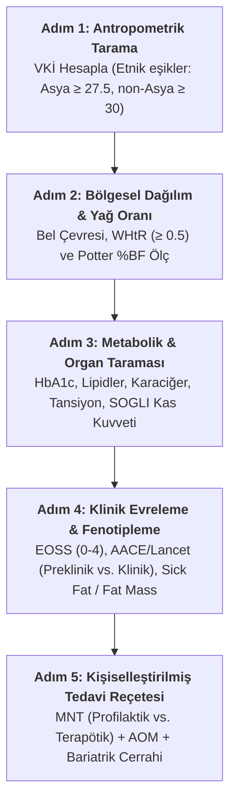
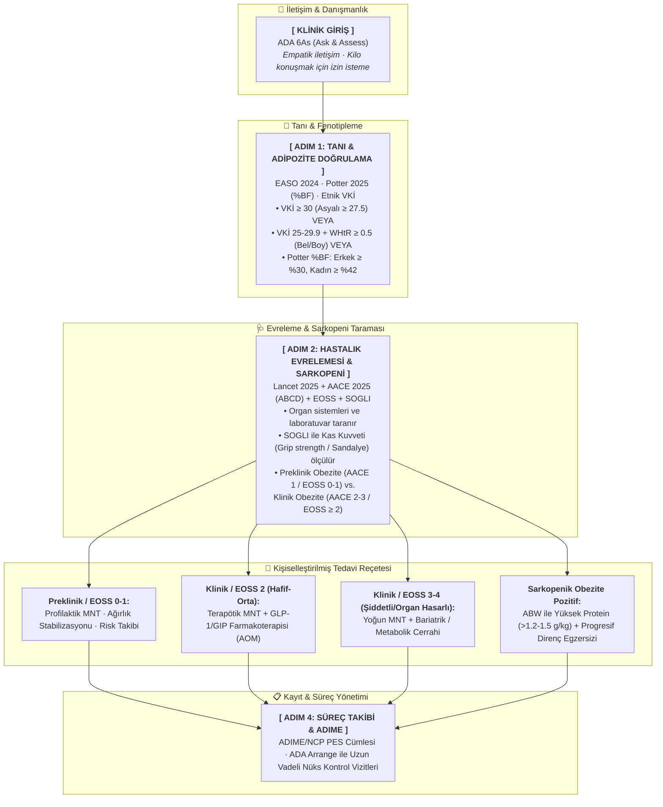
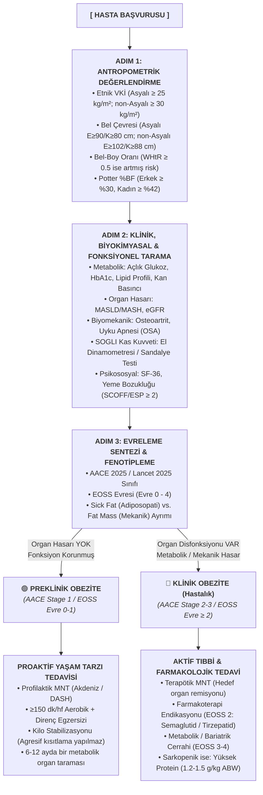

# Obezite Tanı ve Evreleme Sistemlerinin Akılcı Kullanımı
## Klinisyenler, Diyetisyenler ve Eğitmenler İçin Bütünleşik Uygulama Rehberi

**Hedef Kitle:** Beslenme ve Diyetetik Lisans Öğrencileri, Klinik Stajyerler, Diyetisyenler
**Kaynak Notlar:** `obezite-akilci-tani-rehberi`, `obezite-klinik-basucu-rehberi` (Bölüm I), `obezite-tani-ve-enerji-kilavuzu` (Bölüm 1-2), `obezite-tani-ve-evreleme-rehberi` — bu dört not tek bir bütünleşik kaynakta birleştirilmiştir.

---

## 📌 GİRİŞ: Obeziteye Bakışta Paradigmaların Evrimi

Geleneksel tıp yaklaşımı obeziteyi uzun yıllar boyunca yalnızca "aşırı ağırlık" veya enerji alımı-harcaması arasındaki basit bir dengesizlik durumu (Sistem 1 yüzeysel düşüncesi) olarak, Vücut Kitle İndeksi (VKİ) üzerinden değerlendiren hantal ve indirgemeci bir çerçeveye sıkışmıştır [55, 498]. Ancak modern tıp ve klinik diyetetik kılavuzları (EASO, Lancet, ADA), obeziteyi **"Adipoz Doku Disfonksiyonu (Adiposopathy) ile karakterize, çok faktörlü, kronik ve tekrarlayan sistemik bir hastalık"** olarak tanımlar [1, 5, 143]. Fazla adipozitenin — özellikle visseral ve ektopik yağ birikiminin — doku ve organ fonksiyonlarını bozmasıyla karakterize olan bu tablo, artık tek bir "kilo problemi" değil, farklı patofizyolojik mekanizmalara sahip **"Obeziteler" (Obesities)** ve **"Adipozite Temelli Kronik Hastalıklar (ABCD)"** bütünlüğü olarak ele alınmaktadır [368, 594].

Bu rehberin amacı; beslenme ve diyetetik öğrencilerinin kliniğe çıktıklarında sadece hastanın kilosuna ve VKİ'sine kilitlenmelerini önlemek; **VKİ, Bel Çevresi, Bel-Boy Oranı, vücut kompozisyonu analizleri, Edmonton Obezite Evreleme Sistemi (EOSS) ve en güncel EASO/Lancet (2024-2025) kriterlerini** birleştirerek akılcı, kanıta dayalı ve hasta odaklı bir tanı-tedavi rotası çizmelerini sağlamaktır. Rehber; **EASO 2024 Çerçevesi** [85], **Lancet 2025 Komisyonu** [297], **Edmonton Obezite Evreleme Sistemi (EOSS)** [5], **AACE/ACE ABCD (Adiposity-Based Chronic Disease)** modeli [179] ve en güncel ulusal/uluslararası kılavuzlar ışığında, klinik tanı araçlarını, evreleme sistemlerini ve tedaviye yön veren algoritmaları karşılaştırmalı olarak sunmaktadır.

---

## BÖLÜM 1: ANTROPOMETRİK VE BİYOLOJİK TANI ARAÇLARI

Klinikte obezite tanısı konurken tek başına VKİ ölçümü hastayı yanlış sınıflandırabilir [55, 498]. VKİ'nin kas ve yağ dokusunu ayırt edemediği, gebelerde, sporcularda ve sarkopenik yaşlılarda hatalı sonuçlar verdiği unutulmamalıdır [1, 266, 272, 498, 516]. Bu nedenle çok boyutlu antropometri ve vücut kompozisyonu analizleri esastır [55, 117].

### A. Vücut Kitle İndeksi (VKİ / BMI) ve Etnik Köken Hassasiyeti

*   **Formül:** $VKİ = \text{Ağırlık (kg)} / \text{Boy (m)}^2$
*   **Geleneksel WHO 1997 / NIH 1998 Sınıflaması:**

| Kategori | VKİ Aralığı (kg/m²) |
| :--- | :---: |
| Zayıf | < 18.5 |
| Normal | 18.5 – 24.9 |
| Fazla Kilolu | 25.0 – 29.9 |
| Sınıf I Obezite | 30.0 – 34.9 |
| Sınıf II Obezite | 35.0 – 39.9 |
| Sınıf III Obezite (Ciddi/Şiddetli) | ≥ 40.0 |

*   **Avantajları:** Popülasyon düzeyinde veri toplamada son derece pratik, ucuz ve hızlıdır; küresel standarttır.
*   **Dezavantajları:** Bireysel düzeyde aşırı derecede yetersiz ve kusurludur. Yağsız kas kütlesi ile yağ kütlesini ayırt edemez, yağ dağılımını (visseral/ektopik yağlanma) göremez, sarkopenik obeziteyi tamamen ıskalar. "Metabolik olarak obez normal kilolu" (Normal-Weight Obesity) bireylerin gözden kaçmasına yol açarken, yüksek kas kütlesine sahip aktif bireylerin yanlışlıkla obez olarak sınıflandırılmasına neden olur.
*   **Etnik Duyarlılık:** Kardiyometabolik ve Tip 2 Diyabet riskleri etnik gruplara göre dramatik şekilde değişir [17, 102]. South Asian, Çin, Japon, Doğu Asya, Orta Doğu veya Afro-Karayip kökenli bireylerde metabolik riskler ve visseral yağlanma çok daha düşük VKİ seviyelerinde başlar:
    *   **Beyaz, Hispanik, Siyah Popülasyon:** Standart eşikler geçerli (Fazla Kilolu ≥ 25, Obezite ≥ 30) [28, 102].
    *   **Güney Asya / Doğu Asya Popülasyonu:** Fazla Kilolu ≥ 23.0 kg/m²; Obezite ≥ 25.0 kg/m² (bazı kılavuzlarda risk artışı nedeniyle ≥ 27.5 kg/m² eşiği de kullanılır) [8, 54, 265, 299].

### B. Bel Çevresi (Waist Circumference – WC)

Bel çevresi, visseral ve abdominal adipozitenin (iç organ yağlanmasının) en güçlü ve pratik dolaylı göstergesidir [41, 486]; kardiyovasküler hastalık ve mortalite riskini VKİ'den bağımsız olarak öngörür [27, 486].

*   **Avrupalı / Kuzey Amerikalı Popülasyon:** Erkek ≥ 102 cm, Kadın ≥ 88 cm [6, 74, 490].
*   **Asyalı Popülasyon:** Erkek ≥ 90 cm, Kadın ≥ 80 cm [490].
*   Bel çevresi bu sınırların üzerinde ise "Santral Obezite" ve yüksek kardiyometabolik risk mevcuttur.

### C. Bel-Boy Oranı (Waist-to-Height Ratio – WHtR)

Bel çevresinin boya oranıdır. Son klinik kılavuzlarda WHtR'nin metabolik riskleri tahmin etmede VKİ'den daha duyarlı olduğu saptanmıştır [15, 74].

*   **Küresel Sınır Değeri: 0.5.** Bel çevresinin boyun yarısından az olması gerektiği kuralı (WHtR < 0.5), VKİ normal olsa dahi artmış koroner arter ve diyabet riskini işaret eder; kardiyometabolik koruyuculuk için basit ve güçlü bir tarama kriteridir [50, 74, 75, 185].

### D. Vücut Kompozisyonu Analizleri

Hassas klinik değerlendirmelerde kas ve yağ kütlesinin ayrımı — özellikle sarkopenik obeziteyi yakalamak için — hayatidir [117, 516].

*   **DXA (Çift Enerjili X-Işını Absorpsiyometrisi):** Altın standarttır [34, 117]. Yağsız kütle (lean mass), iskelet kası ve kemik mineral yoğunluğunu net olarak ölçer.
*   **BIA (Biyoelektriksel İmpedans):** Klinik ortamda hidrasyon takibi, kas kütlesi ve yağ yüzdesi analizi için pratik bir alternatiftir [117, 177].

#### Vücut Kompozisyonu Modelleri (Bölmeli Analiz Sistemleri)
*   **İki Bölmeli Model (2C):** Vücudu Yağ Kütlesi (FM) ve Yağsız Vücut Kütlesi (FFM) olarak ayırır. FFM'nin su oranını herkes için sabit (%73.2) kabul ettiğinden ödem, asit veya dehidrasyon durumlarında hatalı sonuçlar verir.
*   **Üç Bölmeli Model (3C):** Vücudu Yağ, Toplam Vücut Suyu (TBW) ve Kuru Yağsız Doku olarak böler; hidrasyon dalgalanmalarının yarattığı hatayı eler.
*   **Dört Bölmeli Model (4C):** Yağ, Su, Kemik Minerali ve Protein/Yumuşak Doku olarak ayırır. Klinik araştırmalarda **altın standarttır**.
*   **Hücresel Düzeyde Çok Bölmeli Model (BCM):** Vücudu Vücut Hücre Kütlesi (BCM), Hücre Dışı Su (ECW), Hücre İçi Su (ICW) ve Hücre Dışı Katılar (ECS) olarak inceler. Ödemli/asitli hastalarda malnütrisyonu ve sarkopeniyi sıvı artışına takılmadan saptayan en hassas modeldir.

#### Cinsiyet Farklılıkları ve Yağ Dağılım Tipleri
*   **Elzem (Esansiyel) Yağ:** Erkeklerde %3 iken, gebelik ve laktasyonu desteklemek amacıyla kadınlarda %12 seviyesindedir. Sağlıklı toplam yağ oranı standartları erkeklerde %10-22, kadınlarda %20-32 aralığındadır.
*   **Android (Elma Tipi / Abdominal):** Yağın iç organ çevresinde (VAT) birikmesidir. Proinflamatuar sitokin salınımı yüksektir, metabolik riskleri tetikler. Erkeklerde ve menopoz sonrası kadınlarda yaygındır.
*   **Gynoid (Armut Tipi / Periferik):** Yağın kalça ve uyluk bölgesinde birikmesidir. Östrojen kontrolündedir, metabolik riskleri oldukça düşüktür. Menopoz öncesi kadınlarda yaygındır.

#### Pratik Not — Doğru BIA/Vücut Analizi Ölçümü İçin Hazırlık Protokolü
Vücut kompozisyonu verisi (özellikle Bölüm 2'deki hedef ağırlık modeli veya Enerji notundaki Cunningham formülü gibi FFM-tabanlı hesaplamalarda kullanılacaksa) güvenilir olmalıdır. Doğru bir ölçüm için hasta ölçümden önce şu kurallara uymalıdır:
- [ ] En az 3-4 saatlik açlık ve susuzluk sağlanmış olmalıdır.
- [ ] Son 24 saat içinde ağır fiziksel aktivite/egzersiz yapılmamış olmalıdır.
- [ ] Ölçüm öncesinde idrar torbası (mesane) boşaltılmış olmalıdır.
- [ ] Ölçüm öncesi son 24-48 saat içinde alkol alınmamış olmalıdır.
- [ ] Ölçüm anında hastanın üzerinde metal takı, saat veya cep telefonu bulunmamalıdır.

**Kritik Hasta / Hastane Protokolü:** Hastada belirgin ödem, asit veya yoğun hidrasyon (IV sıvı desteği) varsa BIA sonuçları (ve bunlara dayalı FFM/yağ oranı) reddedilmeli, hesaplamalarda hastanın hastane öncesi kuru ağırlığı (UBW) referans alınmalıdır.

### E. "Hedef Yağ Yüzdesi (BF%) Tabanlı Ağırlık Hedefleme" — Kas Koruyucu Alternatif Model

Geleneksel olarak hastaya ideal ağırlık hedefi koyarken kas kütlesini yok sayıp sadece boyuna bakarak kurguladığımız ideal VKİ sınırlarını (örn. 22 kg/m²) kullanırız. Bu yaklaşım, hastanın metabolik motoru olan kas dokusunun (LBM) da feda edilmesine yol açan metabolik bir çelişkidir. "**Missing Part (Kayıp Halka) Çözümü**" adı verilen alternatif model, hastanın Yağsız Vücut Kütlesini (LBM) koruduğunu varsayarak ideal vücut yağ yüzdesi (BF%) üzerinden bir hedef ağırlık türetir; bu, hastayı yo-yo döngüsünden kurtaran en fizyolojik yaklaşımdır.

**Matematiksel Algoritma** (BIA/DEXA verisi mevcutsa):
$$\text{Mevcut Yağsız Kütle (LBM, kg)} = \text{Toplam Ağırlık} - \text{Mevcut Yağ Kütlesi}$$
$$\text{LBM Korunumlu Hedef Ağırlık (kg)} = \frac{\text{Mevcut LBM (kg)}}{1 - \text{Hedef } BF\%}$$

**Örnek Uygulama:** 1.70 m boyunda, 100 kg ağırlığında, %40 yağ oranına (FM: 40 kg, LBM: 60 kg) sahip obez bir erkek hasta.
*   **Geleneksel Yol (İdeal VKİ 22):** Hedef ağırlık **63.5 kg** olarak belirlenir (36.5 kg kayıp talep edilir; bu süreçte kas kaybı kaçınılmazdır).
*   **Yeni Yol (İdeal BF% 20):** LBM (60 kg) korunarak hedef ağırlık $= 60 / (1 - 0.20) = \mathbf{75\ kg}$.
*   **Klinik Fark:** İdeal BF% tabanlı hedef (75 kg), hastanın kas yapısını koruyan, metabolik çöküşü ve adaptif termogenezi (yo-yo etkisini) en aza indiren, uygulanması ve sürdürülmesi çok daha kolay, gerçekçi bir kilo verme hedefidir.

### F. Klinik, Biyokimyasal ve Fonksiyonel Tarama

Antropometrik ölçümlerin ardından hastanın komorbidite yükünü ortaya koyacak tarama tamamlanmalıdır:
*   **Metabolik/Laboratuvar:** Açlık kan şekeri, HbA1c, lipid profili (Trigliserit, HDL, LDL, Apo B), karaciğer enzimleri (ALT/AST), tiroid paneli [44, 115, 308].
*   **Organ Hasarı:** Karaciğer yağlanması (MASLD/MASH), eGFR (böbrek fonksiyonu) [46, 115].
*   **Mekanik:** Eklem ağrıları (osteoartrit), Uyku Apnesi (OSA/uyku testi) [46, 574].
*   **Fizik Muayene (NFPE):** Boyun ve koltuk altı katlantılarında *Acanthosis Nigricans* (insülin direnci göstergesi) palpasyon ve deprese edilerek değerlendirilir; diz/eklem ağrıları (mekanik yük) sorgulanır [308].
*   **Psikososyal:** Yaşam kalitesi (SF-36), Yeme Bozukluğu taraması (SCOFF/ESP ≥ 2 pozitif kabul edilir) [114, 171, 177].

---

## BÖLÜM 2: MODERN EVRELEME VE SINIFLANDIRMA SİSTEMLERİ (KARŞILAŞTIRMALI)

Öğrencilerin en çok zorlandığı nokta, hangi evreleme sisteminin klinikte ne amaçla kullanılacağıdır. 2005 sonrası geliştirilen 8 büyük tanı/evreleme/değerlendirme sistemi aşağıda detaylandırılmıştır.

### 1. The Lancet 2025 Komisyonu (Rubino et al.) [297]
*   **Menşei & Kurum:** Uluslararası uzmanlardan oluşan *The Lancet Diabetes & Endocrinology* Komisyonu.
*   **Temel Felsefe:** "Aşırı adipozite" (risk faktörü) ile "Klinik Obezite" (organ hasarı yaratan primer hastalık) arasındaki ayrımı kesinleştirmek ve aşırı teşhisi (overdiagnosis) önlemek. Odağı tamamen hücresel, moleküler ve sistemik doku fonksiyon bozukluğuna (adipoz doku disfonksiyonu, kronik sistemik inflamasyon, organ fonksiyon testleri) kaydırır.
* **Kullanılan Tanı Araçları:**
    *   *Adipozite Doğrulaması:* VKİ > 40 kg/m² hariç, VKİ'ye ek olarak **en az bir ek antropometrik kriter** (Bel Çevresi [WC], Bel/Boy Oranı [WHtR ≥ 0.5] veya Bel/Kalça Oranı [WHR]) VEYA **doğrudan vücut yağı ölçümü (%BF - DEXA/BİA)**.
    *   *Klinik Taramalar:* Organ sistemlerinin tıbbi öykü, fizik muayene, biyokimya panelleri (HbA1c, eGFR, ALT/AST, Fib-4, Lipidler, EKG/Eko) ve günlük yaşam aktiviteleri (*ADL/iADL* ölçekleri) ile taranması.
*   **Klinik Sınıflandırma:**
    *   **Preklinik Obezite (Preclinical Obesity):** Antropometrik veya doğrudan vücut yağı ölçümü (%BF) ile aşırı yağlanma kanıtlanmıştır, ancak diğer doku ve organların fonksiyonları tamamen korunmuştur. Bu klinik bir hastalık (*illness*) değil, gelecekteki komplikasyonlar için bir **sağlık riskidir**. Koruyucu (profilaktik) yaşam tarzı takibi gerektirir.
    *   **Klinik Obezite (Clinical Obesity):** Aşırı adipozitenin doğrudan bir sonucu olarak en az bir organ/doku sisteminde somut disfonksiyonun (T2D, HFpEF, MASH, CKD, Uyku Apnesi, Osteoartrit) saptanması VEYA günlük yaşam aktivitelerinde (mobilite, öz bakım) belirgin kısıtlılık olmasıdır. Terapötik (tedavi edici) acil müdahale (ilaç/cerrahi/yapılandırılmış MNT) gerektiren **aktif bir hastalıktır**.
*   **Avantaj / Dezavantaj:** Aşırı teşhisi engeller ve sağlık kaynaklarını en riskli gruba odaklar. Ancak preklinikten kliniğe geçiş hızı bireysel olarak değişkendir.
### 2. AACE 2025 Konsensüsü & AACE/EASO ABCD Modeli (Nadolsky et al., 2025; Garber et al., 2016)
*   **Menşei & Kurum:** Amerikan Klinik Endokrinologlar Derneği (AACE) ve Avrupa Obezite Araştırmaları Derneği (EASO).
*   **Temel Felsefe:** Obeziteyi "Adipozite Temelli Kronik Hastalık (ABCD)" olarak kodlayıp, **Lancet 2025 Komisyonu ile AACE Evreleme Sistemini resmen entegre etmek**.
*   **AACE 2025 - Lancet 2025 Entegrasyonu:**
    *   **AACE Stage 1 = Preclinical Obesity (Preklinik Obezite):** Aşırı adipozite doğrulanmıştır ancak henüz bilinen hiçbir Obezite İlişkili Komplikasyon ve Hastalık (ORCD) yoktur.
    *   **AACE Stage 2 & Stage 3 = Clinical Obesity (Klinik Obezite):** En az bir ORCD mevcuttur. Komplikasyon hafif-orta şiddette ise **Stage 2**, en az bir şiddetli organ hasarı veya çoklu organ etkilenimi varsa **Stage 3** olarak derecelendirilir.
*   **Patofizyolojik Mekanizmalar (Sick Fat vs. Fat Mass):**
    *   *Sick Fat Disease (Adiposopathy / Hasta Yağ Hastalığı):* Yağ dokusunun endokrin ve immün yanıtlarının bozulması sonucu gelişen metabolik-enflamatuar bozukluklar (insülin direnci, T2D, MASH, dislipidemi, hipertansiyon).
    *   *Fat Mass Disease (Yağ Kütlesi Hastalığı):* Artan yağ kütlesinin fiziksel ve mekanik baskısı sonucu gelişen bozukluklar (uyku apnesi, diz/kalça osteoartriti, idrar kaçırma, venöz staz).
*   **Kullanılan Tanı Araçları:** Antropometri (Etnik VKİ + Bel Çevresi + Bel/Boy Oranı [WHtR]) + BİA/DEXA + Tıbbi ORCD Taraması + İçselleştirilmiş Kilo Önyargısı (*Internalized Weight Bias*) ve Sağlığın Sosyal Belirleyicileri (SDOH) Analizi.
### 3. EASO 2024 Yeni Teşhis ve Yönetim Çerçevesi (Busetto et al.) [85]
*   **Menşei & Kurum:** Avrupa Obezite Araştırmaları Derneği (EASO).
*   **Temel Felsefe:** VKİ'nin "yağ dağılımı körlüğünü" yıkmak; düşük VKİ'ye rağmen yüksek visseral yağlanma nedeniyle risk altında olan hastaların tedavisiz kalmasını (undertreatment) engellemek.
*   **Yöntem / Klinik Sınıflandırma:**
    *   **VKİ ≥ 30 kg/m²** olan tüm bireylere doğrudan obezite teşhisi konur.
    *   **VKİ 25.0-29.9 kg/m²** (geleneksel fazla kilolular) arasında olan bireylerde, **WHtR ≥ 0.5** ise ve buna en az bir medikal, fonksiyonel veya psikososyal komplikasyon eşlik ediyorsa hastaya resmen **"Obezite Hastası"** teşhisi konur.
*   **Avantajları:** WHtR boy farklarını kompanse ederek visseral adipoziteyi ve kardiyometabolik riski bel çevresine göre çok daha hassas yansıtır; düşük kilodaki riskli hastaların erken tedaviye (ilaç dahil) ulaşmasını sağlar. "Metabolik Olarak Sağlıklı Obez" (MHO) ile "Metabolik Olarak Riskli Zayıf" bireyleri ayırt ederek kişiselleştirilmiş tıp sunar; VKİ ne olursa olsun visseral yağlanma ve metabolik inflamasyonu olan hastalarda hemen tedaviye başlanmasını dikte eder.
*   **Dezavantajları:** Toplumdaki obezite prevalansını ve tedavi adaylarının sayısını yapay olarak aniden çok fazla artırarak sigorta/sağlık bütçelerinde büyük yük yaratabilir.

### 4. ADA 2026 Obezite Standartları ve 6As Çerçevesi (ADA, 2026)
*   **Menşei & Kurum:** Amerikan Diyabet Derneği (ADA).
*   **Kullanılan Tanı Araçları & Etnik Eşikler:**
    *   *Asya Kökenli Bireyler:* Tarama eşiği **VKİ ≥ 23 kg/m²**, obezite tanı eşiği **VKİ ≥ 27.5 kg/m²** (veya VKİ ≥ 23 kg/m² + WHtR ≥ 0.5 / yüksek bel çevresi).
    *   *Asyalı Olmayan Bireyler:* Tarama eşiği **VKİ ≥ 25 kg/m²**, obezite tanı eşiği **VKİ ≥ 30 kg/m²** VEYA **VKİ ≥ 25 kg/m² + WHtR ≥ 0.5** (veya Kadın ≥88 cm / Erkek ≥102 cm Bel Çevresi).
*   **6As Klinik İletişim & Danışmanlık Modeli:**
    1.  *Ask (Sor):* İzin isteme ("Kilonuzun sağlığınız üzerindeki etkilerini konuşabilir miyiz?").
    2.  *Assess (Değerlendir):* VKİ, WHtR, EOSS evresi, yeme davranışları, SDOH ve kök nedenler.
    3.  *Advise (Tavsiye Et):* MNT, egzersiz, ilaç (AOM) ve cerrahi seçeneklerinin anlatılması.
    4.  *Agree (Anlaş):* Hasta ile ortaklaşa SMART hedefler belirleme.
    5.  *Assist (Yardım Et):* Kilo damgalaması, travma ve engelleri çözmede destek olma.
    6.  *Arrange (Ayarla):* Uzun vadeli kronik takip vizitlerini kurgulama.
### 4.1. Edmonton Obesity Staging System – EOSS (Sharma & Kushner 2009) [5]
*   **Menşei & Kurum:** Kanada (Obesity Canada) ve ADA 2026 kılavuzlarının temel evreleme aracıdır.
*   **Temel Felsefe:** Tedavi kararını ve ciddiyeti tartıdaki kiloya değil, obezitenin hastanın yaşamındaki **fonksiyonel, tıbbi ve psikolojik hasar derecesine** göre belirlemek; kilodan bağımsız olarak bu sınırlılıkları görünür kılmak [254, 311, 314].
*   **Yöntem / Sınıflandırma (Evre 0–4) ve Klinik Yol Haritası:**

| Evre | Klinik Bulgular | Klinik Yol Haritası (Aksiyon) |
| :---: | :--- | :--- |
| **Evre 0** | Hiçbir tıbbi, mekanik veya psikolojik komplikasyon yok; fonksiyonel kısıtlılık yok. | Agresif kalori kısıtlamalarından kaçınılır (yeme bozukluğu riski). Öncelik, mevcut ağırlığın korunması ve sağlıklı yaşam tarzı alışkanlıklarının kazandırılmasıdır. |
| **Evre 1** | Subklinik risk faktörleri: sınırda glukoz, sınırda tansiyon, hafif eklem sızısı/dispne, hafif psikososyal distres. | Tıbbi Beslenme Tedavisi (MNT) ve planlı fiziksel aktivite birincil müdahaledir. %5-10 ağırlık kaybı hedeflenir. |
| **Evre 2 (Yerleşik/Orta)** | Yerleşik kronik hastalıklar: T2DM, Hipertansiyon, KOAH, Uyku Apnesi, diz osteoartriti, klinik depresyon. Günlük işlerde orta düzey kısıtlılık. | Sadece diyet tedavisi yetersiz kalabilir; MNT ile birlikte farmakoterapi (örn. GLP-1 analogları) veya bariatrik cerrahi seçenekleri multidisipliner değerlendirilmelidir. |
| **Evre 3 (Şiddetli/Organ Hasarlı)** | İleri uç-organ hasarları: diyabet komplikasyonları (retinopati/nefropati), kalp yetmezliği, MASH/fibrozis, miyokard enfarktüsü geçmişi, şiddetli eklem kısıtlılığı, majör depresyon. Çalışamaz durumda. | Acil ve agresif tıbbi müdahale (bariatrik cerrahi veya yoğun farmakoterapi) ile birlikte, metabolik hızı çökertmeyecek, besin ögesi eksikliklerini önleyici koruyucu beslenme tedavisi uygulanır. |
| **Evre 4 (Son Dönem)** | Son dönem böbrek/kalp yetmezliği, karaciğer sirozu, tekerlekli sandalyeye/yatağa tam bağımlılık, psikiyatrik katatoni. | Palyatif bakım ve yaşam kalitesini artırıcı liberalize edilmiş beslenme desteği önceliklidir. |

*   **Avantajları:** Hastanın mortalite riskini öngörmede tek başına VKİ'den kat kat daha güçlü bir istatistiksel güce sahiptir.
*   **Dezavantajları:** Değerlendirme süreci ayrıntılı tetkikler (biyokimya, uyku testi, eklem muayenesi) gerektirdiğinden pratik klinik vizit süresini uzatır.
### 5. Potter et al. (2025) NHANES %BF (Vücut Yağ Yüzdesi) Kriterleri
*   **Menşei & Araştırma:** Potter ve ark. (2025, *JCEM*), 16.918 yetişkin NHANES verisi analizi.
*   **Temel Felsefe:** VKİ yerine doğrudan Vücut Yağ Yüzdesi (%BF) kullanarak kardiyometabolik riski (Metabolik Sendrom sıklığını) tahmin etmek.
*   **Klinik %BF Eşik Değerleri:**
    *   *Fazla Kilo (Overweight - Metabolik Sendrom Riski %5):* **Erkek %25 BF | Kadın %36 BF**
    *   *Obezite (Obesity - Metabolik Sendrom Riski %35):* **Erkek %30 BF | Kadın %42 BF**
*   **Avantaj / Dezavantaj:** Sporculardaki "yalancı obeziteyi" ve zayıf kaslı bireylerdeki "gizli obeziteyi" (*normal weight obesity*) tam tespit eder. Ancak BİA/DEXA gerektirir ve yağın visseral/subkutan dağılımını göstermek için bel çevresi/WHtR ile birleştirilmelidir.

### 6. King's Obesity Staging Criteria – KOSC (Wilding et al.)
*   **Menşei & Kurum:** King's College Hospital, Londra (İngiltere).
*   **Temel Felsefe:** Obezitenin farklı organ sistemleri üzerindeki özgül patolojilerini ve tedavinin (özellikle cerrahi/farmakoterapi) bu sistemlerdeki spesifik iyileştirme (remisyon) gücünü takip etmek.
*   **Yöntem / Klinik Değerlendirme:** Hasta 10 farklı klinik alanda **0 (etkilenmemiş) ile 3 (şiddetli hasar)** arasında puanlanır: 1) Hava Yolu (Airway/Uyku Apnesi), 2) Biyobelirteçler (Lipitler, Karaciğer), 3) Kardiyovasküler (Tansiyon, Sol Ventrikül), 4) Diyabet/Glisemik Kontrol, 5) Endokrin (PCOS, Hipogonadizm), 6) Fonksiyonel Kapasite/Mobilite, 7) Gonadal/Fertilite, 8) Sağlık Hizmeti Kullanım Yoğunluğu, 9) Mental Sağlık (Depresyon), 10) Beden Algısı ve Yaşam Kalitesi.
*   **Klinik Örnek:** Sadece kardiyovasküler skoru yüksek olan hastada DASH diyeti ve sodyum kısıtlaması öne çıkarılırken; mental sağlık skoru yüksek olanda bilişsel davranışçı terapi destekli bir beslenme protokolü önceliklendirilir.
*   **Avantajları:** Organ sistemlerine göre son derece spesifik, "özelleştirilmiş" bir izlem sunar; tedavi öncesi/sonrası organ bazlı klinik remisyonları ölçmede rakipsizdir.
*   **Dezavantajları:** 10 ayrı alanın tamamını skorlamak çok fazla klinik veri ve laboratuvar takibi gerektirir.

### 7. Adiposity-Based Chronic Disease – ABCD (AACE/ACE 2016, EASO 2019) [179]
*   **Menşei & Kurum:** Amerikan Klinik Endokrinologlar Derneği (AACE) ve EASO.
*   **Temel Felsefe:** "Obezite" teriminin yarattığı estetik önyargı ve damgalamayı kırarak hastalığı tamamen **biyolojik, endokrin ve dokusal** bir zemine oturtmak.
*   **Yöntem / Klinik Sınıflandırma:** Yağ dokusunu Miktar (Amount), Dağılım (Distribution) ve Fonksiyon (Function) olmak üzere 3 boyutta analiz eder; komplikasyonları iki patolojik sürece ayırır:
    1.  **Sick Fat Disease (Hasta Yağ Hastalığı / Adiposopathy):** Yağ dokusunun endokrin/immün işlevlerinin bozulması sonucu gelişen metabolik hasarlar (insülin direnci, kronik düşük dereceli sistemik inflamasyon).
    2.  **Fat Mass Disease (Yağ Kütlesi Hastalığı):** Aşırı yağ kütlesinin yarattığı fiziksel/mekanik baskı hasarları (uyku apnesi, osteoartrit, reflü).
    *(Basitleştirilmiş evreleme: Evre 0 komplikasyon yok; Evre 1 hafif-orta komplikasyon; Evre 2 şiddetli/ağır komplikasyon — "Treat-to-Target" yaklaşımı sunar.)*
*   **Avantajları:** Hastaya "daha az yiyip hareket etmediği için bu haldesin" suçlaması yerine, hücresel düzeyde hormonal/doku hastalığı olduğunu göstererek tedaviyi bilimselleştirir.
*   **Dezavantajları:** Yoğun poliklinik şartlarında pratik bir evreleme basamağı sunmaktan ziyade akademik/teorik bir patofizyolojik çerçevedir.
### 8. SOGLI (Sarcopenic Obesity Global Leadership Initiative - Barazzoni et al., 2026; Donini et al., 2022)
*   **Menşei & Kurum:** ESPEN ve EASO ortaklığı (FELANPE, PENSA, SASPEN desteğiyle).
*   **Kullanılan Tanı Araçları & Algoritma:**
    1.  *Tarama:* Yüksek VKİ/WC + Risk faktörleri (yaşlılık, kronik hastalık, SARC-F anketi).
    2.  *Tanı Adımı 1 (Kas Gücü):* El kavrama gücü (*Handgrip test*) VEYA Sandalyeden kalkma testi (*Chair stand test*).
    3.  *Tanı Adımı 2 (Vücut Kompozisyonu):* DEXA veya BİA ile artmış Yağ Kütlesi (%FM) ve azalmış Apandiküler Yağsız Kütle (ALM/ASM) doğrulanması.
    4.  *Evreleme:* Komplikasyonsuz ise *Stage 1*; fonksiyonel kısıtlılık/komplikasyon varsa *Stage 2*.

---
Obezite tanısı konulduktan sonra beslenme tedavisi "herkese aynı standart diyet" mantığıyla kurgulanamaz. Tedavi, belirlenmiş biyo-nöro-metabolik fenotiplere göre şekillendirilir:

| FENOTİP | PATOFİZYOLOJİK ÖZELLİK | MNT VE KLİNİK HEDEF |
| :--- | :--- | :--- |
| **Preklinik Obezite** *(AACE Stage 1 / Lancet)* | Aşırı yağlanma var, organ disfonksiyonu/illness **YOK**. | **PROFİLAKTİK MNT:** Besin kalitesini artırma, işlenmiş gıdaları (UPF) kesme, kilo artışını önleme, ağırlık stabilizasyonu. |
| **Klinik Obezite** *(AACE Stage 2-3 / Lancet)* | Aşırı yağlanmaya bağlı organ disfonksiyonu/illness **VAR**. | **TERAPÖTİK MNT:** Hedef organ remisyonu. Yapılandırılmış diyet + İlaç (AOM: GLP-1/GIP) + Cerrahi. |
| **Sick Fat Disease** *(Adiposopathy / Hasta Yağ)* | Yağ dokusunda endokrin/immün bozulma (İnsülin direnci, MASLD, dislipidemi, sistemik inflamasyon). | **METABOLİK MNT:** Akdeniz modeli, düşük glisemik indeks, yüksek lif, %5-15 kilo kaybı, anti-enflamatuar yaklaşım. |
| **Fat Mass Disease** *(Biyomekanik / Yük)* | Artan yağ kütlesinin fiziksel/mekanik baskısı (Uyku Apnesi, Diz OA, GÖRH). | **KAS KORUYUCU MNT:** %10-15+ kilo kaybı. ABW başına >1.0-1.5 g/gün protein + Progresif direnç egzersizi. |
| **Sarkopenik Obezite** *(SOGLI Stage 1-2)* | Düşük kas kütlesi/kuvveti + Artmış yağ kütlesi (Miyosteatoz). | **SOGLI/ESPEN MNT:** Ilımlı kısıtlama (-300-500 kcal), ABW başına >1.2-1.5 g/gün protein, Lösin (2.5-3 g/öğün) ve D vit. |
| **MHO (Metabolik Sağlıklı Obezite)** | Genişleyebilir subkutan yağ deposu, ektopik yağ düşük, insülin duyarlılığı korunmuş. | **TRANSİENT FENOTİP MNT:** MUO'ya geçişi önleme, visseral yağlanmayı engelleyici aerobik + direnç egzersizi ve Akdeniz diyeti. |

---

### ADIME / Nutrition Care Process – NCP (Beslenme Bakım Süreci)
*   **Menşei & Kurum:** Academy of Nutrition and Dietetics (AND).
*   **Temel Felsefe:** Diyetisyenlerin (RDN) obezite ve diğer kronik hastalıklarda bağımsız, kanıta dayalı ve uluslararası standartta bir klinik karar alma ve kayıt metodolojisi kullanmasını sağlamak.
*   **Yöntem / Klinik Adımlar:**
    *   **Assessment (Beslenme Değerlendirmesi):** Antropometrik, biyokimyasal, klinik, beslenme öyküsü ve çevre faktörlerinin toplanması.
    *   **Diagnosis (Beslenme Tanısı):** Tıbbi tanıdan farklı olarak, tamamen beslenme odağında **PES (Problem, Etiology, Signs/Symptoms)** cümle kalıbıyla tanı koyma. *Örn: "Düşük fiziksel aktivite ve porsiyon kontrolü eksikliğine (Etiyoloji) bağlı olarak aşırı enerji alımı (Problem); günlük kalori aşımı ve VKİ 32 olması ile kanıtlanmıştır (Belirti)."*
    *   **Intervention (Beslenme Müdahalesi):** Kişiselleştirilmiş diyet reçetesi, hedef kalori, makro dağılımı, eğitim ve davranışsal hedefler.
    *   **Monitoring & Evaluation (İzlem ve Değerlendirme):** SMART hedeflere ulaşım oranının ve klinik/laboratuvar sonuçlarının takibi.
*   **Avantajları:** Diyetisyenlik mesleğine klinik bir dil birliği ve profesyonel standart kazandırır; tedaviyi ölçülebilir ve raporlanabilir kılar.
*   **Dezavantajları:** Multidisipliner ekiplerde tıp hekimlerinin ve diğer personelin bu özel terminolojiye ve PES cümle yapısına adapte olması zordur.

### Hızlı Karşılaştırma Tablosu — Sistemleri Birbirinden Ayıran Odak Noktaları

| Evreleme Sistemi | Öncelikli Odak Noktası | Klinik Tanı Eşikleri / Sınıfları | Tedavi Kararına Etkisi |
| :--- | :--- | :--- | :--- |
| **EOSS** [5] | Komplikasyonların ağırlığı ve fonksiyonel durum (medikal, fiziksel, psikososyal yük). | Evre 0: risk yok → Evre 4: ağır fonksiyonel kısıtlılık/maluliyet. | Doğrudan tedavi agresifliğini belirler. Evre ≥ 2 ise VKİ'den bağımsız olarak farmakoterapi/cerrahi endikedir. |
| **EASO 2024** [85] | Adipozitenin organ fonksiyonları üzerindeki patolojik etkisi. | Preklinik Obezite (organ disfonksiyonu yok) vs. Klinik Obezite (sistemik doku/organ disfonksiyonu mevcut). | Tedavi hedefini belirler: Klinik obezitede "hastalık remisyonu", Preklinik obezitede proaktif "yaşam tarzı koruması". |
| **ABCD (AACE/ACE)** [179] | Komplikasyon odaklı patofizyolojik değerlendirme. | Evre 0: komplikasyon yok → Evre 2: şiddetli/ağır komplikasyon. | VKİ yerine komplikasyon ciddiyetine dayalı kişiselleştirilmiş "Treat-to-Target" tedavi sunar. |
| **Lancet 2025** [297] | Hücresel, moleküler ve sistemik doku fonksiyon bozukluğu. | Adipoz doku disfonksiyonu (adiposopati), kronik sistemik inflamasyon, organ fonksiyon testleri. | Obeziteyi metabolik/moleküler düzeyde tedavi edilmesi gereken biyolojik bir disfonksiyon olarak ele alır. |

---

## BÖLÜM 3: ENTEGRE KLİNİK KARAR ALGORİTMALARI

Aynı klinik problemi üç farklı, birbirini tamamlayan bakış açısıyla ele alan üç ayrı akış şeması aşağıda sunulmuştur. Öğrencilerin durumun karmaşıklığına göre hangisini uygulayacağını seçebilmesi için üçü de korunmuştur.

### (A) Hızlı Fizik Muayene Akışı (5 Adım Protokolü)

Klinikte karşınıza obezite ile yaşayan bir birey oturduğunda, "Sistem 2" analitik klinik muhakemesini devreye sokmak için izlenecek sıralı adımlar:

*   **Adım 1:** Boy/ağırlık ölçülür, VKİ hesaplanır. VKİ'nin sınırları (kas/yağ ayrımı yapamaması, gebe/sporcu/sarkopenik yaşlıda hata payı) akılda tutulur; etnik eşikler (Asya kökenlilerde ≥ 27.5 kg/m²) unutulmaz.
*   **Adım 2:** WC ve WHtR ölçülür; eşik değerler (WC erkek > 102 cm / kadın > 88 cm, WHtR > 0.5) uygulanır. BIA/DEXA varsa Potter 2025 %BF eşikleri (Erkek %30, Kadın %42) ile teyit edilir.
*   **Adım 3:** Açlık kan şekeri, HbA1c, lipid profili, karaciğer enzimleri, tiroid paneli değerlendirilir; NFPE ile Acanthosis Nigricans, eklem ağrıları ve SOGLI dinamometre kas gücü sorgulanır.
*   **Adım 4:** Komorbidite şiddetine göre EOSS Evre 0-4 ve AACE 2025 / Lancet Preklinik vs. Klinik ataması yapılır.
*   **Adım 5:** Hasta fenotipine uygun beslenme tedavisine (MNT) ve gerekirse farmakoterapi/cerrahiye yönlendirilir.

### (B) İletişim-Öncelikli ADA 6As Akışı (Tanı → Evreleme → Reçete → Takip)

### (C) Dallanmalı Tedavi Karar Ağacı (Preklinik vs. Klinik Obezite Branşlaması)

### Entegre Tedavi Algoritma Tablosu (EOSS × EASO/Lancet × Diyetisyen Aksiyon Planı)

Klinikte her hastaya tek tip kılavuz dayatmak yerine, bu sistemlerin güçlü yönlerini birleştiren aşağıdaki tablo, çıkan sonuca göre **hangi klinik aksiyonun** alınacağını ve diyetisyenin tedavi sınırlarını gösterir:

| EOSS Evresi | EASO / Lancet Sınıflandırması | Klinik Durum ve Bulgular | Tedavi Yaklaşımı (Diyetisyen Aksiyon Planı) | Tedavi Hedefi |
| :---: | :--- | :--- | :--- | :--- |
| **EVRE 0** | **Komplikasyonsuz Adipozite** | VKİ ≥ 30, bel çevresi sınırda veya yüksek olabilir. Metabolik, fiziksel veya psikolojik hiçbir komplikasyon/hasar yoktur. | 🚨 **Agresif kalori kısıtlaması YAPILMAZ.** • Yoğun diyet baskısı yeme bozukluklarını (Binge Eating) tetikleyebilir. • Sağlıklı beslenme davranışları ve sürdürülebilir fiziksel aktivite (haftada 150-300 dk) eğitimi verilir. | **Kilo Stabilizasyonu** Daha fazla kilo alınmasını önlemek ve metabolik sağlığı korumak. |
| **EVRE 1** | **Hafif Dereceli Komplikasyonlar** | Sınırda kan basıncı, bozulmuş açlık glukozu, hafif nefes darlığı veya eklem ağrıları mevcuttur. | **Yoğun Tıbbi Beslenme Tedavisi (MNT):** • Mifflin-St. Jeor ile hesaplanan TDEE'den **500-750 kcal açık** yaratılır. • **Akdeniz veya DASH** beslenme paterni uygulanır. • Davranış değişikliği için LEARN programı entegre edilir. | **Modest Kilo Kaybı** 6 ayda mevcut ağırlığın **%5-%10** kadarını kaybettirerek riskleri sıfırlamak. |
| **EVRE 2** | **Yerleşik Komplikasyonlar** | Tip 2 Diyabet, klinik Hipertansiyon, Dislipidemi, yerleşik Uyku Apnesi veya orta dereceli osteoartrit. | **MNT + Farmakoterapi Ortaklığı:** • Diyet tedavisine ek olarak **GLP-1 Reseptör Agonistleri** (Semaglutid vb.) veya diğer anti-obezite ilaçları yönlendirilir. • **GİS Semptom Yönetimi:** Geciken mide boşalmasına bağlı bulantıyı önlemek için 6 küçük/sık öğün, posa/yağ modifikasyonu ve sıvıların öğün aralarına kaydırılması planlanır. | **Sistemik İyileşme** Komorbiditelerin geriletilmesi, HbA1c ve LDL seviyelerinin hedeflere gelmesi. |
| **EVRE 3** | **Ağır / Kontrolsüz Komplikasyonlar** | Medikal tedaviye dirençli diyabet, ağır osteoartrit (fonksiyonel sınırlılık), ciddi organ hasarı başlangıcı. | **Bariatrik / Metabolik Cerrahi:** • ASMBS/IFSO (2022) kılavuzlarına göre hasta cerrahi için yönlendirilir. • **Pre-op Dönem:** Karaciğer sol lobunu küçültecek düşük kalorili MNT uygulanır. • **Post-op Dönem:** Berrak sıvı → Sıvı → Püre → Yumuşak → Katı diyet geçişi ve **Dumping Sendromu** takibi (basit şeker yasağı, sıvı-katı ayrımı). | **Metabolik Remisyon** Kilo kaybının sürdürülmesi ve diyabet/hipertansiyonun remisyona girmesi. |
| **EVRE 4** | **Son Dönem / Ağır Engellilik** | Obeziteye bağlı geri dönüşsüz, yaşamı tehdit eden son dönem hasarlar (Siroz, Diyaliz gerektiren KBH, Ağır Kalp Yetmezliği). | **Palyatif ve Spesifik Klinik Beslenme:** • Cerrahi ve agresif tedaviler yüksek risklidir (OS-MRS skoru hesaplanır). • Tedavi kilo kaybından ziyade, mevcut organ yetmezliğinin (renal, hepatik veya kardiyak) tıbbi beslenme tedavisine kaydırılır. | **Semptom Hafifletme** Yaşam kalitesini artırmak ve katabolik kas yıkımını önlemek. |

---

## BÖLÜM 4: KLİNİK VAKA SİMÜLASYONLARI (EĞİTİM MATERYALİ)

Öğrencilerin gerçek klinik hayatta düşebilecekleri "Sistem 1" tuzaklarını kıran dört kontrast vaka analizi. Derste kullanılmak üzere tasarlanmıştır.

### 🧩 VAKA 1: "Sarkopenik Obezite ve Demirleme Hatası"
*   **Senaryo:** 72 yaşında KOAH hastası bir erkek hasta. Boy: 175 cm, Kilo: 96 kg (VKİ: 31.3 kg/m² — Sınıf I Obez). Polikliniğe başvurduğunda stajyer diyetisyen Sistem 1 düşünme tarzıyla: *"Hastanın VKİ'si yüksek, depoları dolu. Hemen 1200 kalorilik bir obezite diyeti yazıp zayıflatmalıyım"* der.
*   **Bilişsel Tuzak (Anchoring Bias):** Sadece tartıdaki ağırlığa "demir atarak" hastanın yaşını, KOAH kaynaklı kronik inflamasyonunu ve kas kütlesini göz ardı etmek.
*   **Uzman Yargısı (Sistem 2):** Detaylı fiziksel muayenede (NFPE) şakaklarda (temporal) çökme, el kavrama gücünde (HGS) ciddi düşüş saptanır. Hastanın yüksek yağ kütlesinin altında ölümcül bir **Sarkopenik Obezite** tablosu yatmaktadır.
*   **Akılcı Karar:** Bu hastaya agresif kalori kısıtlaması yapmak kalan kaslarını da yok eder ve solunum kaslarının felcine yol açarak mortaliteyi artırır. Tedavi rotası: Kilo verdirmek değil, **Mifflin-St. Jeor ile normokalorik, yüksek proteinli (1.2-1.5 g/kg) ve direnç egzersizleriyle desteklenmiş** kas koruyucu bir tedavi olmalıdır.

### 🧩 VAKA 2: "Zayıf ama Toksik Yağlı (TOFI) Profil"
*   **Senaryo:** 34 yaşında kadın hasta. Boy: 168 cm, Kilo: 62 kg (VKİ: 21.9 kg/m² — Normal/Sağlıklı aralık). Rutin kontrolde Açlık Kan Şekeri: 115 mg/dL (Prediyabetik), Trigliserit: 210 mg/dL, Bel Çevresi: 92 cm saptanmıştır.
*   **Bilişsel Tuzak (Halo Etkisi):** "VKİ normal aralıkta, o zaman bu hasta tamamen sağlıklıdır, beslenme müdahalesine gerek yoktur" yanılgısı.
*   **Uzman Yargısı (Sistem 2):** Hastanın bel çevresi kadın sınırının (> 88 cm) üzerindedir. Bel-Boy Oranı (WHtR) = 92/168 = 0.54 (Artmış risk). Hasta **"TOFI" (Thin on Outside, Fat on Inside — Dışı İnce, İçi Şişman)** fenotipindedir; visseral yağ birikimi karaciğerde ve pankreasta insülin direncini başlatmıştır.
*   **Akılcı Karar:** VKİ normal olsa da, EASO/Lancet kılavuzuna göre hastada "Adipoz Doku Disfonksiyonu" mevcuttur. Tedavi rotası: **Akdeniz tipi düşük glisemik indeksli beslenme**, basit karbonhidratların tamamen kesilmesi ve visseral yağları en hızlı mobilize eden yöntem olan **haftada 150 dakika aerobik egzersiz** reçetesidir.

### 🧩 VAKA 3: "Metabolik Olarak Sağlıklı" Görünen Aşırı Kilolu Hasta (Etnik Eşik Vurgusu)
*   **Hasta Bilgileri:** 34 yaşında, Doğu Asya kökenli kadın hasta. VKİ: 28.5 kg/m². Bel Çevresi: 84 cm. Kan tetkikleri ve tansiyonu tamamen normal. Eklem ağrısı veya uyku apnesi yok.
*   **Sistemlerin Çıkardığı Sonuçlar:**
    1.  **Geleneksel Sınıflandırma (non-Asyalı standardı ile):** VKİ 28.5 olduğu için sadece "Overweight (Fazla Kilolu)" kabul edilir, obezite tanısı konmaz.
    2.  **Etnik Köken Hassasiyeti:** Doğu Asya popülasyonunda obezite sınırı ≥ 25 kg/m² olduğundan, bu hasta aslında **"Obezite"** tanısı alır.
    3.  **EOSS Evrelemesi:** Belirgin medikal, fiziksel veya psikososyal semptom/risk faktörü olmadığı için **EOSS Evre 0** (veya sınırda bel çevresi nedeniyle Evre 1).
    4.  **EASO 2024 Çerçevesi:** Aktif bir organ fonksiyon hasarı olmadığı için **Preklinik Obezite**.
*   **Klinik Karar ve Tedavi Protokolü:** İlaç veya cerrahi gibi agresif tedaviler kesinlikle uygulanmaz. Hasta etnik kökeni nedeniyle yüksek risk grubunda olduğundan proaktif takibe alınır. Haftada ≥150 dakika egzersiz (aerobik + direnç antrenmanı) ve Akdeniz tipi MNT başlanır. Amaç, preklinik durumun klinik obeziteye evrilmesini önlemektir.

### 🧩 VAKA 4: "Normal Kilolu" Metabolik Olarak Riskli (Sarkopenik) Hasta
*   **Hasta Bilgileri:** 68 yaşında erkek hasta. VKİ: 24.8 kg/m². Bel Çevresi: 104 cm. Kas kütlesi ve kuvveti (grip strength) belirgin düzeyde düşük. HbA1c: %6.4 (Prediyabet), hafif hipertansiyonu ve diz eklemlerinde şiddetli kireçlenme (osteoartrit) mevcut.
*   **Sistemlerin Çıkardığı Sonuçlar:**
    1.  **Geleneksel Sınıflandırma:** VKİ 24.8 kg/m² olduğu için "Normal Ağırlıkta" kabul edilir ve obezite tedavisi kapsamı dışında bırakılır.
    2.  **Antropometrik Tarama (WHtR/WC):** Bel çevresi 104 cm (sınır ≥ 102) ve WHtR > 0.5. Visseral adipozite ve metabolik risk tavan yapmıştır.
    3.  **EOSS Evrelemesi:** Prediyabet, osteoartrit ve hipertansiyon gibi yerleşik komplikasyonlar olduğu için **EOSS Evre 2**.
    4.  **EASO 2024 Çerçevesi:** Aşırı visseral yağlanma organ disfonksiyonuna (insülin direnci, kireçlenme) yol açtığı için **Klinik Obezite**.
*   **Klinik Karar ve Tedavi Protokolü:** Bu hasta "normal ağırlıkta" görünmesine rağmen aktif obezite tedavisi almalıdır. **Kas Koruma Önceliği:** Sarkopeniyi engellemek için diyetisyen gözetiminde **1.2-1.5 g/kg/gün protein** ve proaktif ağırlık antrenmanları planlanır. **Farmakoterapi:** Prediyabetin Tip 2 diyabete ilerlemesini önlemek ve osteoartrit yükünü hafifletmek adına GLP-1/GIP reseptör agonistleri (örn. Tirzepatid veya Semaglutid) tedaviye eklenir.

---

## BÖLÜM 5: HASTA ODAKLI KLİNİK İLETİŞİM PROTOKOLÜ (Do's & Don'ts)

Obezite ile yaşayan bireylerin tedavisinde klinik başarının %50'si hesapladığınız kalori ise, %50'si kurduğunuz terapötik ittifaktır [196, 262].

### ✔️ YAPILMASI GEREKENLER (Do's)
*   **"Önce İnsan" Dilini Kullanın:** Tıbbi kayıtlara ve konuşmalarınıza "Obez hasta" yerine **"Obezite ile yaşayan birey"** veya **"Obezitesi olan birey"** ifadesini yerleştirin [26, 259].
*   **İzin İsteyerek Başlayın (5A Modeli):** Odadan içeri giren hastaya doğrudan "Zayıflamamız lazım" demeyin. *"Bugün kilonuzun sağlığınız üzerindeki etkileri ve beslenme alışkanlıklarınız hakkında konuşmamıza izin verir misiniz?"* diyerek terapötik kapıyı açın.
*   **Ortak Karar Verin (Shared Decision Making):** Diyet hedeflerini hastaya dikte etmeyin. *"Sizce bu hafta beslenmenizde değiştirebileceğimiz en kolay 2 şey ne olabilir?"* diyerek hastayı sürecin lideri yapın.
*   **Teach-Back Metodu ile Teyit Edin:** Eğitim verdikten sonra *"Bugün konuştuklarımızı eve gittiğinizde ailenize nasıl özetleyeceksiniz, bana bir iki cümleyle canlandırabilir misiniz?"* diyerek hastanın gıda okuryazarlığını test edin.

### ❌ YAPILMAMASI GEREKENLER (Don'ts)
*   **Suçlayıcı ve Etiketleyici Terminolojiden Kaçının:** PES tanısı yazarken *"İradesizliğe bağlı aşırı yeme"* veya *"Bilgi eksikliği"* gibi hastayı damgalayıcı (stigmatize edici) ifadeler kullanmayın. eNCPT'nin standart ve kapsayıcı terimi olan **"Sınırlı gıda ve beslenme bilgisi"** veya **"Fiziksel inaktivite"** terimlerini seçin.
*   **Klinik Ekipmanı Ayarlamayı Unutmayın:** Muayenehanenizde obezitesi olan bireyler için uygun genişlikte, kolçaksız sandalyeler ve doğru boyutta (büyük boy) tansiyon manşonları bulundurarak fiziksel damgalamanın önüne geçin.

---

## BÖLÜM 6: ÖĞRETMENİN NOTU — ÖĞRENCİLER İÇİN ÇIKARILACAK VİZYON

Sevgili Öğrenciler,
Kliniğe adım attığınız ilk gün, önünüzdeki bilgisayar ekranında sadece bir **"kilo"** değeri göreceksiniz. Eğer o kiloya bakarak ezbere diyet listeleri yazarsanız, siz birer hesap makinesinden farksız olursunuz.

Gerçek bir uzman diyetisyen; tartıdaki o sayının arkasındaki insanı gören, bozulan yağ dokusunun yarattığı inflamasyonu koklayan, hastanın komorbidite yükünü ve psikolojik bariyerlerini analiz eden ve tedaviyi hasta ile el ele vererek inşa eden kişidir. **Sayıları değil, insanı tedavi edin.**

Bu modern tanı ve evreleme sistemlerini içselleştirmek, öğrencilere meslek hayatlarında şu kritik vizyonları kazandıracaktır:
1.  **Kişiselleştirilmiş Tedavi Yönetimi (Treat-to-Target):** Her hastaya standart %10 kilo kaybı hedeflemek yerine, komplikasyonların gerilemesini (örneğin HbA1c'nin %6.5'in altına inmesi veya eklem ağrısının azalması) birer başarı kriteri olarak görmeyi öğrenirler.
2.  **Stigma ve Damgalamanın Önlenmesi:** Obezitenin biyolojik temellerini, "yemek gürültüsünün" nörolojik boyutunu ve metabolik adaptasyonu kavrayan öğrenciler, hastaları "iradesizlikle" suçlamayı bırakıp onlara kronik bir hastalığı olan bireyler olarak yaklaşır.
3.  **Kaynakların Doğru Kullanımı:** Gerçekten farmakoterapiye ve cerrahiye ihtiyacı olan "Klinik Obezite" (EOSS ≥ 2) vakaları ile yaşam tarzı modifikasyonuyla izlenebilecek "Preklinik Obezite" vakalarını net olarak ayırt ederek sağlık sistemindeki kaynak israfını önlerler.

---

## KAYNAKLAR

1.  *NCPT/eNCPT Standartları (eNCPT Student Guide, 2024)* [79].
2.  *Krause and Mahan's Food and the Nutrition Care Process, 16th Edition* [22, 120].
3.  *AHA/ACC/TOS Adult Obesity Guidelines & ASMBS/IFSO 2022 Joint Statement* [21, 335, 354].
4.  *EASO/Lancet/EASD Obesity Consensus Statement (2024)* [143].
5.  *EASO 2024 Framework (Busetto et al.):* Adult Obesity Diagnosis and Management. (Kanıt Düzeyi: Sınıf I, Güçlü Öneri)
6.  *The Lancet 2025 Commission (Rubino et al.):* Definition and Diagnostic Criteria of Clinical Obesity. (Uluslararası Konsensüs)
7.  *ADA 2026 Standards of Care in Diabetes:* Obesity and Weight Management Sections. (Kanıt Düzeyi: A)
8.  *ESPEN & EASO Joint Consensus (SOGLI):* Sarcopenic Obesity Diagnostic and Clinical Guidelines. (Konsensüs Beyanı)
9.  *Potter et al. (2025):* Defining Overweight and Obesity by Percent Body Fat Instead of BMI (NHANES Database). (Kohort Analizi)

> **Not:** Metin içindeki köşeli parantez numaraları ([55, 498] vb.), kaynak notların orijinal (NotebookLM/Gemini tabanlı) derleme sürecinden gelen iç referans işaretleridir; ayrı bir çözümlenmiş bibliyografyaya sahip değildirler ve izlenebilirlik amacıyla metinde korunmuştur.

---
*Bu rehber, `obezite-akilci-tani-rehberi`, `obezite-klinik-basucu-rehberi` (Bölüm I), `obezite-tani-ve-enerji-kilavuzu` (Bölüm 1-2) ve `obezite-tani-ve-evreleme-rehberi` notlarının birleştirilmesiyle oluşturulmuştur. Enerji gereksinimi hesaplama ile ilgili tüm içerik (RMR formülleri, ABW/AdjBW/IBW/UBW seçimi, TDEE/PAL, kalori açığı) [[1.2.Enerji Harcamasının Belirlenmesi]] notuna entegre edilmiştir.*
