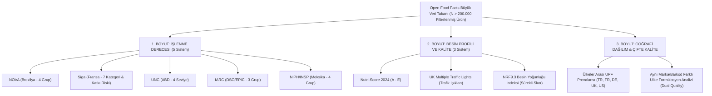
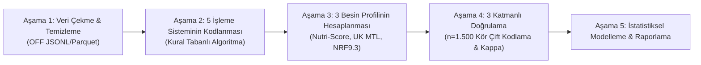
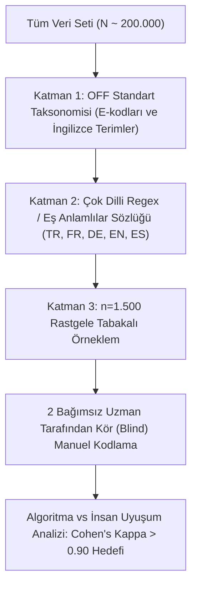

---
Konu:
  - Gıda İşleme Sınıflandırma Sistemleri
  - Ultra-İşlenmiş Gıdalar (UPF)
  - Besin Profili Modelleri
  - Beslenme Bilişimi (Nutritional Informatics)
  - Çifte Standart Gıda (Dual Quality of Food)
Tür:
  - Büyük Veri Analizi
  - Metodolojik Karşılaştırma
  - Kesitsel Epidemiyoloji
Durum: Taslak Proje Önerisi
Öncelik: Çok Yüksek
Oluşturulma_Tarihi: 2026-08-24
Hedef_Dergiler:
  - The American Journal of Clinical Nutrition (AJCN)
  - Nature Food
  - Lancet Planetary Health
  - Nutrients / European Journal of Nutrition
---

# 🌐 Open Food Facts Veri Tabanı Üzerinde 5 Farklı Ultra-İşlenmiş Gıda (UPF) Sisteminin Çapraz Karşılaştırması, Besin Yoğunluğu Matrisi ve Ülkeler Arası "Çifte Kalite" Analizi

> [!abstract] 📌 Proje Özeti
> Bu araştırma projesi; dünyanın en büyük açık kaynaklı barkodlu gıda veri tabanı olan **Open Food Facts (OFF)** üzerindeki yüz binlerce doğrulanmış gıda ürününü kullanarak, literatürdeki **5 majör gıda işleme sınıflandırma sistemini (NOVA, Siga, UNC, IARC, NIPH/Meksika)** algoritmik olarak karşılaştırmayı; bu sistemlerin **3 farklı besin profili modeliyle (Nutri-Score 2024, UK Multiple Traffic Lights, NRF9.3)** olan ortogonal ilişkisini haritalandırmayı ve aynı markalı ürünlerin **ülkeler arası formülasyon farklılıklarını (Dual Quality of Food)** ortaya koymayı amaçlayan kapsamlı bir beslenme bilişimi çalışmasıdır.

---

## 1. 🎯 ARAŞTIRMA SORULARI VE HİPOTEZLER

### ❓ Araştırma Soruları (Research Questions)
1. **RQ1 (Sistem Tutarlılığı):** Aynı gıda ürününe uygulandığında 5 farklı işleme sistemi (NOVA, Siga, UNC, IARC, NIPH) ne derecede uyuşmaktadır? Uyuşmazlığın (discordance) en yüksek olduğu spesifik gıda kategorileri hangileridir?
2. **RQ2 (İşleme vs Besin Yoğunluğu):** 5 işleme sistemine göre "Ultra-İşlenmiş (UPF)" olarak etiketlenen ürünlerin yüzde kaçı Nutri-Score'a göre "A/B", UK Trafik Işığına göre "Yeşil" veya NRF9.3'e göre "Yüksek Besin Yoğunluğu" almaktadır? (İşlenmiş ama besleyici gıda paradoksu).
3. **RQ3 (Katkı Maddesi ve Toksikolojik Ayrışma):** Siga sisteminin kozmetik katkı risk ağırlıklandırması, NOVA'nın toptancı 4. grubunu ne oranda ayrıştırabilmektedir?
4. **RQ4 (Çifte Standart Gıda - Dual Quality):** Aynı global markaların (örn. Nestlé, Danone, Ferrero, Unilever, Barilla) aynı isimli ürünleri; Batı Avrupa (Fransa, Almanya, İngiltere) ile Doğu Avrupa / Türkiye / ABD pazarlarında farklı işleme skoru ve besin profili sergilemekte midir?

### 💡 Çalışma Hipotezleri (Hypotheses)
* **H1 (Düşük Uyuşum Hipotezi):** PREDIMED-Plus kohortundaki bulgulara paralel olarak, market raflarındaki gıdalarda 5 sistem arasındaki genel uyuşum katsayısı (Fleiss’ Kappa) zayıf/orta düzeyde (< 0.40) kalacaktır; en büyük ayrışma bitkisel sütler, tam tahıllı fırıncılık ürünleri ve yoğurtlarda görülecektir.
* **H2 (Ortogonal Besin Kalitesi Hipotezi):** NOVA-4 (UPF) olarak sınıflandırılan gıdaların en az %20-25'i Nutri-Score (A/B) ve NRF9.3 sistemlerine göre "besin değeri yüksek/kabul edilebilir" çıkacaktır.
* **H3 (Coğrafi Çifte Standart Hipotezi):** Gelişmekte olan ülke pazarlarında (örn. Türkiye) satılan çok uluslu markalı gıdalar, Batı Avrupa pazarındaki muadillerine kıyasla daha yüksek oranda endüstriyel serbest şeker/palm yağı ve daha yüksek NOVA/Siga işleme puanı gösterecektir.

---

## 2. 🔬 ÖZGÜN DEĞER VE LİTERATÜRDEKİ AÇIK (GAP IN LITERATURE)

1. **Mevcut Çalışmaların Kısıtlılıkları:**
   * *Sadler et al. (2021):* 5 sistemi karşılaştırmış ancak sadece ~100 adet teorik gıda örneğiyle sınırlı kalmıştır.
   * *PREDIMED-Plus (2023):* Kohort anketlerini karşılaştırmış, barkodlu pazar gıdalarını incelememiştir.
   * *Hercberg/Julia Grubu (2018-2024):* Open Food Facts üzerinde yüzbinlerce ürünü incelemiş, ancak sadece kendi geliştirdikleri **Nutri-Score ile NOVA** arasındaki ilişkiye odaklanmış; Siga, UNC, IARC ve NIPH sistemlerini algoritmik olarak modelledikleri bir çalışma yapmamışlardır.
2. **Bu Çalışmanın Katacağı Özgün Değer:**
   * Literatürde **ilk kez 5 bağımsız işleme sınıflandırması** ile **3 bağımsız besin profili modeli** yüz binlerce gerçek pazar ürünü üzerinde aynı anda çaprazlanacaktır.
   * Gıda endüstrisinin ülkeler arasındaki reformülasyon asimetrisi (*Dual Quality of Food*) büyük veri düzeyinde kanıtlanacaktır.
   * Geliştirilecek açık kaynaklı Python analiz motoru, gıda bilişimi (Nutritional Informatics) literatürüne metodolojik bir standart kazandıracaktır.

---

## 3. 🛠️ AYRINTILI METODOLOJİ VE İŞ AKIŞ BORU HATTI (PIPELINE)

---

### 📥 Aşama 1: Veri Çekme, Filtreleme ve Kürasyon

* **Veri Kaynağı:** Open Food Facts resmi açık veri deposu (`openfoodfacts-products.jsonl.gz` veya Apache Parquet formatı).
* **Dahil Edilme Kriterleri (Inclusion Criteria):**
  1. Barkod (EAN/GTIN), ürün adı (`product_name`) ve marka (`brands`) bilgisi eksiksiz olan ürünler.
  2. İçerik listesi metni (`ingredients_text`) eksiksiz girilmiş olanlar.
  3. 100g/100ml başına zorunlu 7 temel besin ögesi değeri (Enerji kcal, Toplam Yağ, Doymuş Yağ, Karbonhidrat, Şekerler, Protein, Tuz/Sodyum) tam olanlar.
  4. Analiz edilecek ana hedef ülkeler: **Fransa (FR), Almanya (DE), İngiltere (UK), Amerika Birleşik Devletleri (US) ve Türkiye (TR)**.
* **Dışlama Kriterleri (Exclusion Criteria):**
  * Bebek devam sütleri ve özel tıbbi amaçlı gıdalar (regülasyonları tamamen farklı olduğu için).
  * Besin değerleri toplamı 100g'ı aşan veya mantıksal aykırı değer (outlier) içeren hatalı kullanıcı girdileri.
* **Hedef Örneklem:** Filtreleme sonrası doğrulanmış **N = 150.000 - 250.000 gıda ürünü**.

---

### ⚙️ Aşama 2: 5 Gıda İşleme Sisteminin Kural Motoru

Python ortamında her gıda için aşağıdaki 5 bağımsız sınıflandırma algoritması çalıştırılacaktır:

#### 1️⃣ NOVA Sistemi (Brezilya - Monteiro et al.):
* **Grup 1 (İşlenmemiş/Minimal):** Tek bileşenli, katkısız gıdalar.
* **Grup 2 (İşlenmiş Mutfak Malzemeleri):** Sıvı yağlar, tereyağı, şeker, tuz.
* **Grup 3 (İşlenmiş Gıdalar):** Grup 1 + Grup 2 kombinasyonları (koruyucu/tuzlu konserveler, peynirler).
* **Grup 4 (UPF):** Endüstriyel katkı maddesi içeren (E-kodları: emülgatör, tatlandırıcı, renklendirici, aroma artırıcı) veya mutfak dışı endüstriyel fraksiyonlar (hidrolize protein, maltodekstrin, invert şeker şurubu) barındıran ürünler.

#### 2️⃣ Siga Sistemi (Fransa - Fardet et al.):
* Katkı maddelerini EFSA/ANSES toksikolojik değerlendirmelerine göre ağırlıklandırır:
  * *A0:* Katkısız, geleneksel işleme.
  * *A1:* Düşük riskli katkılar (askorbik asit vb.).
  * *B1/B2:* Ultra-Processing Markers (UPM) sayısı 1 veya daha fazla olanlar (kozmetik katkılar, hidrokolloidler, modifiye nişastalar).
* Gıdaları 1 (Ham) ile 7 (Ultra-İşlenmiş) arasında derecelendirir.

#### 3️⃣ UNC Sistemi (Popkin & Ng - University of North Carolina):
* Gıdaları 4 seviyeye ayırır:
  1. *İşlenmemiş:* Doğal ham form.
  2. *Temel İşlenmiş:* Tekil fiziksel işlem (öğütülmüş un, pastörize süt).
  3. *Orta Derecede İşlenmiş:* Lezzet veya koruma amacıyla tuz/yağ/şeker ilave edilmiş gıdalar.
  4. *Yüksek Düzeyde İşlenmiş:* Endüstriyel formülasyon, ilave serbest şekerler, hidrojenize yağlar ve fonksiyonel kimyasallar.

#### 4️⃣ IARC Sistemi (Dünya Sağlık Örgütü / EPIC Çalışması):
* Gıdaları geleneksel raf ömrü uzatma yöntemlerine göre ayırır:
  1. *Non-Processed:* Taze taze tüketilen gıdalar.
  2. *Moderately Processed:* Geleneksel koruma (tuzlama, fermantasyon, konserveleme, fırınlama).
  3. *Highly Processed:* Endüstriyel hazır yemekler, gazlı içecekler, cipsler, paketli tatlılar.

#### 5️⃣ NIPH / INSP Sistemi (Meksika Ulusal Halk Sağlığı Enstitüsü):
* Özellikle Latin Amerika ve Meksika vergilendirme politikalarında kullanılan model:
  1. *Unprocessed/Minimally Processed*
  2. *Processed Culinary Ingredients*
  3. *Processed Foods*
  4. *Ultra-Processed Foods (UPF):* Katkı maddesi ve ilave kalori yoğunluğu (sodyum, serbest şeker, doymuş yağ) eşiklerini aşan endüstriyel ürünler.

---

### 📊 Aşama 3: 3 Besin Profili Sisteminin Matematiksel Modellenmesi

Her ürün için eş zamanlı olarak şu 3 besin profili skoru hesaplanacaktır:

1. **Nutri-Score 2024 (Güncellenmiş Algoritma):**
   * *Negatif Puanlar (N):* Enerji (kJ), Doymuş Yağ (g), Toplam Şeker (g), Tuz (g), Tatlandırıcı varlığı (2024 yeni kuralı).
   * *Pozitif Puanlar (P):* Lif (g), Protein (g), Meyve/Sebze/Baklagil yüzdesi (%).
   * *Skor:* `Final Puanı = N - P` ➔ **A, B, C, D, E** harf notuna dönüştürülür.
2. **UK Multiple Traffic Lights (Birleşik Krallık FSA Modeli):**
   * Yağ, Doymuş Yağ, Şeker ve Tuz için 100g ve porsiyon sınırlarına göre her bir bileşene bağımsız **Yeşil (Düşük), Kehribar/Sarı (Orta), Kırmızı (Yüksek)** rengi atanır.
3. **Nutrient Rich Foods Index (NRF9.3 - Drewnowski Modeli):**
   * 9 Teşvik Edilen Öge: Protein, Diyet Lifi, A, C, E Vitamini, Kalsiyum, Demir, Potasyum, Magnezyum.
   * 3 Sınırlandırılan Öge: Doymuş Yağ, İlave Şeker, Sodyum.
   * `NRF9.3 = Σ (Teşvik Edilenler / RDA x 100) - Σ (Sınırlandırılanlar / Maksimum Limit x 100)`

---

### 🛡️ Aşama 4: Hakem Direnci İçin "3 Katmanlı Doğrulama Protokolü"

Hakemlerin çok dilli metin ayrıştırma eleştirilerini sıfırlamak için geliştirilen protokol:

* **Örneklem:** 5 dilden (İngilizce, Fransızca, Almanca, İspanyolca, Türkçe) tabakalı olarak seçilen rastgele **1.500 ürün**.
* **Kör Doğrulama:** İki araştırmacı algoritmanın kararlarını görmeden bu 1.500 ürünü NOVA, Siga, UNC, IARC ve NIPH kurallarına göre manuel olarak sınıflandıracaktır.
* **Metodolojik Metrik:** İnsan-Algoritma uyuşum katsayısı (Cohen's Kappa) hesaplanacak ve yöntem bölümünde raporlanacaktır.

---

### 📈 Aşama 5: İstatistiksel Analiz Planı

* **Sistemler Arası Uyuşum (Inter-System Concordance):**
  * Çoklu sınıflandırıcılar için **Fleiss’ Kappa** ve yaygınlık sapmalarına dirençli **Gwet’s AC1** katsayıları hesaplanacaktır.
  * İkili karşılaştırmalar için **Cohen’s Kappa** ve yüzde uyuşma (% agreement) matrisleri çıkarılacaktır.
* **Görselleştirme:**
  * **Upset Plot:** 5 sistemin ortak "UPF" dediği kesişim kümeleri ile ayrıştığı alt grupların görselleştirilmesi.
  * **Sankey Akış Şeması:** Gıdaların bir sistemden diğerine geçerken nasıl sınıf değiştirdiğinin akışı.
  * **2D Isı Haritaları (Heatmaps):** İşleme skorları (NOVA 1-4) ile Besin Yoğunluğu skorlarının (Nutri-Score A-E, NRF9.3) çapraz yoğunluğu.
* **Çok Değişkenli Regresyon:**
  * Bir gıdanın NOVA'da UPF çıkıp Nutri-Score'da "A/B" almasını öngören gıda özellikleri (lif oranı, protein, emülgatör türü) **Lojistik Regresyon** ile modellenecektir.

---

## 4. 📄 İKİ AYRI YAYIN (PAPER) STRATEJİSİ

Bu devasa projeden **birbirini tamamlayan iki bağımsız Q1 makale** üretilecektir:

### 📜 MAKALE 1: Ana Metodolojik Karşılaştırma & Besin Profili Matrisi
* **Başlık:** *"Deconstructing Ultra-Processing: A Global Cross-Classification of 200,000 Foods Across 5 Processing Frameworks and 3 Nutrient Profile Models."*
* **Odak:** 5 işleme sisteminin (NOVA, Siga, UNC, IARC, NIPH) birbiriyle uyuşmazlığı; Nutri-Score ve NRF9.3 ile olan ortogonal ilişkisi; işlenmiş ama besin değeri yüksek "masum" gıdaların profili.
* **Hedef Dergi:** *The American Journal of Clinical Nutrition (AJCN)* veya *Nature Food*.

### 📜 MAKALE 2: Coğrafi Analiz & "Çifte Standart Gıda" (Dual Quality)
* **Başlık:** *"Cross-Border Food Formulation Discrepancies: Evaluating the 'Dual Quality' of Branded Packaged Foods Across European and Emerging Markets."*
* **Odak:** Aynı çok uluslu markaların aynı isimli ürünlerinin Batı Avrupa (İngiltere, Fransa, Almanya) vs Türkiye ve ABD pazarlarındaki formülasyon, şeker, tuz, katkı maddesi ve UPF skor farkları.
* **Hedef Dergi:** *Lancet Planetary Health* veya *Food Policy*.

---

## 5. ⚠️ POTANSİYEL KISITLILIKLAR VE RİSK YÖNETİMİ

| Potansiyel Risk / Limitasyon | Metodolojik Çözüm & Savunma Hattı |
| :--- | :--- |
| **Crowdsourced (Halk Katkılı) Veri Hataları** | Sıkı veri temizleme kuralları uygulanacak; zorunlu 7 besin ögesi toplamı 100g'ı aşan tüm aykırı kayıtlar elenecektir. |
| **Fiziksel Ünite İşlemlerinin Eksikliği** | IFIC gibi fiziksel işlem gerektiren sistemler elenmiş; içerik metni ve katkı kodlarından %100 türetilebilen 5 sistem seçilmiştir. |
| **Çok Dilli Metinlerde Katkı Kaçırma Riski** | OFF'un evrensel E-kod taksonomisi kullanılacak + n=1.500 ürünlük manuel kör doğrulama ile hata marjı raporlanacaktır. |
| **Siga Sisteminin Ticari Algoritma Koruması** | Siga'nın tescilli yazılımı yerine, Anthony Fardet'nin hakemli makalelerinde yayımladığı açık bilimsel UPM ve katkı kuralları baz alınacaktır. |

---

## 6. 🔗 BAĞLANTILI NOTLAR VE LİTERATÜR

### Vault İçi Notlar:
- [[Sosyal Medya/Substack/UPF2-Aynı Semptom Farklı Teşhisler Hangisi Gerçek Ultra İşlenmiş Besin?|UPF 2: Sınıflandırma Sistemlerinin Şifreleri]]
- [[Sosyal Medya/Substack/UPF3-Gerçek Suçlu Gıdanın İşlenmesi mi, Yoksa Kendisi mi?|UPF 3: Besin Profili vs İşleme]]
- [[Notlar/UPF Kanıtlarının Sınırlılıklarına Dair, Daha İyi UPF Çalışmaları Planlamak|UPF Kanıtlarının Sınırlılıkları (Forde 2023)]]
- [[Notlar/UPF Tüketimi Metabolitlerle Belirlenebilir Mi?|UPF Metabolitleri (Abar 2025)]]

### Temel Literatür Kaynakçası:
1. **Sadler, C. R., et al. (2021).** "Processed food classification: A comparison of five systems." *Am J Clin Nutr*, 113(6), 1444–1453.
2. **Monteiro, C. A., et al. (2019).** "Ultra-processed foods: what they are and how to identify them." *Public Health Nutr*, 22(5), 936–941.
3. **Davidou, S., et al. (2020).** "Applying the Siga classification to assess the degree of food processing." *Nutrients*, 12(9), 2730.
4. **Popkin, B. M., & Ng, S. W. (2021).** "The nutrition transition and the global food system." *Lancet Diabetes Endocrinol*, 10(1), 58–70.
5. **Julia, C., & Hercberg, S. (2024).** "Nutri-Score: Effectiveness and updates of the algorithm." *Lancet Public Health*, 9(3), e150–e152.
6. **Drewnowski, A. (2018).** "Measures of nutrient density: The Nutrient Rich Foods index." *Nutr Rev*, 76(3), 162–174.

## Bağlantılı Notlar
- [[nova-grup4-nutrient-adjustment-calisma-plani]]
- [[UPF Sınıflandırma Yöntemleri ve Aralarındaki Tutarsızlıklar]]
- [[UPF Sınıflandırmaların Dair Çalışma Fikirleri]]
- [[upf-siniflandirma-tutarsizligi-calisma-fikri]]
- [[UPF Kanıtlarının Sınırlılıklarına Dair, Daha İyi UPF Çalışmaları Planlamak]]
