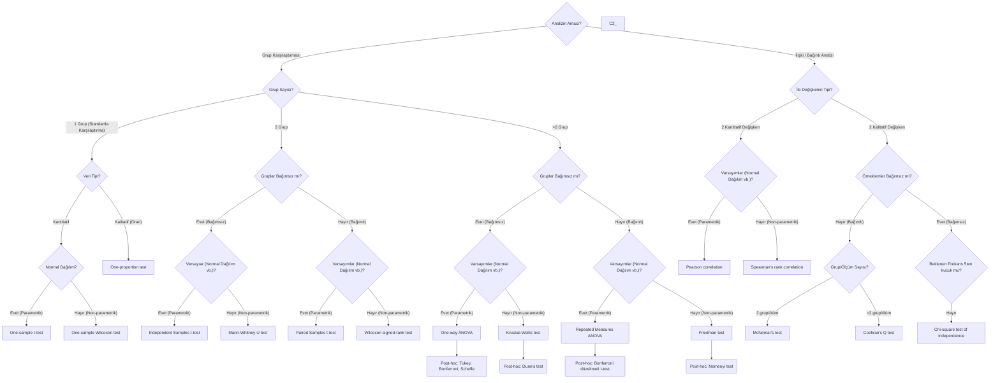

```mermaid
graph TD
    A{"Analizin Amacı?"}
    
    %% === DAL 1: GRUP KARŞILAŞTIRMASI ===
    A -- "Grup Karşılaştırması" --> B{"Grup Sayısı?"}

    %% 1 Grup
    B -- "1 Grup (Standartla Karşılaştırma)" --> B1{"Veri Tipi?"}
        B1 -- "Kantitatif" --> B1_Q{"Normal Dağılım?"}
            B1_Q -- "Evet (Parametrik)" --> B1_QP[One-sample t-test]
            B1_Q -- "Hayır (Non-parametrik)" --> B1_QNP[One-sample Wilcoxon test]
        B1 -- "Kalitatif (Oran)" --> B1_P[One-proportion test]

    %% 2 Grup
    B -- "2 Grup" --> B2{"Gruplar Bağımsız mı?"}
        %% 2 Bağımsız Grup
        B2 -- "Evet (Bağımsız)" --> B2_I{"Varsayıar (Normal Dağılım vb.)?"}
            B2_I -- "Evet (Parametrik)" --> B2_IP[Independent Samples t-test]
            B2_I -- "Hayır (Non-parametrik)" --> B2_INP[Mann-Whitney U test]
        %% 2 Bağımlı Grup
        B2 -- "Hayır (Bağımlı)" --> B2_P{"Varsayımlar (Normal Dağılım vb.)?"}
            B2_P -- "Evet (Parametrik)" --> B2_PP[Paired Samples t-test]
            B2_P -- "Hayır (Non-parametrik)" --> B2_PNP[Wilcoxon signed-rank test]

    %% >2 Grup
    B -- ">2 Grup" --> B3{"Gruplar Bağımsız mı?"}
        %% >2 Bağımsız Grup
        B3 -- "Evet (Bağımsız)" --> B3_I{"Varsayımlar (Normal Dağılım vb.)?"}
            B3_I -- "Evet (Parametrik)" --> B3_IP[One-way ANOVA]
                B3_IP --> B3_IP_PH("Post-hoc: Tukey, Bonferroni, Scheffe")
            B3_I -- "Hayır (Non-parametrik)" --> B3_INP[Kruskal-Wallis test]
                B3_INP --> B3_INP_PH("Post-hoc: Dunn's test")
        %% >2 Bağımlı Grup
        B3 -- "Hayır (Bağımlı)" --> B3_P{"Varsayımlar (Normal Dağılım vb.)?"}
            B3_P -- "Evet (Parametrik)" --> B3_PP[Repeated Measures ANOVA]
                B3_PP --> B3_PP_PH("Post-hoc: Bonferroni düzeltmeli t-test")
            B3_P -- "Hayır (Non-parametrik)" --> B3_PNP[Friedman test]
                B3_PNP --> B3_PNP_PH("Post-hoc: Nemenyi test")

    %% === DAL 2: İLİŞKİ / BAĞINTI ANALİZİ ===
    A -- "İlişki / Bağıntı Analizi" --> C{"İki Değişkenin Tipi?"}
    
    %% 2 Kantitatif
    C -- "2 Kantitatif Değişken" --> C1{"Varsayımlar (Normal Dağılım vb.)?"}
        C1 -- "Evet (Parametrik)" --> C1_P[Pearson correlation]
        C1 -- "Hayır (Non-parametrik)" --> C1_NP[Spearman's rank correlation]

    %% 2 Kalitatif
    C -- "2 Kalitatif Değişken" --> C2{"Örneklemler Bağımsız mı?"}
        %% 2 Kalitatif Bağımlı
        C2 -- "Hayır (Bağımlı)" --> C2_P{"Grup/Ölçüm Sayısı?"}
            C2_P -- "2 grup/ölüm" --> C2_P2[McNemar's test]
            C2_P -- ">2 grup/ölüm" --> C2_PG2[Cochran's Q test]
        %% 2 Kalitatif Bağımsız
        C2 -- "Evet (Bağımsız)" --> C2_I{"Beklenen Frekans 5ten kucuk mu?"}
            C2_I -- "Hayır" --> C2_I_G5[Chi-square test of independence]
            C2_
```